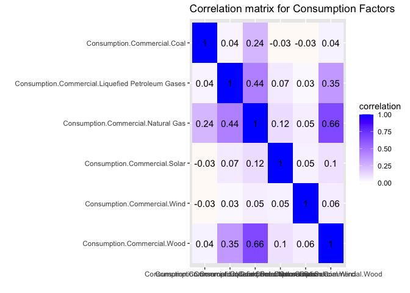
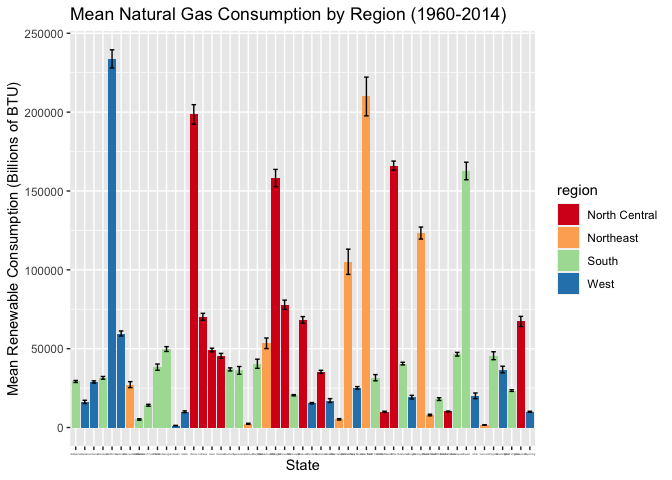
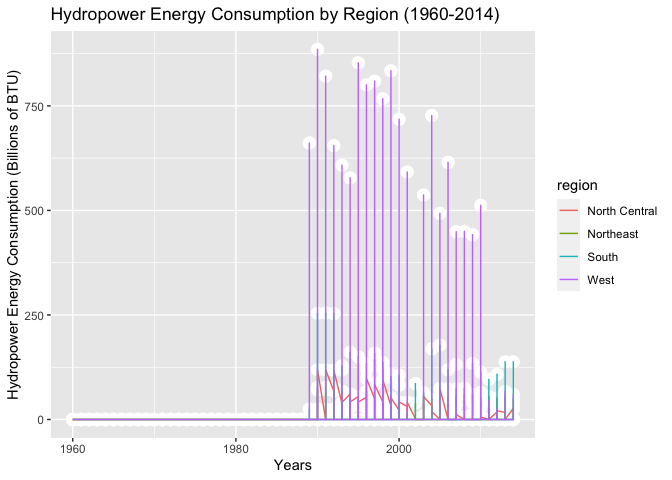
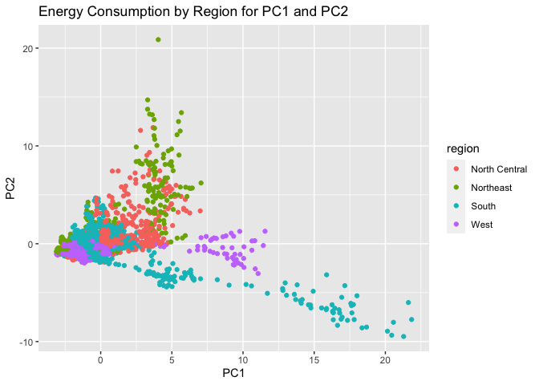
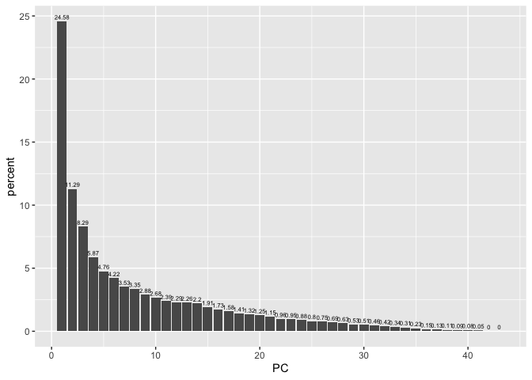

Project1
================

Name: Pranav Varanasi UTEID: ptv247

## R Markdown

Title: How do we get power?

Part 1: Introduction

As recently experienced with the Texas snowstorms, the reliability and
efficiency of the energy grid is crucial to maintaining a basic quality
of life for an individual. Issues with power can cause widespread chaos
and quickly shut down the fundamental functions of modern society. The
key issue made relevant by these Texas storms is the impact of climate
change and the need for a continued reliance on renewable energy. With
this issue in mind, I became curious as to the main sources of power
running all the states across the country. In addition, I began to
wonder how much of the country had already transitioned to renewable
energy sources like solar, wind, and geothermal and how many states
still had a majority dependence on non-renewable sources like natural
gas and coal. Throughout the course of this project, I hope to identify
which states and regions are most reliant on forms of renewable energy
and understand how much of the energy grid needs to transition in order
to make the majority of the country reliant on green power. I expect
that policies surrounding renewable energy are politically driven and
that the West coast region and states with heavy Democratic interests
will be more reliant on renewable energy than the rest of the country.

To answer these questions, I chose two datasets that together provide
the energy sources by state from 1960 - 2014 as well as region/division
identifiers for each state. The main advantage I have in grouping these
two datasets is to be able to group states by region and identify the
main sources of energy.

More information about these datasets can be found below:

Dataset 1: Energy.csv - Provides energy sources by state from 1960 -
2014 - Sources: - <https://corgis-edu.github.io/corgis/csv/energy/> -
<https://www.eia.gov/tools/faqs/>

Dataset 2: usa\_states.csv - Provides abbreviations and region/division
identifiers for each state - Source: - Inbuilt R-dataset from
“stevedata” library -
<https://vincentarelbundock.github.io/Rdatasets/datasets.html>

Part 2: Import + Tidy

``` r
# Import stevedata for in-built usa_states dataset
library(stevedata)

# Import tidyverse and dplyr operations
library(tidyverse)
```

    ## ── Attaching packages ─────────────────────────────────────── tidyverse 1.3.0 ──

    ## ✓ ggplot2 3.3.3     ✓ purrr   0.3.4
    ## ✓ tibble  3.0.5     ✓ dplyr   1.0.4
    ## ✓ tidyr   1.1.2     ✓ stringr 1.4.0
    ## ✓ readr   1.4.0     ✓ forcats 0.5.0

    ## ── Conflicts ────────────────────────────────────────── tidyverse_conflicts() ──
    ## x dplyr::filter() masks stats::filter()
    ## x dplyr::lag()    masks stats::lag()

``` r
library(dplyr)

# Read in online energy data from 1960 - 2014 and save as dataframe
energyData <- read_csv("energy.csv")
```

    ## 
    ## ── Column specification ────────────────────────────────────────────────────────
    ## cols(
    ##   .default = col_double(),
    ##   State = col_character()
    ## )
    ## ℹ Use `spec()` for the full column specifications.

``` r
# Clean datasets:
# Both datasets are already TIDY since each observation has its own row and each variable has its own column

# Dataset 1: Energy.csv
# Drop all Production, Expenditure, and Price columns from energyData
# Only want columns for Consumption across different sectors, Commercial, Electric Power, Industrial, Refinery, Residential, and Transportation

energyTrimmed <- energyData %>%  select(-"Production.Coal") %>% select(-"Expenditure.Commercial.Coal") %>% select(-"Expenditure.Commercial.Distillate Fuel Oil") %>%  select(-"Expenditure.Commercial.Kerosene") %>% select(-"Expenditure.Commercial.Liquefied Petroleum Gases") %>% select(-"Expenditure.Commercial.Natural Gas") %>%  select(-"Expenditure.Electric Power.Coal") %>% select(-"Expenditure.Electric Power.Distillate Fuel Oil") %>% select(-"Expenditure.Electric Power.Natural Gas") %>% select(-"Expenditure.Industrial.Coal") %>%  select(-"Expenditure.Industrial.Distillate Fuel Oil") %>% select(-"Expenditure.Industrial.Kerosene") %>% select(-"Expenditure.Industrial.Liquefied Petroleum Gases") %>% select(-"Expenditure.Industrial.Natural Gas") %>% select(-"Expenditure.Industrial.Other Petroleum Products") %>%  select(-"Expenditure.Residential.Coal") %>% select(-"Expenditure.Residential.Distillate Fuel Oil") %>% select(-"Expenditure.Residential.Kerosene") %>% select(-"Expenditure.Residential.Liquefied Petroleum Gases") %>%  select(-"Expenditure.Residential.Natural Gas") %>% select(-"Expenditure.Residential.Wood") %>%  select(-"Expenditure.Transportation.Coal") %>% select(-"Expenditure.Transportation.Distillate Fuel Oil") %>% select(-"Expenditure.Transportation.Liquefied Petroleum Gases") %>% select(-"Expenditure.Transportation.Natural Gas") %>%  select(-"Price.Commercial.Coal") %>% select(-"Price.Commercial.Distillate Fuel Oil") %>% select(-"Price.Commercial.Kerosene") %>% select(-"Price.Commercial.Liquefied Petroleum Gases") %>%  select(-"Price.Commercial.Natural Gas")  %>% select(-"Price.Electric Power.Coal") %>% select(-"Price.Electric Power.Distillate Fuel Oil") %>%  select(-"Price.Electric Power.Natural Gas") %>% select(-"Price.Industrial.Coal") %>% select(-"Price.Industrial.Distillate Fuel Oil") %>% select(-"Price.Industrial.Kerosene") %>%  select(-"Price.Industrial.Liquefied Petroleum Gases") %>% select(-"Price.Industrial.Natural Gas") %>%  select(-"Price.Industrial.Other Petroleum Products") %>% select(-"Price.Transportation.Coal") %>% select(-"Price.Transportation.Distillate Fuel Oil") %>% select(-"Price.Transportation.Liquefied Petroleum Gases") %>%  select(-"Price.Transportation.Natural Gas") 


# Create new variables/columns to represent total renewable and total non-renewable energy per year for each state
# Renewable Energy Types: Geothermal, Hydropower, Solar, Wind, Wood
# Non-Renewable Energy Types: Coal, Distillate Fuel Oil, Kerosene, Liqueified Petroleum Gases, Natural Gas

# Sum up all non-renewable energy sources and save them in one column, units are in billions of BTU (British Thermal Unit)
# Move column to front of dataframe with .before operator
energySum <- energyTrimmed %>% mutate(nonRenewableTotal = Consumption.Commercial.Coal  + `Consumption.Commercial.Distillate Fuel Oil` + Consumption.Commercial.Kerosene +  `Consumption.Commercial.Liquefied Petroleum Gases` + 
`Consumption.Commercial.Natural Gas` + `Consumption.Electric Power.Coal` + `Consumption.Electric Power.Distillate Fuel Oil` +
`Consumption.Electric Power.Natural Gas` + Consumption.Industrial.Coal + `Consumption.Industrial.Distillate Fuel Oil` + Consumption.Industrial.Kerosene + `Consumption.Industrial.Liquefied Petroleum Gases` + `Consumption.Industrial.Natural Gas` + `Consumption.Industrial.Other Petroleum Products`  + Consumption.Refinery.Coal + `Consumption.Refinery.Distillate Fuel Oil` +  `Consumption.Refinery.Liquefied Petroleum Gases` + `Consumption.Refinery.Natural Gas` +  Consumption.Residential.Coal + `Consumption.Residential.Distillate Fuel Oil` + Consumption.Residential.Kerosene + `Consumption.Residential.Liquefied Petroleum Gases` + `Consumption.Residential.Natural Gas` + Consumption.Transportation.Coal 
+ `Consumption.Transportation.Distillate Fuel Oil` + `Consumption.Transportation.Liquefied Petroleum Gases` + `Consumption.Transportation.Natural Gas`, .before = Consumption.Commercial.Coal)


# Sum up all reneable energy sources, put renewable column before nonRenewable column
# Save fully formatted dataset as energyClean
energyClean <- energySum %>% mutate(renewableTotal = Consumption.Commercial.Geothermal + Consumption.Commercial.Hydropower + Consumption.Commercial.Solar + Consumption.Commercial.Wind + Consumption.Commercial.Wood + 
`Consumption.Electric Power.Wood` + Consumption.Industrial.Geothermal + Consumption.Industrial.Hydropower + Consumption.Industrial.Solar + Consumption.Industrial.Wind + Consumption.Industrial.Wood
 + Consumption.Residential.Geothermal + Consumption.Residential.Wood, .before = nonRenewableTotal)


# Dataset 2: usa_states.csv
# Dataset 2 is already in proper ascending order by state and has all relevant columns
```

The first obsevation I made is that both of my datasets are already tidy
since each observation has its own row and each variable has its own
column. An important decision I made here for my energy source dataset
is to focus only on variables of consumption to measure a state’s
reliance on a certain form of energy. To address this, I dropped all the
non-essential columns related to the Production, Expenditure, and Price
of energy reducing the total number of variables from 80 to 42.. In
addition, I added 3 new variables, percentRenewable, renewableTotal, and
nonRenewableTotal thhat would summarize the total renewable and
non-renewable sources of energy for each state. These changes helped me
come up with a cleaner dataset that I could easily draw conclusions
from.

Part 3: Join/Merge

``` r
# Rename statename variable so it matches up with energy dataset
renameStates <- usa_states %>% rename('State' = statename)

# Perform left join with energy clean dataset
energyJoin <- energyClean %>% left_join(renameStates, by = 'State')

# Use anti join to see if any cases should be dropped
energyAnti <- energyClean %>% anti_join(renameStates, by = 'State')
```

To join my two datasets, I performed a left join because I wanted to
keep all rows in the main energy dataset (enerrrgyClean) and just add
the state name, region, division columns from the second dataset at the
end. I needed to keep all the rows in energyClean because it contained
all the important Consumption statistics for each state. In addition, I
performed an anti\_join against my energyClean and renameStates datasets
to check if any cases were dropped from the left join. Since the
resultant dataframe from anti\_join came up empty, I could safely assume
that no cases were dropped from the left join.

Part 4: Summary Statistics

``` r
# Sort dataframe in ascending order of state names
# Sorting is needed to group all data for one state together and make overall table visually understandable
energyJoin <- energyJoin %>% arrange(State)

# Add a percent renewable variable for each state
energyJoin <- energyJoin %>% mutate(percentRenewable = (renewableTotal / (renewableTotal + nonRenewableTotal)) * 100, .before = renewableTotal)

# import libraries for kable table rendering
#install.packages("kableExtra")
library(kableExtra)
```

    ## 
    ## Attaching package: 'kableExtra'

    ## The following object is masked from 'package:dplyr':
    ## 
    ##     group_rows

``` r
# Statistic 1: Overall Case, Get mean values of entire dataset without grouping by categorial variable
energyJoin %>% group_by(State) %>% summarise(renewablePercent = mean(percentRenewable), renewable = mean(renewableTotal), nonRenewable = mean(nonRenewableTotal), commCol = mean(Consumption.Commercial.Coal), commOil = mean(`Consumption.Commercial.Distillate Fuel Oil`), commKerosene = mean(Consumption.Commercial.Kerosene), commGas = mean(`Consumption.Commercial.Liquefied Petroleum Gases`), 
commNatural = mean(`Consumption.Commercial.Natural Gas`) , electricCoal = mean(`Consumption.Electric Power.Coal`), electricOil = mean(`Consumption.Electric Power.Distillate Fuel Oil`),
electricNatural = mean(`Consumption.Electric Power.Natural Gas`), industrialCoal = mean(Consumption.Industrial.Coal), industrialOil = mean(`Consumption.Industrial.Distillate Fuel Oil`), industrialKerosene = mean(Consumption.Industrial.Kerosene), industrialPetGas = mean(`Consumption.Industrial.Liquefied Petroleum Gases`), industrialNatural = mean(`Consumption.Industrial.Natural Gas`), industrialPetrol = mean(`Consumption.Industrial.Other Petroleum Products`), refineryCoal = mean(Consumption.Refinery.Coal), refineryOil = mean(`Consumption.Refinery.Distillate Fuel Oil`), refineryPetGas = mean(`Consumption.Refinery.Liquefied Petroleum Gases`), refineryNatural = mean(`Consumption.Refinery.Natural Gas`),  residentCoal = mean(Consumption.Residential.Coal), residentOil = mean(`Consumption.Residential.Distillate Fuel Oil`), residentKerosense = mean(Consumption.Residential.Kerosene), residentPetGas = mean(`Consumption.Residential.Liquefied Petroleum Gases`), residentNatural = mean(`Consumption.Residential.Natural Gas`), transportCoal = mean(Consumption.Transportation.Coal), transportOil = mean(`Consumption.Transportation.Distillate Fuel Oil`), transportPetGas = mean(`Consumption.Transportation.Liquefied Petroleum Gases`), transportNatural = mean(`Consumption.Transportation.Natural Gas`), commThermal = mean(Consumption.Commercial.Geothermal), commHydro = mean(Consumption.Commercial.Hydropower), commSolar = mean(Consumption.Commercial.Solar), commWind = mean(Consumption.Commercial.Wind), commWood = mean(Consumption.Commercial.Wood), electricWood = mean(`Consumption.Electric Power.Wood`), industrialThermal = mean(Consumption.Industrial.Geothermal), industrialHydro = mean(Consumption.Industrial.Hydropower), industrialSolar = mean(Consumption.Industrial.Solar), industrialWind = mean(Consumption.Industrial.Wind), industrialWood = mean(Consumption.Industrial.Wood),
residentThermal = mean(Consumption.Residential.Geothermal), residentWood = mean(Consumption.Residential.Wood)) %>% kbl(caption = "Mean Consumption for all Sectors from 1960 - 2014") %>% kable_styling()
```

<table class="table" style="margin-left: auto; margin-right: auto;">
<caption>
Mean Consumption for all Sectors from 1960 - 2014
</caption>
<thead>
<tr>
<th style="text-align:left;">
State
</th>
<th style="text-align:right;">
renewablePercent
</th>
<th style="text-align:right;">
renewable
</th>
<th style="text-align:right;">
nonRenewable
</th>
<th style="text-align:right;">
commCol
</th>
<th style="text-align:right;">
commOil
</th>
<th style="text-align:right;">
commKerosene
</th>
<th style="text-align:right;">
commGas
</th>
<th style="text-align:right;">
commNatural
</th>
<th style="text-align:right;">
electricCoal
</th>
<th style="text-align:right;">
electricOil
</th>
<th style="text-align:right;">
electricNatural
</th>
<th style="text-align:right;">
industrialCoal
</th>
<th style="text-align:right;">
industrialOil
</th>
<th style="text-align:right;">
industrialKerosene
</th>
<th style="text-align:right;">
industrialPetGas
</th>
<th style="text-align:right;">
industrialNatural
</th>
<th style="text-align:right;">
industrialPetrol
</th>
<th style="text-align:right;">
refineryCoal
</th>
<th style="text-align:right;">
refineryOil
</th>
<th style="text-align:right;">
refineryPetGas
</th>
<th style="text-align:right;">
refineryNatural
</th>
<th style="text-align:right;">
residentCoal
</th>
<th style="text-align:right;">
residentOil
</th>
<th style="text-align:right;">
residentKerosense
</th>
<th style="text-align:right;">
residentPetGas
</th>
<th style="text-align:right;">
residentNatural
</th>
<th style="text-align:right;">
transportCoal
</th>
<th style="text-align:right;">
transportOil
</th>
<th style="text-align:right;">
transportPetGas
</th>
<th style="text-align:right;">
transportNatural
</th>
<th style="text-align:right;">
commThermal
</th>
<th style="text-align:right;">
commHydro
</th>
<th style="text-align:right;">
commSolar
</th>
<th style="text-align:right;">
commWind
</th>
<th style="text-align:right;">
commWood
</th>
<th style="text-align:right;">
electricWood
</th>
<th style="text-align:right;">
industrialThermal
</th>
<th style="text-align:right;">
industrialHydro
</th>
<th style="text-align:right;">
industrialSolar
</th>
<th style="text-align:right;">
industrialWind
</th>
<th style="text-align:right;">
industrialWood
</th>
<th style="text-align:right;">
residentThermal
</th>
<th style="text-align:right;">
residentWood
</th>
</tr>
</thead>
<tbody>
<tr>
<td style="text-align:left;">
Alabama
</td>
<td style="text-align:right;">
9.4119117
</td>
<td style="text-align:right;">
125842.8909
</td>
<td style="text-align:right;">
1158413.29
</td>
<td style="text-align:right;">
1241.327273
</td>
<td style="text-align:right;">
3893.818
</td>
<td style="text-align:right;">
691.036364
</td>
<td style="text-align:right;">
3791.909091
</td>
<td style="text-align:right;">
29197.945
</td>
<td style="text-align:right;">
517314.9636
</td>
<td style="text-align:right;">
1318.800000
</td>
<td style="text-align:right;">
5.995744e+04
</td>
<td style="text-align:right;">
159764.6727
</td>
<td style="text-align:right;">
22746.3091
</td>
<td style="text-align:right;">
1331.21818
</td>
<td style="text-align:right;">
4.610545e+03
</td>
<td style="text-align:right;">
167193.2000
</td>
<td style="text-align:right;">
1.530938e+04
</td>
<td style="text-align:right;">
44.4000000
</td>
<td style="text-align:right;">
104.945454
</td>
<td style="text-align:right;">
82.5454545
</td>
<td style="text-align:right;">
1.619104e+04
</td>
<td style="text-align:right;">
744.272727
</td>
<td style="text-align:right;">
1.981636e+02
</td>
<td style="text-align:right;">
621.927273
</td>
<td style="text-align:right;">
9890.054545
</td>
<td style="text-align:right;">
48564.4182
</td>
<td style="text-align:right;">
189.7272727
</td>
<td style="text-align:right;">
76348.218
</td>
<td style="text-align:right;">
360.745454
</td>
<td style="text-align:right;">
16710.27273
</td>
<td style="text-align:right;">
0.0000000
</td>
<td style="text-align:right;">
0.000000
</td>
<td style="text-align:right;">
0.0000000
</td>
<td style="text-align:right;">
0.0000000
</td>
<td style="text-align:right;">
740.054546
</td>
<td style="text-align:right;">
5.364291e+03
</td>
<td style="text-align:right;">
11.7636364
</td>
<td style="text-align:right;">
134.6909091
</td>
<td style="text-align:right;">
0.000000
</td>
<td style="text-align:right;">
0.0000000
</td>
<td style="text-align:right;">
106811.81818
</td>
<td style="text-align:right;">
19.781818
</td>
<td style="text-align:right;">
12760.49091
</td>
</tr>
<tr>
<td style="text-align:left;">
Alaska
</td>
<td style="text-align:right;">
2.8468502
</td>
<td style="text-align:right;">
4227.6545
</td>
<td style="text-align:right;">
339347.96
</td>
<td style="text-align:right;">
4140.872727
</td>
<td style="text-align:right;">
5181.236
</td>
<td style="text-align:right;">
1078.054545
</td>
<td style="text-align:right;">
317.363636
</td>
<td style="text-align:right;">
16247.182
</td>
<td style="text-align:right;">
4815.3818
</td>
<td style="text-align:right;">
2968.836364
</td>
<td style="text-align:right;">
2.546642e+04
</td>
<td style="text-align:right;">
3063.2909
</td>
<td style="text-align:right;">
12895.7091
</td>
<td style="text-align:right;">
207.92727
</td>
<td style="text-align:right;">
2.215455e+02
</td>
<td style="text-align:right;">
179604.8000
</td>
<td style="text-align:right;">
1.707562e+04
</td>
<td style="text-align:right;">
0.0000000
</td>
<td style="text-align:right;">
211.436364
</td>
<td style="text-align:right;">
51.1272727
</td>
<td style="text-align:right;">
1.835613e+04
</td>
<td style="text-align:right;">
607.436364
</td>
<td style="text-align:right;">
8.662091e+03
</td>
<td style="text-align:right;">
202.509091
</td>
<td style="text-align:right;">
372.636364
</td>
<td style="text-align:right;">
11701.2727
</td>
<td style="text-align:right;">
7.7636364
</td>
<td style="text-align:right;">
23085.345
</td>
<td style="text-align:right;">
14.545454
</td>
<td style="text-align:right;">
2791.43636
</td>
<td style="text-align:right;">
19.9636364
</td>
<td style="text-align:right;">
0.000000
</td>
<td style="text-align:right;">
0.0000000
</td>
<td style="text-align:right;">
0.0000000
</td>
<td style="text-align:right;">
145.418182
</td>
<td style="text-align:right;">
5.563636e+00
</td>
<td style="text-align:right;">
2.9090909
</td>
<td style="text-align:right;">
0.0000000
</td>
<td style="text-align:right;">
0.000000
</td>
<td style="text-align:right;">
0.0000000
</td>
<td style="text-align:right;">
2326.92727
</td>
<td style="text-align:right;">
22.636364
</td>
<td style="text-align:right;">
1704.23636
</td>
</tr>
<tr>
<td style="text-align:left;">
Arizona
</td>
<td style="text-align:right;">
1.9966057
</td>
<td style="text-align:right;">
10223.0909
</td>
<td style="text-align:right;">
551064.15
</td>
<td style="text-align:right;">
6.509091
</td>
<td style="text-align:right;">
2832.836
</td>
<td style="text-align:right;">
31.872727
</td>
<td style="text-align:right;">
959.290909
</td>
<td style="text-align:right;">
28893.327
</td>
<td style="text-align:right;">
247587.6545
</td>
<td style="text-align:right;">
1295.690909
</td>
<td style="text-align:right;">
8.940951e+04
</td>
<td style="text-align:right;">
11925.6909
</td>
<td style="text-align:right;">
18470.7273
</td>
<td style="text-align:right;">
201.43636
</td>
<td style="text-align:right;">
1.386364e+03
</td>
<td style="text-align:right;">
34759.2727
</td>
<td style="text-align:right;">
4.639636e+02
</td>
<td style="text-align:right;">
0.0000000
</td>
<td style="text-align:right;">
9.745454
</td>
<td style="text-align:right;">
78.2000000
</td>
<td style="text-align:right;">
3.612182e+02
</td>
<td style="text-align:right;">
1.036364
</td>
<td style="text-align:right;">
3.040727e+02
</td>
<td style="text-align:right;">
113.109091
</td>
<td style="text-align:right;">
3016.818182
</td>
<td style="text-align:right;">
32592.2545
</td>
<td style="text-align:right;">
0.1636364
</td>
<td style="text-align:right;">
55748.473
</td>
<td style="text-align:right;">
348.127273
</td>
<td style="text-align:right;">
20266.78182
</td>
<td style="text-align:right;">
14.2545455
</td>
<td style="text-align:right;">
0.000000
</td>
<td style="text-align:right;">
8.5818182
</td>
<td style="text-align:right;">
0.0000000
</td>
<td style="text-align:right;">
540.272727
</td>
<td style="text-align:right;">
2.457636e+02
</td>
<td style="text-align:right;">
107.9272727
</td>
<td style="text-align:right;">
50.9454545
</td>
<td style="text-align:right;">
0.000000
</td>
<td style="text-align:right;">
0.0000000
</td>
<td style="text-align:right;">
3014.89091
</td>
<td style="text-align:right;">
10.545454
</td>
<td style="text-align:right;">
6229.90909
</td>
</tr>
<tr>
<td style="text-align:left;">
Arkansas
</td>
<td style="text-align:right;">
10.1894907
</td>
<td style="text-align:right;">
60489.0182
</td>
<td style="text-align:right;">
529935.13
</td>
<td style="text-align:right;">
9.854546
</td>
<td style="text-align:right;">
1734.491
</td>
<td style="text-align:right;">
384.109091
</td>
<td style="text-align:right;">
2426.181818
</td>
<td style="text-align:right;">
31505.673
</td>
<td style="text-align:right;">
145332.5273
</td>
<td style="text-align:right;">
376.163636
</td>
<td style="text-align:right;">
5.042035e+04
</td>
<td style="text-align:right;">
5507.9636
</td>
<td style="text-align:right;">
21428.7455
</td>
<td style="text-align:right;">
1056.78182
</td>
<td style="text-align:right;">
5.166291e+03
</td>
<td style="text-align:right;">
122790.3636
</td>
<td style="text-align:right;">
1.179216e+04
</td>
<td style="text-align:right;">
5.2727273
</td>
<td style="text-align:right;">
75.200000
</td>
<td style="text-align:right;">
46.9454545
</td>
<td style="text-align:right;">
9.842073e+03
</td>
<td style="text-align:right;">
2.509091
</td>
<td style="text-align:right;">
2.710364e+02
</td>
<td style="text-align:right;">
371.218182
</td>
<td style="text-align:right;">
10597.327273
</td>
<td style="text-align:right;">
42191.3455
</td>
<td style="text-align:right;">
0.2363636
</td>
<td style="text-align:right;">
55172.727
</td>
<td style="text-align:right;">
1093.381818
</td>
<td style="text-align:right;">
10334.20000
</td>
<td style="text-align:right;">
0.7272727
</td>
<td style="text-align:right;">
0.000000
</td>
<td style="text-align:right;">
0.0000000
</td>
<td style="text-align:right;">
0.0000000
</td>
<td style="text-align:right;">
427.327273
</td>
<td style="text-align:right;">
0.000000e+00
</td>
<td style="text-align:right;">
4.9090909
</td>
<td style="text-align:right;">
0.0000000
</td>
<td style="text-align:right;">
0.000000
</td>
<td style="text-align:right;">
0.0000000
</td>
<td style="text-align:right;">
52856.76364
</td>
<td style="text-align:right;">
160.545455
</td>
<td style="text-align:right;">
7038.74545
</td>
</tr>
<tr>
<td style="text-align:left;">
California
</td>
<td style="text-align:right;">
4.2530733
</td>
<td style="text-align:right;">
127700.1455
</td>
<td style="text-align:right;">
2911572.80
</td>
<td style="text-align:right;">
456.727273
</td>
<td style="text-align:right;">
14619.455
</td>
<td style="text-align:right;">
1125.818182
</td>
<td style="text-align:right;">
6134.927273
</td>
<td style="text-align:right;">
233764.927
</td>
<td style="text-align:right;">
9565.4545
</td>
<td style="text-align:right;">
1762.090909
</td>
<td style="text-align:right;">
6.321791e+05
</td>
<td style="text-align:right;">
51405.9636
</td>
<td style="text-align:right;">
80137.8545
</td>
<td style="text-align:right;">
2417.36364
</td>
<td style="text-align:right;">
3.193262e+04
</td>
<td style="text-align:right;">
669956.5091
</td>
<td style="text-align:right;">
2.368890e+05
</td>
<td style="text-align:right;">
0.0000000
</td>
<td style="text-align:right;">
1277.218182
</td>
<td style="text-align:right;">
7187.4181818
</td>
<td style="text-align:right;">
6.907145e+04
</td>
<td style="text-align:right;">
135.290909
</td>
<td style="text-align:right;">
1.809782e+03
</td>
<td style="text-align:right;">
737.709091
</td>
<td style="text-align:right;">
17886.036364
</td>
<td style="text-align:right;">
528392.7091
</td>
<td style="text-align:right;">
41.9090909
</td>
<td style="text-align:right;">
292098.600
</td>
<td style="text-align:right;">
2509.127273
</td>
<td style="text-align:right;">
18077.72727
</td>
<td style="text-align:right;">
256.7090909
</td>
<td style="text-align:right;">
25.636364
</td>
<td style="text-align:right;">
44.6000000
</td>
<td style="text-align:right;">
0.7454545
</td>
<td style="text-align:right;">
3502.727273
</td>
<td style="text-align:right;">
2.003125e+04
</td>
<td style="text-align:right;">
559.9636364
</td>
<td style="text-align:right;">
0.1818182
</td>
<td style="text-align:right;">
2.327273
</td>
<td style="text-align:right;">
0.5818182
</td>
<td style="text-align:right;">
58528.49091
</td>
<td style="text-align:right;">
98.600000
</td>
<td style="text-align:right;">
44648.32727
</td>
</tr>
<tr>
<td style="text-align:left;">
Colorado
</td>
<td style="text-align:right;">
1.6024828
</td>
<td style="text-align:right;">
9972.2000
</td>
<td style="text-align:right;">
678333.11
</td>
<td style="text-align:right;">
2265.290909
</td>
<td style="text-align:right;">
2815.891
</td>
<td style="text-align:right;">
327.963636
</td>
<td style="text-align:right;">
1683.800000
</td>
<td style="text-align:right;">
59612.364
</td>
<td style="text-align:right;">
240043.9455
</td>
<td style="text-align:right;">
579.145455
</td>
<td style="text-align:right;">
4.711478e+04
</td>
<td style="text-align:right;">
23001.4545
</td>
<td style="text-align:right;">
18183.2727
</td>
<td style="text-align:right;">
1038.07273
</td>
<td style="text-align:right;">
4.618327e+03
</td>
<td style="text-align:right;">
102067.4364
</td>
<td style="text-align:right;">
7.987927e+03
</td>
<td style="text-align:right;">
0.0000000
</td>
<td style="text-align:right;">
67.872727
</td>
<td style="text-align:right;">
188.0727273
</td>
<td style="text-align:right;">
5.226182e+03
</td>
<td style="text-align:right;">
1093.200000
</td>
<td style="text-align:right;">
5.620545e+02
</td>
<td style="text-align:right;">
333.872727
</td>
<td style="text-align:right;">
9395.872727
</td>
<td style="text-align:right;">
97753.8909
</td>
<td style="text-align:right;">
33.4181818
</td>
<td style="text-align:right;">
44288.073
</td>
<td style="text-align:right;">
377.490909
</td>
<td style="text-align:right;">
7673.43636
</td>
<td style="text-align:right;">
96.0000000
</td>
<td style="text-align:right;">
2.309091
</td>
<td style="text-align:right;">
9.4727273
</td>
<td style="text-align:right;">
2.8727273
</td>
<td style="text-align:right;">
582.490909
</td>
<td style="text-align:right;">
1.463636e+01
</td>
<td style="text-align:right;">
100.6545455
</td>
<td style="text-align:right;">
5.0000000
</td>
<td style="text-align:right;">
0.000000
</td>
<td style="text-align:right;">
2.1454545
</td>
<td style="text-align:right;">
2046.78182
</td>
<td style="text-align:right;">
66.109091
</td>
<td style="text-align:right;">
7043.72727
</td>
</tr>
<tr>
<td style="text-align:left;">
Connecticut
</td>
<td style="text-align:right;">
6.0096257
</td>
<td style="text-align:right;">
17169.9636
</td>
<td style="text-align:right;">
294923.67
</td>
<td style="text-align:right;">
417.272727
</td>
<td style="text-align:right;">
20741.891
</td>
<td style="text-align:right;">
336.654545
</td>
<td style="text-align:right;">
1639.309091
</td>
<td style="text-align:right;">
27212.109
</td>
<td style="text-align:right;">
34046.5273
</td>
<td style="text-align:right;">
1196.309091
</td>
<td style="text-align:right;">
2.434453e+04
</td>
<td style="text-align:right;">
3671.5818
</td>
<td style="text-align:right;">
8176.8182
</td>
<td style="text-align:right;">
920.36364
</td>
<td style="text-align:right;">
2.439345e+03
</td>
<td style="text-align:right;">
21975.1636
</td>
<td style="text-align:right;">
1.997182e+03
</td>
<td style="text-align:right;">
0.0000000
</td>
<td style="text-align:right;">
0.000000
</td>
<td style="text-align:right;">
0.0000000
</td>
<td style="text-align:right;">
0.000000e+00
</td>
<td style="text-align:right;">
347.618182
</td>
<td style="text-align:right;">
7.780767e+04
</td>
<td style="text-align:right;">
2143.309091
</td>
<td style="text-align:right;">
3201.418182
</td>
<td style="text-align:right;">
36113.9091
</td>
<td style="text-align:right;">
16.8727273
</td>
<td style="text-align:right;">
24520.182
</td>
<td style="text-align:right;">
114.563636
</td>
<td style="text-align:right;">
1543.07273
</td>
<td style="text-align:right;">
0.0000000
</td>
<td style="text-align:right;">
0.000000
</td>
<td style="text-align:right;">
0.0000000
</td>
<td style="text-align:right;">
0.0000000
</td>
<td style="text-align:right;">
581.236364
</td>
<td style="text-align:right;">
4.063636e+01
</td>
<td style="text-align:right;">
0.0000000
</td>
<td style="text-align:right;">
68.1636364
</td>
<td style="text-align:right;">
0.000000
</td>
<td style="text-align:right;">
0.0000000
</td>
<td style="text-align:right;">
8165.67273
</td>
<td style="text-align:right;">
3.545454
</td>
<td style="text-align:right;">
8310.70909
</td>
</tr>
<tr>
<td style="text-align:left;">
Delaware
</td>
<td style="text-align:right;">
3.1741651
</td>
<td style="text-align:right;">
3872.8909
</td>
<td style="text-align:right;">
133441.18
</td>
<td style="text-align:right;">
134.200000
</td>
<td style="text-align:right;">
2699.200
</td>
<td style="text-align:right;">
197.054545
</td>
<td style="text-align:right;">
804.745455
</td>
<td style="text-align:right;">
5101.127
</td>
<td style="text-align:right;">
38757.2000
</td>
<td style="text-align:right;">
760.490909
</td>
<td style="text-align:right;">
1.138920e+04
</td>
<td style="text-align:right;">
2564.2909
</td>
<td style="text-align:right;">
3305.2182
</td>
<td style="text-align:right;">
174.81818
</td>
<td style="text-align:right;">
3.151764e+03
</td>
<td style="text-align:right;">
15044.2000
</td>
<td style="text-align:right;">
2.253444e+04
</td>
<td style="text-align:right;">
24.8545455
</td>
<td style="text-align:right;">
54.018182
</td>
<td style="text-align:right;">
68.5454545
</td>
<td style="text-align:right;">
9.438909e+02
</td>
<td style="text-align:right;">
65.254546
</td>
<td style="text-align:right;">
7.582073e+03
</td>
<td style="text-align:right;">
1528.054545
</td>
<td style="text-align:right;">
2116.818182
</td>
<td style="text-align:right;">
8117.2182
</td>
<td style="text-align:right;">
0.8000000
</td>
<td style="text-align:right;">
6195.691
</td>
<td style="text-align:right;">
39.727273
</td>
<td style="text-align:right;">
86.29091
</td>
<td style="text-align:right;">
0.0000000
</td>
<td style="text-align:right;">
0.000000
</td>
<td style="text-align:right;">
0.2909091
</td>
<td style="text-align:right;">
3.1454545
</td>
<td style="text-align:right;">
103.363636
</td>
<td style="text-align:right;">
0.000000e+00
</td>
<td style="text-align:right;">
0.0000000
</td>
<td style="text-align:right;">
0.0545455
</td>
<td style="text-align:right;">
0.000000
</td>
<td style="text-align:right;">
0.0000000
</td>
<td style="text-align:right;">
2201.18182
</td>
<td style="text-align:right;">
85.981818
</td>
<td style="text-align:right;">
1478.87273
</td>
</tr>
<tr>
<td style="text-align:left;">
District of Columbia
</td>
<td style="text-align:right;">
1.9612224
</td>
<td style="text-align:right;">
933.1455
</td>
<td style="text-align:right;">
49267.80
</td>
<td style="text-align:right;">
803.054546
</td>
<td style="text-align:right;">
4108.473
</td>
<td style="text-align:right;">
189.509091
</td>
<td style="text-align:right;">
2.054546
</td>
<td style="text-align:right;">
14122.745
</td>
<td style="text-align:right;">
3153.9818
</td>
<td style="text-align:right;">
1001.890909
</td>
<td style="text-align:right;">
1.860000e+01
</td>
<td style="text-align:right;">
2381.9091
</td>
<td style="text-align:right;">
681.2909
</td>
<td style="text-align:right;">
192.43636
</td>
<td style="text-align:right;">
8.127273e+00
</td>
<td style="text-align:right;">
153.8727
</td>
<td style="text-align:right;">
0.000000e+00
</td>
<td style="text-align:right;">
0.0000000
</td>
<td style="text-align:right;">
0.000000
</td>
<td style="text-align:right;">
0.0000000
</td>
<td style="text-align:right;">
0.000000e+00
</td>
<td style="text-align:right;">
443.836364
</td>
<td style="text-align:right;">
3.730745e+03
</td>
<td style="text-align:right;">
69.127273
</td>
<td style="text-align:right;">
4.090909
</td>
<td style="text-align:right;">
14042.9091
</td>
<td style="text-align:right;">
8.1272727
</td>
<td style="text-align:right;">
3764.945
</td>
<td style="text-align:right;">
2.290909
</td>
<td style="text-align:right;">
383.78182
</td>
<td style="text-align:right;">
0.0000000
</td>
<td style="text-align:right;">
0.000000
</td>
<td style="text-align:right;">
0.0000000
</td>
<td style="text-align:right;">
0.0000000
</td>
<td style="text-align:right;">
63.763636
</td>
<td style="text-align:right;">
0.000000e+00
</td>
<td style="text-align:right;">
0.0000000
</td>
<td style="text-align:right;">
0.0000000
</td>
<td style="text-align:right;">
0.000000
</td>
<td style="text-align:right;">
0.0000000
</td>
<td style="text-align:right;">
0.00000
</td>
<td style="text-align:right;">
2.381818
</td>
<td style="text-align:right;">
867.00000
</td>
</tr>
<tr>
<td style="text-align:left;">
Florida
</td>
<td style="text-align:right;">
7.6228859
</td>
<td style="text-align:right;">
86007.8182
</td>
<td style="text-align:right;">
1147489.20
</td>
<td style="text-align:right;">
189.309091
</td>
<td style="text-align:right;">
14685.800
</td>
<td style="text-align:right;">
838.527273
</td>
<td style="text-align:right;">
11563.090909
</td>
<td style="text-align:right;">
38293.855
</td>
<td style="text-align:right;">
399578.1636
</td>
<td style="text-align:right;">
10933.381818
</td>
<td style="text-align:right;">
3.464554e+05
</td>
<td style="text-align:right;">
16327.1818
</td>
<td style="text-align:right;">
31678.0909
</td>
<td style="text-align:right;">
1774.50909
</td>
<td style="text-align:right;">
5.977055e+03
</td>
<td style="text-align:right;">
94461.5091
</td>
<td style="text-align:right;">
4.098836e+03
</td>
<td style="text-align:right;">
10.8545455
</td>
<td style="text-align:right;">
46.072727
</td>
<td style="text-align:right;">
8.5636364
</td>
<td style="text-align:right;">
1.598000e+02
</td>
<td style="text-align:right;">
44.581818
</td>
<td style="text-align:right;">
3.149764e+03
</td>
<td style="text-align:right;">
5279.127273
</td>
<td style="text-align:right;">
8815.436364
</td>
<td style="text-align:right;">
14896.3091
</td>
<td style="text-align:right;">
0.0000000
</td>
<td style="text-align:right;">
131288.164
</td>
<td style="text-align:right;">
874.490909
</td>
<td style="text-align:right;">
6061.32727
</td>
<td style="text-align:right;">
435.5090909
</td>
<td style="text-align:right;">
0.000000
</td>
<td style="text-align:right;">
0.7090909
</td>
<td style="text-align:right;">
0.0000000
</td>
<td style="text-align:right;">
971.509091
</td>
<td style="text-align:right;">
3.896455e+03
</td>
<td style="text-align:right;">
0.0000000
</td>
<td style="text-align:right;">
0.0000000
</td>
<td style="text-align:right;">
0.000000
</td>
<td style="text-align:right;">
0.0000000
</td>
<td style="text-align:right;">
62426.10909
</td>
<td style="text-align:right;">
1618.872727
</td>
<td style="text-align:right;">
16658.65455
</td>
</tr>
<tr>
<td style="text-align:left;">
Georgia
</td>
<td style="text-align:right;">
11.1725941
</td>
<td style="text-align:right;">
131454.6727
</td>
<td style="text-align:right;">
1081687.45
</td>
<td style="text-align:right;">
853.981818
</td>
<td style="text-align:right;">
6084.673
</td>
<td style="text-align:right;">
309.381818
</td>
<td style="text-align:right;">
3814.490909
</td>
<td style="text-align:right;">
49767.218
</td>
<td style="text-align:right;">
498226.5455
</td>
<td style="text-align:right;">
2859.254545
</td>
<td style="text-align:right;">
4.737962e+04
</td>
<td style="text-align:right;">
30898.1636
</td>
<td style="text-align:right;">
26187.4545
</td>
<td style="text-align:right;">
1105.21818
</td>
<td style="text-align:right;">
8.425964e+03
</td>
<td style="text-align:right;">
148476.1818
</td>
<td style="text-align:right;">
1.089062e+04
</td>
<td style="text-align:right;">
206.5636364
</td>
<td style="text-align:right;">
194.545455
</td>
<td style="text-align:right;">
124.1454545
</td>
<td style="text-align:right;">
3.258364e+03
</td>
<td style="text-align:right;">
783.218182
</td>
<td style="text-align:right;">
1.140273e+03
</td>
<td style="text-align:right;">
904.036364
</td>
<td style="text-align:right;">
11989.763636
</td>
<td style="text-align:right;">
101648.1455
</td>
<td style="text-align:right;">
13.5454545
</td>
<td style="text-align:right;">
118654.673
</td>
<td style="text-align:right;">
660.709091
</td>
<td style="text-align:right;">
6830.70909
</td>
<td style="text-align:right;">
2.1090909
</td>
<td style="text-align:right;">
0.000000
</td>
<td style="text-align:right;">
1.2727273
</td>
<td style="text-align:right;">
0.0000000
</td>
<td style="text-align:right;">
1028.381818
</td>
<td style="text-align:right;">
3.864545e+02
</td>
<td style="text-align:right;">
4.0363636
</td>
<td style="text-align:right;">
445.4545455
</td>
<td style="text-align:right;">
0.000000
</td>
<td style="text-align:right;">
0.0000000
</td>
<td style="text-align:right;">
113061.61818
</td>
<td style="text-align:right;">
60.909091
</td>
<td style="text-align:right;">
16464.43636
</td>
</tr>
<tr>
<td style="text-align:left;">
Hawaii
</td>
<td style="text-align:right;">
5.1400196
</td>
<td style="text-align:right;">
2131.6909
</td>
<td style="text-align:right;">
47201.40
</td>
<td style="text-align:right;">
0.000000
</td>
<td style="text-align:right;">
1351.800
</td>
<td style="text-align:right;">
98.163636
</td>
<td style="text-align:right;">
983.545455
</td>
<td style="text-align:right;">
1236.036
</td>
<td style="text-align:right;">
6264.4000
</td>
<td style="text-align:right;">
7683.490909
</td>
<td style="text-align:right;">
0.000000e+00
</td>
<td style="text-align:right;">
1008.9091
</td>
<td style="text-align:right;">
3538.6364
</td>
<td style="text-align:right;">
53.85455
</td>
<td style="text-align:right;">
1.029436e+03
</td>
<td style="text-align:right;">
143.7273
</td>
<td style="text-align:right;">
9.212400e+03
</td>
<td style="text-align:right;">
0.0000000
</td>
<td style="text-align:right;">
63.781818
</td>
<td style="text-align:right;">
267.0181818
</td>
<td style="text-align:right;">
1.434545e+01
</td>
<td style="text-align:right;">
0.000000
</td>
<td style="text-align:right;">
5.036364e+00
</td>
<td style="text-align:right;">
0.000000
</td>
<td style="text-align:right;">
550.600000
</td>
<td style="text-align:right;">
419.8545
</td>
<td style="text-align:right;">
0.0000000
</td>
<td style="text-align:right;">
13227.818
</td>
<td style="text-align:right;">
47.745455
</td>
<td style="text-align:right;">
0.80000
</td>
<td style="text-align:right;">
1.6727273
</td>
<td style="text-align:right;">
0.000000
</td>
<td style="text-align:right;">
0.0000000
</td>
<td style="text-align:right;">
0.0000000
</td>
<td style="text-align:right;">
7.036364
</td>
<td style="text-align:right;">
0.000000e+00
</td>
<td style="text-align:right;">
0.5636364
</td>
<td style="text-align:right;">
587.1090909
</td>
<td style="text-align:right;">
0.000000
</td>
<td style="text-align:right;">
0.0000000
</td>
<td style="text-align:right;">
1486.01818
</td>
<td style="text-align:right;">
0.000000
</td>
<td style="text-align:right;">
49.29091
</td>
</tr>
<tr>
<td style="text-align:left;">
Idaho
</td>
<td style="text-align:right;">
14.4241975
</td>
<td style="text-align:right;">
19720.1636
</td>
<td style="text-align:right;">
115059.91
</td>
<td style="text-align:right;">
1716.490909
</td>
<td style="text-align:right;">
1935.745
</td>
<td style="text-align:right;">
422.436364
</td>
<td style="text-align:right;">
743.145455
</td>
<td style="text-align:right;">
10002.800
</td>
<td style="text-align:right;">
0.0000
</td>
<td style="text-align:right;">
6.309091
</td>
<td style="text-align:right;">
3.321073e+03
</td>
<td style="text-align:right;">
7723.2182
</td>
<td style="text-align:right;">
15633.2727
</td>
<td style="text-align:right;">
210.81818
</td>
<td style="text-align:right;">
1.039018e+03
</td>
<td style="text-align:right;">
26834.0727
</td>
<td style="text-align:right;">
6.301818e+01
</td>
<td style="text-align:right;">
0.0000000
</td>
<td style="text-align:right;">
0.000000
</td>
<td style="text-align:right;">
0.0000000
</td>
<td style="text-align:right;">
0.000000e+00
</td>
<td style="text-align:right;">
1382.345454
</td>
<td style="text-align:right;">
3.297436e+03
</td>
<td style="text-align:right;">
14.054545
</td>
<td style="text-align:right;">
2104.418182
</td>
<td style="text-align:right;">
13123.3636
</td>
<td style="text-align:right;">
5.2545455
</td>
<td style="text-align:right;">
20995.691
</td>
<td style="text-align:right;">
107.327273
</td>
<td style="text-align:right;">
4378.60000
</td>
<td style="text-align:right;">
194.8727273
</td>
<td style="text-align:right;">
0.000000
</td>
<td style="text-align:right;">
0.0000000
</td>
<td style="text-align:right;">
0.0000000
</td>
<td style="text-align:right;">
274.309091
</td>
<td style="text-align:right;">
6.099455e+02
</td>
<td style="text-align:right;">
281.1090909
</td>
<td style="text-align:right;">
0.6545455
</td>
<td style="text-align:right;">
0.000000
</td>
<td style="text-align:right;">
0.0000000
</td>
<td style="text-align:right;">
14760.70909
</td>
<td style="text-align:right;">
43.545454
</td>
<td style="text-align:right;">
3555.01818
</td>
</tr>
<tr>
<td style="text-align:left;">
Illinois
</td>
<td style="text-align:right;">
1.6219571
</td>
<td style="text-align:right;">
39121.6000
</td>
<td style="text-align:right;">
2405668.38
</td>
<td style="text-align:right;">
13897.490909
</td>
<td style="text-align:right;">
15856.436
</td>
<td style="text-align:right;">
263.527273
</td>
<td style="text-align:right;">
3679.145455
</td>
<td style="text-align:right;">
198510.455
</td>
<td style="text-align:right;">
711718.1636
</td>
<td style="text-align:right;">
5328.981818
</td>
<td style="text-align:right;">
4.054607e+04
</td>
<td style="text-align:right;">
174886.2909
</td>
<td style="text-align:right;">
53978.8727
</td>
<td style="text-align:right;">
4720.70909
</td>
<td style="text-align:right;">
6.477522e+04
</td>
<td style="text-align:right;">
307113.7455
</td>
<td style="text-align:right;">
1.190467e+05
</td>
<td style="text-align:right;">
24.0181818
</td>
<td style="text-align:right;">
408.509091
</td>
<td style="text-align:right;">
1963.4181818
</td>
<td style="text-align:right;">
1.251451e+04
</td>
<td style="text-align:right;">
13616.236364
</td>
<td style="text-align:right;">
3.138905e+04
</td>
<td style="text-align:right;">
3608.781818
</td>
<td style="text-align:right;">
21942.781818
</td>
<td style="text-align:right;">
445669.5636
</td>
<td style="text-align:right;">
294.4727273
</td>
<td style="text-align:right;">
142731.582
</td>
<td style="text-align:right;">
1625.000000
</td>
<td style="text-align:right;">
15558.65455
</td>
<td style="text-align:right;">
0.0000000
</td>
<td style="text-align:right;">
10.000000
</td>
<td style="text-align:right;">
0.0000000
</td>
<td style="text-align:right;">
0.6727273
</td>
<td style="text-align:right;">
1393.618182
</td>
<td style="text-align:right;">
3.454545e-01
</td>
<td style="text-align:right;">
0.0000000
</td>
<td style="text-align:right;">
100.5454545
</td>
<td style="text-align:right;">
0.000000
</td>
<td style="text-align:right;">
0.0000000
</td>
<td style="text-align:right;">
15502.94545
</td>
<td style="text-align:right;">
410.909091
</td>
<td style="text-align:right;">
21702.56364
</td>
</tr>
<tr>
<td style="text-align:left;">
Indiana
</td>
<td style="text-align:right;">
1.3379134
</td>
<td style="text-align:right;">
25891.6727
</td>
<td style="text-align:right;">
2015985.67
</td>
<td style="text-align:right;">
8464.363636
</td>
<td style="text-align:right;">
11658.636
</td>
<td style="text-align:right;">
585.254545
</td>
<td style="text-align:right;">
2592.290909
</td>
<td style="text-align:right;">
70200.909
</td>
<td style="text-align:right;">
835408.1818
</td>
<td style="text-align:right;">
1919.145454
</td>
<td style="text-align:right;">
1.990975e+04
</td>
<td style="text-align:right;">
364366.7091
</td>
<td style="text-align:right;">
40871.7636
</td>
<td style="text-align:right;">
956.78182
</td>
<td style="text-align:right;">
9.662655e+03
</td>
<td style="text-align:right;">
246148.0000
</td>
<td style="text-align:right;">
6.779120e+04
</td>
<td style="text-align:right;">
27.9818182
</td>
<td style="text-align:right;">
61.345455
</td>
<td style="text-align:right;">
240.0000000
</td>
<td style="text-align:right;">
9.534182e+03
</td>
<td style="text-align:right;">
5062.200000
</td>
<td style="text-align:right;">
2.447204e+04
</td>
<td style="text-align:right;">
4964.563636
</td>
<td style="text-align:right;">
17331.872727
</td>
<td style="text-align:right;">
146949.2909
</td>
<td style="text-align:right;">
381.8181818
</td>
<td style="text-align:right;">
117846.273
</td>
<td style="text-align:right;">
543.490909
</td>
<td style="text-align:right;">
8034.98182
</td>
<td style="text-align:right;">
165.6545455
</td>
<td style="text-align:right;">
0.000000
</td>
<td style="text-align:right;">
0.0000000
</td>
<td style="text-align:right;">
1.1272727
</td>
<td style="text-align:right;">
929.454545
</td>
<td style="text-align:right;">
0.000000e+00
</td>
<td style="text-align:right;">
0.0000000
</td>
<td style="text-align:right;">
0.1818182
</td>
<td style="text-align:right;">
0.000000
</td>
<td style="text-align:right;">
0.0000000
</td>
<td style="text-align:right;">
9770.14545
</td>
<td style="text-align:right;">
769.672727
</td>
<td style="text-align:right;">
14255.43636
</td>
</tr>
<tr>
<td style="text-align:left;">
Iowa
</td>
<td style="text-align:right;">
1.8445061
</td>
<td style="text-align:right;">
12628.0364
</td>
<td style="text-align:right;">
707192.62
</td>
<td style="text-align:right;">
4241.636364
</td>
<td style="text-align:right;">
4270.145
</td>
<td style="text-align:right;">
92.381818
</td>
<td style="text-align:right;">
2202.672727
</td>
<td style="text-align:right;">
49151.327
</td>
<td style="text-align:right;">
232475.7091
</td>
<td style="text-align:right;">
1364.600000
</td>
<td style="text-align:right;">
2.360096e+04
</td>
<td style="text-align:right;">
49078.3455
</td>
<td style="text-align:right;">
32067.8000
</td>
<td style="text-align:right;">
441.98182
</td>
<td style="text-align:right;">
2.637967e+04
</td>
<td style="text-align:right;">
105357.4000
</td>
<td style="text-align:right;">
2.666436e+03
</td>
<td style="text-align:right;">
0.0000000
</td>
<td style="text-align:right;">
0.000000
</td>
<td style="text-align:right;">
0.0000000
</td>
<td style="text-align:right;">
0.000000e+00
</td>
<td style="text-align:right;">
1773.745455
</td>
<td style="text-align:right;">
7.792691e+03
</td>
<td style="text-align:right;">
1817.472727
</td>
<td style="text-align:right;">
19027.745455
</td>
<td style="text-align:right;">
78154.4727
</td>
<td style="text-align:right;">
45.8727273
</td>
<td style="text-align:right;">
53702.091
</td>
<td style="text-align:right;">
297.563636
</td>
<td style="text-align:right;">
11189.89091
</td>
<td style="text-align:right;">
157.8000000
</td>
<td style="text-align:right;">
0.000000
</td>
<td style="text-align:right;">
0.0000000
</td>
<td style="text-align:right;">
2.4181818
</td>
<td style="text-align:right;">
434.018182
</td>
<td style="text-align:right;">
4.620000e+01
</td>
<td style="text-align:right;">
0.0000000
</td>
<td style="text-align:right;">
7.4727273
</td>
<td style="text-align:right;">
0.000000
</td>
<td style="text-align:right;">
0.0000000
</td>
<td style="text-align:right;">
6598.65455
</td>
<td style="text-align:right;">
101.909091
</td>
<td style="text-align:right;">
5279.56364
</td>
</tr>
<tr>
<td style="text-align:left;">
Kansas
</td>
<td style="text-align:right;">
0.8225236
</td>
<td style="text-align:right;">
6429.6000
</td>
<td style="text-align:right;">
767099.49
</td>
<td style="text-align:right;">
151.472727
</td>
<td style="text-align:right;">
2147.564
</td>
<td style="text-align:right;">
168.127273
</td>
<td style="text-align:right;">
1381.527273
</td>
<td style="text-align:right;">
45473.873
</td>
<td style="text-align:right;">
206231.8909
</td>
<td style="text-align:right;">
1376.000000
</td>
<td style="text-align:right;">
6.650747e+04
</td>
<td style="text-align:right;">
3880.6364
</td>
<td style="text-align:right;">
23381.2182
</td>
<td style="text-align:right;">
492.70909
</td>
<td style="text-align:right;">
2.442413e+04
</td>
<td style="text-align:right;">
155155.8545
</td>
<td style="text-align:right;">
3.741018e+04
</td>
<td style="text-align:right;">
1.2909091
</td>
<td style="text-align:right;">
27.818182
</td>
<td style="text-align:right;">
800.9636364
</td>
<td style="text-align:right;">
1.116960e+04
</td>
<td style="text-align:right;">
87.090909
</td>
<td style="text-align:right;">
3.165636e+02
</td>
<td style="text-align:right;">
579.509091
</td>
<td style="text-align:right;">
10854.745455
</td>
<td style="text-align:right;">
79217.3636
</td>
<td style="text-align:right;">
3.3636364
</td>
<td style="text-align:right;">
53320.000
</td>
<td style="text-align:right;">
731.636364
</td>
<td style="text-align:right;">
41806.89091
</td>
<td style="text-align:right;">
156.8000000
</td>
<td style="text-align:right;">
0.000000
</td>
<td style="text-align:right;">
0.0000000
</td>
<td style="text-align:right;">
0.0000000
</td>
<td style="text-align:right;">
386.090909
</td>
<td style="text-align:right;">
0.000000e+00
</td>
<td style="text-align:right;">
0.0000000
</td>
<td style="text-align:right;">
0.0000000
</td>
<td style="text-align:right;">
0.000000
</td>
<td style="text-align:right;">
0.0000000
</td>
<td style="text-align:right;">
1175.74545
</td>
<td style="text-align:right;">
47.309091
</td>
<td style="text-align:right;">
4663.65455
</td>
</tr>
<tr>
<td style="text-align:left;">
Kentucky
</td>
<td style="text-align:right;">
2.3955954
</td>
<td style="text-align:right;">
26022.4545
</td>
<td style="text-align:right;">
1154766.98
</td>
<td style="text-align:right;">
5277.018182
</td>
<td style="text-align:right;">
5210.000
</td>
<td style="text-align:right;">
870.363636
</td>
<td style="text-align:right;">
1499.545455
</td>
<td style="text-align:right;">
36847.291
</td>
<td style="text-align:right;">
648269.8545
</td>
<td style="text-align:right;">
980.709091
</td>
<td style="text-align:right;">
5.519400e+03
</td>
<td style="text-align:right;">
77652.6000
</td>
<td style="text-align:right;">
26081.0545
</td>
<td style="text-align:right;">
1694.23636
</td>
<td style="text-align:right;">
1.982731e+04
</td>
<td style="text-align:right;">
82492.7818
</td>
<td style="text-align:right;">
4.651940e+04
</td>
<td style="text-align:right;">
32.4909091
</td>
<td style="text-align:right;">
33.836364
</td>
<td style="text-align:right;">
462.0000000
</td>
<td style="text-align:right;">
3.576418e+03
</td>
<td style="text-align:right;">
2736.236364
</td>
<td style="text-align:right;">
2.914782e+03
</td>
<td style="text-align:right;">
4307.563636
</td>
<td style="text-align:right;">
9196.000000
</td>
<td style="text-align:right;">
67438.0364
</td>
<td style="text-align:right;">
93.9272727
</td>
<td style="text-align:right;">
84055.327
</td>
<td style="text-align:right;">
340.636364
</td>
<td style="text-align:right;">
20838.16364
</td>
<td style="text-align:right;">
172.0363636
</td>
<td style="text-align:right;">
0.000000
</td>
<td style="text-align:right;">
0.0000000
</td>
<td style="text-align:right;">
0.0000000
</td>
<td style="text-align:right;">
855.945454
</td>
<td style="text-align:right;">
0.000000e+00
</td>
<td style="text-align:right;">
0.0000000
</td>
<td style="text-align:right;">
0.0000000
</td>
<td style="text-align:right;">
0.000000
</td>
<td style="text-align:right;">
0.0000000
</td>
<td style="text-align:right;">
11695.16364
</td>
<td style="text-align:right;">
371.709091
</td>
<td style="text-align:right;">
12927.60000
</td>
</tr>
<tr>
<td style="text-align:left;">
Louisiana
</td>
<td style="text-align:right;">
2.7767043
</td>
<td style="text-align:right;">
83901.3091
</td>
<td style="text-align:right;">
2877727.58
</td>
<td style="text-align:right;">
8.018182
</td>
<td style="text-align:right;">
6241.018
</td>
<td style="text-align:right;">
1194.600000
</td>
<td style="text-align:right;">
1797.890909
</td>
<td style="text-align:right;">
36240.636
</td>
<td style="text-align:right;">
126893.0909
</td>
<td style="text-align:right;">
895.927273
</td>
<td style="text-align:right;">
2.910891e+05
</td>
<td style="text-align:right;">
3457.3818
</td>
<td style="text-align:right;">
46668.2909
</td>
<td style="text-align:right;">
6077.72727
</td>
<td style="text-align:right;">
2.339584e+05
</td>
<td style="text-align:right;">
1145566.7455
</td>
<td style="text-align:right;">
6.320775e+05
</td>
<td style="text-align:right;">
5.8727273
</td>
<td style="text-align:right;">
1486.836364
</td>
<td style="text-align:right;">
1468.5454545
</td>
<td style="text-align:right;">
1.097429e+05
</td>
<td style="text-align:right;">
1.672727
</td>
<td style="text-align:right;">
5.276364e+01
</td>
<td style="text-align:right;">
107.963636
</td>
<td style="text-align:right;">
4597.654545
</td>
<td style="text-align:right;">
63432.3455
</td>
<td style="text-align:right;">
0.0000000
</td>
<td style="text-align:right;">
105627.200
</td>
<td style="text-align:right;">
695.218182
</td>
<td style="text-align:right;">
58342.34545
</td>
<td style="text-align:right;">
172.0363636
</td>
<td style="text-align:right;">
0.000000
</td>
<td style="text-align:right;">
0.0000000
</td>
<td style="text-align:right;">
0.0000000
</td>
<td style="text-align:right;">
333.690909
</td>
<td style="text-align:right;">
0.000000e+00
</td>
<td style="text-align:right;">
11.7636364
</td>
<td style="text-align:right;">
0.0000000
</td>
<td style="text-align:right;">
0.000000
</td>
<td style="text-align:right;">
0.0000000
</td>
<td style="text-align:right;">
78162.23636
</td>
<td style="text-align:right;">
189.472727
</td>
<td style="text-align:right;">
5032.10909
</td>
</tr>
<tr>
<td style="text-align:left;">
Maine
</td>
<td style="text-align:right;">
42.5961412
</td>
<td style="text-align:right;">
87744.8364
</td>
<td style="text-align:right;">
115063.93
</td>
<td style="text-align:right;">
523.945454
</td>
<td style="text-align:right;">
11483.982
</td>
<td style="text-align:right;">
545.163636
</td>
<td style="text-align:right;">
2239.490909
</td>
<td style="text-align:right;">
2362.636
</td>
<td style="text-align:right;">
1676.7818
</td>
<td style="text-align:right;">
334.400000
</td>
<td style="text-align:right;">
1.263545e+04
</td>
<td style="text-align:right;">
4464.8000
</td>
<td style="text-align:right;">
5038.4545
</td>
<td style="text-align:right;">
344.30909
</td>
<td style="text-align:right;">
7.559273e+02
</td>
<td style="text-align:right;">
6562.8000
</td>
<td style="text-align:right;">
8.692727e+01
</td>
<td style="text-align:right;">
0.0000000
</td>
<td style="text-align:right;">
0.000000
</td>
<td style="text-align:right;">
0.0000000
</td>
<td style="text-align:right;">
0.000000e+00
</td>
<td style="text-align:right;">
425.018182
</td>
<td style="text-align:right;">
3.855236e+04
</td>
<td style="text-align:right;">
6399.709091
</td>
<td style="text-align:right;">
2179.545454
</td>
<td style="text-align:right;">
793.5636
</td>
<td style="text-align:right;">
8.7090909
</td>
<td style="text-align:right;">
17313.564
</td>
<td style="text-align:right;">
36.800000
</td>
<td style="text-align:right;">
299.58182
</td>
<td style="text-align:right;">
0.0000000
</td>
<td style="text-align:right;">
0.000000
</td>
<td style="text-align:right;">
0.0000000
</td>
<td style="text-align:right;">
0.0000000
</td>
<td style="text-align:right;">
625.109091
</td>
<td style="text-align:right;">
1.175749e+04
</td>
<td style="text-align:right;">
0.0000000
</td>
<td style="text-align:right;">
9643.5272727
</td>
<td style="text-align:right;">
0.000000
</td>
<td style="text-align:right;">
0.0000000
</td>
<td style="text-align:right;">
58960.83636
</td>
<td style="text-align:right;">
9.927273
</td>
<td style="text-align:right;">
6747.94545
</td>
</tr>
<tr>
<td style="text-align:left;">
Maryland
</td>
<td style="text-align:right;">
4.3989530
</td>
<td style="text-align:right;">
26302.2727
</td>
<td style="text-align:right;">
585417.24
</td>
<td style="text-align:right;">
1411.381818
</td>
<td style="text-align:right;">
14656.327
</td>
<td style="text-align:right;">
498.563636
</td>
<td style="text-align:right;">
1889.418182
</td>
<td style="text-align:right;">
40449.109
</td>
<td style="text-align:right;">
195715.5091
</td>
<td style="text-align:right;">
3868.327273
</td>
<td style="text-align:right;">
1.211120e+04
</td>
<td style="text-align:right;">
75514.8182
</td>
<td style="text-align:right;">
14283.2545
</td>
<td style="text-align:right;">
558.25455
</td>
<td style="text-align:right;">
2.404636e+03
</td>
<td style="text-align:right;">
40518.8727
</td>
<td style="text-align:right;">
1.144660e+04
</td>
<td style="text-align:right;">
32.0000000
</td>
<td style="text-align:right;">
154.618182
</td>
<td style="text-align:right;">
3.1818182
</td>
<td style="text-align:right;">
6.561818e+01
</td>
<td style="text-align:right;">
829.418182
</td>
<td style="text-align:right;">
3.453736e+04
</td>
<td style="text-align:right;">
5512.381818
</td>
<td style="text-align:right;">
4236.818182
</td>
<td style="text-align:right;">
74046.4909
</td>
<td style="text-align:right;">
130.9818182
</td>
<td style="text-align:right;">
47565.964
</td>
<td style="text-align:right;">
186.400000
</td>
<td style="text-align:right;">
2789.72727
</td>
<td style="text-align:right;">
0.0000000
</td>
<td style="text-align:right;">
0.000000
</td>
<td style="text-align:right;">
1.4727273
</td>
<td style="text-align:right;">
0.0000000
</td>
<td style="text-align:right;">
1003.363636
</td>
<td style="text-align:right;">
3.818182e-01
</td>
<td style="text-align:right;">
0.0000000
</td>
<td style="text-align:right;">
1.4363636
</td>
<td style="text-align:right;">
0.000000
</td>
<td style="text-align:right;">
0.0000000
</td>
<td style="text-align:right;">
15359.76364
</td>
<td style="text-align:right;">
113.781818
</td>
<td style="text-align:right;">
9822.07273
</td>
</tr>
<tr>
<td style="text-align:left;">
Massachusetts
</td>
<td style="text-align:right;">
6.4709042
</td>
<td style="text-align:right;">
40088.8545
</td>
<td style="text-align:right;">
615830.13
</td>
<td style="text-align:right;">
1814.672727
</td>
<td style="text-align:right;">
47096.964
</td>
<td style="text-align:right;">
604.727273
</td>
<td style="text-align:right;">
1681.309091
</td>
<td style="text-align:right;">
53417.909
</td>
<td style="text-align:right;">
74644.5091
</td>
<td style="text-align:right;">
3283.545454
</td>
<td style="text-align:right;">
6.782371e+04
</td>
<td style="text-align:right;">
4951.4182
</td>
<td style="text-align:right;">
11642.4000
</td>
<td style="text-align:right;">
994.96364
</td>
<td style="text-align:right;">
2.289527e+03
</td>
<td style="text-align:right;">
39897.9091
</td>
<td style="text-align:right;">
4.053691e+03
</td>
<td style="text-align:right;">
0.0000000
</td>
<td style="text-align:right;">
0.000000
</td>
<td style="text-align:right;">
0.0000000
</td>
<td style="text-align:right;">
0.000000e+00
</td>
<td style="text-align:right;">
1500.309091
</td>
<td style="text-align:right;">
1.472714e+05
</td>
<td style="text-align:right;">
4899.054546
</td>
<td style="text-align:right;">
4265.363636
</td>
<td style="text-align:right;">
100444.5455
</td>
<td style="text-align:right;">
19.9636364
</td>
<td style="text-align:right;">
41246.473
</td>
<td style="text-align:right;">
180.963636
</td>
<td style="text-align:right;">
1804.81818
</td>
<td style="text-align:right;">
167.7454545
</td>
<td style="text-align:right;">
11.363636
</td>
<td style="text-align:right;">
1.3272727
</td>
<td style="text-align:right;">
10.5636364
</td>
<td style="text-align:right;">
1046.836364
</td>
<td style="text-align:right;">
7.163091e+02
</td>
<td style="text-align:right;">
0.0000000
</td>
<td style="text-align:right;">
476.2363636
</td>
<td style="text-align:right;">
0.000000
</td>
<td style="text-align:right;">
0.5090909
</td>
<td style="text-align:right;">
22982.81818
</td>
<td style="text-align:right;">
8.927273
</td>
<td style="text-align:right;">
14666.21818
</td>
</tr>
<tr>
<td style="text-align:left;">
Michigan
</td>
<td style="text-align:right;">
3.5233137
</td>
<td style="text-align:right;">
67078.4909
</td>
<td style="text-align:right;">
1840808.98
</td>
<td style="text-align:right;">
7123.000000
</td>
<td style="text-align:right;">
13551.800
</td>
<td style="text-align:right;">
1104.709091
</td>
<td style="text-align:right;">
2549.509091
</td>
<td style="text-align:right;">
158215.545
</td>
<td style="text-align:right;">
574248.0727
</td>
<td style="text-align:right;">
3099.527273
</td>
<td style="text-align:right;">
6.226158e+04
</td>
<td style="text-align:right;">
179755.7818
</td>
<td style="text-align:right;">
32192.5818
</td>
<td style="text-align:right;">
5008.83636
</td>
<td style="text-align:right;">
1.101098e+04
</td>
<td style="text-align:right;">
228815.1273
</td>
<td style="text-align:right;">
2.716818e+04
</td>
<td style="text-align:right;">
20.7636364
</td>
<td style="text-align:right;">
523.054546
</td>
<td style="text-align:right;">
325.9090909
</td>
<td style="text-align:right;">
7.359055e+03
</td>
<td style="text-align:right;">
5966.890909
</td>
<td style="text-align:right;">
5.171831e+04
</td>
<td style="text-align:right;">
2237.800000
</td>
<td style="text-align:right;">
28113.890909
</td>
<td style="text-align:right;">
340076.6727
</td>
<td style="text-align:right;">
310.6545455
</td>
<td style="text-align:right;">
80596.527
</td>
<td style="text-align:right;">
894.163636
</td>
<td style="text-align:right;">
16560.05455
</td>
<td style="text-align:right;">
173.5090909
</td>
<td style="text-align:right;">
0.000000
</td>
<td style="text-align:right;">
0.0000000
</td>
<td style="text-align:right;">
0.0000000
</td>
<td style="text-align:right;">
1615.836364
</td>
<td style="text-align:right;">
6.239600e+03
</td>
<td style="text-align:right;">
0.0000000
</td>
<td style="text-align:right;">
881.3636364
</td>
<td style="text-align:right;">
0.000000
</td>
<td style="text-align:right;">
0.0000000
</td>
<td style="text-align:right;">
34209.70909
</td>
<td style="text-align:right;">
871.454545
</td>
<td style="text-align:right;">
23087.01818
</td>
</tr>
<tr>
<td style="text-align:left;">
Minnesota
</td>
<td style="text-align:right;">
4.9685777
</td>
<td style="text-align:right;">
40695.7091
</td>
<td style="text-align:right;">
786005.49
</td>
<td style="text-align:right;">
2960.763636
</td>
<td style="text-align:right;">
7850.509
</td>
<td style="text-align:right;">
512.981818
</td>
<td style="text-align:right;">
2626.163636
</td>
<td style="text-align:right;">
77839.273
</td>
<td style="text-align:right;">
225481.9818
</td>
<td style="text-align:right;">
1503.581818
</td>
<td style="text-align:right;">
2.475705e+04
</td>
<td style="text-align:right;">
32054.8909
</td>
<td style="text-align:right;">
37697.2727
</td>
<td style="text-align:right;">
666.67273
</td>
<td style="text-align:right;">
9.723455e+03
</td>
<td style="text-align:right;">
100590.7636
</td>
<td style="text-align:right;">
2.668316e+04
</td>
<td style="text-align:right;">
5.4363636
</td>
<td style="text-align:right;">
32.981818
</td>
<td style="text-align:right;">
244.8181818
</td>
<td style="text-align:right;">
3.812600e+03
</td>
<td style="text-align:right;">
2315.690909
</td>
<td style="text-align:right;">
2.579525e+04
</td>
<td style="text-align:right;">
2404.272727
</td>
<td style="text-align:right;">
17850.618182
</td>
<td style="text-align:right;">
111346.8727
</td>
<td style="text-align:right;">
42.5818182
</td>
<td style="text-align:right;">
59918.055
</td>
<td style="text-align:right;">
366.527273
</td>
<td style="text-align:right;">
10921.25455
</td>
<td style="text-align:right;">
0.0000000
</td>
<td style="text-align:right;">
0.000000
</td>
<td style="text-align:right;">
0.0000000
</td>
<td style="text-align:right;">
20.9272727
</td>
<td style="text-align:right;">
928.781818
</td>
<td style="text-align:right;">
1.490345e+03
</td>
<td style="text-align:right;">
0.0000000
</td>
<td style="text-align:right;">
1644.3090909
</td>
<td style="text-align:right;">
0.000000
</td>
<td style="text-align:right;">
0.0000000
</td>
<td style="text-align:right;">
23759.47273
</td>
<td style="text-align:right;">
217.018182
</td>
<td style="text-align:right;">
12634.85455
</td>
</tr>
<tr>
<td style="text-align:left;">
Mississippi
</td>
<td style="text-align:right;">
9.5164590
</td>
<td style="text-align:right;">
52620.8000
</td>
<td style="text-align:right;">
519197.09
</td>
<td style="text-align:right;">
14.400000
</td>
<td style="text-align:right;">
1919.927
</td>
<td style="text-align:right;">
55.200000
</td>
<td style="text-align:right;">
3062.654546
</td>
<td style="text-align:right;">
20472.727
</td>
<td style="text-align:right;">
83541.9455
</td>
<td style="text-align:right;">
364.527273
</td>
<td style="text-align:right;">
9.670436e+04
</td>
<td style="text-align:right;">
3163.9455
</td>
<td style="text-align:right;">
20070.9636
</td>
<td style="text-align:right;">
3058.10909
</td>
<td style="text-align:right;">
7.314091e+03
</td>
<td style="text-align:right;">
109196.2182
</td>
<td style="text-align:right;">
3.029409e+04
</td>
<td style="text-align:right;">
3.0000000
</td>
<td style="text-align:right;">
100.600000
</td>
<td style="text-align:right;">
121.4181818
</td>
<td style="text-align:right;">
1.081945e+04
</td>
<td style="text-align:right;">
3.745455
</td>
<td style="text-align:right;">
2.415455e+02
</td>
<td style="text-align:right;">
224.127273
</td>
<td style="text-align:right;">
9632.345455
</td>
<td style="text-align:right;">
28015.2364
</td>
<td style="text-align:right;">
0.6363636
</td>
<td style="text-align:right;">
52388.109
</td>
<td style="text-align:right;">
828.472727
</td>
<td style="text-align:right;">
37585.23636
</td>
<td style="text-align:right;">
165.0545455
</td>
<td style="text-align:right;">
0.000000
</td>
<td style="text-align:right;">
0.0000000
</td>
<td style="text-align:right;">
0.0000000
</td>
<td style="text-align:right;">
538.309091
</td>
<td style="text-align:right;">
5.272727e-01
</td>
<td style="text-align:right;">
11.7636364
</td>
<td style="text-align:right;">
0.0000000
</td>
<td style="text-align:right;">
0.000000
</td>
<td style="text-align:right;">
0.0000000
</td>
<td style="text-align:right;">
41388.43636
</td>
<td style="text-align:right;">
21.963636
</td>
<td style="text-align:right;">
10494.74545
</td>
</tr>
<tr>
<td style="text-align:left;">
Missouri
</td>
<td style="text-align:right;">
2.4699669
</td>
<td style="text-align:right;">
24181.4000
</td>
<td style="text-align:right;">
1027108.67
</td>
<td style="text-align:right;">
3576.545454
</td>
<td style="text-align:right;">
6320.145
</td>
<td style="text-align:right;">
1288.381818
</td>
<td style="text-align:right;">
5636.418182
</td>
<td style="text-align:right;">
68232.945
</td>
<td style="text-align:right;">
486333.6909
</td>
<td style="text-align:right;">
1729.963636
</td>
<td style="text-align:right;">
2.745327e+04
</td>
<td style="text-align:right;">
35830.6364
</td>
<td style="text-align:right;">
27715.1455
</td>
<td style="text-align:right;">
545.65455
</td>
<td style="text-align:right;">
7.887782e+03
</td>
<td style="text-align:right;">
76085.2909
</td>
<td style="text-align:right;">
2.139455e+04
</td>
<td style="text-align:right;">
0.4363636
</td>
<td style="text-align:right;">
2.654545
</td>
<td style="text-align:right;">
22.7454545
</td>
<td style="text-align:right;">
4.885818e+02
</td>
<td style="text-align:right;">
1759.854546
</td>
<td style="text-align:right;">
4.524418e+03
</td>
<td style="text-align:right;">
362.563636
</td>
<td style="text-align:right;">
22372.636364
</td>
<td style="text-align:right;">
128058.4182
</td>
<td style="text-align:right;">
51.7272727
</td>
<td style="text-align:right;">
92741.436
</td>
<td style="text-align:right;">
515.109091
</td>
<td style="text-align:right;">
6177.67273
</td>
<td style="text-align:right;">
0.0000000
</td>
<td style="text-align:right;">
0.000000
</td>
<td style="text-align:right;">
0.0000000
</td>
<td style="text-align:right;">
0.0000000
</td>
<td style="text-align:right;">
1286.272727
</td>
<td style="text-align:right;">
1.163636e+00
</td>
<td style="text-align:right;">
0.0000000
</td>
<td style="text-align:right;">
0.0000000
</td>
<td style="text-align:right;">
0.000000
</td>
<td style="text-align:right;">
0.0000000
</td>
<td style="text-align:right;">
5652.43636
</td>
<td style="text-align:right;">
70.472727
</td>
<td style="text-align:right;">
17171.05455
</td>
</tr>
<tr>
<td style="text-align:left;">
Montana
</td>
<td style="text-align:right;">
4.4378694
</td>
<td style="text-align:right;">
10919.8182
</td>
<td style="text-align:right;">
248534.47
</td>
<td style="text-align:right;">
317.236364
</td>
<td style="text-align:right;">
1899.927
</td>
<td style="text-align:right;">
349.072727
</td>
<td style="text-align:right;">
759.545455
</td>
<td style="text-align:right;">
15424.636
</td>
<td style="text-align:right;">
104084.8545
</td>
<td style="text-align:right;">
144.036364
</td>
<td style="text-align:right;">
1.387000e+03
</td>
<td style="text-align:right;">
2773.6182
</td>
<td style="text-align:right;">
13836.0909
</td>
<td style="text-align:right;">
378.52727
</td>
<td style="text-align:right;">
1.221364e+03
</td>
<td style="text-align:right;">
25241.2727
</td>
<td style="text-align:right;">
2.138129e+04
</td>
<td style="text-align:right;">
0.0000000
</td>
<td style="text-align:right;">
1.454546
</td>
<td style="text-align:right;">
155.3454545
</td>
<td style="text-align:right;">
1.933436e+03
</td>
<td style="text-align:right;">
105.254546
</td>
<td style="text-align:right;">
1.765782e+03
</td>
<td style="text-align:right;">
8.636364
</td>
<td style="text-align:right;">
3683.109091
</td>
<td style="text-align:right;">
20403.5273
</td>
<td style="text-align:right;">
0.8909091
</td>
<td style="text-align:right;">
27659.382
</td>
<td style="text-align:right;">
140.636364
</td>
<td style="text-align:right;">
3478.54545
</td>
<td style="text-align:right;">
52.2727273
</td>
<td style="text-align:right;">
0.000000
</td>
<td style="text-align:right;">
0.0000000
</td>
<td style="text-align:right;">
0.0000000
</td>
<td style="text-align:right;">
220.218182
</td>
<td style="text-align:right;">
1.432727e+02
</td>
<td style="text-align:right;">
26.0727273
</td>
<td style="text-align:right;">
0.0000000
</td>
<td style="text-align:right;">
0.000000
</td>
<td style="text-align:right;">
0.0000000
</td>
<td style="text-align:right;">
7409.83636
</td>
<td style="text-align:right;">
31.072727
</td>
<td style="text-align:right;">
3037.07273
</td>
</tr>
<tr>
<td style="text-align:left;">
Nebraska
</td>
<td style="text-align:right;">
1.0686587
</td>
<td style="text-align:right;">
3854.5273
</td>
<td style="text-align:right;">
371262.71
</td>
<td style="text-align:right;">
352.563636
</td>
<td style="text-align:right;">
1517.364
</td>
<td style="text-align:right;">
154.963636
</td>
<td style="text-align:right;">
651.963636
</td>
<td style="text-align:right;">
35296.327
</td>
<td style="text-align:right;">
121146.8182
</td>
<td style="text-align:right;">
554.800000
</td>
<td style="text-align:right;">
1.582831e+04
</td>
<td style="text-align:right;">
8114.8364
</td>
<td style="text-align:right;">
24006.4727
</td>
<td style="text-align:right;">
406.90909
</td>
<td style="text-align:right;">
5.279600e+03
</td>
<td style="text-align:right;">
50516.9455
</td>
<td style="text-align:right;">
4.238909e+02
</td>
<td style="text-align:right;">
0.0909091
</td>
<td style="text-align:right;">
1.581818
</td>
<td style="text-align:right;">
21.2000000
</td>
<td style="text-align:right;">
3.015455e+02
</td>
<td style="text-align:right;">
271.072727
</td>
<td style="text-align:right;">
9.536000e+02
</td>
<td style="text-align:right;">
756.490909
</td>
<td style="text-align:right;">
8314.527273
</td>
<td style="text-align:right;">
45695.3818
</td>
<td style="text-align:right;">
7.6545455
</td>
<td style="text-align:right;">
43536.127
</td>
<td style="text-align:right;">
428.436364
</td>
<td style="text-align:right;">
6723.23636
</td>
<td style="text-align:right;">
173.9090909
</td>
<td style="text-align:right;">
0.000000
</td>
<td style="text-align:right;">
0.0000000
</td>
<td style="text-align:right;">
0.0000000
</td>
<td style="text-align:right;">
238.800000
</td>
<td style="text-align:right;">
0.000000e+00
</td>
<td style="text-align:right;">
0.0000000
</td>
<td style="text-align:right;">
0.7636364
</td>
<td style="text-align:right;">
0.000000
</td>
<td style="text-align:right;">
0.0000000
</td>
<td style="text-align:right;">
413.03636
</td>
<td style="text-align:right;">
83.672727
</td>
<td style="text-align:right;">
2944.34545
</td>
</tr>
<tr>
<td style="text-align:left;">
Nevada
</td>
<td style="text-align:right;">
1.2286287
</td>
<td style="text-align:right;">
2979.8182
</td>
<td style="text-align:right;">
264026.25
</td>
<td style="text-align:right;">
148.818182
</td>
<td style="text-align:right;">
1822.255
</td>
<td style="text-align:right;">
29.400000
</td>
<td style="text-align:right;">
762.345454
</td>
<td style="text-align:right;">
17088.982
</td>
<td style="text-align:right;">
103620.3636
</td>
<td style="text-align:right;">
200.600000
</td>
<td style="text-align:right;">
6.590069e+04
</td>
<td style="text-align:right;">
3674.0000
</td>
<td style="text-align:right;">
11235.0182
</td>
<td style="text-align:right;">
25.25455
</td>
<td style="text-align:right;">
9.013636e+02
</td>
<td style="text-align:right;">
9516.4909
</td>
<td style="text-align:right;">
2.905636e+02
</td>
<td style="text-align:right;">
0.0000000
</td>
<td style="text-align:right;">
96.945454
</td>
<td style="text-align:right;">
162.0545455
</td>
<td style="text-align:right;">
5.977455e+02
</td>
<td style="text-align:right;">
143.254546
</td>
<td style="text-align:right;">
1.333818e+03
</td>
<td style="text-align:right;">
52.145454
</td>
<td style="text-align:right;">
1739.727273
</td>
<td style="text-align:right;">
19722.3455
</td>
<td style="text-align:right;">
2.2363636
</td>
<td style="text-align:right;">
23668.564
</td>
<td style="text-align:right;">
119.890909
</td>
<td style="text-align:right;">
1171.38182
</td>
<td style="text-align:right;">
267.8000000
</td>
<td style="text-align:right;">
0.000000
</td>
<td style="text-align:right;">
22.1454545
</td>
<td style="text-align:right;">
0.0000000
</td>
<td style="text-align:right;">
189.545455
</td>
<td style="text-align:right;">
1.818182e-01
</td>
<td style="text-align:right;">
169.3090909
</td>
<td style="text-align:right;">
0.8000000
</td>
<td style="text-align:right;">
1.890909
</td>
<td style="text-align:right;">
0.0000000
</td>
<td style="text-align:right;">
108.30909
</td>
<td style="text-align:right;">
102.927273
</td>
<td style="text-align:right;">
2116.90909
</td>
</tr>
<tr>
<td style="text-align:left;">
New Hampshire
</td>
<td style="text-align:right;">
16.9791110
</td>
<td style="text-align:right;">
20301.9455
</td>
<td style="text-align:right;">
105526.49
</td>
<td style="text-align:right;">
121.654545
</td>
<td style="text-align:right;">
5635.309
</td>
<td style="text-align:right;">
154.727273
</td>
<td style="text-align:right;">
1880.890909
</td>
<td style="text-align:right;">
5208.164
</td>
<td style="text-align:right;">
28083.2000
</td>
<td style="text-align:right;">
389.927273
</td>
<td style="text-align:right;">
9.194964e+03
</td>
<td style="text-align:right;">
473.7818
</td>
<td style="text-align:right;">
2883.8727
</td>
<td style="text-align:right;">
109.76364
</td>
<td style="text-align:right;">
1.270218e+03
</td>
<td style="text-align:right;">
3416.2909
</td>
<td style="text-align:right;">
4.592364e+02
</td>
<td style="text-align:right;">
0.0000000
</td>
<td style="text-align:right;">
16.636364
</td>
<td style="text-align:right;">
12.6000000
</td>
<td style="text-align:right;">
2.654545e+00
</td>
<td style="text-align:right;">
60.363636
</td>
<td style="text-align:right;">
2.661558e+04
</td>
<td style="text-align:right;">
2436.090909
</td>
<td style="text-align:right;">
4222.527273
</td>
<td style="text-align:right;">
5309.0182
</td>
<td style="text-align:right;">
1.4545455
</td>
<td style="text-align:right;">
7456.545
</td>
<td style="text-align:right;">
48.563636
</td>
<td style="text-align:right;">
62.45455
</td>
<td style="text-align:right;">
0.0000000
</td>
<td style="text-align:right;">
0.000000
</td>
<td style="text-align:right;">
0.0000000
</td>
<td style="text-align:right;">
0.0000000
</td>
<td style="text-align:right;">
343.400000
</td>
<td style="text-align:right;">
5.968418e+03
</td>
<td style="text-align:right;">
0.0000000
</td>
<td style="text-align:right;">
1461.6000000
</td>
<td style="text-align:right;">
0.000000
</td>
<td style="text-align:right;">
0.0000000
</td>
<td style="text-align:right;">
8230.01818
</td>
<td style="text-align:right;">
4.890909
</td>
<td style="text-align:right;">
4293.61818
</td>
</tr>
<tr>
<td style="text-align:left;">
New Jersey
</td>
<td style="text-align:right;">
2.8167826
</td>
<td style="text-align:right;">
26426.9273
</td>
<td style="text-align:right;">
952010.64
</td>
<td style="text-align:right;">
1052.618182
</td>
<td style="text-align:right;">
39917.291
</td>
<td style="text-align:right;">
1781.327273
</td>
<td style="text-align:right;">
1293.672727
</td>
<td style="text-align:right;">
105103.291
</td>
<td style="text-align:right;">
88296.0000
</td>
<td style="text-align:right;">
6728.036364
</td>
<td style="text-align:right;">
9.338047e+04
</td>
<td style="text-align:right;">
10813.1818
</td>
<td style="text-align:right;">
29041.5273
</td>
<td style="text-align:right;">
3381.10909
</td>
<td style="text-align:right;">
1.383144e+04
</td>
<td style="text-align:right;">
88031.7091
</td>
<td style="text-align:right;">
8.352551e+04
</td>
<td style="text-align:right;">
17.9818182
</td>
<td style="text-align:right;">
454.927273
</td>
<td style="text-align:right;">
568.0909091
</td>
<td style="text-align:right;">
5.709418e+03
</td>
<td style="text-align:right;">
962.545455
</td>
<td style="text-align:right;">
1.086466e+05
</td>
<td style="text-align:right;">
2832.472727
</td>
<td style="text-align:right;">
4120.745455
</td>
<td style="text-align:right;">
176825.1455
</td>
<td style="text-align:right;">
44.2727273
</td>
<td style="text-align:right;">
83200.527
</td>
<td style="text-align:right;">
359.000000
</td>
<td style="text-align:right;">
2091.76364
</td>
<td style="text-align:right;">
0.0000000
</td>
<td style="text-align:right;">
0.000000
</td>
<td style="text-align:right;">
40.9454545
</td>
<td style="text-align:right;">
0.0000000
</td>
<td style="text-align:right;">
865.890909
</td>
<td style="text-align:right;">
0.000000e+00
</td>
<td style="text-align:right;">
0.0000000
</td>
<td style="text-align:right;">
27.0000000
</td>
<td style="text-align:right;">
0.600000
</td>
<td style="text-align:right;">
0.0000000
</td>
<td style="text-align:right;">
11846.38182
</td>
<td style="text-align:right;">
94.054546
</td>
<td style="text-align:right;">
13552.05455
</td>
</tr>
<tr>
<td style="text-align:left;">
New Mexico
</td>
<td style="text-align:right;">
1.2213598
</td>
<td style="text-align:right;">
6082.4000
</td>
<td style="text-align:right;">
524311.67
</td>
<td style="text-align:right;">
99.927273
</td>
<td style="text-align:right;">
1486.436
</td>
<td style="text-align:right;">
314.290909
</td>
<td style="text-align:right;">
1337.527273
</td>
<td style="text-align:right;">
25135.164
</td>
<td style="text-align:right;">
201217.5636
</td>
<td style="text-align:right;">
306.090909
</td>
<td style="text-align:right;">
4.873116e+04
</td>
<td style="text-align:right;">
1229.7818
</td>
<td style="text-align:right;">
11536.0182
</td>
<td style="text-align:right;">
1464.94545
</td>
<td style="text-align:right;">
7.551400e+03
</td>
<td style="text-align:right;">
98473.7818
</td>
<td style="text-align:right;">
9.103309e+03
</td>
<td style="text-align:right;">
1.2909091
</td>
<td style="text-align:right;">
18.109091
</td>
<td style="text-align:right;">
130.3454545
</td>
<td style="text-align:right;">
7.514055e+03
</td>
<td style="text-align:right;">
55.981818
</td>
<td style="text-align:right;">
3.496364e+01
</td>
<td style="text-align:right;">
146.563636
</td>
<td style="text-align:right;">
5634.745455
</td>
<td style="text-align:right;">
31097.9636
</td>
<td style="text-align:right;">
1.1636364
</td>
<td style="text-align:right;">
38591.055
</td>
<td style="text-align:right;">
464.781818
</td>
<td style="text-align:right;">
32633.25455
</td>
<td style="text-align:right;">
30.5818182
</td>
<td style="text-align:right;">
0.000000
</td>
<td style="text-align:right;">
0.0000000
</td>
<td style="text-align:right;">
2.3090909
</td>
<td style="text-align:right;">
381.490909
</td>
<td style="text-align:right;">
0.000000e+00
</td>
<td style="text-align:right;">
145.1090909
</td>
<td style="text-align:right;">
0.0000000
</td>
<td style="text-align:right;">
0.000000
</td>
<td style="text-align:right;">
0.0000000
</td>
<td style="text-align:right;">
749.32727
</td>
<td style="text-align:right;">
7.654546
</td>
<td style="text-align:right;">
4765.92727
</td>
</tr>
<tr>
<td style="text-align:left;">
New York
</td>
<td style="text-align:right;">
4.4196695
</td>
<td style="text-align:right;">
83346.8182
</td>
<td style="text-align:right;">
1828644.93
</td>
<td style="text-align:right;">
6493.290909
</td>
<td style="text-align:right;">
94175.182
</td>
<td style="text-align:right;">
2804.090909
</td>
<td style="text-align:right;">
3968.890909
</td>
<td style="text-align:right;">
209916.582
</td>
<td style="text-align:right;">
216907.3273
</td>
<td style="text-align:right;">
10731.672727
</td>
<td style="text-align:right;">
2.192602e+05
</td>
<td style="text-align:right;">
137451.3818
</td>
<td style="text-align:right;">
48853.8182
</td>
<td style="text-align:right;">
3597.96364
</td>
<td style="text-align:right;">
4.206218e+03
</td>
<td style="text-align:right;">
106891.5818
</td>
<td style="text-align:right;">
2.597280e+04
</td>
<td style="text-align:right;">
150.6000000
</td>
<td style="text-align:right;">
73.890909
</td>
<td style="text-align:right;">
318.6000000
</td>
<td style="text-align:right;">
4.570000e+02
</td>
<td style="text-align:right;">
4670.290909
</td>
<td style="text-align:right;">
2.332574e+05
</td>
<td style="text-align:right;">
15651.963636
</td>
<td style="text-align:right;">
13725.181818
</td>
<td style="text-align:right;">
358262.7091
</td>
<td style="text-align:right;">
283.0909091
</td>
<td style="text-align:right;">
102545.218
</td>
<td style="text-align:right;">
508.090909
</td>
<td style="text-align:right;">
7509.83636
</td>
<td style="text-align:right;">
171.6181818
</td>
<td style="text-align:right;">
18.418182
</td>
<td style="text-align:right;">
0.0000000
</td>
<td style="text-align:right;">
0.0000000
</td>
<td style="text-align:right;">
3908.272727
</td>
<td style="text-align:right;">
2.058509e+03
</td>
<td style="text-align:right;">
0.0000000
</td>
<td style="text-align:right;">
1842.8000000
</td>
<td style="text-align:right;">
0.000000
</td>
<td style="text-align:right;">
1.6909091
</td>
<td style="text-align:right;">
31111.81818
</td>
<td style="text-align:right;">
75.272727
</td>
<td style="text-align:right;">
44158.41818
</td>
</tr>
<tr>
<td style="text-align:left;">
North Carolina
</td>
<td style="text-align:right;">
8.5323783
</td>
<td style="text-align:right;">
88737.0364
</td>
<td style="text-align:right;">
982911.80
</td>
<td style="text-align:right;">
4584.618182
</td>
<td style="text-align:right;">
11117.564
</td>
<td style="text-align:right;">
885.018182
</td>
<td style="text-align:right;">
5346.781818
</td>
<td style="text-align:right;">
31596.309
</td>
<td style="text-align:right;">
522381.8727
</td>
<td style="text-align:right;">
2803.963636
</td>
<td style="text-align:right;">
2.132207e+04
</td>
<td style="text-align:right;">
47291.8364
</td>
<td style="text-align:right;">
23581.5818
</td>
<td style="text-align:right;">
3224.90909
</td>
<td style="text-align:right;">
1.226707e+04
</td>
<td style="text-align:right;">
80113.4182
</td>
<td style="text-align:right;">
7.854927e+03
</td>
<td style="text-align:right;">
58.8909091
</td>
<td style="text-align:right;">
38.054546
</td>
<td style="text-align:right;">
55.4727273
</td>
<td style="text-align:right;">
2.638182e+02
</td>
<td style="text-align:right;">
2647.963636
</td>
<td style="text-align:right;">
2.950762e+04
</td>
<td style="text-align:right;">
24405.527273
</td>
<td style="text-align:right;">
14088.254545
</td>
<td style="text-align:right;">
41821.9455
</td>
<td style="text-align:right;">
56.6181818
</td>
<td style="text-align:right;">
89100.382
</td>
<td style="text-align:right;">
1060.200000
</td>
<td style="text-align:right;">
5435.10909
</td>
<td style="text-align:right;">
0.0000000
</td>
<td style="text-align:right;">
60.854546
</td>
<td style="text-align:right;">
21.6363636
</td>
<td style="text-align:right;">
0.0000000
</td>
<td style="text-align:right;">
1301.327273
</td>
<td style="text-align:right;">
3.050545e+03
</td>
<td style="text-align:right;">
0.0000000
</td>
<td style="text-align:right;">
3151.6909091
</td>
<td style="text-align:right;">
0.000000
</td>
<td style="text-align:right;">
0.0000000
</td>
<td style="text-align:right;">
59734.80000
</td>
<td style="text-align:right;">
193.363636
</td>
<td style="text-align:right;">
21222.81818
</td>
</tr>
<tr>
<td style="text-align:left;">
North Dakota
</td>
<td style="text-align:right;">
0.3961222
</td>
<td style="text-align:right;">
1396.6909
</td>
<td style="text-align:right;">
363166.95
</td>
<td style="text-align:right;">
1928.327273
</td>
<td style="text-align:right;">
1766.345
</td>
<td style="text-align:right;">
3.963636
</td>
<td style="text-align:right;">
895.290909
</td>
<td style="text-align:right;">
9980.036
</td>
<td style="text-align:right;">
200395.4364
</td>
<td style="text-align:right;">
332.145455
</td>
<td style="text-align:right;">
9.265455e+01
</td>
<td style="text-align:right;">
52647.3273
</td>
<td style="text-align:right;">
19262.7091
</td>
<td style="text-align:right;">
77.92727
</td>
<td style="text-align:right;">
2.329182e+03
</td>
<td style="text-align:right;">
19866.3273
</td>
<td style="text-align:right;">
6.502164e+03
</td>
<td style="text-align:right;">
17.8000000
</td>
<td style="text-align:right;">
18.400000
</td>
<td style="text-align:right;">
55.6181818
</td>
<td style="text-align:right;">
7.901091e+02
</td>
<td style="text-align:right;">
910.272727
</td>
<td style="text-align:right;">
4.610473e+03
</td>
<td style="text-align:right;">
593.381818
</td>
<td style="text-align:right;">
4176.672727
</td>
<td style="text-align:right;">
9889.2000
</td>
<td style="text-align:right;">
6.1454545
</td>
<td style="text-align:right;">
21194.564
</td>
<td style="text-align:right;">
124.636364
</td>
<td style="text-align:right;">
4699.83636
</td>
<td style="text-align:right;">
92.0181818
</td>
<td style="text-align:right;">
0.000000
</td>
<td style="text-align:right;">
0.0000000
</td>
<td style="text-align:right;">
0.0000000
</td>
<td style="text-align:right;">
81.927273
</td>
<td style="text-align:right;">
0.000000e+00
</td>
<td style="text-align:right;">
0.0000000
</td>
<td style="text-align:right;">
0.0000000
</td>
<td style="text-align:right;">
0.000000
</td>
<td style="text-align:right;">
0.0000000
</td>
<td style="text-align:right;">
57.74545
</td>
<td style="text-align:right;">
106.800000
</td>
<td style="text-align:right;">
1058.20000
</td>
</tr>
<tr>
<td style="text-align:left;">
Ohio
</td>
<td style="text-align:right;">
2.1417059
</td>
<td style="text-align:right;">
59380.1636
</td>
<td style="text-align:right;">
2715190.20
</td>
<td style="text-align:right;">
13770.181818
</td>
<td style="text-align:right;">
11599.455
</td>
<td style="text-align:right;">
791.127273
</td>
<td style="text-align:right;">
3125.309091
</td>
<td style="text-align:right;">
166127.073
</td>
<td style="text-align:right;">
1046551.2000
</td>
<td style="text-align:right;">
4791.163636
</td>
<td style="text-align:right;">
2.087587e+04
</td>
<td style="text-align:right;">
345258.6727
</td>
<td style="text-align:right;">
46013.8182
</td>
<td style="text-align:right;">
5786.47273
</td>
<td style="text-align:right;">
3.065031e+04
</td>
<td style="text-align:right;">
318257.0000
</td>
<td style="text-align:right;">
8.441449e+04
</td>
<td style="text-align:right;">
82.8545455
</td>
<td style="text-align:right;">
157.036364
</td>
<td style="text-align:right;">
849.3636364
</td>
<td style="text-align:right;">
1.292309e+04
</td>
<td style="text-align:right;">
9070.127273
</td>
<td style="text-align:right;">
3.332333e+04
</td>
<td style="text-align:right;">
7385.636364
</td>
<td style="text-align:right;">
16121.072727
</td>
<td style="text-align:right;">
374370.5818
</td>
<td style="text-align:right;">
588.2909091
</td>
<td style="text-align:right;">
148324.527
</td>
<td style="text-align:right;">
959.218182
</td>
<td style="text-align:right;">
13022.92727
</td>
<td style="text-align:right;">
169.6909091
</td>
<td style="text-align:right;">
0.000000
</td>
<td style="text-align:right;">
1.0909091
</td>
<td style="text-align:right;">
0.0000000
</td>
<td style="text-align:right;">
1783.018182
</td>
<td style="text-align:right;">
2.833818e+02
</td>
<td style="text-align:right;">
0.0000000
</td>
<td style="text-align:right;">
9.7454545
</td>
<td style="text-align:right;">
0.000000
</td>
<td style="text-align:right;">
13.6000000
</td>
<td style="text-align:right;">
31404.87273
</td>
<td style="text-align:right;">
523.454545
</td>
<td style="text-align:right;">
25191.30909
</td>
</tr>
<tr>
<td style="text-align:left;">
Oklahoma
</td>
<td style="text-align:right;">
1.6055775
</td>
<td style="text-align:right;">
16593.1818
</td>
<td style="text-align:right;">
1004759.04
</td>
<td style="text-align:right;">
171.254546
</td>
<td style="text-align:right;">
2242.364
</td>
<td style="text-align:right;">
368.727273
</td>
<td style="text-align:right;">
2151.218182
</td>
<td style="text-align:right;">
40547.582
</td>
<td style="text-align:right;">
195408.3091
</td>
<td style="text-align:right;">
272.163636
</td>
<td style="text-align:right;">
2.219743e+05
</td>
<td style="text-align:right;">
10225.5091
</td>
<td style="text-align:right;">
20869.5818
</td>
<td style="text-align:right;">
1079.76364
</td>
<td style="text-align:right;">
1.080096e+04
</td>
<td style="text-align:right;">
247896.2727
</td>
<td style="text-align:right;">
4.863836e+04
</td>
<td style="text-align:right;">
4.0000000
</td>
<td style="text-align:right;">
116.727273
</td>
<td style="text-align:right;">
302.2363636
</td>
<td style="text-align:right;">
1.808845e+04
</td>
<td style="text-align:right;">
80.636364
</td>
<td style="text-align:right;">
7.332727e+01
</td>
<td style="text-align:right;">
112.181818
</td>
<td style="text-align:right;">
11367.836364
</td>
<td style="text-align:right;">
71106.4545
</td>
<td style="text-align:right;">
0.4181818
</td>
<td style="text-align:right;">
74728.109
</td>
<td style="text-align:right;">
974.345454
</td>
<td style="text-align:right;">
25157.98182
</td>
<td style="text-align:right;">
0.0000000
</td>
<td style="text-align:right;">
0.000000
</td>
<td style="text-align:right;">
0.0000000
</td>
<td style="text-align:right;">
0.0000000
</td>
<td style="text-align:right;">
366.054546
</td>
<td style="text-align:right;">
0.000000e+00
</td>
<td style="text-align:right;">
0.0000000
</td>
<td style="text-align:right;">
0.1272727
</td>
<td style="text-align:right;">
0.000000
</td>
<td style="text-align:right;">
0.0000000
</td>
<td style="text-align:right;">
10609.96364
</td>
<td style="text-align:right;">
4.254545
</td>
<td style="text-align:right;">
5612.78182
</td>
</tr>
<tr>
<td style="text-align:left;">
Oregon
</td>
<td style="text-align:right;">
20.4358234
</td>
<td style="text-align:right;">
60094.2182
</td>
<td style="text-align:right;">
263723.85
</td>
<td style="text-align:right;">
295.181818
</td>
<td style="text-align:right;">
6861.691
</td>
<td style="text-align:right;">
129.709091
</td>
<td style="text-align:right;">
910.345454
</td>
<td style="text-align:right;">
19243.982
</td>
<td style="text-align:right;">
16131.4000
</td>
<td style="text-align:right;">
283.254546
</td>
<td style="text-align:right;">
2.932187e+04
</td>
<td style="text-align:right;">
2648.8545
</td>
<td style="text-align:right;">
17945.5455
</td>
<td style="text-align:right;">
215.36364
</td>
<td style="text-align:right;">
1.597945e+03
</td>
<td style="text-align:right;">
56704.4727
</td>
<td style="text-align:right;">
6.248818e+03
</td>
<td style="text-align:right;">
0.0000000
</td>
<td style="text-align:right;">
124.145454
</td>
<td style="text-align:right;">
62.3454545
</td>
<td style="text-align:right;">
1.345055e+03
</td>
<td style="text-align:right;">
340.090909
</td>
<td style="text-align:right;">
1.101518e+04
</td>
<td style="text-align:right;">
242.400000
</td>
<td style="text-align:right;">
1820.127273
</td>
<td style="text-align:right;">
26981.4909
</td>
<td style="text-align:right;">
3.8727273
</td>
<td style="text-align:right;">
56367.582
</td>
<td style="text-align:right;">
357.109091
</td>
<td style="text-align:right;">
6526.01818
</td>
<td style="text-align:right;">
200.6181818
</td>
<td style="text-align:right;">
0.000000
</td>
<td style="text-align:right;">
0.0000000
</td>
<td style="text-align:right;">
0.0000000
</td>
<td style="text-align:right;">
1024.018182
</td>
<td style="text-align:right;">
1.994564e+03
</td>
<td style="text-align:right;">
63.1090909
</td>
<td style="text-align:right;">
253.5090909
</td>
<td style="text-align:right;">
0.000000
</td>
<td style="text-align:right;">
0.0000000
</td>
<td style="text-align:right;">
44975.90909
</td>
<td style="text-align:right;">
106.563636
</td>
<td style="text-align:right;">
11475.92727
</td>
</tr>
<tr>
<td style="text-align:left;">
Pennsylvania
</td>
<td style="text-align:right;">
2.4064123
</td>
<td style="text-align:right;">
67506.2000
</td>
<td style="text-align:right;">
2753940.02
</td>
<td style="text-align:right;">
29866.909091
</td>
<td style="text-align:right;">
32072.673
</td>
<td style="text-align:right;">
1512.200000
</td>
<td style="text-align:right;">
3690.727273
</td>
<td style="text-align:right;">
123332.745
</td>
<td style="text-align:right;">
934640.3455
</td>
<td style="text-align:right;">
9972.090909
</td>
<td style="text-align:right;">
5.490784e+04
</td>
<td style="text-align:right;">
507378.2545
</td>
<td style="text-align:right;">
48757.6182
</td>
<td style="text-align:right;">
2173.07273
</td>
<td style="text-align:right;">
1.387785e+04
</td>
<td style="text-align:right;">
268147.6727
</td>
<td style="text-align:right;">
8.883280e+04
</td>
<td style="text-align:right;">
1568.2727273
</td>
<td style="text-align:right;">
788.690909
</td>
<td style="text-align:right;">
269.2363636
</td>
<td style="text-align:right;">
1.202942e+04
</td>
<td style="text-align:right;">
21374.181818
</td>
<td style="text-align:right;">
1.389980e+05
</td>
<td style="text-align:right;">
12378.090909
</td>
<td style="text-align:right;">
9762.836364
</td>
<td style="text-align:right;">
267486.5455
</td>
<td style="text-align:right;">
807.5272727
</td>
<td style="text-align:right;">
137000.473
</td>
<td style="text-align:right;">
650.763636
</td>
<td style="text-align:right;">
31663.21818
</td>
<td style="text-align:right;">
169.5272727
</td>
<td style="text-align:right;">
0.000000
</td>
<td style="text-align:right;">
0.7272727
</td>
<td style="text-align:right;">
0.0000000
</td>
<td style="text-align:right;">
1700.509091
</td>
<td style="text-align:right;">
1.426873e+03
</td>
<td style="text-align:right;">
0.0000000
</td>
<td style="text-align:right;">
35.0727273
</td>
<td style="text-align:right;">
4.963636
</td>
<td style="text-align:right;">
0.0000000
</td>
<td style="text-align:right;">
37218.54545
</td>
<td style="text-align:right;">
272.236364
</td>
<td style="text-align:right;">
26677.74545
</td>
</tr>
<tr>
<td style="text-align:left;">
Rhode Island
</td>
<td style="text-align:right;">
4.2002749
</td>
<td style="text-align:right;">
3647.6909
</td>
<td style="text-align:right;">
99217.53
</td>
<td style="text-align:right;">
77.890909
</td>
<td style="text-align:right;">
5460.655
</td>
<td style="text-align:right;">
63.054546
</td>
<td style="text-align:right;">
325.309091
</td>
<td style="text-align:right;">
7917.745
</td>
<td style="text-align:right;">
1817.7818
</td>
<td style="text-align:right;">
197.309091
</td>
<td style="text-align:right;">
2.260758e+04
</td>
<td style="text-align:right;">
126.6545
</td>
<td style="text-align:right;">
1979.9818
</td>
<td style="text-align:right;">
196.38182
</td>
<td style="text-align:right;">
5.063818e+02
</td>
<td style="text-align:right;">
10077.3455
</td>
<td style="text-align:right;">
5.439091e+02
</td>
<td style="text-align:right;">
0.0000000
</td>
<td style="text-align:right;">
3.200000
</td>
<td style="text-align:right;">
0.1272727
</td>
<td style="text-align:right;">
4.072727e+00
</td>
<td style="text-align:right;">
51.000000
</td>
<td style="text-align:right;">
2.353238e+04
</td>
<td style="text-align:right;">
932.763636
</td>
<td style="text-align:right;">
662.836364
</td>
<td style="text-align:right;">
15396.7091
</td>
<td style="text-align:right;">
0.0363636
</td>
<td style="text-align:right;">
6288.564
</td>
<td style="text-align:right;">
55.236364
</td>
<td style="text-align:right;">
392.61818
</td>
<td style="text-align:right;">
0.0000000
</td>
<td style="text-align:right;">
0.000000
</td>
<td style="text-align:right;">
0.0000000
</td>
<td style="text-align:right;">
1.3090909
</td>
<td style="text-align:right;">
168.454545
</td>
<td style="text-align:right;">
0.000000e+00
</td>
<td style="text-align:right;">
0.0000000
</td>
<td style="text-align:right;">
0.8545455
</td>
<td style="text-align:right;">
0.000000
</td>
<td style="text-align:right;">
0.0000000
</td>
<td style="text-align:right;">
1185.34545
</td>
<td style="text-align:right;">
7.472727
</td>
<td style="text-align:right;">
2284.25455
</td>
</tr>
<tr>
<td style="text-align:left;">
South Carolina
</td>
<td style="text-align:right;">
10.8558240
</td>
<td style="text-align:right;">
61441.2727
</td>
<td style="text-align:right;">
521813.98
</td>
<td style="text-align:right;">
1693.163636
</td>
<td style="text-align:right;">
4046.909
</td>
<td style="text-align:right;">
214.436364
</td>
<td style="text-align:right;">
2572.181818
</td>
<td style="text-align:right;">
18023.073
</td>
<td style="text-align:right;">
222254.7818
</td>
<td style="text-align:right;">
1832.563636
</td>
<td style="text-align:right;">
2.493527e+04
</td>
<td style="text-align:right;">
43090.6909
</td>
<td style="text-align:right;">
12134.3091
</td>
<td style="text-align:right;">
1248.60000
</td>
<td style="text-align:right;">
3.526600e+03
</td>
<td style="text-align:right;">
76332.1273
</td>
<td style="text-align:right;">
1.146649e+04
</td>
<td style="text-align:right;">
0.0000000
</td>
<td style="text-align:right;">
0.000000
</td>
<td style="text-align:right;">
0.0000000
</td>
<td style="text-align:right;">
0.000000e+00
</td>
<td style="text-align:right;">
1149.236364
</td>
<td style="text-align:right;">
6.771145e+03
</td>
<td style="text-align:right;">
6472.145454
</td>
<td style="text-align:right;">
5202.472727
</td>
<td style="text-align:right;">
22383.0727
</td>
<td style="text-align:right;">
39.6181818
</td>
<td style="text-align:right;">
53293.818
</td>
<td style="text-align:right;">
294.545455
</td>
<td style="text-align:right;">
2836.72727
</td>
<td style="text-align:right;">
0.0000000
</td>
<td style="text-align:right;">
8.363636
</td>
<td style="text-align:right;">
0.0000000
</td>
<td style="text-align:right;">
0.0000000
</td>
<td style="text-align:right;">
541.072727
</td>
<td style="text-align:right;">
1.477764e+03
</td>
<td style="text-align:right;">
0.0000000
</td>
<td style="text-align:right;">
313.4909091
</td>
<td style="text-align:right;">
0.000000
</td>
<td style="text-align:right;">
0.0000000
</td>
<td style="text-align:right;">
49138.12727
</td>
<td style="text-align:right;">
129.418182
</td>
<td style="text-align:right;">
9833.03636
</td>
</tr>
<tr>
<td style="text-align:left;">
South Dakota
</td>
<td style="text-align:right;">
2.4148650
</td>
<td style="text-align:right;">
2562.0909
</td>
<td style="text-align:right;">
106276.42
</td>
<td style="text-align:right;">
235.836364
</td>
<td style="text-align:right;">
1387.327
</td>
<td style="text-align:right;">
3.309091
</td>
<td style="text-align:right;">
1043.200000
</td>
<td style="text-align:right;">
10196.636
</td>
<td style="text-align:right;">
24446.5091
</td>
<td style="text-align:right;">
222.400000
</td>
<td style="text-align:right;">
2.149073e+03
</td>
<td style="text-align:right;">
3401.1636
</td>
<td style="text-align:right;">
11636.0545
</td>
<td style="text-align:right;">
86.03636
</td>
<td style="text-align:right;">
2.129091e+03
</td>
<td style="text-align:right;">
10768.7091
</td>
<td style="text-align:right;">
3.225455e+01
</td>
<td style="text-align:right;">
0.0000000
</td>
<td style="text-align:right;">
0.000000
</td>
<td style="text-align:right;">
0.0000000
</td>
<td style="text-align:right;">
0.000000e+00
</td>
<td style="text-align:right;">
204.145454
</td>
<td style="text-align:right;">
3.113036e+03
</td>
<td style="text-align:right;">
670.127273
</td>
<td style="text-align:right;">
5306.781818
</td>
<td style="text-align:right;">
11764.2182
</td>
<td style="text-align:right;">
0.0363636
</td>
<td style="text-align:right;">
15264.018
</td>
<td style="text-align:right;">
137.363636
</td>
<td style="text-align:right;">
2079.09091
</td>
<td style="text-align:right;">
228.4181818
</td>
<td style="text-align:right;">
0.000000
</td>
<td style="text-align:right;">
0.0000000
</td>
<td style="text-align:right;">
0.0000000
</td>
<td style="text-align:right;">
117.309091
</td>
<td style="text-align:right;">
0.000000e+00
</td>
<td style="text-align:right;">
42.2545455
</td>
<td style="text-align:right;">
177.2363636
</td>
<td style="text-align:right;">
0.000000
</td>
<td style="text-align:right;">
0.0000000
</td>
<td style="text-align:right;">
439.63636
</td>
<td style="text-align:right;">
101.600000
</td>
<td style="text-align:right;">
1455.63636
</td>
</tr>
<tr>
<td style="text-align:left;">
Tennessee
</td>
<td style="text-align:right;">
5.9204915
</td>
<td style="text-align:right;">
58452.2727
</td>
<td style="text-align:right;">
951735.00
</td>
<td style="text-align:right;">
3989.709091
</td>
<td style="text-align:right;">
5123.418
</td>
<td style="text-align:right;">
827.290909
</td>
<td style="text-align:right;">
1802.618182
</td>
<td style="text-align:right;">
46481.582
</td>
<td style="text-align:right;">
450036.4545
</td>
<td style="text-align:right;">
3106.818182
</td>
<td style="text-align:right;">
8.624236e+03
</td>
<td style="text-align:right;">
77726.9091
</td>
<td style="text-align:right;">
19505.9818
</td>
<td style="text-align:right;">
3175.76364
</td>
<td style="text-align:right;">
2.564218e+03
</td>
<td style="text-align:right;">
113954.2727
</td>
<td style="text-align:right;">
2.732336e+04
</td>
<td style="text-align:right;">
39.0000000
</td>
<td style="text-align:right;">
23.090909
</td>
<td style="text-align:right;">
59.0181818
</td>
<td style="text-align:right;">
4.282636e+03
</td>
<td style="text-align:right;">
2706.672727
</td>
<td style="text-align:right;">
1.181164e+03
</td>
<td style="text-align:right;">
4106.327273
</td>
<td style="text-align:right;">
7332.690909
</td>
<td style="text-align:right;">
53669.4000
</td>
<td style="text-align:right;">
58.5636364
</td>
<td style="text-align:right;">
96766.782
</td>
<td style="text-align:right;">
520.727273
</td>
<td style="text-align:right;">
16746.29091
</td>
<td style="text-align:right;">
0.0000000
</td>
<td style="text-align:right;">
0.000000
</td>
<td style="text-align:right;">
1.1818182
</td>
<td style="text-align:right;">
0.0000000
</td>
<td style="text-align:right;">
986.290909
</td>
<td style="text-align:right;">
7.636364e-01
</td>
<td style="text-align:right;">
0.0000000
</td>
<td style="text-align:right;">
2104.7090909
</td>
<td style="text-align:right;">
0.000000
</td>
<td style="text-align:right;">
0.0000000
</td>
<td style="text-align:right;">
38288.92727
</td>
<td style="text-align:right;">
42.400000
</td>
<td style="text-align:right;">
17028.00000
</td>
</tr>
<tr>
<td style="text-align:left;">
Texas
</td>
<td style="text-align:right;">
0.8791051
</td>
<td style="text-align:right;">
67323.4000
</td>
<td style="text-align:right;">
7707188.18
</td>
<td style="text-align:right;">
190.727273
</td>
<td style="text-align:right;">
15647.673
</td>
<td style="text-align:right;">
8797.527273
</td>
<td style="text-align:right;">
9088.018182
</td>
<td style="text-align:right;">
162694.182
</td>
<td style="text-align:right;">
874026.8909
</td>
<td style="text-align:right;">
3057.945454
</td>
<td style="text-align:right;">
1.231075e+06
</td>
<td style="text-align:right;">
52518.8364
</td>
<td style="text-align:right;">
111790.3636
</td>
<td style="text-align:right;">
10201.03636
</td>
<td style="text-align:right;">
9.432760e+05
</td>
<td style="text-align:right;">
2150585.3455
</td>
<td style="text-align:right;">
1.159993e+06
</td>
<td style="text-align:right;">
49.0727273
</td>
<td style="text-align:right;">
1859.418182
</td>
<td style="text-align:right;">
2026.8363636
</td>
<td style="text-align:right;">
2.632744e+05
</td>
<td style="text-align:right;">
39.709091
</td>
<td style="text-align:right;">
5.565091e+02
</td>
<td style="text-align:right;">
225.836364
</td>
<td style="text-align:right;">
29106.890909
</td>
<td style="text-align:right;">
220329.8364
</td>
<td style="text-align:right;">
15.7272727
</td>
<td style="text-align:right;">
353348.527
</td>
<td style="text-align:right;">
7636.527273
</td>
<td style="text-align:right;">
95776.23636
</td>
<td style="text-align:right;">
186.0545455
</td>
<td style="text-align:right;">
0.000000
</td>
<td style="text-align:right;">
0.9090909
</td>
<td style="text-align:right;">
4.0727273
</td>
<td style="text-align:right;">
1158.963636
</td>
<td style="text-align:right;">
1.222727e+02
</td>
<td style="text-align:right;">
0.0000000
</td>
<td style="text-align:right;">
3.0000000
</td>
<td style="text-align:right;">
0.000000
</td>
<td style="text-align:right;">
0.0000000
</td>
<td style="text-align:right;">
51423.78182
</td>
<td style="text-align:right;">
318.636364
</td>
<td style="text-align:right;">
14105.70909
</td>
</tr>
<tr>
<td style="text-align:left;">
Utah
</td>
<td style="text-align:right;">
0.8711489
</td>
<td style="text-align:right;">
3500.7273
</td>
<td style="text-align:right;">
462013.64
</td>
<td style="text-align:right;">
2642.072727
</td>
<td style="text-align:right;">
3394.618
</td>
<td style="text-align:right;">
186.581818
</td>
<td style="text-align:right;">
1019.672727
</td>
<td style="text-align:right;">
20122.255
</td>
<td style="text-align:right;">
194835.1273
</td>
<td style="text-align:right;">
305.963636
</td>
<td style="text-align:right;">
1.263045e+04
</td>
<td style="text-align:right;">
44197.4727
</td>
<td style="text-align:right;">
11561.7636
</td>
<td style="text-align:right;">
516.94545
</td>
<td style="text-align:right;">
1.607182e+03
</td>
<td style="text-align:right;">
55552.0000
</td>
<td style="text-align:right;">
1.598040e+04
</td>
<td style="text-align:right;">
0.0000000
</td>
<td style="text-align:right;">
32.672727
</td>
<td style="text-align:right;">
177.5454545
</td>
<td style="text-align:right;">
3.594509e+03
</td>
<td style="text-align:right;">
1201.890909
</td>
<td style="text-align:right;">
7.022727e+02
</td>
<td style="text-align:right;">
44.563636
</td>
<td style="text-align:right;">
1470.963636
</td>
<td style="text-align:right;">
51911.9818
</td>
<td style="text-align:right;">
55.8545455
</td>
<td style="text-align:right;">
34413.945
</td>
<td style="text-align:right;">
154.200000
</td>
<td style="text-align:right;">
3700.72727
</td>
<td style="text-align:right;">
104.2727273
</td>
<td style="text-align:right;">
0.000000
</td>
<td style="text-align:right;">
0.0000000
</td>
<td style="text-align:right;">
0.0000000
</td>
<td style="text-align:right;">
190.654546
</td>
<td style="text-align:right;">
0.000000e+00
</td>
<td style="text-align:right;">
152.7636364
</td>
<td style="text-align:right;">
5.9818182
</td>
<td style="text-align:right;">
0.000000
</td>
<td style="text-align:right;">
0.0000000
</td>
<td style="text-align:right;">
459.01818
</td>
<td style="text-align:right;">
24.672727
</td>
<td style="text-align:right;">
2563.36364
</td>
</tr>
<tr>
<td style="text-align:left;">
Vermont
</td>
<td style="text-align:right;">
19.9788732
</td>
<td style="text-align:right;">
10462.4000
</td>
<td style="text-align:right;">
41970.67
</td>
<td style="text-align:right;">
216.872727
</td>
<td style="text-align:right;">
4182.345
</td>
<td style="text-align:right;">
150.000000
</td>
<td style="text-align:right;">
1440.418182
</td>
<td style="text-align:right;">
1641.818
</td>
<td style="text-align:right;">
365.9818
</td>
<td style="text-align:right;">
280.145455
</td>
<td style="text-align:right;">
1.932727e+02
</td>
<td style="text-align:right;">
225.2364
</td>
<td style="text-align:right;">
2602.1455
</td>
<td style="text-align:right;">
245.36364
</td>
<td style="text-align:right;">
5.864727e+02
</td>
<td style="text-align:right;">
1779.8182
</td>
<td style="text-align:right;">
2.267818e+02
</td>
<td style="text-align:right;">
0.0000000
</td>
<td style="text-align:right;">
0.000000
</td>
<td style="text-align:right;">
0.0000000
</td>
<td style="text-align:right;">
0.000000e+00
</td>
<td style="text-align:right;">
176.272727
</td>
<td style="text-align:right;">
1.489909e+04
</td>
<td style="text-align:right;">
1887.200000
</td>
<td style="text-align:right;">
2944.581818
</td>
<td style="text-align:right;">
1839.1636
</td>
<td style="text-align:right;">
0.6181818
</td>
<td style="text-align:right;">
6043.345
</td>
<td style="text-align:right;">
27.436364
</td>
<td style="text-align:right;">
16.29091
</td>
<td style="text-align:right;">
0.0000000
</td>
<td style="text-align:right;">
0.000000
</td>
<td style="text-align:right;">
0.0000000
</td>
<td style="text-align:right;">
0.0000000
</td>
<td style="text-align:right;">
290.927273
</td>
<td style="text-align:right;">
2.340982e+03
</td>
<td style="text-align:right;">
0.0000000
</td>
<td style="text-align:right;">
445.6000000
</td>
<td style="text-align:right;">
0.000000
</td>
<td style="text-align:right;">
0.0000000
</td>
<td style="text-align:right;">
4075.29091
</td>
<td style="text-align:right;">
4.727273
</td>
<td style="text-align:right;">
3304.87273
</td>
</tr>
<tr>
<td style="text-align:left;">
Virginia
</td>
<td style="text-align:right;">
9.0747055
</td>
<td style="text-align:right;">
73796.2000
</td>
<td style="text-align:right;">
760106.00
</td>
<td style="text-align:right;">
5145.836364
</td>
<td style="text-align:right;">
13058.582
</td>
<td style="text-align:right;">
727.200000
</td>
<td style="text-align:right;">
3121.218182
</td>
<td style="text-align:right;">
45540.018
</td>
<td style="text-align:right;">
233641.9273
</td>
<td style="text-align:right;">
3973.618182
</td>
<td style="text-align:right;">
3.311042e+04
</td>
<td style="text-align:right;">
94658.6364
</td>
<td style="text-align:right;">
22881.6000
</td>
<td style="text-align:right;">
1161.87273
</td>
<td style="text-align:right;">
3.940600e+03
</td>
<td style="text-align:right;">
60958.0000
</td>
<td style="text-align:right;">
1.121633e+04
</td>
<td style="text-align:right;">
422.1090909
</td>
<td style="text-align:right;">
286.963636
</td>
<td style="text-align:right;">
110.2545455
</td>
<td style="text-align:right;">
2.047727e+03
</td>
<td style="text-align:right;">
3394.090909
</td>
<td style="text-align:right;">
3.776951e+04
</td>
<td style="text-align:right;">
13106.490909
</td>
<td style="text-align:right;">
7153.254545
</td>
<td style="text-align:right;">
61342.3091
</td>
<td style="text-align:right;">
110.8181818
</td>
<td style="text-align:right;">
93880.964
</td>
<td style="text-align:right;">
263.090909
</td>
<td style="text-align:right;">
7082.56364
</td>
<td style="text-align:right;">
181.7818182
</td>
<td style="text-align:right;">
0.000000
</td>
<td style="text-align:right;">
0.0000000
</td>
<td style="text-align:right;">
0.0000000
</td>
<td style="text-align:right;">
1152.654546
</td>
<td style="text-align:right;">
2.075673e+03
</td>
<td style="text-align:right;">
0.0000000
</td>
<td style="text-align:right;">
291.3636364
</td>
<td style="text-align:right;">
0.000000
</td>
<td style="text-align:right;">
0.0000000
</td>
<td style="text-align:right;">
52058.16364
</td>
<td style="text-align:right;">
163.272727
</td>
<td style="text-align:right;">
17873.29091
</td>
</tr>
<tr>
<td style="text-align:left;">
Washington
</td>
<td style="text-align:right;">
15.2302811
</td>
<td style="text-align:right;">
83473.9455
</td>
<td style="text-align:right;">
493751.62
</td>
<td style="text-align:right;">
1132.690909
</td>
<td style="text-align:right;">
9316.655
</td>
<td style="text-align:right;">
397.818182
</td>
<td style="text-align:right;">
1277.600000
</td>
<td style="text-align:right;">
36792.309
</td>
<td style="text-align:right;">
62952.6364
</td>
<td style="text-align:right;">
365.054546
</td>
<td style="text-align:right;">
2.404018e+04
</td>
<td style="text-align:right;">
5566.2909
</td>
<td style="text-align:right;">
23903.3091
</td>
<td style="text-align:right;">
576.56364
</td>
<td style="text-align:right;">
3.451636e+03
</td>
<td style="text-align:right;">
83745.4545
</td>
<td style="text-align:right;">
8.153527e+04
</td>
<td style="text-align:right;">
0.0000000
</td>
<td style="text-align:right;">
405.436364
</td>
<td style="text-align:right;">
828.6181818
</td>
<td style="text-align:right;">
9.217564e+03
</td>
<td style="text-align:right;">
550.327273
</td>
<td style="text-align:right;">
2.051245e+04
</td>
<td style="text-align:right;">
463.709091
</td>
<td style="text-align:right;">
4328.454545
</td>
<td style="text-align:right;">
47890.7455
</td>
<td style="text-align:right;">
8.6000000
</td>
<td style="text-align:right;">
68349.291
</td>
<td style="text-align:right;">
564.600000
</td>
<td style="text-align:right;">
5578.34545
</td>
<td style="text-align:right;">
195.6363636
</td>
<td style="text-align:right;">
251.018182
</td>
<td style="text-align:right;">
0.0000000
</td>
<td style="text-align:right;">
0.0000000
</td>
<td style="text-align:right;">
1314.563636
</td>
<td style="text-align:right;">
2.757145e+03
</td>
<td style="text-align:right;">
0.0000000
</td>
<td style="text-align:right;">
1287.0545455
</td>
<td style="text-align:right;">
0.000000
</td>
<td style="text-align:right;">
0.0000000
</td>
<td style="text-align:right;">
62730.07273
</td>
<td style="text-align:right;">
48.818182
</td>
<td style="text-align:right;">
14889.63636
</td>
</tr>
<tr>
<td style="text-align:left;">
West Virginia
</td>
<td style="text-align:right;">
1.7930094
</td>
<td style="text-align:right;">
17806.8000
</td>
<td style="text-align:right;">
1023584.47
</td>
<td style="text-align:right;">
2564.945454
</td>
<td style="text-align:right;">
1831.982
</td>
<td style="text-align:right;">
192.563636
</td>
<td style="text-align:right;">
424.000000
</td>
<td style="text-align:right;">
23449.891
</td>
<td style="text-align:right;">
644378.4545
</td>
<td style="text-align:right;">
1394.600000
</td>
<td style="text-align:right;">
1.007382e+03
</td>
<td style="text-align:right;">
143387.6000
</td>
<td style="text-align:right;">
16329.0000
</td>
<td style="text-align:right;">
331.05455
</td>
<td style="text-align:right;">
3.260873e+03
</td>
<td style="text-align:right;">
64389.9455
</td>
<td style="text-align:right;">
1.783287e+04
</td>
<td style="text-align:right;">
413.6909091
</td>
<td style="text-align:right;">
193.763636
</td>
<td style="text-align:right;">
61.7818182
</td>
<td style="text-align:right;">
1.917545e+03
</td>
<td style="text-align:right;">
1377.509091
</td>
<td style="text-align:right;">
2.958382e+03
</td>
<td style="text-align:right;">
1480.581818
</td>
<td style="text-align:right;">
1794.000000
</td>
<td style="text-align:right;">
42478.9455
</td>
<td style="text-align:right;">
213.2545455
</td>
<td style="text-align:right;">
30556.036
</td>
<td style="text-align:right;">
55.436364
</td>
<td style="text-align:right;">
19308.38182
</td>
<td style="text-align:right;">
1.0181818
</td>
<td style="text-align:right;">
0.000000
</td>
<td style="text-align:right;">
0.0000000
</td>
<td style="text-align:right;">
0.0000000
</td>
<td style="text-align:right;">
597.090909
</td>
<td style="text-align:right;">
5.272727e-01
</td>
<td style="text-align:right;">
0.0000000
</td>
<td style="text-align:right;">
5958.6545455
</td>
<td style="text-align:right;">
0.000000
</td>
<td style="text-align:right;">
0.0000000
</td>
<td style="text-align:right;">
3806.76364
</td>
<td style="text-align:right;">
4.727273
</td>
<td style="text-align:right;">
7438.01818
</td>
</tr>
<tr>
<td style="text-align:left;">
Wisconsin
</td>
<td style="text-align:right;">
8.2105313
</td>
<td style="text-align:right;">
83006.6545
</td>
<td style="text-align:right;">
921541.67
</td>
<td style="text-align:right;">
6467.927273
</td>
<td style="text-align:right;">
9810.309
</td>
<td style="text-align:right;">
230.163636
</td>
<td style="text-align:right;">
2543.763636
</td>
<td style="text-align:right;">
67259.782
</td>
<td style="text-align:right;">
314608.8000
</td>
<td style="text-align:right;">
1314.254545
</td>
<td style="text-align:right;">
2.128647e+04
</td>
<td style="text-align:right;">
62876.0909
</td>
<td style="text-align:right;">
34062.3818
</td>
<td style="text-align:right;">
1930.34545
</td>
<td style="text-align:right;">
6.784655e+03
</td>
<td style="text-align:right;">
125390.3636
</td>
<td style="text-align:right;">
9.791873e+03
</td>
<td style="text-align:right;">
11.1818182
</td>
<td style="text-align:right;">
26.236364
</td>
<td style="text-align:right;">
160.6000000
</td>
<td style="text-align:right;">
4.137618e+03
</td>
<td style="text-align:right;">
6196.654545
</td>
<td style="text-align:right;">
3.996580e+04
</td>
<td style="text-align:right;">
2313.581818
</td>
<td style="text-align:right;">
20423.290909
</td>
<td style="text-align:right;">
116755.0364
</td>
<td style="text-align:right;">
110.4727273
</td>
<td style="text-align:right;">
62872.055
</td>
<td style="text-align:right;">
535.181818
</td>
<td style="text-align:right;">
3676.78182
</td>
<td style="text-align:right;">
0.0000000
</td>
<td style="text-align:right;">
19.636364
</td>
<td style="text-align:right;">
0.0000000
</td>
<td style="text-align:right;">
0.0000000
</td>
<td style="text-align:right;">
1186.254545
</td>
<td style="text-align:right;">
1.657018e+03
</td>
<td style="text-align:right;">
0.0000000
</td>
<td style="text-align:right;">
2577.5818182
</td>
<td style="text-align:right;">
0.000000
</td>
<td style="text-align:right;">
1.2363636
</td>
<td style="text-align:right;">
61548.49091
</td>
<td style="text-align:right;">
123.200000
</td>
<td style="text-align:right;">
15893.23636
</td>
</tr>
<tr>
<td style="text-align:left;">
Wyoming
</td>
<td style="text-align:right;">
0.5560488
</td>
<td style="text-align:right;">
2210.5636
</td>
<td style="text-align:right;">
505831.98
</td>
<td style="text-align:right;">
1430.272727
</td>
<td style="text-align:right;">
992.000
</td>
<td style="text-align:right;">
264.600000
</td>
<td style="text-align:right;">
1051.109091
</td>
<td style="text-align:right;">
9969.164
</td>
<td style="text-align:right;">
292481.3091
</td>
<td style="text-align:right;">
386.454545
</td>
<td style="text-align:right;">
6.393273e+02
</td>
<td style="text-align:right;">
25388.0909
</td>
<td style="text-align:right;">
19069.3818
</td>
<td style="text-align:right;">
266.25455
</td>
<td style="text-align:right;">
2.329745e+03
</td>
<td style="text-align:right;">
68660.9091
</td>
<td style="text-align:right;">
1.611509e+04
</td>
<td style="text-align:right;">
0.0000000
</td>
<td style="text-align:right;">
21.036364
</td>
<td style="text-align:right;">
162.3090909
</td>
<td style="text-align:right;">
6.077273e+03
</td>
<td style="text-align:right;">
372.363636
</td>
<td style="text-align:right;">
2.071818e+02
</td>
<td style="text-align:right;">
72.836364
</td>
<td style="text-align:right;">
2372.636364
</td>
<td style="text-align:right;">
12850.0364
</td>
<td style="text-align:right;">
3.1454545
</td>
<td style="text-align:right;">
35657.545
</td>
<td style="text-align:right;">
218.454545
</td>
<td style="text-align:right;">
8773.45455
</td>
<td style="text-align:right;">
286.1454545
</td>
<td style="text-align:right;">
0.000000
</td>
<td style="text-align:right;">
0.0000000
</td>
<td style="text-align:right;">
0.0000000
</td>
<td style="text-align:right;">
91.490909
</td>
<td style="text-align:right;">
0.000000e+00
</td>
<td style="text-align:right;">
16.2545455
</td>
<td style="text-align:right;">
0.0000000
</td>
<td style="text-align:right;">
0.000000
</td>
<td style="text-align:right;">
0.0000000
</td>
<td style="text-align:right;">
574.50909
</td>
<td style="text-align:right;">
8.527273
</td>
<td style="text-align:right;">
1233.63636
</td>
</tr>
</tbody>
</table>

``` r
# Across all the years:
# Statistic 2: Group by region and summarise total mean for all numeric variables in reduced dataset, use kbl pacakge for title and modern styling

energyJoin %>% group_by(region) %>% summarise(renewablePercent = mean(percentRenewable), renewable = mean(renewableTotal), nonRenewable = mean(nonRenewableTotal), commCol = mean(Consumption.Commercial.Coal), commOil = mean(`Consumption.Commercial.Distillate Fuel Oil`), commKerosene = mean(Consumption.Commercial.Kerosene), commGas = mean(`Consumption.Commercial.Liquefied Petroleum Gases`), 
commNatural = mean(`Consumption.Commercial.Natural Gas`) , electricCoal = mean(`Consumption.Electric Power.Coal`), electricOil = mean(`Consumption.Electric Power.Distillate Fuel Oil`),
electricNatural = mean(`Consumption.Electric Power.Natural Gas`), industrialCoal = mean(Consumption.Industrial.Coal), industrialOil = mean(`Consumption.Industrial.Distillate Fuel Oil`), industrialKerosene = mean(Consumption.Industrial.Kerosene), industrialPetGas = mean(`Consumption.Industrial.Liquefied Petroleum Gases`), industrialNatural = mean(`Consumption.Industrial.Natural Gas`), industrialPetrol = mean(`Consumption.Industrial.Other Petroleum Products`), refineryCoal = mean(Consumption.Refinery.Coal), refineryOil = mean(`Consumption.Refinery.Distillate Fuel Oil`), refineryPetGas = mean(`Consumption.Refinery.Liquefied Petroleum Gases`), refineryNatural = mean(`Consumption.Refinery.Natural Gas`),  residentCoal = mean(Consumption.Residential.Coal), residentOil = mean(`Consumption.Residential.Distillate Fuel Oil`), residentKerosense = mean(Consumption.Residential.Kerosene), residentPetGas = mean(`Consumption.Residential.Liquefied Petroleum Gases`), residentNatural = mean(`Consumption.Residential.Natural Gas`), transportCoal = mean(Consumption.Transportation.Coal), transportOil = mean(`Consumption.Transportation.Distillate Fuel Oil`), transportPetGas = mean(`Consumption.Transportation.Liquefied Petroleum Gases`), transportNatural = mean(`Consumption.Transportation.Natural Gas`), commThermal = mean(Consumption.Commercial.Geothermal), commHydro = mean(Consumption.Commercial.Hydropower), commSolar = mean(Consumption.Commercial.Solar), commWind = mean(Consumption.Commercial.Wind), commWood = mean(Consumption.Commercial.Wood), electricWood = mean(`Consumption.Electric Power.Wood`), industrialThermal = mean(Consumption.Industrial.Geothermal), industrialHydro = mean(Consumption.Industrial.Hydropower), industrialSolar = mean(Consumption.Industrial.Solar), industrialWind = mean(Consumption.Industrial.Wind), industrialWood = mean(Consumption.Industrial.Wood),
residentThermal = mean(Consumption.Residential.Geothermal), residentWood = mean(Consumption.Residential.Wood)) %>% kbl(caption = "Mean Consumption for all Sectors by Region") %>% kable_styling()
```

<table class="table" style="margin-left: auto; margin-right: auto;">
<caption>
Mean Consumption for all Sectors by Region
</caption>
<thead>
<tr>
<th style="text-align:left;">
region
</th>
<th style="text-align:right;">
renewablePercent
</th>
<th style="text-align:right;">
renewable
</th>
<th style="text-align:right;">
nonRenewable
</th>
<th style="text-align:right;">
commCol
</th>
<th style="text-align:right;">
commOil
</th>
<th style="text-align:right;">
commKerosene
</th>
<th style="text-align:right;">
commGas
</th>
<th style="text-align:right;">
commNatural
</th>
<th style="text-align:right;">
electricCoal
</th>
<th style="text-align:right;">
electricOil
</th>
<th style="text-align:right;">
electricNatural
</th>
<th style="text-align:right;">
industrialCoal
</th>
<th style="text-align:right;">
industrialOil
</th>
<th style="text-align:right;">
industrialKerosene
</th>
<th style="text-align:right;">
industrialPetGas
</th>
<th style="text-align:right;">
industrialNatural
</th>
<th style="text-align:right;">
industrialPetrol
</th>
<th style="text-align:right;">
refineryCoal
</th>
<th style="text-align:right;">
refineryOil
</th>
<th style="text-align:right;">
refineryPetGas
</th>
<th style="text-align:right;">
refineryNatural
</th>
<th style="text-align:right;">
residentCoal
</th>
<th style="text-align:right;">
residentOil
</th>
<th style="text-align:right;">
residentKerosense
</th>
<th style="text-align:right;">
residentPetGas
</th>
<th style="text-align:right;">
residentNatural
</th>
<th style="text-align:right;">
transportCoal
</th>
<th style="text-align:right;">
transportOil
</th>
<th style="text-align:right;">
transportPetGas
</th>
<th style="text-align:right;">
transportNatural
</th>
<th style="text-align:right;">
commThermal
</th>
<th style="text-align:right;">
commHydro
</th>
<th style="text-align:right;">
commSolar
</th>
<th style="text-align:right;">
commWind
</th>
<th style="text-align:right;">
commWood
</th>
<th style="text-align:right;">
electricWood
</th>
<th style="text-align:right;">
industrialThermal
</th>
<th style="text-align:right;">
industrialHydro
</th>
<th style="text-align:right;">
industrialSolar
</th>
<th style="text-align:right;">
industrialWind
</th>
<th style="text-align:right;">
industrialWood
</th>
<th style="text-align:right;">
residentThermal
</th>
<th style="text-align:right;">
residentWood
</th>
</tr>
</thead>
<tbody>
<tr>
<td style="text-align:left;">
North Central
</td>
<td style="text-align:right;">
2.568387
</td>
<td style="text-align:right;">
30518.89
</td>
<td style="text-align:right;">
1168942.3
</td>
<td style="text-align:right;">
5264.176
</td>
<td style="text-align:right;">
7311.336
</td>
<td style="text-align:right;">
433.2409
</td>
<td style="text-align:right;">
2410.605
</td>
<td style="text-align:right;">
79707.02
</td>
<td style="text-align:right;">
414920.5
</td>
<td style="text-align:right;">
1961.380
</td>
<td style="text-align:right;">
27105.71
</td>
<td style="text-align:right;">
109345.95
</td>
<td style="text-align:right;">
31907.17
</td>
<td style="text-align:right;">
1760.0864
</td>
<td style="text-align:right;">
16753.061
</td>
<td style="text-align:right;">
145338.79
</td>
<td style="text-align:right;">
33610.42
</td>
<td style="text-align:right;">
15.9878788
</td>
<td style="text-align:right;">
104.9682
</td>
<td style="text-align:right;">
390.3864
</td>
<td style="text-align:right;">
5252.574
</td>
<td style="text-align:right;">
3936.1652
</td>
<td style="text-align:right;">
18997.880
</td>
<td style="text-align:right;">
2307.8485
</td>
<td style="text-align:right;">
15986.386
</td>
<td style="text-align:right;">
157328.92
</td>
<td style="text-align:right;">
153.59091
</td>
<td style="text-align:right;">
74337.27
</td>
<td style="text-align:right;">
596.5273
</td>
<td style="text-align:right;">
11704.273
</td>
<td style="text-align:right;">
109.81667
</td>
<td style="text-align:right;">
2.469697
</td>
<td style="text-align:right;">
0.0909091
</td>
<td style="text-align:right;">
2.0954545
</td>
<td style="text-align:right;">
865.1152
</td>
<td style="text-align:right;">
809.8379
</td>
<td style="text-align:right;">
3.521212
</td>
<td style="text-align:right;">
449.9333
</td>
<td style="text-align:right;">
0.0000000
</td>
<td style="text-align:right;">
1.2363636
</td>
<td style="text-align:right;">
15877.74
</td>
<td style="text-align:right;">
285.62273
</td>
<td style="text-align:right;">
12111.406
</td>
</tr>
<tr>
<td style="text-align:left;">
Northeast
</td>
<td style="text-align:right;">
11.764199
</td>
<td style="text-align:right;">
39632.85
</td>
<td style="text-align:right;">
756347.6
</td>
<td style="text-align:right;">
4509.459
</td>
<td style="text-align:right;">
28974.032
</td>
<td style="text-align:right;">
883.5495
</td>
<td style="text-align:right;">
2017.780
</td>
<td style="text-align:right;">
59568.11
</td>
<td style="text-align:right;">
153386.5
</td>
<td style="text-align:right;">
3679.271
</td>
<td style="text-align:right;">
56038.67
</td>
<td style="text-align:right;">
74395.14
</td>
<td style="text-align:right;">
17664.07
</td>
<td style="text-align:right;">
1329.2545
</td>
<td style="text-align:right;">
4418.154
</td>
<td style="text-align:right;">
60753.37
</td>
<td style="text-align:right;">
22855.43
</td>
<td style="text-align:right;">
192.9838384
</td>
<td style="text-align:right;">
148.5939
</td>
<td style="text-align:right;">
129.8505
</td>
<td style="text-align:right;">
2022.507
</td>
<td style="text-align:right;">
3285.2889
</td>
<td style="text-align:right;">
89953.382
</td>
<td style="text-align:right;">
5506.7394
</td>
<td style="text-align:right;">
5009.448
</td>
<td style="text-align:right;">
106941.26
</td>
<td style="text-align:right;">
131.39394
</td>
<td style="text-align:right;">
47290.54
</td>
<td style="text-align:right;">
220.1576
</td>
<td style="text-align:right;">
5042.628
</td>
<td style="text-align:right;">
56.54343
</td>
<td style="text-align:right;">
3.309091
</td>
<td style="text-align:right;">
4.7777778
</td>
<td style="text-align:right;">
1.3191919
</td>
<td style="text-align:right;">
1058.9596
</td>
<td style="text-align:right;">
2701.0242
</td>
<td style="text-align:right;">
0.000000
</td>
<td style="text-align:right;">
1555.6505
</td>
<td style="text-align:right;">
0.6181818
</td>
<td style="text-align:right;">
0.2444444
</td>
<td style="text-align:right;">
20419.64
</td>
<td style="text-align:right;">
53.45051
</td>
<td style="text-align:right;">
13777.315
</td>
</tr>
<tr>
<td style="text-align:left;">
South
</td>
<td style="text-align:right;">
5.957710
</td>
<td style="text-align:right;">
57741.03
</td>
<td style="text-align:right;">
1305261.3
</td>
<td style="text-align:right;">
1663.694
</td>
<td style="text-align:right;">
6723.660
</td>
<td style="text-align:right;">
1014.1829
</td>
<td style="text-align:right;">
3244.589
</td>
<td style="text-align:right;">
39431.23
</td>
<td style="text-align:right;">
341112.5
</td>
<td style="text-align:right;">
2341.244
</td>
<td style="text-align:right;">
144887.84
</td>
<td style="text-align:right;">
49772.53
</td>
<td style="text-align:right;">
25895.48
</td>
<td style="text-align:right;">
2202.7241
</td>
<td style="text-align:right;">
74734.144
</td>
<td style="text-align:right;">
277654.31
</td>
<td style="text-align:right;">
121722.85
</td>
<td style="text-align:right;">
79.5336898
</td>
<td style="text-align:right;">
280.5112
</td>
<td style="text-align:right;">
294.2053
</td>
<td style="text-align:right;">
26145.534
</td>
<td style="text-align:right;">
1002.9743
</td>
<td style="text-align:right;">
7802.127
</td>
<td style="text-align:right;">
4049.0952
</td>
<td style="text-align:right;">
8654.218
</td>
<td style="text-align:right;">
57383.79
</td>
<td style="text-align:right;">
54.88235
</td>
<td style="text-align:right;">
86631.51
</td>
<td style="text-align:right;">
934.5262
</td>
<td style="text-align:right;">
19547.373
</td>
<td style="text-align:right;">
77.43102
</td>
<td style="text-align:right;">
4.071658
</td>
<td style="text-align:right;">
1.6160428
</td>
<td style="text-align:right;">
0.4245989
</td>
<td style="text-align:right;">
715.8332
</td>
<td style="text-align:right;">
963.2738
</td>
<td style="text-align:right;">
2.602139
</td>
<td style="text-align:right;">
729.6866
</td>
<td style="text-align:right;">
0.0000000
</td>
<td style="text-align:right;">
0.0000000
</td>
<td style="text-align:right;">
44060.21
</td>
<td style="text-align:right;">
205.96898
</td>
<td style="text-align:right;">
10979.905
</td>
</tr>
<tr>
<td style="text-align:left;">
West
</td>
<td style="text-align:right;">
5.711107
</td>
<td style="text-align:right;">
26402.80
</td>
<td style="text-align:right;">
569597.9
</td>
<td style="text-align:right;">
1127.084
</td>
<td style="text-align:right;">
4193.119
</td>
<td style="text-align:right;">
365.8294
</td>
<td style="text-align:right;">
1380.017
</td>
<td style="text-align:right;">
37964.09
</td>
<td style="text-align:right;">
114123.1
</td>
<td style="text-align:right;">
1252.848
</td>
<td style="text-align:right;">
75395.51
</td>
<td style="text-align:right;">
14123.59
</td>
<td style="text-align:right;">
19842.05
</td>
<td style="text-align:right;">
582.5636
</td>
<td style="text-align:right;">
4529.842
</td>
<td style="text-align:right;">
108558.48
</td>
<td style="text-align:right;">
32488.21
</td>
<td style="text-align:right;">
0.0993007
</td>
<td style="text-align:right;">
179.2196
</td>
<td style="text-align:right;">
726.9538
</td>
<td style="text-align:right;">
9485.305
</td>
<td style="text-align:right;">
460.6517
</td>
<td style="text-align:right;">
3862.471
</td>
<td style="text-align:right;">
187.0853
</td>
<td style="text-align:right;">
4182.780
</td>
<td style="text-align:right;">
68833.96
</td>
<td style="text-align:right;">
12.63636
</td>
<td style="text-align:right;">
56473.18
</td>
<td style="text-align:right;">
417.2336
</td>
<td style="text-align:right;">
8850.039
</td>
<td style="text-align:right;">
132.36923
</td>
<td style="text-align:right;">
21.458741
</td>
<td style="text-align:right;">
6.5230769
</td>
<td style="text-align:right;">
0.4559441
</td>
<td style="text-align:right;">
651.0951
</td>
<td style="text-align:right;">
1984.7944
</td>
<td style="text-align:right;">
125.057343
</td>
<td style="text-align:right;">
168.5566
</td>
<td style="text-align:right;">
0.3244755
</td>
<td style="text-align:right;">
0.2097902
</td>
<td style="text-align:right;">
15320.83
</td>
<td style="text-align:right;">
43.97483
</td>
<td style="text-align:right;">
7947.152
</td>
</tr>
</tbody>
</table>

``` r
# Statistic 3: Group by region and summarise total sd of all numeric variables
energyJoin %>% group_by(region) %>% summarise(renewablePercent =  sd(percentRenewable), renewable =  sd(renewableTotal), nonRenewable =  sd(nonRenewableTotal), commCol =  sd(Consumption.Commercial.Coal), commOil =  sd(`Consumption.Commercial.Distillate Fuel Oil`), commKerosene =  sd(Consumption.Commercial.Kerosene), commGas =  sd(`Consumption.Commercial.Liquefied Petroleum Gases`), 
commNatural =  sd(`Consumption.Commercial.Natural Gas`) , electricCoal =  sd(`Consumption.Electric Power.Coal`), electricOil =  sd(`Consumption.Electric Power.Distillate Fuel Oil`),
electricNatural =  sd(`Consumption.Electric Power.Natural Gas`), industrialCoal =  sd(Consumption.Industrial.Coal), industrialOil =  sd(`Consumption.Industrial.Distillate Fuel Oil`), industrialKerosene =  sd(Consumption.Industrial.Kerosene), industrialPetGas =  sd(`Consumption.Industrial.Liquefied Petroleum Gases`), industrialNatural =  sd(`Consumption.Industrial.Natural Gas`), industrialPetrol =  sd(`Consumption.Industrial.Other Petroleum Products`), refineryCoal =  sd(Consumption.Refinery.Coal), refineryOil =  sd(`Consumption.Refinery.Distillate Fuel Oil`), refineryPetGas =  sd(`Consumption.Refinery.Liquefied Petroleum Gases`), refineryNatural =  sd(`Consumption.Refinery.Natural Gas`),  residentCoal =  sd(Consumption.Residential.Coal), residentOil =  sd(`Consumption.Residential.Distillate Fuel Oil`), residentKerosense =  sd(Consumption.Residential.Kerosene), residentPetGas =  sd(`Consumption.Residential.Liquefied Petroleum Gases`), residentNatural =  sd(`Consumption.Residential.Natural Gas`), transportCoal =  sd(Consumption.Transportation.Coal), transportOil =  sd(`Consumption.Transportation.Distillate Fuel Oil`), transportPetGas =  sd(`Consumption.Transportation.Liquefied Petroleum Gases`), transportNatural =  sd(`Consumption.Transportation.Natural Gas`), commThermal =  sd(Consumption.Commercial.Geothermal), commHydro =  sd(Consumption.Commercial.Hydropower), commSolar =  sd(Consumption.Commercial.Solar), commWind =  sd(Consumption.Commercial.Wind), commWood =  sd(Consumption.Commercial.Wood), electricWood =  sd(`Consumption.Electric Power.Wood`), industrialThermal =  sd(Consumption.Industrial.Geothermal), industrialHydro =  sd(Consumption.Industrial.Hydropower), industrialSolar = sd(Consumption.Industrial.Solar), industrialWind = sd(Consumption.Industrial.Wind), industrialWood = sd(Consumption.Industrial.Wood),
residentThermal = sd(Consumption.Residential.Geothermal), residentWood = sd(Consumption.Residential.Wood)) %>% kbl(caption = "Standard Deviation of Consumption for all Sectors by Region") %>% kable_styling()
```

<table class="table" style="margin-left: auto; margin-right: auto;">
<caption>
Standard Deviation of Consumption for all Sectors by Region
</caption>
<thead>
<tr>
<th style="text-align:left;">
region
</th>
<th style="text-align:right;">
renewablePercent
</th>
<th style="text-align:right;">
renewable
</th>
<th style="text-align:right;">
nonRenewable
</th>
<th style="text-align:right;">
commCol
</th>
<th style="text-align:right;">
commOil
</th>
<th style="text-align:right;">
commKerosene
</th>
<th style="text-align:right;">
commGas
</th>
<th style="text-align:right;">
commNatural
</th>
<th style="text-align:right;">
electricCoal
</th>
<th style="text-align:right;">
electricOil
</th>
<th style="text-align:right;">
electricNatural
</th>
<th style="text-align:right;">
industrialCoal
</th>
<th style="text-align:right;">
industrialOil
</th>
<th style="text-align:right;">
industrialKerosene
</th>
<th style="text-align:right;">
industrialPetGas
</th>
<th style="text-align:right;">
industrialNatural
</th>
<th style="text-align:right;">
industrialPetrol
</th>
<th style="text-align:right;">
refineryCoal
</th>
<th style="text-align:right;">
refineryOil
</th>
<th style="text-align:right;">
refineryPetGas
</th>
<th style="text-align:right;">
refineryNatural
</th>
<th style="text-align:right;">
residentCoal
</th>
<th style="text-align:right;">
residentOil
</th>
<th style="text-align:right;">
residentKerosense
</th>
<th style="text-align:right;">
residentPetGas
</th>
<th style="text-align:right;">
residentNatural
</th>
<th style="text-align:right;">
transportCoal
</th>
<th style="text-align:right;">
transportOil
</th>
<th style="text-align:right;">
transportPetGas
</th>
<th style="text-align:right;">
transportNatural
</th>
<th style="text-align:right;">
commThermal
</th>
<th style="text-align:right;">
commHydro
</th>
<th style="text-align:right;">
commSolar
</th>
<th style="text-align:right;">
commWind
</th>
<th style="text-align:right;">
commWood
</th>
<th style="text-align:right;">
electricWood
</th>
<th style="text-align:right;">
industrialThermal
</th>
<th style="text-align:right;">
industrialHydro
</th>
<th style="text-align:right;">
industrialSolar
</th>
<th style="text-align:right;">
industrialWind
</th>
<th style="text-align:right;">
industrialWood
</th>
<th style="text-align:right;">
residentThermal
</th>
<th style="text-align:right;">
residentWood
</th>
</tr>
</thead>
<tbody>
<tr>
<td style="text-align:left;">
North Central
</td>
<td style="text-align:right;">
2.532634
</td>
<td style="text-align:right;">
31800.66
</td>
<td style="text-align:right;">
845175.1
</td>
<td style="text-align:right;">
7635.901
</td>
<td style="text-align:right;">
6276.771
</td>
<td style="text-align:right;">
890.5837
</td>
<td style="text-align:right;">
1624.758
</td>
<td style="text-align:right;">
63187.86
</td>
<td style="text-align:right;">
345059.3
</td>
<td style="text-align:right;">
3146.086
</td>
<td style="text-align:right;">
35744.88
</td>
<td style="text-align:right;">
148952.63
</td>
<td style="text-align:right;">
15495.35
</td>
<td style="text-align:right;">
4015.000
</td>
<td style="text-align:right;">
23927.546
</td>
<td style="text-align:right;">
108635.57
</td>
<td style="text-align:right;">
37428.07
</td>
<td style="text-align:right;">
51.523613
</td>
<td style="text-align:right;">
634.2587
</td>
<td style="text-align:right;">
940.3320
</td>
<td style="text-align:right;">
7123.258
</td>
<td style="text-align:right;">
10259.9013
</td>
<td style="text-align:right;">
26020.742
</td>
<td style="text-align:right;">
3801.4019
</td>
<td style="text-align:right;">
9503.008
</td>
<td style="text-align:right;">
143745.68
</td>
<td style="text-align:right;">
681.89270
</td>
<td style="text-align:right;">
57778.52
</td>
<td style="text-align:right;">
557.1808
</td>
<td style="text-align:right;">
11923.99
</td>
<td style="text-align:right;">
225.9891
</td>
<td style="text-align:right;">
12.89636
</td>
<td style="text-align:right;">
1.596917
</td>
<td style="text-align:right;">
20.901060
</td>
<td style="text-align:right;">
1008.3746
</td>
<td style="text-align:right;">
2871.448
</td>
<td style="text-align:right;">
26.964730
</td>
<td style="text-align:right;">
861.9149
</td>
<td style="text-align:right;">
0.000000
</td>
<td style="text-align:right;">
17.748758
</td>
<td style="text-align:right;">
22614.21
</td>
<td style="text-align:right;">
670.4911
</td>
<td style="text-align:right;">
11315.157
</td>
</tr>
<tr>
<td style="text-align:left;">
Northeast
</td>
<td style="text-align:right;">
13.270155
</td>
<td style="text-align:right;">
36072.72
</td>
<td style="text-align:right;">
900885.4
</td>
<td style="text-align:right;">
11252.166
</td>
<td style="text-align:right;">
30184.443
</td>
<td style="text-align:right;">
1240.4373
</td>
<td style="text-align:right;">
1609.129
</td>
<td style="text-align:right;">
78474.89
</td>
<td style="text-align:right;">
295744.4
</td>
<td style="text-align:right;">
6645.564
</td>
<td style="text-align:right;">
95814.04
</td>
<td style="text-align:right;">
187893.47
</td>
<td style="text-align:right;">
23526.58
</td>
<td style="text-align:right;">
1844.558
</td>
<td style="text-align:right;">
6452.379
</td>
<td style="text-align:right;">
86420.42
</td>
<td style="text-align:right;">
35343.67
</td>
<td style="text-align:right;">
905.631667
</td>
<td style="text-align:right;">
576.0485
</td>
<td style="text-align:right;">
445.0220
</td>
<td style="text-align:right;">
4955.661
</td>
<td style="text-align:right;">
12948.7864
</td>
<td style="text-align:right;">
80119.950
</td>
<td style="text-align:right;">
6628.6505
</td>
<td style="text-align:right;">
4742.465
</td>
<td style="text-align:right;">
127228.39
</td>
<td style="text-align:right;">
812.37592
</td>
<td style="text-align:right;">
53971.57
</td>
<td style="text-align:right;">
283.8977
</td>
<td style="text-align:right;">
10355.69
</td>
<td style="text-align:right;">
169.9458
</td>
<td style="text-align:right;">
12.77267
</td>
<td style="text-align:right;">
60.277556
</td>
<td style="text-align:right;">
13.990712
</td>
<td style="text-align:right;">
1845.0880
</td>
<td style="text-align:right;">
6322.581
</td>
<td style="text-align:right;">
0.000000
</td>
<td style="text-align:right;">
3074.3368
</td>
<td style="text-align:right;">
6.232804
</td>
<td style="text-align:right;">
2.749097
</td>
<td style="text-align:right;">
22294.25
</td>
<td style="text-align:right;">
175.1351
</td>
<td style="text-align:right;">
16392.770
</td>
</tr>
<tr>
<td style="text-align:left;">
South
</td>
<td style="text-align:right;">
4.083364
</td>
<td style="text-align:right;">
45343.38
</td>
<td style="text-align:right;">
1791287.8
</td>
<td style="text-align:right;">
2332.280
</td>
<td style="text-align:right;">
6188.374
</td>
<td style="text-align:right;">
4041.5236
</td>
<td style="text-align:right;">
3276.128
</td>
<td style="text-align:right;">
36134.84
</td>
<td style="text-align:right;">
325345.4
</td>
<td style="text-align:right;">
3953.790
</td>
<td style="text-align:right;">
312526.75
</td>
<td style="text-align:right;">
56772.20
</td>
<td style="text-align:right;">
27396.82
</td>
<td style="text-align:right;">
4950.650
</td>
<td style="text-align:right;">
250996.587
</td>
<td style="text-align:right;">
540747.85
</td>
<td style="text-align:right;">
318816.39
</td>
<td style="text-align:right;">
302.844984
</td>
<td style="text-align:right;">
1460.7311
</td>
<td style="text-align:right;">
968.5918
</td>
<td style="text-align:right;">
77624.741
</td>
<td style="text-align:right;">
2358.2829
</td>
<td style="text-align:right;">
13644.237
</td>
<td style="text-align:right;">
8745.5278
</td>
<td style="text-align:right;">
7844.479
</td>
<td style="text-align:right;">
49130.28
</td>
<td style="text-align:right;">
234.62398
</td>
<td style="text-align:right;">
99834.28
</td>
<td style="text-align:right;">
2655.6844
</td>
<td style="text-align:right;">
26822.17
</td>
<td style="text-align:right;">
251.1961
</td>
<td style="text-align:right;">
23.69435
</td>
<td style="text-align:right;">
28.147690
</td>
<td style="text-align:right;">
7.852660
</td>
<td style="text-align:right;">
711.2759
</td>
<td style="text-align:right;">
3272.848
</td>
<td style="text-align:right;">
9.356833
</td>
<td style="text-align:right;">
2261.0053
</td>
<td style="text-align:right;">
0.000000
</td>
<td style="text-align:right;">
0.000000
</td>
<td style="text-align:right;">
41484.20
</td>
<td style="text-align:right;">
738.8969
</td>
<td style="text-align:right;">
8670.221
</td>
</tr>
<tr>
<td style="text-align:left;">
West
</td>
<td style="text-align:right;">
7.323185
</td>
<td style="text-align:right;">
39308.03
</td>
<td style="text-align:right;">
727534.8
</td>
<td style="text-align:right;">
1846.716
</td>
<td style="text-align:right;">
5130.171
</td>
<td style="text-align:right;">
1622.4106
</td>
<td style="text-align:right;">
1562.973
</td>
<td style="text-align:right;">
59979.59
</td>
<td style="text-align:right;">
140697.8
</td>
<td style="text-align:right;">
2798.331
</td>
<td style="text-align:right;">
173000.89
</td>
<td style="text-align:right;">
18673.95
</td>
<td style="text-align:right;">
19443.07
</td>
<td style="text-align:right;">
1499.329
</td>
<td style="text-align:right;">
9617.956
</td>
<td style="text-align:right;">
177987.86
</td>
<td style="text-align:right;">
64463.58
</td>
<td style="text-align:right;">
1.429947
</td>
<td style="text-align:right;">
533.6922
</td>
<td style="text-align:right;">
2535.1655
</td>
<td style="text-align:right;">
21703.989
</td>
<td style="text-align:right;">
955.3759
</td>
<td style="text-align:right;">
7117.056
</td>
<td style="text-align:right;">
381.5033
</td>
<td style="text-align:right;">
5054.166
</td>
<td style="text-align:right;">
136480.83
</td>
<td style="text-align:right;">
62.57593
</td>
<td style="text-align:right;">
79727.85
</td>
<td style="text-align:right;">
768.3552
</td>
<td style="text-align:right;">
10710.29
</td>
<td style="text-align:right;">
219.6137
</td>
<td style="text-align:right;">
114.12285
</td>
<td style="text-align:right;">
55.360651
</td>
<td style="text-align:right;">
4.280331
</td>
<td style="text-align:right;">
1308.3368
</td>
<td style="text-align:right;">
8119.581
</td>
<td style="text-align:right;">
268.863425
</td>
<td style="text-align:right;">
432.7174
</td>
<td style="text-align:right;">
3.298994
</td>
<td style="text-align:right;">
2.356388
</td>
<td style="text-align:right;">
25183.83
</td>
<td style="text-align:right;">
86.1074
</td>
<td style="text-align:right;">
13600.434
</td>
</tr>
</tbody>
</table>

``` r
# Statistic 4: Group by region and summarise max of all numeric variables
energyJoin %>% group_by(region) %>% summarise(renewablePercent =  max(percentRenewable), renewable =  max(renewableTotal), nonRenewable =  max(nonRenewableTotal), commCol =  max(Consumption.Commercial.Coal), commOil =  max(`Consumption.Commercial.Distillate Fuel Oil`), commKerosene =  max(Consumption.Commercial.Kerosene), commGas =  max(`Consumption.Commercial.Liquefied Petroleum Gases`), 
commNatural =  max(`Consumption.Commercial.Natural Gas`) , electricCoal =  max(`Consumption.Electric Power.Coal`), electricOil =  max(`Consumption.Electric Power.Distillate Fuel Oil`),
electricNatural =  max(`Consumption.Electric Power.Natural Gas`), industrialCoal =  max(Consumption.Industrial.Coal), industrialOil =  max(`Consumption.Industrial.Distillate Fuel Oil`), industrialKerosene =  max(Consumption.Industrial.Kerosene), industrialPetGas =  max(`Consumption.Industrial.Liquefied Petroleum Gases`), industrialNatural =  max(`Consumption.Industrial.Natural Gas`), industrialPetrol =  max(`Consumption.Industrial.Other Petroleum Products`), refineryCoal =  max(Consumption.Refinery.Coal), refineryOil =  max(`Consumption.Refinery.Distillate Fuel Oil`), refineryPetGas =  max(`Consumption.Refinery.Liquefied Petroleum Gases`), refineryNatural =  max(`Consumption.Refinery.Natural Gas`),  residentCoal =  max(Consumption.Residential.Coal), residentOil =  max(`Consumption.Residential.Distillate Fuel Oil`), residentKerosense =  max(Consumption.Residential.Kerosene), residentPetGas =  max(`Consumption.Residential.Liquefied Petroleum Gases`), residentNatural =  max(`Consumption.Residential.Natural Gas`), transportCoal =  max(Consumption.Transportation.Coal), transportOil =  max(`Consumption.Transportation.Distillate Fuel Oil`), transportPetGas =  max(`Consumption.Transportation.Liquefied Petroleum Gases`), transportNatural =  max(`Consumption.Transportation.Natural Gas`), commThermal =  max(Consumption.Commercial.Geothermal), commHydro =  sd(Consumption.Commercial.Hydropower), commSolar =  sd(Consumption.Commercial.Solar), commWind =  max(Consumption.Commercial.Wind), commWood =  max(Consumption.Commercial.Wood), electricWood =  max(`Consumption.Electric Power.Wood`), industrialThermal =  max(Consumption.Industrial.Geothermal), industrialHydro =  max(Consumption.Industrial.Hydropower), industrialSolar = max(Consumption.Industrial.Solar), industrialWind = max(Consumption.Industrial.Wind), industrialWood = max(Consumption.Industrial.Wood),
residentThermal = max(Consumption.Residential.Geothermal), residentWood = max(Consumption.Residential.Wood)) %>%  kbl(caption = "Max Consumption for all Sectors by Region") %>% kable_styling()
```

<table class="table" style="margin-left: auto; margin-right: auto;">
<caption>
Max Consumption for all Sectors by Region
</caption>
<thead>
<tr>
<th style="text-align:left;">
region
</th>
<th style="text-align:right;">
renewablePercent
</th>
<th style="text-align:right;">
renewable
</th>
<th style="text-align:right;">
nonRenewable
</th>
<th style="text-align:right;">
commCol
</th>
<th style="text-align:right;">
commOil
</th>
<th style="text-align:right;">
commKerosene
</th>
<th style="text-align:right;">
commGas
</th>
<th style="text-align:right;">
commNatural
</th>
<th style="text-align:right;">
electricCoal
</th>
<th style="text-align:right;">
electricOil
</th>
<th style="text-align:right;">
electricNatural
</th>
<th style="text-align:right;">
industrialCoal
</th>
<th style="text-align:right;">
industrialOil
</th>
<th style="text-align:right;">
industrialKerosene
</th>
<th style="text-align:right;">
industrialPetGas
</th>
<th style="text-align:right;">
industrialNatural
</th>
<th style="text-align:right;">
industrialPetrol
</th>
<th style="text-align:right;">
refineryCoal
</th>
<th style="text-align:right;">
refineryOil
</th>
<th style="text-align:right;">
refineryPetGas
</th>
<th style="text-align:right;">
refineryNatural
</th>
<th style="text-align:right;">
residentCoal
</th>
<th style="text-align:right;">
residentOil
</th>
<th style="text-align:right;">
residentKerosense
</th>
<th style="text-align:right;">
residentPetGas
</th>
<th style="text-align:right;">
residentNatural
</th>
<th style="text-align:right;">
transportCoal
</th>
<th style="text-align:right;">
transportOil
</th>
<th style="text-align:right;">
transportPetGas
</th>
<th style="text-align:right;">
transportNatural
</th>
<th style="text-align:right;">
commThermal
</th>
<th style="text-align:right;">
commHydro
</th>
<th style="text-align:right;">
commSolar
</th>
<th style="text-align:right;">
commWind
</th>
<th style="text-align:right;">
commWood
</th>
<th style="text-align:right;">
electricWood
</th>
<th style="text-align:right;">
industrialThermal
</th>
<th style="text-align:right;">
industrialHydro
</th>
<th style="text-align:right;">
industrialSolar
</th>
<th style="text-align:right;">
industrialWind
</th>
<th style="text-align:right;">
industrialWood
</th>
<th style="text-align:right;">
residentThermal
</th>
<th style="text-align:right;">
residentWood
</th>
</tr>
</thead>
<tbody>
<tr>
<td style="text-align:left;">
North Central
</td>
<td style="text-align:right;">
18.16074
</td>
<td style="text-align:right;">
179597
</td>
<td style="text-align:right;">
3174452
</td>
<td style="text-align:right;">
62835
</td>
<td style="text-align:right;">
33781
</td>
<td style="text-align:right;">
8546
</td>
<td style="text-align:right;">
8686
</td>
<td style="text-align:right;">
256457
</td>
<td style="text-align:right;">
1372996
</td>
<td style="text-align:right;">
26419
</td>
<td style="text-align:right;">
184389
</td>
<td style="text-align:right;">
738504
</td>
<td style="text-align:right;">
84763
</td>
<td style="text-align:right;">
26681
</td>
<td style="text-align:right;">
165477
</td>
<td style="text-align:right;">
450823
</td>
<td style="text-align:right;">
163288
</td>
<td style="text-align:right;">
486
</td>
<td style="text-align:right;">
10485
</td>
<td style="text-align:right;">
11583
</td>
<td style="text-align:right;">
33982
</td>
<td style="text-align:right;">
90421
</td>
<td style="text-align:right;">
127024
</td>
<td style="text-align:right;">
20561
</td>
<td style="text-align:right;">
61134
</td>
<td style="text-align:right;">
548974
</td>
<td style="text-align:right;">
10997
</td>
<td style="text-align:right;">
272499
</td>
<td style="text-align:right;">
3179
</td>
<td style="text-align:right;">
80028
</td>
<td style="text-align:right;">
1056
</td>
<td style="text-align:right;">
12.89636
</td>
<td style="text-align:right;">
1.596917
</td>
<td style="text-align:right;">
289
</td>
<td style="text-align:right;">
4531
</td>
<td style="text-align:right;">
17992
</td>
<td style="text-align:right;">
295
</td>
<td style="text-align:right;">
3636
</td>
<td style="text-align:right;">
0
</td>
<td style="text-align:right;">
335
</td>
<td style="text-align:right;">
150075
</td>
<td style="text-align:right;">
4320
</td>
<td style="text-align:right;">
59028
</td>
</tr>
<tr>
<td style="text-align:left;">
Northeast
</td>
<td style="text-align:right;">
66.37073
</td>
<td style="text-align:right;">
155791
</td>
<td style="text-align:right;">
3189722
</td>
<td style="text-align:right;">
89986
</td>
<td style="text-align:right;">
123016
</td>
<td style="text-align:right;">
8082
</td>
<td style="text-align:right;">
7907
</td>
<td style="text-align:right;">
377693
</td>
<td style="text-align:right;">
1243073
</td>
<td style="text-align:right;">
50982
</td>
<td style="text-align:right;">
513642
</td>
<td style="text-align:right;">
1053277
</td>
<td style="text-align:right;">
107024
</td>
<td style="text-align:right;">
9216
</td>
<td style="text-align:right;">
29899
</td>
<td style="text-align:right;">
380078
</td>
<td style="text-align:right;">
114239
</td>
<td style="text-align:right;">
9150
</td>
<td style="text-align:right;">
4899
</td>
<td style="text-align:right;">
4754
</td>
<td style="text-align:right;">
27164
</td>
<td style="text-align:right;">
129493
</td>
<td style="text-align:right;">
363014
</td>
<td style="text-align:right;">
33911
</td>
<td style="text-align:right;">
23413
</td>
<td style="text-align:right;">
472933
</td>
<td style="text-align:right;">
14588
</td>
<td style="text-align:right;">
236175
</td>
<td style="text-align:right;">
2045
</td>
<td style="text-align:right;">
53553
</td>
<td style="text-align:right;">
924
</td>
<td style="text-align:right;">
12.77267
</td>
<td style="text-align:right;">
60.277556
</td>
<td style="text-align:right;">
236
</td>
<td style="text-align:right;">
14041
</td>
<td style="text-align:right;">
39682
</td>
<td style="text-align:right;">
0
</td>
<td style="text-align:right;">
14246
</td>
<td style="text-align:right;">
80
</td>
<td style="text-align:right;">
35
</td>
<td style="text-align:right;">
95333
</td>
<td style="text-align:right;">
1347
</td>
<td style="text-align:right;">
99992
</td>
</tr>
<tr>
<td style="text-align:left;">
South
</td>
<td style="text-align:right;">
17.68782
</td>
<td style="text-align:right;">
247846
</td>
<td style="text-align:right;">
10110059
</td>
<td style="text-align:right;">
14285
</td>
<td style="text-align:right;">
52145
</td>
<td style="text-align:right;">
66791
</td>
<td style="text-align:right;">
17390
</td>
<td style="text-align:right;">
240663
</td>
<td style="text-align:right;">
1675488
</td>
<td style="text-align:right;">
31564
</td>
<td style="text-align:right;">
1610708
</td>
<td style="text-align:right;">
291403
</td>
<td style="text-align:right;">
228566
</td>
<td style="text-align:right;">
67507
</td>
<td style="text-align:right;">
1622181
</td>
<td style="text-align:right;">
2940002
</td>
<td style="text-align:right;">
1718304
</td>
<td style="text-align:right;">
5581
</td>
<td style="text-align:right;">
22636
</td>
<td style="text-align:right;">
14963
</td>
<td style="text-align:right;">
611799
</td>
<td style="text-align:right;">
18995
</td>
<td style="text-align:right;">
76061
</td>
<td style="text-align:right;">
68276
</td>
<td style="text-align:right;">
57245
</td>
<td style="text-align:right;">
325187
</td>
<td style="text-align:right;">
3422
</td>
<td style="text-align:right;">
847983
</td>
<td style="text-align:right;">
25067
</td>
<td style="text-align:right;">
306023
</td>
<td style="text-align:right;">
2355
</td>
<td style="text-align:right;">
23.69435
</td>
<td style="text-align:right;">
28.147690
</td>
<td style="text-align:right;">
224
</td>
<td style="text-align:right;">
3819
</td>
<td style="text-align:right;">
25552
</td>
<td style="text-align:right;">
49
</td>
<td style="text-align:right;">
19919
</td>
<td style="text-align:right;">
0
</td>
<td style="text-align:right;">
0
</td>
<td style="text-align:right;">
236607
</td>
<td style="text-align:right;">
7976
</td>
<td style="text-align:right;">
58860
</td>
</tr>
<tr>
<td style="text-align:left;">
West
</td>
<td style="text-align:right;">
37.76318
</td>
<td style="text-align:right;">
210985
</td>
<td style="text-align:right;">
3543269
</td>
<td style="text-align:right;">
10130
</td>
<td style="text-align:right;">
46776
</td>
<td style="text-align:right;">
28242
</td>
<td style="text-align:right;">
11800
</td>
<td style="text-align:right;">
298056
</td>
<td style="text-align:right;">
488808
</td>
<td style="text-align:right;">
23199
</td>
<td style="text-align:right;">
999529
</td>
<td style="text-align:right;">
78354
</td>
<td style="text-align:right;">
126275
</td>
<td style="text-align:right;">
17594
</td>
<td style="text-align:right;">
59991
</td>
<td style="text-align:right;">
893413
</td>
<td style="text-align:right;">
324740
</td>
<td style="text-align:right;">
23
</td>
<td style="text-align:right;">
4694
</td>
<td style="text-align:right;">
23797
</td>
<td style="text-align:right;">
152460
</td>
<td style="text-align:right;">
6929
</td>
<td style="text-align:right;">
42538
</td>
<td style="text-align:right;">
4315
</td>
<td style="text-align:right;">
32114
</td>
<td style="text-align:right;">
669746
</td>
<td style="text-align:right;">
1188
</td>
<td style="text-align:right;">
494417
</td>
<td style="text-align:right;">
6587
</td>
<td style="text-align:right;">
80384
</td>
<td style="text-align:right;">
911
</td>
<td style="text-align:right;">
114.12285
</td>
<td style="text-align:right;">
55.360651
</td>
<td style="text-align:right;">
54
</td>
<td style="text-align:right;">
9682
</td>
<td style="text-align:right;">
53281
</td>
<td style="text-align:right;">
1583
</td>
<td style="text-align:right;">
2213
</td>
<td style="text-align:right;">
48
</td>
<td style="text-align:right;">
32
</td>
<td style="text-align:right;">
125182
</td>
<td style="text-align:right;">
854
</td>
<td style="text-align:right;">
119526
</td>
</tr>
</tbody>
</table>

``` r
# Statistic 5: Group by region and summarise variance of all numeric variables
energyJoin %>% group_by(region) %>% summarise(renewablePercent =  var(percentRenewable), renewable =  var(renewableTotal), nonRenewable =  var(nonRenewableTotal), commCol =  var(Consumption.Commercial.Coal), commOil =  var(`Consumption.Commercial.Distillate Fuel Oil`), commKerosene =  var(Consumption.Commercial.Kerosene), commGas =  var(`Consumption.Commercial.Liquefied Petroleum Gases`), 
commNatural =  var(`Consumption.Commercial.Natural Gas`) , electricCoal =  var(`Consumption.Electric Power.Coal`), electricOil =  var(`Consumption.Electric Power.Distillate Fuel Oil`),
electricNatural =  var(`Consumption.Electric Power.Natural Gas`), industrialCoal =  var(Consumption.Industrial.Coal), industrialOil =  var(`Consumption.Industrial.Distillate Fuel Oil`), industrialKerosene =  var(Consumption.Industrial.Kerosene), industrialPetGas =  var(`Consumption.Industrial.Liquefied Petroleum Gases`), industrialNatural =  var(`Consumption.Industrial.Natural Gas`), industrialPetrol =  var(`Consumption.Industrial.Other Petroleum Products`), refineryCoal =  var(Consumption.Refinery.Coal), refineryOil =  var(`Consumption.Refinery.Distillate Fuel Oil`), refineryPetGas =  var(`Consumption.Refinery.Liquefied Petroleum Gases`), refineryNatural =  var(`Consumption.Refinery.Natural Gas`),  residentCoal =  var(Consumption.Residential.Coal), residentOil =  var(`Consumption.Residential.Distillate Fuel Oil`), residentKerosense =  var(Consumption.Residential.Kerosene), residentPetGas =  var(`Consumption.Residential.Liquefied Petroleum Gases`), residentNatural =  var(`Consumption.Residential.Natural Gas`), transportCoal =  var(Consumption.Transportation.Coal), transportOil =  var(`Consumption.Transportation.Distillate Fuel Oil`), transportPetGas =  var(`Consumption.Transportation.Liquefied Petroleum Gases`), transportNatural =  var(`Consumption.Transportation.Natural Gas`), commThermal =  var(Consumption.Commercial.Geothermal), commHydro =  var(Consumption.Commercial.Hydropower), commSolar =  var(Consumption.Commercial.Solar), commWind =  var(Consumption.Commercial.Wind), commWood =  var(Consumption.Commercial.Wood), electricWood =  var(`Consumption.Electric Power.Wood`), industrialThermal =  var(Consumption.Industrial.Geothermal), industrialHydro =  var(Consumption.Industrial.Hydropower), industrialSolar = var(Consumption.Industrial.Solar), industrialWind = var(Consumption.Industrial.Wind), industrialWood = var(Consumption.Industrial.Wood),
residentThermal = var(Consumption.Residential.Geothermal), residentWood = var(Consumption.Residential.Wood)) %>%  kbl(caption = "Variance of Consumption for all Sectors by Region") %>% kable_styling()
```

<table class="table" style="margin-left: auto; margin-right: auto;">
<caption>
Variance of Consumption for all Sectors by Region
</caption>
<thead>
<tr>
<th style="text-align:left;">
region
</th>
<th style="text-align:right;">
renewablePercent
</th>
<th style="text-align:right;">
renewable
</th>
<th style="text-align:right;">
nonRenewable
</th>
<th style="text-align:right;">
commCol
</th>
<th style="text-align:right;">
commOil
</th>
<th style="text-align:right;">
commKerosene
</th>
<th style="text-align:right;">
commGas
</th>
<th style="text-align:right;">
commNatural
</th>
<th style="text-align:right;">
electricCoal
</th>
<th style="text-align:right;">
electricOil
</th>
<th style="text-align:right;">
electricNatural
</th>
<th style="text-align:right;">
industrialCoal
</th>
<th style="text-align:right;">
industrialOil
</th>
<th style="text-align:right;">
industrialKerosene
</th>
<th style="text-align:right;">
industrialPetGas
</th>
<th style="text-align:right;">
industrialNatural
</th>
<th style="text-align:right;">
industrialPetrol
</th>
<th style="text-align:right;">
refineryCoal
</th>
<th style="text-align:right;">
refineryOil
</th>
<th style="text-align:right;">
refineryPetGas
</th>
<th style="text-align:right;">
refineryNatural
</th>
<th style="text-align:right;">
residentCoal
</th>
<th style="text-align:right;">
residentOil
</th>
<th style="text-align:right;">
residentKerosense
</th>
<th style="text-align:right;">
residentPetGas
</th>
<th style="text-align:right;">
residentNatural
</th>
<th style="text-align:right;">
transportCoal
</th>
<th style="text-align:right;">
transportOil
</th>
<th style="text-align:right;">
transportPetGas
</th>
<th style="text-align:right;">
transportNatural
</th>
<th style="text-align:right;">
commThermal
</th>
<th style="text-align:right;">
commHydro
</th>
<th style="text-align:right;">
commSolar
</th>
<th style="text-align:right;">
commWind
</th>
<th style="text-align:right;">
commWood
</th>
<th style="text-align:right;">
electricWood
</th>
<th style="text-align:right;">
industrialThermal
</th>
<th style="text-align:right;">
industrialHydro
</th>
<th style="text-align:right;">
industrialSolar
</th>
<th style="text-align:right;">
industrialWind
</th>
<th style="text-align:right;">
industrialWood
</th>
<th style="text-align:right;">
residentThermal
</th>
<th style="text-align:right;">
residentWood
</th>
</tr>
</thead>
<tbody>
<tr>
<td style="text-align:left;">
North Central
</td>
<td style="text-align:right;">
6.414238
</td>
<td style="text-align:right;">
1011281712
</td>
<td style="text-align:right;">
7.143210e+11
</td>
<td style="text-align:right;">
58306980
</td>
<td style="text-align:right;">
39397848
</td>
<td style="text-align:right;">
793139.4
</td>
<td style="text-align:right;">
2639840
</td>
<td style="text-align:right;">
3992705154
</td>
<td style="text-align:right;">
119065913117
</td>
<td style="text-align:right;">
9897858
</td>
<td style="text-align:right;">
1277696349
</td>
<td style="text-align:right;">
22186884648
</td>
<td style="text-align:right;">
240105795
</td>
<td style="text-align:right;">
16120227
</td>
<td style="text-align:right;">
572527477
</td>
<td style="text-align:right;">
11801687606
</td>
<td style="text-align:right;">
1400860347
</td>
<td style="text-align:right;">
2.654683e+03
</td>
<td style="text-align:right;">
402284.1
</td>
<td style="text-align:right;">
884224.2
</td>
<td style="text-align:right;">
50740809
</td>
<td style="text-align:right;">
105265575\.0
</td>
<td style="text-align:right;">
677079012
</td>
<td style="text-align:right;">
14450656.2
</td>
<td style="text-align:right;">
90307166
</td>
<td style="text-align:right;">
20662821663
</td>
<td style="text-align:right;">
464977.650
</td>
<td style="text-align:right;">
3338357351
</td>
<td style="text-align:right;">
310450.41
</td>
<td style="text-align:right;">
142181579
</td>
<td style="text-align:right;">
51071.09
</td>
<td style="text-align:right;">
166.3162
</td>
<td style="text-align:right;">
2.550145
</td>
<td style="text-align:right;">
436.85430
</td>
<td style="text-align:right;">
1016819.3
</td>
<td style="text-align:right;">
8245216
</td>
<td style="text-align:right;">
727.09667
</td>
<td style="text-align:right;">
742897.3
</td>
<td style="text-align:right;">
0.00000
</td>
<td style="text-align:right;">
315.018402
</td>
<td style="text-align:right;">
511402485
</td>
<td style="text-align:right;">
449558.342
</td>
<td style="text-align:right;">
128032777
</td>
</tr>
<tr>
<td style="text-align:left;">
Northeast
</td>
<td style="text-align:right;">
176.097003
</td>
<td style="text-align:right;">
1301241391
</td>
<td style="text-align:right;">
8.115945e+11
</td>
<td style="text-align:right;">
126611244
</td>
<td style="text-align:right;">
911100613
</td>
<td style="text-align:right;">
1538684.8
</td>
<td style="text-align:right;">
2589297
</td>
<td style="text-align:right;">
6158307836
</td>
<td style="text-align:right;">
87464750571
</td>
<td style="text-align:right;">
44163526
</td>
<td style="text-align:right;">
9180330509
</td>
<td style="text-align:right;">
35303954313
</td>
<td style="text-align:right;">
553500103
</td>
<td style="text-align:right;">
3402394
</td>
<td style="text-align:right;">
41633195
</td>
<td style="text-align:right;">
7468489798
</td>
<td style="text-align:right;">
1249175269
</td>
<td style="text-align:right;">
8.201687e+05
</td>
<td style="text-align:right;">
331831.9
</td>
<td style="text-align:right;">
198044.6
</td>
<td style="text-align:right;">
24558573
</td>
<td style="text-align:right;">
167671068\.0
</td>
<td style="text-align:right;">
6419206320
</td>
<td style="text-align:right;">
43939007.0
</td>
<td style="text-align:right;">
22490976
</td>
<td style="text-align:right;">
16187062923
</td>
<td style="text-align:right;">
659954.628
</td>
<td style="text-align:right;">
2912930782
</td>
<td style="text-align:right;">
80597.92
</td>
<td style="text-align:right;">
107240382
</td>
<td style="text-align:right;">
28881.57
</td>
<td style="text-align:right;">
163.1411
</td>
<td style="text-align:right;">
3633.383716
</td>
<td style="text-align:right;">
195.74002
</td>
<td style="text-align:right;">
3404349.8
</td>
<td style="text-align:right;">
39975034
</td>
<td style="text-align:right;">
0.00000
</td>
<td style="text-align:right;">
9451547.0
</td>
<td style="text-align:right;">
38.84785
</td>
<td style="text-align:right;">
7.557535
</td>
<td style="text-align:right;">
497033721
</td>
<td style="text-align:right;">
30672.301
</td>
<td style="text-align:right;">
268722903
</td>
</tr>
<tr>
<td style="text-align:left;">
South
</td>
<td style="text-align:right;">
16.673859
</td>
<td style="text-align:right;">
2056021851
</td>
<td style="text-align:right;">
3.208712e+12
</td>
<td style="text-align:right;">
5439529
</td>
<td style="text-align:right;">
38295979
</td>
<td style="text-align:right;">
16333912.9
</td>
<td style="text-align:right;">
10733014
</td>
<td style="text-align:right;">
1305726716
</td>
<td style="text-align:right;">
105849636519
</td>
<td style="text-align:right;">
15632456
</td>
<td style="text-align:right;">
97672969554
</td>
<td style="text-align:right;">
3223082419
</td>
<td style="text-align:right;">
750585885
</td>
<td style="text-align:right;">
24508933
</td>
<td style="text-align:right;">
62999286820
</td>
<td style="text-align:right;">
292408241830
</td>
<td style="text-align:right;">
101643891400
</td>
<td style="text-align:right;">
9.171508e+04
</td>
<td style="text-align:right;">
2133735.3
</td>
<td style="text-align:right;">
938170.0
</td>
<td style="text-align:right;">
6025600491
</td>
<td style="text-align:right;">
5561498.1
</td>
<td style="text-align:right;">
186165191
</td>
<td style="text-align:right;">
76484257.2
</td>
<td style="text-align:right;">
61535852
</td>
<td style="text-align:right;">
2413784832
</td>
<td style="text-align:right;">
55048.412
</td>
<td style="text-align:right;">
9966883102
</td>
<td style="text-align:right;">
7052659.39
</td>
<td style="text-align:right;">
719428828
</td>
<td style="text-align:right;">
63099.50
</td>
<td style="text-align:right;">
561.4221
</td>
<td style="text-align:right;">
792.292462
</td>
<td style="text-align:right;">
61.66428
</td>
<td style="text-align:right;">
505913.4
</td>
<td style="text-align:right;">
10711532
</td>
<td style="text-align:right;">
87.55032
</td>
<td style="text-align:right;">
5112144.8
</td>
<td style="text-align:right;">
0.00000
</td>
<td style="text-align:right;">
0.000000
</td>
<td style="text-align:right;">
1720938449
</td>
<td style="text-align:right;">
545968.666
</td>
<td style="text-align:right;">
75172735
</td>
</tr>
<tr>
<td style="text-align:left;">
West
</td>
<td style="text-align:right;">
53.629036
</td>
<td style="text-align:right;">
1545121061
</td>
<td style="text-align:right;">
5.293069e+11
</td>
<td style="text-align:right;">
3410361
</td>
<td style="text-align:right;">
26318656
</td>
<td style="text-align:right;">
2632216.1
</td>
<td style="text-align:right;">
2442884
</td>
<td style="text-align:right;">
3597550912
</td>
<td style="text-align:right;">
19795876166
</td>
<td style="text-align:right;">
7830658
</td>
<td style="text-align:right;">
29929307667
</td>
<td style="text-align:right;">
348716338
</td>
<td style="text-align:right;">
378032930
</td>
<td style="text-align:right;">
2247989
</td>
<td style="text-align:right;">
92505072
</td>
<td style="text-align:right;">
31679676666
</td>
<td style="text-align:right;">
4155553714
</td>
<td style="text-align:right;">
2.044747e+00
</td>
<td style="text-align:right;">
284827.3
</td>
<td style="text-align:right;">
6427064.0
</td>
<td style="text-align:right;">
471063126
</td>
<td style="text-align:right;">
912743.2
</td>
<td style="text-align:right;">
50652484
</td>
<td style="text-align:right;">
145544.8
</td>
<td style="text-align:right;">
25544591
</td>
<td style="text-align:right;">
18627017228
</td>
<td style="text-align:right;">
3915.747
</td>
<td style="text-align:right;">
6356530102
</td>
<td style="text-align:right;">
590369.73
</td>
<td style="text-align:right;">
114710295
</td>
<td style="text-align:right;">
48230.19
</td>
<td style="text-align:right;">
13024.0246
</td>
<td style="text-align:right;">
3064.801638
</td>
<td style="text-align:right;">
18.32124
</td>
<td style="text-align:right;">
1711745.1
</td>
<td style="text-align:right;">
65927599
</td>
<td style="text-align:right;">
72287.54153
</td>
<td style="text-align:right;">
187244.4
</td>
<td style="text-align:right;">
10.88336
</td>
<td style="text-align:right;">
5.552565
</td>
<td style="text-align:right;">
634225274
</td>
<td style="text-align:right;">
7414.484
</td>
<td style="text-align:right;">
184971792
</td>
</tr>
</tbody>
</table>

``` r
# Statistic 6: Group by region and summarise min of all numeric variables
energyJoin %>% group_by(region) %>% summarise(renewablePercent =  min(percentRenewable), renewable =  min(renewableTotal), nonRenewable =  min(nonRenewableTotal), commCol =  min(Consumption.Commercial.Coal), commOil =  min(`Consumption.Commercial.Distillate Fuel Oil`), commKerosene =  min(Consumption.Commercial.Kerosene), commGas =  min(`Consumption.Commercial.Liquefied Petroleum Gases`), 
commNatural =  min(`Consumption.Commercial.Natural Gas`) , electricCoal =  min(`Consumption.Electric Power.Coal`), electricOil =  min(`Consumption.Electric Power.Distillate Fuel Oil`),
electricNatural =  min(`Consumption.Electric Power.Natural Gas`), industrialCoal =  min(Consumption.Industrial.Coal), industrialOil =  min(`Consumption.Industrial.Distillate Fuel Oil`), industrialKerosene =  min(Consumption.Industrial.Kerosene), industrialPetGas =  min(`Consumption.Industrial.Liquefied Petroleum Gases`), industrialNatural =  min(`Consumption.Industrial.Natural Gas`), industrialPetrol =  min(`Consumption.Industrial.Other Petroleum Products`), refineryCoal =  min(Consumption.Refinery.Coal), refineryOil =  min(`Consumption.Refinery.Distillate Fuel Oil`), refineryPetGas =  min(`Consumption.Refinery.Liquefied Petroleum Gases`), refineryNatural =  min(`Consumption.Refinery.Natural Gas`),  residentCoal =  min(Consumption.Residential.Coal), residentOil =  min(`Consumption.Residential.Distillate Fuel Oil`), residentKerosense =  min(Consumption.Residential.Kerosene), residentPetGas =  min(`Consumption.Residential.Liquefied Petroleum Gases`), residentNatural =  min(`Consumption.Residential.Natural Gas`), transportCoal =  min(Consumption.Transportation.Coal), transportOil =  min(`Consumption.Transportation.Distillate Fuel Oil`), transportPetGas =  min(`Consumption.Transportation.Liquefied Petroleum Gases`), transportNatural =  min(`Consumption.Transportation.Natural Gas`), commThermal =  min(Consumption.Commercial.Geothermal), commHydro =  min(Consumption.Commercial.Hydropower), commSolar =  min(Consumption.Commercial.Solar), commWind =  min(Consumption.Commercial.Wind), commWood =  min(Consumption.Commercial.Wood), electricWood =  min(`Consumption.Electric Power.Wood`), industrialThermal =  min(Consumption.Industrial.Geothermal), industrialHydro =  min(Consumption.Industrial.Hydropower), industrialSolar = min(Consumption.Industrial.Solar), industrialWind = min(Consumption.Industrial.Wind), industrialWood = min(Consumption.Industrial.Wood),
residentThermal = min(Consumption.Residential.Geothermal), residentWood = min(Consumption.Residential.Wood)) %>%  kbl(caption = "Min Consumption for all Sectors by Region") %>% kable_styling()
```

<table class="table" style="margin-left: auto; margin-right: auto;">
<caption>
Min Consumption for all Sectors by Region
</caption>
<thead>
<tr>
<th style="text-align:left;">
region
</th>
<th style="text-align:right;">
renewablePercent
</th>
<th style="text-align:right;">
renewable
</th>
<th style="text-align:right;">
nonRenewable
</th>
<th style="text-align:right;">
commCol
</th>
<th style="text-align:right;">
commOil
</th>
<th style="text-align:right;">
commKerosene
</th>
<th style="text-align:right;">
commGas
</th>
<th style="text-align:right;">
commNatural
</th>
<th style="text-align:right;">
electricCoal
</th>
<th style="text-align:right;">
electricOil
</th>
<th style="text-align:right;">
electricNatural
</th>
<th style="text-align:right;">
industrialCoal
</th>
<th style="text-align:right;">
industrialOil
</th>
<th style="text-align:right;">
industrialKerosene
</th>
<th style="text-align:right;">
industrialPetGas
</th>
<th style="text-align:right;">
industrialNatural
</th>
<th style="text-align:right;">
industrialPetrol
</th>
<th style="text-align:right;">
refineryCoal
</th>
<th style="text-align:right;">
refineryOil
</th>
<th style="text-align:right;">
refineryPetGas
</th>
<th style="text-align:right;">
refineryNatural
</th>
<th style="text-align:right;">
residentCoal
</th>
<th style="text-align:right;">
residentOil
</th>
<th style="text-align:right;">
residentKerosense
</th>
<th style="text-align:right;">
residentPetGas
</th>
<th style="text-align:right;">
residentNatural
</th>
<th style="text-align:right;">
transportCoal
</th>
<th style="text-align:right;">
transportOil
</th>
<th style="text-align:right;">
transportPetGas
</th>
<th style="text-align:right;">
transportNatural
</th>
<th style="text-align:right;">
commThermal
</th>
<th style="text-align:right;">
commHydro
</th>
<th style="text-align:right;">
commSolar
</th>
<th style="text-align:right;">
commWind
</th>
<th style="text-align:right;">
commWood
</th>
<th style="text-align:right;">
electricWood
</th>
<th style="text-align:right;">
industrialThermal
</th>
<th style="text-align:right;">
industrialHydro
</th>
<th style="text-align:right;">
industrialSolar
</th>
<th style="text-align:right;">
industrialWind
</th>
<th style="text-align:right;">
industrialWood
</th>
<th style="text-align:right;">
residentThermal
</th>
<th style="text-align:right;">
residentWood
</th>
</tr>
</thead>
<tbody>
<tr>
<td style="text-align:left;">
North Central
</td>
<td style="text-align:right;">
0.1779891
</td>
<td style="text-align:right;">
333
</td>
<td style="text-align:right;">
60046
</td>
<td style="text-align:right;">
0
</td>
<td style="text-align:right;">
538
</td>
<td style="text-align:right;">
0
</td>
<td style="text-align:right;">
95
</td>
<td style="text-align:right;">
2950
</td>
<td style="text-align:right;">
3771
</td>
<td style="text-align:right;">
3
</td>
<td style="text-align:right;">
0
</td>
<td style="text-align:right;">
59
</td>
<td style="text-align:right;">
5756
</td>
<td style="text-align:right;">
0
</td>
<td style="text-align:right;">
235
</td>
<td style="text-align:right;">
2096
</td>
<td style="text-align:right;">
0
</td>
<td style="text-align:right;">
0
</td>
<td style="text-align:right;">
0
</td>
<td style="text-align:right;">
0
</td>
<td style="text-align:right;">
0
</td>
<td style="text-align:right;">
0
</td>
<td style="text-align:right;">
6
</td>
<td style="text-align:right;">
0
</td>
<td style="text-align:right;">
485
</td>
<td style="text-align:right;">
3953
</td>
<td style="text-align:right;">
0
</td>
<td style="text-align:right;">
2106
</td>
<td style="text-align:right;">
6
</td>
<td style="text-align:right;">
2
</td>
<td style="text-align:right;">
0
</td>
<td style="text-align:right;">
0
</td>
<td style="text-align:right;">
0
</td>
<td style="text-align:right;">
0
</td>
<td style="text-align:right;">
6
</td>
<td style="text-align:right;">
0
</td>
<td style="text-align:right;">
0
</td>
<td style="text-align:right;">
0
</td>
<td style="text-align:right;">
0
</td>
<td style="text-align:right;">
0
</td>
<td style="text-align:right;">
0
</td>
<td style="text-align:right;">
0
</td>
<td style="text-align:right;">
321
</td>
</tr>
<tr>
<td style="text-align:left;">
Northeast
</td>
<td style="text-align:right;">
0.3653987
</td>
<td style="text-align:right;">
687
</td>
<td style="text-align:right;">
25969
</td>
<td style="text-align:right;">
0
</td>
<td style="text-align:right;">
2193
</td>
<td style="text-align:right;">
0
</td>
<td style="text-align:right;">
164
</td>
<td style="text-align:right;">
0
</td>
<td style="text-align:right;">
0
</td>
<td style="text-align:right;">
-130
</td>
<td style="text-align:right;">
0
</td>
<td style="text-align:right;">
0
</td>
<td style="text-align:right;">
499
</td>
<td style="text-align:right;">
0
</td>
<td style="text-align:right;">
40
</td>
<td style="text-align:right;">
0
</td>
<td style="text-align:right;">
0
</td>
<td style="text-align:right;">
0
</td>
<td style="text-align:right;">
0
</td>
<td style="text-align:right;">
0
</td>
<td style="text-align:right;">
0
</td>
<td style="text-align:right;">
0
</td>
<td style="text-align:right;">
8125
</td>
<td style="text-align:right;">
35
</td>
<td style="text-align:right;">
329
</td>
<td style="text-align:right;">
0
</td>
<td style="text-align:right;">
0
</td>
<td style="text-align:right;">
704
</td>
<td style="text-align:right;">
0
</td>
<td style="text-align:right;">
0
</td>
<td style="text-align:right;">
0
</td>
<td style="text-align:right;">
0
</td>
<td style="text-align:right;">
0
</td>
<td style="text-align:right;">
0
</td>
<td style="text-align:right;">
17
</td>
<td style="text-align:right;">
0
</td>
<td style="text-align:right;">
0
</td>
<td style="text-align:right;">
0
</td>
<td style="text-align:right;">
0
</td>
<td style="text-align:right;">
0
</td>
<td style="text-align:right;">
0
</td>
<td style="text-align:right;">
0
</td>
<td style="text-align:right;">
536
</td>
</tr>
<tr>
<td style="text-align:left;">
South
</td>
<td style="text-align:right;">
0.0677949
</td>
<td style="text-align:right;">
27
</td>
<td style="text-align:right;">
33740
</td>
<td style="text-align:right;">
0
</td>
<td style="text-align:right;">
81
</td>
<td style="text-align:right;">
0
</td>
<td style="text-align:right;">
0
</td>
<td style="text-align:right;">
586
</td>
<td style="text-align:right;">
0
</td>
<td style="text-align:right;">
-25
</td>
<td style="text-align:right;">
0
</td>
<td style="text-align:right;">
0
</td>
<td style="text-align:right;">
12
</td>
<td style="text-align:right;">
0
</td>
<td style="text-align:right;">
2
</td>
<td style="text-align:right;">
0
</td>
<td style="text-align:right;">
0
</td>
<td style="text-align:right;">
0
</td>
<td style="text-align:right;">
0
</td>
<td style="text-align:right;">
0
</td>
<td style="text-align:right;">
0
</td>
<td style="text-align:right;">
0
</td>
<td style="text-align:right;">
0
</td>
<td style="text-align:right;">
0
</td>
<td style="text-align:right;">
0
</td>
<td style="text-align:right;">
3945
</td>
<td style="text-align:right;">
0
</td>
<td style="text-align:right;">
961
</td>
<td style="text-align:right;">
0
</td>
<td style="text-align:right;">
0
</td>
<td style="text-align:right;">
0
</td>
<td style="text-align:right;">
0
</td>
<td style="text-align:right;">
0
</td>
<td style="text-align:right;">
0
</td>
<td style="text-align:right;">
2
</td>
<td style="text-align:right;">
0
</td>
<td style="text-align:right;">
0
</td>
<td style="text-align:right;">
0
</td>
<td style="text-align:right;">
0
</td>
<td style="text-align:right;">
0
</td>
<td style="text-align:right;">
0
</td>
<td style="text-align:right;">
0
</td>
<td style="text-align:right;">
20
</td>
</tr>
<tr>
<td style="text-align:left;">
West
</td>
<td style="text-align:right;">
0.0000000
</td>
<td style="text-align:right;">
0
</td>
<td style="text-align:right;">
9325
</td>
<td style="text-align:right;">
0
</td>
<td style="text-align:right;">
53
</td>
<td style="text-align:right;">
0
</td>
<td style="text-align:right;">
70
</td>
<td style="text-align:right;">
0
</td>
<td style="text-align:right;">
0
</td>
<td style="text-align:right;">
-598
</td>
<td style="text-align:right;">
0
</td>
<td style="text-align:right;">
0
</td>
<td style="text-align:right;">
1876
</td>
<td style="text-align:right;">
0
</td>
<td style="text-align:right;">
0
</td>
<td style="text-align:right;">
0
</td>
<td style="text-align:right;">
0
</td>
<td style="text-align:right;">
0
</td>
<td style="text-align:right;">
0
</td>
<td style="text-align:right;">
0
</td>
<td style="text-align:right;">
0
</td>
<td style="text-align:right;">
0
</td>
<td style="text-align:right;">
0
</td>
<td style="text-align:right;">
0
</td>
<td style="text-align:right;">
91
</td>
<td style="text-align:right;">
0
</td>
<td style="text-align:right;">
0
</td>
<td style="text-align:right;">
1439
</td>
<td style="text-align:right;">
0
</td>
<td style="text-align:right;">
0
</td>
<td style="text-align:right;">
0
</td>
<td style="text-align:right;">
0
</td>
<td style="text-align:right;">
0
</td>
<td style="text-align:right;">
0
</td>
<td style="text-align:right;">
0
</td>
<td style="text-align:right;">
0
</td>
<td style="text-align:right;">
0
</td>
<td style="text-align:right;">
0
</td>
<td style="text-align:right;">
0
</td>
<td style="text-align:right;">
0
</td>
<td style="text-align:right;">
0
</td>
<td style="text-align:right;">
0
</td>
<td style="text-align:right;">
0
</td>
</tr>
</tbody>
</table>

``` r
# Across specific years and filters:

# Statistic 7:  in 2014, summarise total mean of all columns for California
energyJoin %>% filter(State == 'California') %>% group_by(State) %>% summarise(renewablePercent = mean(percentRenewable), renewable = mean(renewableTotal), nonRenewable = mean(nonRenewableTotal), commCol = mean(Consumption.Commercial.Coal), commOil = mean(`Consumption.Commercial.Distillate Fuel Oil`), commKerosene = mean(Consumption.Commercial.Kerosene), commGas = mean(`Consumption.Commercial.Liquefied Petroleum Gases`), 
commNatural = mean(`Consumption.Commercial.Natural Gas`) , electricCoal = mean(`Consumption.Electric Power.Coal`), electricOil = mean(`Consumption.Electric Power.Distillate Fuel Oil`),
electricNatural = mean(`Consumption.Electric Power.Natural Gas`), industrialCoal = mean(Consumption.Industrial.Coal), industrialOil = mean(`Consumption.Industrial.Distillate Fuel Oil`), industrialKerosene = mean(Consumption.Industrial.Kerosene), industrialPetGas = mean(`Consumption.Industrial.Liquefied Petroleum Gases`), industrialNatural = mean(`Consumption.Industrial.Natural Gas`), industrialPetrol = mean(`Consumption.Industrial.Other Petroleum Products`), refineryCoal = mean(Consumption.Refinery.Coal), refineryOil = mean(`Consumption.Refinery.Distillate Fuel Oil`), refineryPetGas = mean(`Consumption.Refinery.Liquefied Petroleum Gases`), refineryNatural = mean(`Consumption.Refinery.Natural Gas`),  residentCoal = mean(Consumption.Residential.Coal), residentOil = mean(`Consumption.Residential.Distillate Fuel Oil`), residentKerosense = mean(Consumption.Residential.Kerosene), residentPetGas = mean(`Consumption.Residential.Liquefied Petroleum Gases`), residentNatural = mean(`Consumption.Residential.Natural Gas`), transportCoal = mean(Consumption.Transportation.Coal), transportOil = mean(`Consumption.Transportation.Distillate Fuel Oil`), transportPetGas = mean(`Consumption.Transportation.Liquefied Petroleum Gases`), transportNatural = mean(`Consumption.Transportation.Natural Gas`), commThermal = mean(Consumption.Commercial.Geothermal), commHydro = mean(Consumption.Commercial.Hydropower), commSolar = mean(Consumption.Commercial.Solar), commWind = mean(Consumption.Commercial.Wind), commWood = mean(Consumption.Commercial.Wood), electricWood = mean(`Consumption.Electric Power.Wood`), industrialThermal = mean(Consumption.Industrial.Geothermal), industrialHydro = mean(Consumption.Industrial.Hydropower), industrialSolar = mean(Consumption.Industrial.Solar), industrialWind = mean(Consumption.Industrial.Wind), industrialWood = mean(Consumption.Industrial.Wood),
residentThermal = mean(Consumption.Residential.Geothermal), residentWood = mean(Consumption.Residential.Wood)) %>% kbl(caption = "Mean 2014 California Consumption for all Sectors") %>% kable_styling()
```

<table class="table" style="margin-left: auto; margin-right: auto;">
<caption>
Mean 2014 California Consumption for all Sectors
</caption>
<thead>
<tr>
<th style="text-align:left;">
State
</th>
<th style="text-align:right;">
renewablePercent
</th>
<th style="text-align:right;">
renewable
</th>
<th style="text-align:right;">
nonRenewable
</th>
<th style="text-align:right;">
commCol
</th>
<th style="text-align:right;">
commOil
</th>
<th style="text-align:right;">
commKerosene
</th>
<th style="text-align:right;">
commGas
</th>
<th style="text-align:right;">
commNatural
</th>
<th style="text-align:right;">
electricCoal
</th>
<th style="text-align:right;">
electricOil
</th>
<th style="text-align:right;">
electricNatural
</th>
<th style="text-align:right;">
industrialCoal
</th>
<th style="text-align:right;">
industrialOil
</th>
<th style="text-align:right;">
industrialKerosene
</th>
<th style="text-align:right;">
industrialPetGas
</th>
<th style="text-align:right;">
industrialNatural
</th>
<th style="text-align:right;">
industrialPetrol
</th>
<th style="text-align:right;">
refineryCoal
</th>
<th style="text-align:right;">
refineryOil
</th>
<th style="text-align:right;">
refineryPetGas
</th>
<th style="text-align:right;">
refineryNatural
</th>
<th style="text-align:right;">
residentCoal
</th>
<th style="text-align:right;">
residentOil
</th>
<th style="text-align:right;">
residentKerosense
</th>
<th style="text-align:right;">
residentPetGas
</th>
<th style="text-align:right;">
residentNatural
</th>
<th style="text-align:right;">
transportCoal
</th>
<th style="text-align:right;">
transportOil
</th>
<th style="text-align:right;">
transportPetGas
</th>
<th style="text-align:right;">
transportNatural
</th>
<th style="text-align:right;">
commThermal
</th>
<th style="text-align:right;">
commHydro
</th>
<th style="text-align:right;">
commSolar
</th>
<th style="text-align:right;">
commWind
</th>
<th style="text-align:right;">
commWood
</th>
<th style="text-align:right;">
electricWood
</th>
<th style="text-align:right;">
industrialThermal
</th>
<th style="text-align:right;">
industrialHydro
</th>
<th style="text-align:right;">
industrialSolar
</th>
<th style="text-align:right;">
industrialWind
</th>
<th style="text-align:right;">
industrialWood
</th>
<th style="text-align:right;">
residentThermal
</th>
<th style="text-align:right;">
residentWood
</th>
</tr>
</thead>
<tbody>
<tr>
<td style="text-align:left;">
California
</td>
<td style="text-align:right;">
4.253073
</td>
<td style="text-align:right;">
127700.1
</td>
<td style="text-align:right;">
2911573
</td>
<td style="text-align:right;">
456.7273
</td>
<td style="text-align:right;">
14619.45
</td>
<td style="text-align:right;">
1125.818
</td>
<td style="text-align:right;">
6134.927
</td>
<td style="text-align:right;">
233764.9
</td>
<td style="text-align:right;">
9565.455
</td>
<td style="text-align:right;">
1762.091
</td>
<td style="text-align:right;">
632179.1
</td>
<td style="text-align:right;">
51405.96
</td>
<td style="text-align:right;">
80137.85
</td>
<td style="text-align:right;">
2417.364
</td>
<td style="text-align:right;">
31932.62
</td>
<td style="text-align:right;">
669956.5
</td>
<td style="text-align:right;">
236889
</td>
<td style="text-align:right;">
0
</td>
<td style="text-align:right;">
1277.218
</td>
<td style="text-align:right;">
7187.418
</td>
<td style="text-align:right;">
69071.45
</td>
<td style="text-align:right;">
135.2909
</td>
<td style="text-align:right;">
1809.782
</td>
<td style="text-align:right;">
737.7091
</td>
<td style="text-align:right;">
17886.04
</td>
<td style="text-align:right;">
528392.7
</td>
<td style="text-align:right;">
41.90909
</td>
<td style="text-align:right;">
292098.6
</td>
<td style="text-align:right;">
2509.127
</td>
<td style="text-align:right;">
18077.73
</td>
<td style="text-align:right;">
256.7091
</td>
<td style="text-align:right;">
25.63636
</td>
<td style="text-align:right;">
44.6
</td>
<td style="text-align:right;">
0.7454545
</td>
<td style="text-align:right;">
3502.727
</td>
<td style="text-align:right;">
20031.25
</td>
<td style="text-align:right;">
559.9636
</td>
<td style="text-align:right;">
0.1818182
</td>
<td style="text-align:right;">
2.327273
</td>
<td style="text-align:right;">
0.5818182
</td>
<td style="text-align:right;">
58528.49
</td>
<td style="text-align:right;">
98.6
</td>
<td style="text-align:right;">
44648.33
</td>
</tr>
</tbody>
</table>

``` r
# Statistic 8: in 2014, summarise total of all columns for Texas
energyJoin %>% filter(State == 'Texas') %>% group_by(State) %>% summarise(renewablePercent = mean(percentRenewable), renewable = mean(renewableTotal), nonRenewable = mean(nonRenewableTotal), commCol = mean(Consumption.Commercial.Coal), commOil = mean(`Consumption.Commercial.Distillate Fuel Oil`), commKerosene = mean(Consumption.Commercial.Kerosene), commGas = mean(`Consumption.Commercial.Liquefied Petroleum Gases`), 
commNatural = mean(`Consumption.Commercial.Natural Gas`) , electricCoal = mean(`Consumption.Electric Power.Coal`), electricOil = mean(`Consumption.Electric Power.Distillate Fuel Oil`),
electricNatural = mean(`Consumption.Electric Power.Natural Gas`), industrialCoal = mean(Consumption.Industrial.Coal), industrialOil = mean(`Consumption.Industrial.Distillate Fuel Oil`), industrialKerosene = mean(Consumption.Industrial.Kerosene), industrialPetGas = mean(`Consumption.Industrial.Liquefied Petroleum Gases`), industrialNatural = mean(`Consumption.Industrial.Natural Gas`), industrialPetrol = mean(`Consumption.Industrial.Other Petroleum Products`), refineryCoal = mean(Consumption.Refinery.Coal), refineryOil = mean(`Consumption.Refinery.Distillate Fuel Oil`), refineryPetGas = mean(`Consumption.Refinery.Liquefied Petroleum Gases`), refineryNatural = mean(`Consumption.Refinery.Natural Gas`),  residentCoal = mean(Consumption.Residential.Coal), residentOil = mean(`Consumption.Residential.Distillate Fuel Oil`), residentKerosense = mean(Consumption.Residential.Kerosene), residentPetGas = mean(`Consumption.Residential.Liquefied Petroleum Gases`), residentNatural = mean(`Consumption.Residential.Natural Gas`), transportCoal = mean(Consumption.Transportation.Coal), transportOil = mean(`Consumption.Transportation.Distillate Fuel Oil`), transportPetGas = mean(`Consumption.Transportation.Liquefied Petroleum Gases`), transportNatural = mean(`Consumption.Transportation.Natural Gas`), commThermal = mean(Consumption.Commercial.Geothermal), commHydro = mean(Consumption.Commercial.Hydropower), commSolar = mean(Consumption.Commercial.Solar), commWind = mean(Consumption.Commercial.Wind), commWood = mean(Consumption.Commercial.Wood), electricWood = mean(`Consumption.Electric Power.Wood`), industrialThermal = mean(Consumption.Industrial.Geothermal), industrialHydro = mean(Consumption.Industrial.Hydropower), industrialSolar = mean(Consumption.Industrial.Solar), industrialWind = mean(Consumption.Industrial.Wind), industrialWood = mean(Consumption.Industrial.Wood),
residentThermal = mean(Consumption.Residential.Geothermal), residentWood = mean(Consumption.Residential.Wood)) %>% kbl(caption = "Mean 2014 Texas Consumption for all Sectors") %>% kable_styling()
```

<table class="table" style="margin-left: auto; margin-right: auto;">
<caption>
Mean 2014 Texas Consumption for all Sectors
</caption>
<thead>
<tr>
<th style="text-align:left;">
State
</th>
<th style="text-align:right;">
renewablePercent
</th>
<th style="text-align:right;">
renewable
</th>
<th style="text-align:right;">
nonRenewable
</th>
<th style="text-align:right;">
commCol
</th>
<th style="text-align:right;">
commOil
</th>
<th style="text-align:right;">
commKerosene
</th>
<th style="text-align:right;">
commGas
</th>
<th style="text-align:right;">
commNatural
</th>
<th style="text-align:right;">
electricCoal
</th>
<th style="text-align:right;">
electricOil
</th>
<th style="text-align:right;">
electricNatural
</th>
<th style="text-align:right;">
industrialCoal
</th>
<th style="text-align:right;">
industrialOil
</th>
<th style="text-align:right;">
industrialKerosene
</th>
<th style="text-align:right;">
industrialPetGas
</th>
<th style="text-align:right;">
industrialNatural
</th>
<th style="text-align:right;">
industrialPetrol
</th>
<th style="text-align:right;">
refineryCoal
</th>
<th style="text-align:right;">
refineryOil
</th>
<th style="text-align:right;">
refineryPetGas
</th>
<th style="text-align:right;">
refineryNatural
</th>
<th style="text-align:right;">
residentCoal
</th>
<th style="text-align:right;">
residentOil
</th>
<th style="text-align:right;">
residentKerosense
</th>
<th style="text-align:right;">
residentPetGas
</th>
<th style="text-align:right;">
residentNatural
</th>
<th style="text-align:right;">
transportCoal
</th>
<th style="text-align:right;">
transportOil
</th>
<th style="text-align:right;">
transportPetGas
</th>
<th style="text-align:right;">
transportNatural
</th>
<th style="text-align:right;">
commThermal
</th>
<th style="text-align:right;">
commHydro
</th>
<th style="text-align:right;">
commSolar
</th>
<th style="text-align:right;">
commWind
</th>
<th style="text-align:right;">
commWood
</th>
<th style="text-align:right;">
electricWood
</th>
<th style="text-align:right;">
industrialThermal
</th>
<th style="text-align:right;">
industrialHydro
</th>
<th style="text-align:right;">
industrialSolar
</th>
<th style="text-align:right;">
industrialWind
</th>
<th style="text-align:right;">
industrialWood
</th>
<th style="text-align:right;">
residentThermal
</th>
<th style="text-align:right;">
residentWood
</th>
</tr>
</thead>
<tbody>
<tr>
<td style="text-align:left;">
Texas
</td>
<td style="text-align:right;">
0.8791051
</td>
<td style="text-align:right;">
67323.4
</td>
<td style="text-align:right;">
7707188
</td>
<td style="text-align:right;">
190.7273
</td>
<td style="text-align:right;">
15647.67
</td>
<td style="text-align:right;">
8797.527
</td>
<td style="text-align:right;">
9088.018
</td>
<td style="text-align:right;">
162694.2
</td>
<td style="text-align:right;">
874026.9
</td>
<td style="text-align:right;">
3057.945
</td>
<td style="text-align:right;">
1231075
</td>
<td style="text-align:right;">
52518.84
</td>
<td style="text-align:right;">
111790.4
</td>
<td style="text-align:right;">
10201.04
</td>
<td style="text-align:right;">
943276
</td>
<td style="text-align:right;">
2150585
</td>
<td style="text-align:right;">
1159993
</td>
<td style="text-align:right;">
49.07273
</td>
<td style="text-align:right;">
1859.418
</td>
<td style="text-align:right;">
2026.836
</td>
<td style="text-align:right;">
263274.4
</td>
<td style="text-align:right;">
39.70909
</td>
<td style="text-align:right;">
556.5091
</td>
<td style="text-align:right;">
225.8364
</td>
<td style="text-align:right;">
29106.89
</td>
<td style="text-align:right;">
220329.8
</td>
<td style="text-align:right;">
15.72727
</td>
<td style="text-align:right;">
353348.5
</td>
<td style="text-align:right;">
7636.527
</td>
<td style="text-align:right;">
95776.24
</td>
<td style="text-align:right;">
186.0545
</td>
<td style="text-align:right;">
0
</td>
<td style="text-align:right;">
0.9090909
</td>
<td style="text-align:right;">
4.072727
</td>
<td style="text-align:right;">
1158.964
</td>
<td style="text-align:right;">
122.2727
</td>
<td style="text-align:right;">
0
</td>
<td style="text-align:right;">
3
</td>
<td style="text-align:right;">
0
</td>
<td style="text-align:right;">
0
</td>
<td style="text-align:right;">
51423.78
</td>
<td style="text-align:right;">
318.6364
</td>
<td style="text-align:right;">
14105.71
</td>
</tr>
</tbody>
</table>

``` r
# Statistic 9: For states with more than 10% renwable consumption, get max of all values for all years, use filter
energyJoin %>% filter(percentRenewable > 10) %>% group_by(State) %>% summarise(renewablePercent = max(percentRenewable), renewable = max(renewableTotal), nonRenewable = max(nonRenewableTotal), commCol = max(Consumption.Commercial.Coal), commOil = max(`Consumption.Commercial.Distillate Fuel Oil`), commKerosene = max(Consumption.Commercial.Kerosene), commGas = max(`Consumption.Commercial.Liquefied Petroleum Gases`), 
commNatural = max(`Consumption.Commercial.Natural Gas`) , electricCoal = max(`Consumption.Electric Power.Coal`), electricOil = max(`Consumption.Electric Power.Distillate Fuel Oil`),
electricNatural = max(`Consumption.Electric Power.Natural Gas`), industrialCoal = max(Consumption.Industrial.Coal), industrialOil = max(`Consumption.Industrial.Distillate Fuel Oil`), industrialKerosene = max(Consumption.Industrial.Kerosene), industrialPetGas = max(`Consumption.Industrial.Liquefied Petroleum Gases`), industrialNatural = max(`Consumption.Industrial.Natural Gas`), industrialPetrol = max(`Consumption.Industrial.Other Petroleum Products`), refineryCoal = max(Consumption.Refinery.Coal), refineryOil = max(`Consumption.Refinery.Distillate Fuel Oil`), refineryPetGas = max(`Consumption.Refinery.Liquefied Petroleum Gases`), refineryNatural = max(`Consumption.Refinery.Natural Gas`),  residentCoal = max(Consumption.Residential.Coal), residentOil = max(`Consumption.Residential.Distillate Fuel Oil`), residentKerosense = max(Consumption.Residential.Kerosene), residentPetGas = max(`Consumption.Residential.Liquefied Petroleum Gases`), residentNatural = max(`Consumption.Residential.Natural Gas`), transportCoal = max(Consumption.Transportation.Coal), transportOil = max(`Consumption.Transportation.Distillate Fuel Oil`), transportPetGas = max(`Consumption.Transportation.Liquefied Petroleum Gases`), transportNatural = max(`Consumption.Transportation.Natural Gas`), commThermal = max(Consumption.Commercial.Geothermal), commHydro = max(Consumption.Commercial.Hydropower), commSolar = max(Consumption.Commercial.Solar), commWind = max(Consumption.Commercial.Wind), commWood = max(Consumption.Commercial.Wood), electricWood = max(`Consumption.Electric Power.Wood`), industrialThermal = max(Consumption.Industrial.Geothermal), industrialHydro = max(Consumption.Industrial.Hydropower), industrialSolar = max(Consumption.Industrial.Solar), industrialWind = max(Consumption.Industrial.Wind), industrialWood = max(Consumption.Industrial.Wood),
residentThermal = max(Consumption.Residential.Geothermal), residentWood = max(Consumption.Residential.Wood)) %>% kbl(caption = "Top 10% Renewable States Max Consumption") %>% kable_styling()
```

<table class="table" style="margin-left: auto; margin-right: auto;">
<caption>
Top 10% Renewable States Max Consumption
</caption>
<thead>
<tr>
<th style="text-align:left;">
State
</th>
<th style="text-align:right;">
renewablePercent
</th>
<th style="text-align:right;">
renewable
</th>
<th style="text-align:right;">
nonRenewable
</th>
<th style="text-align:right;">
commCol
</th>
<th style="text-align:right;">
commOil
</th>
<th style="text-align:right;">
commKerosene
</th>
<th style="text-align:right;">
commGas
</th>
<th style="text-align:right;">
commNatural
</th>
<th style="text-align:right;">
electricCoal
</th>
<th style="text-align:right;">
electricOil
</th>
<th style="text-align:right;">
electricNatural
</th>
<th style="text-align:right;">
industrialCoal
</th>
<th style="text-align:right;">
industrialOil
</th>
<th style="text-align:right;">
industrialKerosene
</th>
<th style="text-align:right;">
industrialPetGas
</th>
<th style="text-align:right;">
industrialNatural
</th>
<th style="text-align:right;">
industrialPetrol
</th>
<th style="text-align:right;">
refineryCoal
</th>
<th style="text-align:right;">
refineryOil
</th>
<th style="text-align:right;">
refineryPetGas
</th>
<th style="text-align:right;">
refineryNatural
</th>
<th style="text-align:right;">
residentCoal
</th>
<th style="text-align:right;">
residentOil
</th>
<th style="text-align:right;">
residentKerosense
</th>
<th style="text-align:right;">
residentPetGas
</th>
<th style="text-align:right;">
residentNatural
</th>
<th style="text-align:right;">
transportCoal
</th>
<th style="text-align:right;">
transportOil
</th>
<th style="text-align:right;">
transportPetGas
</th>
<th style="text-align:right;">
transportNatural
</th>
<th style="text-align:right;">
commThermal
</th>
<th style="text-align:right;">
commHydro
</th>
<th style="text-align:right;">
commSolar
</th>
<th style="text-align:right;">
commWind
</th>
<th style="text-align:right;">
commWood
</th>
<th style="text-align:right;">
electricWood
</th>
<th style="text-align:right;">
industrialThermal
</th>
<th style="text-align:right;">
industrialHydro
</th>
<th style="text-align:right;">
industrialSolar
</th>
<th style="text-align:right;">
industrialWind
</th>
<th style="text-align:right;">
industrialWood
</th>
<th style="text-align:right;">
residentThermal
</th>
<th style="text-align:right;">
residentWood
</th>
</tr>
</thead>
<tbody>
<tr>
<td style="text-align:left;">
Alabama
</td>
<td style="text-align:right;">
14.41560
</td>
<td style="text-align:right;">
217162
</td>
<td style="text-align:right;">
1542702
</td>
<td style="text-align:right;">
4331
</td>
<td style="text-align:right;">
8894
</td>
<td style="text-align:right;">
1877
</td>
<td style="text-align:right;">
6156
</td>
<td style="text-align:right;">
33701
</td>
<td style="text-align:right;">
806975
</td>
<td style="text-align:right;">
3145
</td>
<td style="text-align:right;">
355113
</td>
<td style="text-align:right;">
187039
</td>
<td style="text-align:right;">
39697
</td>
<td style="text-align:right;">
4984
</td>
<td style="text-align:right;">
8795
</td>
<td style="text-align:right;">
227420
</td>
<td style="text-align:right;">
23200
</td>
<td style="text-align:right;">
1023
</td>
<td style="text-align:right;">
474
</td>
<td style="text-align:right;">
602
</td>
<td style="text-align:right;">
33288
</td>
<td style="text-align:right;">
1151
</td>
<td style="text-align:right;">
319
</td>
<td style="text-align:right;">
3410
</td>
<td style="text-align:right;">
16069
</td>
<td style="text-align:right;">
58395
</td>
<td style="text-align:right;">
0
</td>
<td style="text-align:right;">
134620
</td>
<td style="text-align:right;">
843
</td>
<td style="text-align:right;">
23693
</td>
<td style="text-align:right;">
0
</td>
<td style="text-align:right;">
0
</td>
<td style="text-align:right;">
0
</td>
<td style="text-align:right;">
0
</td>
<td style="text-align:right;">
1892
</td>
<td style="text-align:right;">
25552
</td>
<td style="text-align:right;">
49
</td>
<td style="text-align:right;">
249
</td>
<td style="text-align:right;">
0
</td>
<td style="text-align:right;">
0
</td>
<td style="text-align:right;">
188946
</td>
<td style="text-align:right;">
99
</td>
<td style="text-align:right;">
29112
</td>
</tr>
<tr>
<td style="text-align:left;">
Alaska
</td>
<td style="text-align:right;">
12.71377
</td>
<td style="text-align:right;">
4864
</td>
<td style="text-align:right;">
41733
</td>
<td style="text-align:right;">
593
</td>
<td style="text-align:right;">
2020
</td>
<td style="text-align:right;">
0
</td>
<td style="text-align:right;">
151
</td>
<td style="text-align:right;">
2293
</td>
<td style="text-align:right;">
2690
</td>
<td style="text-align:right;">
1794
</td>
<td style="text-align:right;">
2170
</td>
<td style="text-align:right;">
10696
</td>
<td style="text-align:right;">
7211
</td>
<td style="text-align:right;">
511
</td>
<td style="text-align:right;">
15
</td>
<td style="text-align:right;">
3399
</td>
<td style="text-align:right;">
1702
</td>
<td style="text-align:right;">
0
</td>
<td style="text-align:right;">
0
</td>
<td style="text-align:right;">
0
</td>
<td style="text-align:right;">
0
</td>
<td style="text-align:right;">
854
</td>
<td style="text-align:right;">
6523
</td>
<td style="text-align:right;">
57
</td>
<td style="text-align:right;">
197
</td>
<td style="text-align:right;">
1451
</td>
<td style="text-align:right;">
86
</td>
<td style="text-align:right;">
4598
</td>
<td style="text-align:right;">
1
</td>
<td style="text-align:right;">
75
</td>
<td style="text-align:right;">
0
</td>
<td style="text-align:right;">
0
</td>
<td style="text-align:right;">
0
</td>
<td style="text-align:right;">
0
</td>
<td style="text-align:right;">
35
</td>
<td style="text-align:right;">
0
</td>
<td style="text-align:right;">
0
</td>
<td style="text-align:right;">
0
</td>
<td style="text-align:right;">
0
</td>
<td style="text-align:right;">
0
</td>
<td style="text-align:right;">
3234
</td>
<td style="text-align:right;">
0
</td>
<td style="text-align:right;">
1823
</td>
</tr>
<tr>
<td style="text-align:left;">
Arkansas
</td>
<td style="text-align:right;">
13.21553
</td>
<td style="text-align:right;">
85900
</td>
<td style="text-align:right;">
684646
</td>
<td style="text-align:right;">
113
</td>
<td style="text-align:right;">
6989
</td>
<td style="text-align:right;">
1123
</td>
<td style="text-align:right;">
4583
</td>
<td style="text-align:right;">
36792
</td>
<td style="text-align:right;">
265232
</td>
<td style="text-align:right;">
1580
</td>
<td style="text-align:right;">
85317
</td>
<td style="text-align:right;">
9778
</td>
<td style="text-align:right;">
41022
</td>
<td style="text-align:right;">
4512
</td>
<td style="text-align:right;">
11571
</td>
<td style="text-align:right;">
153912
</td>
<td style="text-align:right;">
17456
</td>
<td style="text-align:right;">
116
</td>
<td style="text-align:right;">
513
</td>
<td style="text-align:right;">
208
</td>
<td style="text-align:right;">
23432
</td>
<td style="text-align:right;">
30
</td>
<td style="text-align:right;">
2422
</td>
<td style="text-align:right;">
1309
</td>
<td style="text-align:right;">
20055
</td>
<td style="text-align:right;">
50679
</td>
<td style="text-align:right;">
6
</td>
<td style="text-align:right;">
97389
</td>
<td style="text-align:right;">
3030
</td>
<td style="text-align:right;">
12882
</td>
<td style="text-align:right;">
4
</td>
<td style="text-align:right;">
0
</td>
<td style="text-align:right;">
0
</td>
<td style="text-align:right;">
0
</td>
<td style="text-align:right;">
1353
</td>
<td style="text-align:right;">
0
</td>
<td style="text-align:right;">
21
</td>
<td style="text-align:right;">
0
</td>
<td style="text-align:right;">
0
</td>
<td style="text-align:right;">
0
</td>
<td style="text-align:right;">
82843
</td>
<td style="text-align:right;">
681
</td>
<td style="text-align:right;">
19384
</td>
</tr>
<tr>
<td style="text-align:left;">
Connecticut
</td>
<td style="text-align:right;">
18.65433
</td>
<td style="text-align:right;">
42483
</td>
<td style="text-align:right;">
242218
</td>
<td style="text-align:right;">
835
</td>
<td style="text-align:right;">
23074
</td>
<td style="text-align:right;">
566
</td>
<td style="text-align:right;">
1052
</td>
<td style="text-align:right;">
25497
</td>
<td style="text-align:right;">
20367
</td>
<td style="text-align:right;">
722
</td>
<td style="text-align:right;">
2291
</td>
<td style="text-align:right;">
202
</td>
<td style="text-align:right;">
18843
</td>
<td style="text-align:right;">
1423
</td>
<td style="text-align:right;">
2854
</td>
<td style="text-align:right;">
21988
</td>
<td style="text-align:right;">
2834
</td>
<td style="text-align:right;">
0
</td>
<td style="text-align:right;">
0
</td>
<td style="text-align:right;">
0
</td>
<td style="text-align:right;">
0
</td>
<td style="text-align:right;">
208
</td>
<td style="text-align:right;">
78451
</td>
<td style="text-align:right;">
3538
</td>
<td style="text-align:right;">
2042
</td>
<td style="text-align:right;">
36158
</td>
<td style="text-align:right;">
0
</td>
<td style="text-align:right;">
26456
</td>
<td style="text-align:right;">
163
</td>
<td style="text-align:right;">
673
</td>
<td style="text-align:right;">
0
</td>
<td style="text-align:right;">
0
</td>
<td style="text-align:right;">
0
</td>
<td style="text-align:right;">
0
</td>
<td style="text-align:right;">
548
</td>
<td style="text-align:right;">
0
</td>
<td style="text-align:right;">
0
</td>
<td style="text-align:right;">
65
</td>
<td style="text-align:right;">
0
</td>
<td style="text-align:right;">
0
</td>
<td style="text-align:right;">
19494
</td>
<td style="text-align:right;">
0
</td>
<td style="text-align:right;">
22416
</td>
</tr>
<tr>
<td style="text-align:left;">
Florida
</td>
<td style="text-align:right;">
11.56228
</td>
<td style="text-align:right;">
158198
</td>
<td style="text-align:right;">
1220897
</td>
<td style="text-align:right;">
192
</td>
<td style="text-align:right;">
17990
</td>
<td style="text-align:right;">
2021
</td>
<td style="text-align:right;">
12459
</td>
<td style="text-align:right;">
37946
</td>
<td style="text-align:right;">
608010
</td>
<td style="text-align:right;">
18639
</td>
<td style="text-align:right;">
189336
</td>
<td style="text-align:right;">
28621
</td>
<td style="text-align:right;">
41221
</td>
<td style="text-align:right;">
3618
</td>
<td style="text-align:right;">
19404
</td>
<td style="text-align:right;">
108636
</td>
<td style="text-align:right;">
5407
</td>
<td style="text-align:right;">
0
</td>
<td style="text-align:right;">
33
</td>
<td style="text-align:right;">
0
</td>
<td style="text-align:right;">
228
</td>
<td style="text-align:right;">
51
</td>
<td style="text-align:right;">
7075
</td>
<td style="text-align:right;">
17858
</td>
<td style="text-align:right;">
9399
</td>
<td style="text-align:right;">
16189
</td>
<td style="text-align:right;">
0
</td>
<td style="text-align:right;">
148981
</td>
<td style="text-align:right;">
1370
</td>
<td style="text-align:right;">
4492
</td>
<td style="text-align:right;">
139
</td>
<td style="text-align:right;">
0
</td>
<td style="text-align:right;">
0
</td>
<td style="text-align:right;">
0
</td>
<td style="text-align:right;">
3819
</td>
<td style="text-align:right;">
2550
</td>
<td style="text-align:right;">
0
</td>
<td style="text-align:right;">
0
</td>
<td style="text-align:right;">
0
</td>
<td style="text-align:right;">
0
</td>
<td style="text-align:right;">
103524
</td>
<td style="text-align:right;">
1020
</td>
<td style="text-align:right;">
58860
</td>
</tr>
<tr>
<td style="text-align:left;">
Georgia
</td>
<td style="text-align:right;">
17.68782
</td>
<td style="text-align:right;">
247846
</td>
<td style="text-align:right;">
1552301
</td>
<td style="text-align:right;">
3884
</td>
<td style="text-align:right;">
9376
</td>
<td style="text-align:right;">
1187
</td>
<td style="text-align:right;">
5102
</td>
<td style="text-align:right;">
62787
</td>
<td style="text-align:right;">
789365
</td>
<td style="text-align:right;">
11852
</td>
<td style="text-align:right;">
312656
</td>
<td style="text-align:right;">
56141
</td>
<td style="text-align:right;">
45971
</td>
<td style="text-align:right;">
4057
</td>
<td style="text-align:right;">
13828
</td>
<td style="text-align:right;">
188450
</td>
<td style="text-align:right;">
19002
</td>
<td style="text-align:right;">
588
</td>
<td style="text-align:right;">
1029
</td>
<td style="text-align:right;">
592
</td>
<td style="text-align:right;">
11535
</td>
<td style="text-align:right;">
5589
</td>
<td style="text-align:right;">
2932
</td>
<td style="text-align:right;">
3657
</td>
<td style="text-align:right;">
15979
</td>
<td style="text-align:right;">
143406
</td>
<td style="text-align:right;">
239
</td>
<td style="text-align:right;">
222233
</td>
<td style="text-align:right;">
2212
</td>
<td style="text-align:right;">
11790
</td>
<td style="text-align:right;">
8
</td>
<td style="text-align:right;">
0
</td>
<td style="text-align:right;">
29
</td>
<td style="text-align:right;">
0
</td>
<td style="text-align:right;">
2361
</td>
<td style="text-align:right;">
6950
</td>
<td style="text-align:right;">
21
</td>
<td style="text-align:right;">
719
</td>
<td style="text-align:right;">
0
</td>
<td style="text-align:right;">
0
</td>
<td style="text-align:right;">
236607
</td>
<td style="text-align:right;">
304
</td>
<td style="text-align:right;">
34383
</td>
</tr>
<tr>
<td style="text-align:left;">
Hawaii
</td>
<td style="text-align:right;">
35.21969
</td>
<td style="text-align:right;">
13281
</td>
<td style="text-align:right;">
49987
</td>
<td style="text-align:right;">
0
</td>
<td style="text-align:right;">
2317
</td>
<td style="text-align:right;">
7
</td>
<td style="text-align:right;">
1271
</td>
<td style="text-align:right;">
2010
</td>
<td style="text-align:right;">
0
</td>
<td style="text-align:right;">
5171
</td>
<td style="text-align:right;">
0
</td>
<td style="text-align:right;">
1149
</td>
<td style="text-align:right;">
8037
</td>
<td style="text-align:right;">
51
</td>
<td style="text-align:right;">
5743
</td>
<td style="text-align:right;">
0
</td>
<td style="text-align:right;">
5240
</td>
<td style="text-align:right;">
0
</td>
<td style="text-align:right;">
146
</td>
<td style="text-align:right;">
1494
</td>
<td style="text-align:right;">
0
</td>
<td style="text-align:right;">
0
</td>
<td style="text-align:right;">
6
</td>
<td style="text-align:right;">
0
</td>
<td style="text-align:right;">
769
</td>
<td style="text-align:right;">
1364
</td>
<td style="text-align:right;">
0
</td>
<td style="text-align:right;">
21455
</td>
<td style="text-align:right;">
213
</td>
<td style="text-align:right;">
0
</td>
<td style="text-align:right;">
0
</td>
<td style="text-align:right;">
0
</td>
<td style="text-align:right;">
0
</td>
<td style="text-align:right;">
0
</td>
<td style="text-align:right;">
0
</td>
<td style="text-align:right;">
0
</td>
<td style="text-align:right;">
0
</td>
<td style="text-align:right;">
701
</td>
<td style="text-align:right;">
0
</td>
<td style="text-align:right;">
0
</td>
<td style="text-align:right;">
12580
</td>
<td style="text-align:right;">
0
</td>
<td style="text-align:right;">
0
</td>
</tr>
<tr>
<td style="text-align:left;">
Idaho
</td>
<td style="text-align:right;">
21.09849
</td>
<td style="text-align:right;">
35352
</td>
<td style="text-align:right;">
178804
</td>
<td style="text-align:right;">
4815
</td>
<td style="text-align:right;">
2996
</td>
<td style="text-align:right;">
2833
</td>
<td style="text-align:right;">
1786
</td>
<td style="text-align:right;">
18786
</td>
<td style="text-align:right;">
0
</td>
<td style="text-align:right;">
40
</td>
<td style="text-align:right;">
25131
</td>
<td style="text-align:right;">
13302
</td>
<td style="text-align:right;">
24878
</td>
<td style="text-align:right;">
1113
</td>
<td style="text-align:right;">
7481
</td>
<td style="text-align:right;">
36080
</td>
<td style="text-align:right;">
207
</td>
<td style="text-align:right;">
0
</td>
<td style="text-align:right;">
0
</td>
<td style="text-align:right;">
0
</td>
<td style="text-align:right;">
0
</td>
<td style="text-align:right;">
6929
</td>
<td style="text-align:right;">
6290
</td>
<td style="text-align:right;">
85
</td>
<td style="text-align:right;">
4927
</td>
<td style="text-align:right;">
28197
</td>
<td style="text-align:right;">
86
</td>
<td style="text-align:right;">
43050
</td>
<td style="text-align:right;">
326
</td>
<td style="text-align:right;">
7916
</td>
<td style="text-align:right;">
649
</td>
<td style="text-align:right;">
0
</td>
<td style="text-align:right;">
0
</td>
<td style="text-align:right;">
0
</td>
<td style="text-align:right;">
1355
</td>
<td style="text-align:right;">
1540
</td>
<td style="text-align:right;">
930
</td>
<td style="text-align:right;">
7
</td>
<td style="text-align:right;">
0
</td>
<td style="text-align:right;">
0
</td>
<td style="text-align:right;">
25548
</td>
<td style="text-align:right;">
134
</td>
<td style="text-align:right;">
8907
</td>
</tr>
<tr>
<td style="text-align:left;">
Maine
</td>
<td style="text-align:right;">
66.37073
</td>
<td style="text-align:right;">
138723
</td>
<td style="text-align:right;">
230182
</td>
<td style="text-align:right;">
2109
</td>
<td style="text-align:right;">
22004
</td>
<td style="text-align:right;">
1423
</td>
<td style="text-align:right;">
7205
</td>
<td style="text-align:right;">
9312
</td>
<td style="text-align:right;">
6171
</td>
<td style="text-align:right;">
1504
</td>
<td style="text-align:right;">
94229
</td>
<td style="text-align:right;">
20557
</td>
<td style="text-align:right;">
9163
</td>
<td style="text-align:right;">
3003
</td>
<td style="text-align:right;">
2233
</td>
<td style="text-align:right;">
33404
</td>
<td style="text-align:right;">
566
</td>
<td style="text-align:right;">
0
</td>
<td style="text-align:right;">
0
</td>
<td style="text-align:right;">
0
</td>
<td style="text-align:right;">
0
</td>
<td style="text-align:right;">
3034
</td>
<td style="text-align:right;">
57943
</td>
<td style="text-align:right;">
14823
</td>
<td style="text-align:right;">
6197
</td>
<td style="text-align:right;">
2431
</td>
<td style="text-align:right;">
250
</td>
<td style="text-align:right;">
30100
</td>
<td style="text-align:right;">
122
</td>
<td style="text-align:right;">
2500
</td>
<td style="text-align:right;">
0
</td>
<td style="text-align:right;">
0
</td>
<td style="text-align:right;">
0
</td>
<td style="text-align:right;">
0
</td>
<td style="text-align:right;">
2038
</td>
<td style="text-align:right;">
39682
</td>
<td style="text-align:right;">
0
</td>
<td style="text-align:right;">
14246
</td>
<td style="text-align:right;">
0
</td>
<td style="text-align:right;">
0
</td>
<td style="text-align:right;">
95333
</td>
<td style="text-align:right;">
72
</td>
<td style="text-align:right;">
16446
</td>
</tr>
<tr>
<td style="text-align:left;">
Massachusetts
</td>
<td style="text-align:right;">
13.96226
</td>
<td style="text-align:right;">
73632
</td>
<td style="text-align:right;">
534047
</td>
<td style="text-align:right;">
3116
</td>
<td style="text-align:right;">
77424
</td>
<td style="text-align:right;">
1644
</td>
<td style="text-align:right;">
1467
</td>
<td style="text-align:right;">
62632
</td>
<td style="text-align:right;">
95060
</td>
<td style="text-align:right;">
5975
</td>
<td style="text-align:right;">
25714
</td>
<td style="text-align:right;">
2803
</td>
<td style="text-align:right;">
14964
</td>
<td style="text-align:right;">
1956
</td>
<td style="text-align:right;">
6022
</td>
<td style="text-align:right;">
35684
</td>
<td style="text-align:right;">
6225
</td>
<td style="text-align:right;">
0
</td>
<td style="text-align:right;">
0
</td>
<td style="text-align:right;">
0
</td>
<td style="text-align:right;">
0
</td>
<td style="text-align:right;">
638
</td>
<td style="text-align:right;">
221989
</td>
<td style="text-align:right;">
2892
</td>
<td style="text-align:right;">
3663
</td>
<td style="text-align:right;">
104928
</td>
<td style="text-align:right;">
0
</td>
<td style="text-align:right;">
45838
</td>
<td style="text-align:right;">
237
</td>
<td style="text-align:right;">
1665
</td>
<td style="text-align:right;">
0
</td>
<td style="text-align:right;">
0
</td>
<td style="text-align:right;">
0
</td>
<td style="text-align:right;">
0
</td>
<td style="text-align:right;">
1042
</td>
<td style="text-align:right;">
0
</td>
<td style="text-align:right;">
0
</td>
<td style="text-align:right;">
675
</td>
<td style="text-align:right;">
0
</td>
<td style="text-align:right;">
0
</td>
<td style="text-align:right;">
53268
</td>
<td style="text-align:right;">
0
</td>
<td style="text-align:right;">
42608
</td>
</tr>
<tr>
<td style="text-align:left;">
Mississippi
</td>
<td style="text-align:right;">
16.91912
</td>
<td style="text-align:right;">
93695
</td>
<td style="text-align:right;">
626264
</td>
<td style="text-align:right;">
38
</td>
<td style="text-align:right;">
3524
</td>
<td style="text-align:right;">
72
</td>
<td style="text-align:right;">
4349
</td>
<td style="text-align:right;">
22877
</td>
<td style="text-align:right;">
143780
</td>
<td style="text-align:right;">
518
</td>
<td style="text-align:right;">
115066
</td>
<td style="text-align:right;">
7082
</td>
<td style="text-align:right;">
27023
</td>
<td style="text-align:right;">
2182
</td>
<td style="text-align:right;">
21531
</td>
<td style="text-align:right;">
125579
</td>
<td style="text-align:right;">
37679
</td>
<td style="text-align:right;">
0
</td>
<td style="text-align:right;">
78
</td>
<td style="text-align:right;">
46
</td>
<td style="text-align:right;">
16029
</td>
<td style="text-align:right;">
10
</td>
<td style="text-align:right;">
185
</td>
<td style="text-align:right;">
199
</td>
<td style="text-align:right;">
13696
</td>
<td style="text-align:right;">
31042
</td>
<td style="text-align:right;">
9
</td>
<td style="text-align:right;">
75224
</td>
<td style="text-align:right;">
1361
</td>
<td style="text-align:right;">
50648
</td>
<td style="text-align:right;">
217
</td>
<td style="text-align:right;">
0
</td>
<td style="text-align:right;">
0
</td>
<td style="text-align:right;">
0
</td>
<td style="text-align:right;">
1159
</td>
<td style="text-align:right;">
0
</td>
<td style="text-align:right;">
42
</td>
<td style="text-align:right;">
0
</td>
<td style="text-align:right;">
0
</td>
<td style="text-align:right;">
0
</td>
<td style="text-align:right;">
85407
</td>
<td style="text-align:right;">
6
</td>
<td style="text-align:right;">
27503
</td>
</tr>
<tr>
<td style="text-align:left;">
New Hampshire
</td>
<td style="text-align:right;">
25.12257
</td>
<td style="text-align:right;">
32769
</td>
<td style="text-align:right;">
176337
</td>
<td style="text-align:right;">
456
</td>
<td style="text-align:right;">
11146
</td>
<td style="text-align:right;">
329
</td>
<td style="text-align:right;">
6571
</td>
<td style="text-align:right;">
10274
</td>
<td style="text-align:right;">
44812
</td>
<td style="text-align:right;">
1358
</td>
<td style="text-align:right;">
52017
</td>
<td style="text-align:right;">
2483
</td>
<td style="text-align:right;">
3695
</td>
<td style="text-align:right;">
324
</td>
<td style="text-align:right;">
3589
</td>
<td style="text-align:right;">
9221
</td>
<td style="text-align:right;">
1498
</td>
<td style="text-align:right;">
0
</td>
<td style="text-align:right;">
232
</td>
<td style="text-align:right;">
233
</td>
<td style="text-align:right;">
26
</td>
<td style="text-align:right;">
302
</td>
<td style="text-align:right;">
41087
</td>
<td style="text-align:right;">
5045
</td>
<td style="text-align:right;">
11938
</td>
<td style="text-align:right;">
8011
</td>
<td style="text-align:right;">
42
</td>
<td style="text-align:right;">
14297
</td>
<td style="text-align:right;">
283
</td>
<td style="text-align:right;">
1000
</td>
<td style="text-align:right;">
0
</td>
<td style="text-align:right;">
0
</td>
<td style="text-align:right;">
0
</td>
<td style="text-align:right;">
0
</td>
<td style="text-align:right;">
1166
</td>
<td style="text-align:right;">
21202
</td>
<td style="text-align:right;">
0
</td>
<td style="text-align:right;">
2576
</td>
<td style="text-align:right;">
0
</td>
<td style="text-align:right;">
0
</td>
<td style="text-align:right;">
20208
</td>
<td style="text-align:right;">
29
</td>
<td style="text-align:right;">
9502
</td>
</tr>
<tr>
<td style="text-align:left;">
North Carolina
</td>
<td style="text-align:right;">
14.53023
</td>
<td style="text-align:right;">
124714
</td>
<td style="text-align:right;">
1059766
</td>
<td style="text-align:right;">
10106
</td>
<td style="text-align:right;">
12681
</td>
<td style="text-align:right;">
1929
</td>
<td style="text-align:right;">
6910
</td>
<td style="text-align:right;">
40344
</td>
<td style="text-align:right;">
566089
</td>
<td style="text-align:right;">
3723
</td>
<td style="text-align:right;">
4823
</td>
<td style="text-align:right;">
66103
</td>
<td style="text-align:right;">
28507
</td>
<td style="text-align:right;">
10878
</td>
<td style="text-align:right;">
19725
</td>
<td style="text-align:right;">
98256
</td>
<td style="text-align:right;">
10165
</td>
<td style="text-align:right;">
0
</td>
<td style="text-align:right;">
371
</td>
<td style="text-align:right;">
0
</td>
<td style="text-align:right;">
169
</td>
<td style="text-align:right;">
14542
</td>
<td style="text-align:right;">
54955
</td>
<td style="text-align:right;">
68276
</td>
<td style="text-align:right;">
18217
</td>
<td style="text-align:right;">
49161
</td>
<td style="text-align:right;">
1058
</td>
<td style="text-align:right;">
111747
</td>
<td style="text-align:right;">
1066
</td>
<td style="text-align:right;">
5974
</td>
<td style="text-align:right;">
0
</td>
<td style="text-align:right;">
161
</td>
<td style="text-align:right;">
0
</td>
<td style="text-align:right;">
0
</td>
<td style="text-align:right;">
2404
</td>
<td style="text-align:right;">
6899
</td>
<td style="text-align:right;">
0
</td>
<td style="text-align:right;">
19919
</td>
<td style="text-align:right;">
0
</td>
<td style="text-align:right;">
0
</td>
<td style="text-align:right;">
77488
</td>
<td style="text-align:right;">
141
</td>
<td style="text-align:right;">
43912
</td>
</tr>
<tr>
<td style="text-align:left;">
Oregon
</td>
<td style="text-align:right;">
37.76318
</td>
<td style="text-align:right;">
110993
</td>
<td style="text-align:right;">
402903
</td>
<td style="text-align:right;">
1828
</td>
<td style="text-align:right;">
12280
</td>
<td style="text-align:right;">
578
</td>
<td style="text-align:right;">
1527
</td>
<td style="text-align:right;">
31034
</td>
<td style="text-align:right;">
43381
</td>
<td style="text-align:right;">
5422
</td>
<td style="text-align:right;">
111098
</td>
<td style="text-align:right;">
5903
</td>
<td style="text-align:right;">
26380
</td>
<td style="text-align:right;">
1573
</td>
<td style="text-align:right;">
3657
</td>
<td style="text-align:right;">
107905
</td>
<td style="text-align:right;">
12351
</td>
<td style="text-align:right;">
0
</td>
<td style="text-align:right;">
1502
</td>
<td style="text-align:right;">
619
</td>
<td style="text-align:right;">
9877
</td>
<td style="text-align:right;">
2631
</td>
<td style="text-align:right;">
21570
</td>
<td style="text-align:right;">
1053
</td>
<td style="text-align:right;">
2972
</td>
<td style="text-align:right;">
47640
</td>
<td style="text-align:right;">
85
</td>
<td style="text-align:right;">
92625
</td>
<td style="text-align:right;">
1106
</td>
<td style="text-align:right;">
14057
</td>
<td style="text-align:right;">
739
</td>
<td style="text-align:right;">
0
</td>
<td style="text-align:right;">
0
</td>
<td style="text-align:right;">
0
</td>
<td style="text-align:right;">
2639
</td>
<td style="text-align:right;">
6511
</td>
<td style="text-align:right;">
190
</td>
<td style="text-align:right;">
867
</td>
<td style="text-align:right;">
0
</td>
<td style="text-align:right;">
0
</td>
<td style="text-align:right;">
96229
</td>
<td style="text-align:right;">
390
</td>
<td style="text-align:right;">
18438
</td>
</tr>
<tr>
<td style="text-align:left;">
Rhode Island
</td>
<td style="text-align:right;">
11.04880
</td>
<td style="text-align:right;">
7368
</td>
<td style="text-align:right;">
60083
</td>
<td style="text-align:right;">
144
</td>
<td style="text-align:right;">
3593
</td>
<td style="text-align:right;">
16
</td>
<td style="text-align:right;">
215
</td>
<td style="text-align:right;">
7217
</td>
<td style="text-align:right;">
0
</td>
<td style="text-align:right;">
164
</td>
<td style="text-align:right;">
3199
</td>
<td style="text-align:right;">
96
</td>
<td style="text-align:right;">
2417
</td>
<td style="text-align:right;">
170
</td>
<td style="text-align:right;">
543
</td>
<td style="text-align:right;">
5310
</td>
<td style="text-align:right;">
824
</td>
<td style="text-align:right;">
0
</td>
<td style="text-align:right;">
0
</td>
<td style="text-align:right;">
0
</td>
<td style="text-align:right;">
0
</td>
<td style="text-align:right;">
27
</td>
<td style="text-align:right;">
19206
</td>
<td style="text-align:right;">
325
</td>
<td style="text-align:right;">
430
</td>
<td style="text-align:right;">
14741
</td>
<td style="text-align:right;">
0
</td>
<td style="text-align:right;">
4967
</td>
<td style="text-align:right;">
61
</td>
<td style="text-align:right;">
166
</td>
<td style="text-align:right;">
0
</td>
<td style="text-align:right;">
0
</td>
<td style="text-align:right;">
0
</td>
<td style="text-align:right;">
0
</td>
<td style="text-align:right;">
176
</td>
<td style="text-align:right;">
0
</td>
<td style="text-align:right;">
0
</td>
<td style="text-align:right;">
0
</td>
<td style="text-align:right;">
0
</td>
<td style="text-align:right;">
0
</td>
<td style="text-align:right;">
0
</td>
<td style="text-align:right;">
0
</td>
<td style="text-align:right;">
7205
</td>
</tr>
<tr>
<td style="text-align:left;">
South Carolina
</td>
<td style="text-align:right;">
16.68713
</td>
<td style="text-align:right;">
97193
</td>
<td style="text-align:right;">
744167
</td>
<td style="text-align:right;">
4209
</td>
<td style="text-align:right;">
8741
</td>
<td style="text-align:right;">
587
</td>
<td style="text-align:right;">
3244
</td>
<td style="text-align:right;">
35864
</td>
<td style="text-align:right;">
342946
</td>
<td style="text-align:right;">
9109
</td>
<td style="text-align:right;">
119127
</td>
<td style="text-align:right;">
65157
</td>
<td style="text-align:right;">
18576
</td>
<td style="text-align:right;">
5219
</td>
<td style="text-align:right;">
13339
</td>
<td style="text-align:right;">
106140
</td>
<td style="text-align:right;">
19123
</td>
<td style="text-align:right;">
0
</td>
<td style="text-align:right;">
0
</td>
<td style="text-align:right;">
0
</td>
<td style="text-align:right;">
0
</td>
<td style="text-align:right;">
4885
</td>
<td style="text-align:right;">
13756
</td>
<td style="text-align:right;">
21980
</td>
<td style="text-align:right;">
6615
</td>
<td style="text-align:right;">
33991
</td>
<td style="text-align:right;">
768
</td>
<td style="text-align:right;">
107447
</td>
<td style="text-align:right;">
691
</td>
<td style="text-align:right;">
4004
</td>
<td style="text-align:right;">
0
</td>
<td style="text-align:right;">
37
</td>
<td style="text-align:right;">
0
</td>
<td style="text-align:right;">
0
</td>
<td style="text-align:right;">
1271
</td>
<td style="text-align:right;">
14297
</td>
<td style="text-align:right;">
0
</td>
<td style="text-align:right;">
1045
</td>
<td style="text-align:right;">
0
</td>
<td style="text-align:right;">
0
</td>
<td style="text-align:right;">
87595
</td>
<td style="text-align:right;">
648
</td>
<td style="text-align:right;">
25387
</td>
</tr>
<tr>
<td style="text-align:left;">
Vermont
</td>
<td style="text-align:right;">
34.78239
</td>
<td style="text-align:right;">
17933
</td>
<td style="text-align:right;">
53216
</td>
<td style="text-align:right;">
875
</td>
<td style="text-align:right;">
6053
</td>
<td style="text-align:right;">
360
</td>
<td style="text-align:right;">
3889
</td>
<td style="text-align:right;">
4907
</td>
<td style="text-align:right;">
1366
</td>
<td style="text-align:right;">
1559
</td>
<td style="text-align:right;">
1266
</td>
<td style="text-align:right;">
2633
</td>
<td style="text-align:right;">
3914
</td>
<td style="text-align:right;">
856
</td>
<td style="text-align:right;">
1520
</td>
<td style="text-align:right;">
3996
</td>
<td style="text-align:right;">
598
</td>
<td style="text-align:right;">
0
</td>
<td style="text-align:right;">
0
</td>
<td style="text-align:right;">
0
</td>
<td style="text-align:right;">
0
</td>
<td style="text-align:right;">
1107
</td>
<td style="text-align:right;">
23840
</td>
<td style="text-align:right;">
4799
</td>
<td style="text-align:right;">
6109
</td>
<td style="text-align:right;">
3887
</td>
<td style="text-align:right;">
19
</td>
<td style="text-align:right;">
12963
</td>
<td style="text-align:right;">
111
</td>
<td style="text-align:right;">
166
</td>
<td style="text-align:right;">
0
</td>
<td style="text-align:right;">
0
</td>
<td style="text-align:right;">
0
</td>
<td style="text-align:right;">
0
</td>
<td style="text-align:right;">
1375
</td>
<td style="text-align:right;">
9411
</td>
<td style="text-align:right;">
0
</td>
<td style="text-align:right;">
771
</td>
<td style="text-align:right;">
0
</td>
<td style="text-align:right;">
0
</td>
<td style="text-align:right;">
10056
</td>
<td style="text-align:right;">
29
</td>
<td style="text-align:right;">
9832
</td>
</tr>
<tr>
<td style="text-align:left;">
Virginia
</td>
<td style="text-align:right;">
12.74421
</td>
<td style="text-align:right;">
99716
</td>
<td style="text-align:right;">
891034
</td>
<td style="text-align:right;">
13200
</td>
<td style="text-align:right;">
18776
</td>
<td style="text-align:right;">
1561
</td>
<td style="text-align:right;">
3839
</td>
<td style="text-align:right;">
58697
</td>
<td style="text-align:right;">
287262
</td>
<td style="text-align:right;">
9280
</td>
<td style="text-align:right;">
46418
</td>
<td style="text-align:right;">
114951
</td>
<td style="text-align:right;">
24795
</td>
<td style="text-align:right;">
2149
</td>
<td style="text-align:right;">
7041
</td>
<td style="text-align:right;">
101829
</td>
<td style="text-align:right;">
17449
</td>
<td style="text-align:right;">
5581
</td>
<td style="text-align:right;">
1594
</td>
<td style="text-align:right;">
399
</td>
<td style="text-align:right;">
4094
</td>
<td style="text-align:right;">
18995
</td>
<td style="text-align:right;">
76061
</td>
<td style="text-align:right;">
26393
</td>
<td style="text-align:right;">
9131
</td>
<td style="text-align:right;">
70823
</td>
<td style="text-align:right;">
1969
</td>
<td style="text-align:right;">
107549
</td>
<td style="text-align:right;">
696
</td>
<td style="text-align:right;">
11226
</td>
<td style="text-align:right;">
113
</td>
<td style="text-align:right;">
0
</td>
<td style="text-align:right;">
0
</td>
<td style="text-align:right;">
0
</td>
<td style="text-align:right;">
2136
</td>
<td style="text-align:right;">
2295
</td>
<td style="text-align:right;">
0
</td>
<td style="text-align:right;">
845
</td>
<td style="text-align:right;">
0
</td>
<td style="text-align:right;">
0
</td>
<td style="text-align:right;">
79317
</td>
<td style="text-align:right;">
126
</td>
<td style="text-align:right;">
31648
</td>
</tr>
<tr>
<td style="text-align:left;">
Washington
</td>
<td style="text-align:right;">
22.22471
</td>
<td style="text-align:right;">
126291
</td>
<td style="text-align:right;">
726288
</td>
<td style="text-align:right;">
4206
</td>
<td style="text-align:right;">
24197
</td>
<td style="text-align:right;">
4927
</td>
<td style="text-align:right;">
4170
</td>
<td style="text-align:right;">
59149
</td>
<td style="text-align:right;">
115504
</td>
<td style="text-align:right;">
4553
</td>
<td style="text-align:right;">
94008
</td>
<td style="text-align:right;">
14240
</td>
<td style="text-align:right;">
34581
</td>
<td style="text-align:right;">
6728
</td>
<td style="text-align:right;">
15614
</td>
<td style="text-align:right;">
139318
</td>
<td style="text-align:right;">
154851
</td>
<td style="text-align:right;">
0
</td>
<td style="text-align:right;">
2195
</td>
<td style="text-align:right;">
3995
</td>
<td style="text-align:right;">
34972
</td>
<td style="text-align:right;">
2751
</td>
<td style="text-align:right;">
42538
</td>
<td style="text-align:right;">
3033
</td>
<td style="text-align:right;">
10959
</td>
<td style="text-align:right;">
87884
</td>
<td style="text-align:right;">
187
</td>
<td style="text-align:right;">
138834
</td>
<td style="text-align:right;">
1850
</td>
<td style="text-align:right;">
10912
</td>
<td style="text-align:right;">
911
</td>
<td style="text-align:right;">
885
</td>
<td style="text-align:right;">
0
</td>
<td style="text-align:right;">
0
</td>
<td style="text-align:right;">
4463
</td>
<td style="text-align:right;">
10560
</td>
<td style="text-align:right;">
0
</td>
<td style="text-align:right;">
2213
</td>
<td style="text-align:right;">
0
</td>
<td style="text-align:right;">
0
</td>
<td style="text-align:right;">
98702
</td>
<td style="text-align:right;">
854
</td>
<td style="text-align:right;">
26053
</td>
</tr>
<tr>
<td style="text-align:left;">
Wisconsin
</td>
<td style="text-align:right;">
18.16074
</td>
<td style="text-align:right;">
179597
</td>
<td style="text-align:right;">
911202
</td>
<td style="text-align:right;">
2448
</td>
<td style="text-align:right;">
26896
</td>
<td style="text-align:right;">
737
</td>
<td style="text-align:right;">
2207
</td>
<td style="text-align:right;">
77727
</td>
<td style="text-align:right;">
346249
</td>
<td style="text-align:right;">
2908
</td>
<td style="text-align:right;">
13836
</td>
<td style="text-align:right;">
54568
</td>
<td style="text-align:right;">
22869
</td>
<td style="text-align:right;">
272
</td>
<td style="text-align:right;">
8879
</td>
<td style="text-align:right;">
130760
</td>
<td style="text-align:right;">
8907
</td>
<td style="text-align:right;">
104
</td>
<td style="text-align:right;">
88
</td>
<td style="text-align:right;">
310
</td>
<td style="text-align:right;">
6442
</td>
<td style="text-align:right;">
574
</td>
<td style="text-align:right;">
47500
</td>
<td style="text-align:right;">
1106
</td>
<td style="text-align:right;">
17854
</td>
<td style="text-align:right;">
127636
</td>
<td style="text-align:right;">
0
</td>
<td style="text-align:right;">
75143
</td>
<td style="text-align:right;">
1039
</td>
<td style="text-align:right;">
8312
</td>
<td style="text-align:right;">
0
</td>
<td style="text-align:right;">
0
</td>
<td style="text-align:right;">
0
</td>
<td style="text-align:right;">
0
</td>
<td style="text-align:right;">
1993
</td>
<td style="text-align:right;">
1719
</td>
<td style="text-align:right;">
0
</td>
<td style="text-align:right;">
2713
</td>
<td style="text-align:right;">
0
</td>
<td style="text-align:right;">
0
</td>
<td style="text-align:right;">
150075
</td>
<td style="text-align:right;">
71
</td>
<td style="text-align:right;">
25697
</td>
</tr>
</tbody>
</table>

``` r
# Statistic 10: in 1960, summarise max of all columns for all states
energyJoin %>% filter(Year == 1960) %>% group_by(State) %>% summarise(renewablePercent = max(percentRenewable), renewable = max(renewableTotal), nonRenewable = max(nonRenewableTotal), commCol = max(Consumption.Commercial.Coal), commOil = max(`Consumption.Commercial.Distillate Fuel Oil`), commKerosene = max(Consumption.Commercial.Kerosene), commGas = max(`Consumption.Commercial.Liquefied Petroleum Gases`), 
commNatural = max(`Consumption.Commercial.Natural Gas`) , electricCoal = max(`Consumption.Electric Power.Coal`), electricOil = max(`Consumption.Electric Power.Distillate Fuel Oil`),
electricNatural = max(`Consumption.Electric Power.Natural Gas`), industrialCoal = max(Consumption.Industrial.Coal), industrialOil = max(`Consumption.Industrial.Distillate Fuel Oil`), industrialKerosene = max(Consumption.Industrial.Kerosene), industrialPetGas = max(`Consumption.Industrial.Liquefied Petroleum Gases`), industrialNatural = max(`Consumption.Industrial.Natural Gas`), industrialPetrol = max(`Consumption.Industrial.Other Petroleum Products`), refineryCoal = max(Consumption.Refinery.Coal), refineryOil = max(`Consumption.Refinery.Distillate Fuel Oil`), refineryPetGas = max(`Consumption.Refinery.Liquefied Petroleum Gases`), refineryNatural = max(`Consumption.Refinery.Natural Gas`),  residentCoal = max(Consumption.Residential.Coal), residentOil = max(`Consumption.Residential.Distillate Fuel Oil`), residentKerosense = max(Consumption.Residential.Kerosene), residentPetGas = max(`Consumption.Residential.Liquefied Petroleum Gases`), residentNatural = max(`Consumption.Residential.Natural Gas`), transportCoal = max(Consumption.Transportation.Coal), transportOil = max(`Consumption.Transportation.Distillate Fuel Oil`), transportPetGas = max(`Consumption.Transportation.Liquefied Petroleum Gases`), transportNatural = max(`Consumption.Transportation.Natural Gas`), commThermal = max(Consumption.Commercial.Geothermal), commHydro = max(Consumption.Commercial.Hydropower), commSolar = max(Consumption.Commercial.Solar), commWind = max(Consumption.Commercial.Wind), commWood = max(Consumption.Commercial.Wood), electricWood = max(`Consumption.Electric Power.Wood`), industrialThermal = max(Consumption.Industrial.Geothermal), industrialHydro = max(Consumption.Industrial.Hydropower), industrialSolar = max(Consumption.Industrial.Solar), industrialWind = max(Consumption.Industrial.Wind), industrialWood = max(Consumption.Industrial.Wood),
residentThermal = max(Consumption.Residential.Geothermal), residentWood = max(Consumption.Residential.Wood)) %>% kbl(caption = "1960 Max Energy Consumption") %>% kable_styling()
```

<table class="table" style="margin-left: auto; margin-right: auto;">
<caption>
1960 Max Energy Consumption
</caption>
<thead>
<tr>
<th style="text-align:left;">
State
</th>
<th style="text-align:right;">
renewablePercent
</th>
<th style="text-align:right;">
renewable
</th>
<th style="text-align:right;">
nonRenewable
</th>
<th style="text-align:right;">
commCol
</th>
<th style="text-align:right;">
commOil
</th>
<th style="text-align:right;">
commKerosene
</th>
<th style="text-align:right;">
commGas
</th>
<th style="text-align:right;">
commNatural
</th>
<th style="text-align:right;">
electricCoal
</th>
<th style="text-align:right;">
electricOil
</th>
<th style="text-align:right;">
electricNatural
</th>
<th style="text-align:right;">
industrialCoal
</th>
<th style="text-align:right;">
industrialOil
</th>
<th style="text-align:right;">
industrialKerosene
</th>
<th style="text-align:right;">
industrialPetGas
</th>
<th style="text-align:right;">
industrialNatural
</th>
<th style="text-align:right;">
industrialPetrol
</th>
<th style="text-align:right;">
refineryCoal
</th>
<th style="text-align:right;">
refineryOil
</th>
<th style="text-align:right;">
refineryPetGas
</th>
<th style="text-align:right;">
refineryNatural
</th>
<th style="text-align:right;">
residentCoal
</th>
<th style="text-align:right;">
residentOil
</th>
<th style="text-align:right;">
residentKerosense
</th>
<th style="text-align:right;">
residentPetGas
</th>
<th style="text-align:right;">
residentNatural
</th>
<th style="text-align:right;">
transportCoal
</th>
<th style="text-align:right;">
transportOil
</th>
<th style="text-align:right;">
transportPetGas
</th>
<th style="text-align:right;">
transportNatural
</th>
<th style="text-align:right;">
commThermal
</th>
<th style="text-align:right;">
commHydro
</th>
<th style="text-align:right;">
commSolar
</th>
<th style="text-align:right;">
commWind
</th>
<th style="text-align:right;">
commWood
</th>
<th style="text-align:right;">
electricWood
</th>
<th style="text-align:right;">
industrialThermal
</th>
<th style="text-align:right;">
industrialHydro
</th>
<th style="text-align:right;">
industrialSolar
</th>
<th style="text-align:right;">
industrialWind
</th>
<th style="text-align:right;">
industrialWood
</th>
<th style="text-align:right;">
residentThermal
</th>
<th style="text-align:right;">
residentWood
</th>
</tr>
</thead>
<tbody>
<tr>
<td style="text-align:left;">
Alabama
</td>
<td style="text-align:right;">
6.6947832
</td>
<td style="text-align:right;">
45955
</td>
<td style="text-align:right;">
640475
</td>
<td style="text-align:right;">
2801
</td>
<td style="text-align:right;">
1538
</td>
<td style="text-align:right;">
1670
</td>
<td style="text-align:right;">
2627
</td>
<td style="text-align:right;">
18098
</td>
<td style="text-align:right;">
175259
</td>
<td style="text-align:right;">
0
</td>
<td style="text-align:right;">
9706
</td>
<td style="text-align:right;">
209886
</td>
<td style="text-align:right;">
14626
</td>
<td style="text-align:right;">
3338
</td>
<td style="text-align:right;">
2947
</td>
<td style="text-align:right;">
112771
</td>
<td style="text-align:right;">
4480
</td>
<td style="text-align:right;">
0
</td>
<td style="text-align:right;">
0
</td>
<td style="text-align:right;">
0
</td>
<td style="text-align:right;">
0
</td>
<td style="text-align:right;">
4031
</td>
<td style="text-align:right;">
209
</td>
<td style="text-align:right;">
923
</td>
<td style="text-align:right;">
6856
</td>
<td style="text-align:right;">
42265
</td>
<td style="text-align:right;">
3422
</td>
<td style="text-align:right;">
15039
</td>
<td style="text-align:right;">
117
</td>
<td style="text-align:right;">
7866
</td>
<td style="text-align:right;">
0
</td>
<td style="text-align:right;">
0
</td>
<td style="text-align:right;">
0
</td>
<td style="text-align:right;">
0
</td>
<td style="text-align:right;">
410
</td>
<td style="text-align:right;">
0
</td>
<td style="text-align:right;">
0
</td>
<td style="text-align:right;">
275
</td>
<td style="text-align:right;">
0
</td>
<td style="text-align:right;">
0
</td>
<td style="text-align:right;">
23598
</td>
<td style="text-align:right;">
0
</td>
<td style="text-align:right;">
21672
</td>
</tr>
<tr>
<td style="text-align:left;">
Alaska
</td>
<td style="text-align:right;">
12.7137675
</td>
<td style="text-align:right;">
3680
</td>
<td style="text-align:right;">
25265
</td>
<td style="text-align:right;">
496
</td>
<td style="text-align:right;">
1562
</td>
<td style="text-align:right;">
0
</td>
<td style="text-align:right;">
70
</td>
<td style="text-align:right;">
0
</td>
<td style="text-align:right;">
914
</td>
<td style="text-align:right;">
554
</td>
<td style="text-align:right;">
0
</td>
<td style="text-align:right;">
4980
</td>
<td style="text-align:right;">
5115
</td>
<td style="text-align:right;">
511
</td>
<td style="text-align:right;">
15
</td>
<td style="text-align:right;">
1856
</td>
<td style="text-align:right;">
0
</td>
<td style="text-align:right;">
0
</td>
<td style="text-align:right;">
0
</td>
<td style="text-align:right;">
0
</td>
<td style="text-align:right;">
0
</td>
<td style="text-align:right;">
714
</td>
<td style="text-align:right;">
5046
</td>
<td style="text-align:right;">
0
</td>
<td style="text-align:right;">
91
</td>
<td style="text-align:right;">
176
</td>
<td style="text-align:right;">
86
</td>
<td style="text-align:right;">
3077
</td>
<td style="text-align:right;">
0
</td>
<td style="text-align:right;">
2
</td>
<td style="text-align:right;">
0
</td>
<td style="text-align:right;">
0
</td>
<td style="text-align:right;">
0
</td>
<td style="text-align:right;">
0
</td>
<td style="text-align:right;">
34
</td>
<td style="text-align:right;">
0
</td>
<td style="text-align:right;">
0
</td>
<td style="text-align:right;">
0
</td>
<td style="text-align:right;">
0
</td>
<td style="text-align:right;">
0
</td>
<td style="text-align:right;">
1840
</td>
<td style="text-align:right;">
0
</td>
<td style="text-align:right;">
1806
</td>
</tr>
<tr>
<td style="text-align:left;">
Arizona
</td>
<td style="text-align:right;">
2.3321710
</td>
<td style="text-align:right;">
3819
</td>
<td style="text-align:right;">
159934
</td>
<td style="text-align:right;">
0
</td>
<td style="text-align:right;">
618
</td>
<td style="text-align:right;">
0
</td>
<td style="text-align:right;">
434
</td>
<td style="text-align:right;">
26171
</td>
<td style="text-align:right;">
0
</td>
<td style="text-align:right;">
15
</td>
<td style="text-align:right;">
55110
</td>
<td style="text-align:right;">
206
</td>
<td style="text-align:right;">
7149
</td>
<td style="text-align:right;">
364
</td>
<td style="text-align:right;">
924
</td>
<td style="text-align:right;">
14160
</td>
<td style="text-align:right;">
0
</td>
<td style="text-align:right;">
0
</td>
<td style="text-align:right;">
0
</td>
<td style="text-align:right;">
0
</td>
<td style="text-align:right;">
0
</td>
<td style="text-align:right;">
0
</td>
<td style="text-align:right;">
276
</td>
<td style="text-align:right;">
0
</td>
<td style="text-align:right;">
1359
</td>
<td style="text-align:right;">
28367
</td>
<td style="text-align:right;">
4
</td>
<td style="text-align:right;">
8178
</td>
<td style="text-align:right;">
132
</td>
<td style="text-align:right;">
16467
</td>
<td style="text-align:right;">
0
</td>
<td style="text-align:right;">
0
</td>
<td style="text-align:right;">
0
</td>
<td style="text-align:right;">
0
</td>
<td style="text-align:right;">
52
</td>
<td style="text-align:right;">
0
</td>
<td style="text-align:right;">
0
</td>
<td style="text-align:right;">
0
</td>
<td style="text-align:right;">
0
</td>
<td style="text-align:right;">
0
</td>
<td style="text-align:right;">
998
</td>
<td style="text-align:right;">
0
</td>
<td style="text-align:right;">
2769
</td>
</tr>
<tr>
<td style="text-align:left;">
Arkansas
</td>
<td style="text-align:right;">
12.2663984
</td>
<td style="text-align:right;">
37433
</td>
<td style="text-align:right;">
267734
</td>
<td style="text-align:right;">
0
</td>
<td style="text-align:right;">
81
</td>
<td style="text-align:right;">
217
</td>
<td style="text-align:right;">
2377
</td>
<td style="text-align:right;">
17762
</td>
<td style="text-align:right;">
0
</td>
<td style="text-align:right;">
8
</td>
<td style="text-align:right;">
48417
</td>
<td style="text-align:right;">
350
</td>
<td style="text-align:right;">
6148
</td>
<td style="text-align:right;">
2634
</td>
<td style="text-align:right;">
4926
</td>
<td style="text-align:right;">
112133
</td>
<td style="text-align:right;">
11312
</td>
<td style="text-align:right;">
0
</td>
<td style="text-align:right;">
0
</td>
<td style="text-align:right;">
0
</td>
<td style="text-align:right;">
0
</td>
<td style="text-align:right;">
0
</td>
<td style="text-align:right;">
142
</td>
<td style="text-align:right;">
352
</td>
<td style="text-align:right;">
10401
</td>
<td style="text-align:right;">
34424
</td>
<td style="text-align:right;">
6
</td>
<td style="text-align:right;">
5393
</td>
<td style="text-align:right;">
1184
</td>
<td style="text-align:right;">
9467
</td>
<td style="text-align:right;">
0
</td>
<td style="text-align:right;">
0
</td>
<td style="text-align:right;">
0
</td>
<td style="text-align:right;">
0
</td>
<td style="text-align:right;">
367
</td>
<td style="text-align:right;">
0
</td>
<td style="text-align:right;">
0
</td>
<td style="text-align:right;">
0
</td>
<td style="text-align:right;">
0
</td>
<td style="text-align:right;">
0
</td>
<td style="text-align:right;">
17682
</td>
<td style="text-align:right;">
0
</td>
<td style="text-align:right;">
19384
</td>
</tr>
<tr>
<td style="text-align:left;">
California
</td>
<td style="text-align:right;">
4.6369814
</td>
<td style="text-align:right;">
82094
</td>
<td style="text-align:right;">
1688325
</td>
<td style="text-align:right;">
64
</td>
<td style="text-align:right;">
3710
</td>
<td style="text-align:right;">
259
</td>
<td style="text-align:right;">
4381
</td>
<td style="text-align:right;">
112672
</td>
<td style="text-align:right;">
0
</td>
<td style="text-align:right;">
700
</td>
<td style="text-align:right;">
334297
</td>
<td style="text-align:right;">
35160
</td>
<td style="text-align:right;">
58992
</td>
<td style="text-align:right;">
5423
</td>
<td style="text-align:right;">
17610
</td>
<td style="text-align:right;">
466332
</td>
<td style="text-align:right;">
153926
</td>
<td style="text-align:right;">
0
</td>
<td style="text-align:right;">
0
</td>
<td style="text-align:right;">
0
</td>
<td style="text-align:right;">
0
</td>
<td style="text-align:right;">
92
</td>
<td style="text-align:right;">
2825
</td>
<td style="text-align:right;">
84
</td>
<td style="text-align:right;">
12667
</td>
<td style="text-align:right;">
377572
</td>
<td style="text-align:right;">
587
</td>
<td style="text-align:right;">
89200
</td>
<td style="text-align:right;">
819
</td>
<td style="text-align:right;">
10953
</td>
<td style="text-align:right;">
0
</td>
<td style="text-align:right;">
0
</td>
<td style="text-align:right;">
0
</td>
<td style="text-align:right;">
0
</td>
<td style="text-align:right;">
479
</td>
<td style="text-align:right;">
0
</td>
<td style="text-align:right;">
0
</td>
<td style="text-align:right;">
1
</td>
<td style="text-align:right;">
0
</td>
<td style="text-align:right;">
0
</td>
<td style="text-align:right;">
56347
</td>
<td style="text-align:right;">
0
</td>
<td style="text-align:right;">
25267
</td>
</tr>
<tr>
<td style="text-align:left;">
Colorado
</td>
<td style="text-align:right;">
2.0792400
</td>
<td style="text-align:right;">
6487
</td>
<td style="text-align:right;">
305502
</td>
<td style="text-align:right;">
2417
</td>
<td style="text-align:right;">
715
</td>
<td style="text-align:right;">
373
</td>
<td style="text-align:right;">
1438
</td>
<td style="text-align:right;">
29495
</td>
<td style="text-align:right;">
25088
</td>
<td style="text-align:right;">
56
</td>
<td style="text-align:right;">
38311
</td>
<td style="text-align:right;">
36641
</td>
<td style="text-align:right;">
10300
</td>
<td style="text-align:right;">
913
</td>
<td style="text-align:right;">
2469
</td>
<td style="text-align:right;">
71750
</td>
<td style="text-align:right;">
4045
</td>
<td style="text-align:right;">
0
</td>
<td style="text-align:right;">
0
</td>
<td style="text-align:right;">
0
</td>
<td style="text-align:right;">
0
</td>
<td style="text-align:right;">
3478
</td>
<td style="text-align:right;">
860
</td>
<td style="text-align:right;">
282
</td>
<td style="text-align:right;">
8024
</td>
<td style="text-align:right;">
54125
</td>
<td style="text-align:right;">
582
</td>
<td style="text-align:right;">
12501
</td>
<td style="text-align:right;">
358
</td>
<td style="text-align:right;">
1281
</td>
<td style="text-align:right;">
0
</td>
<td style="text-align:right;">
0
</td>
<td style="text-align:right;">
0
</td>
<td style="text-align:right;">
0
</td>
<td style="text-align:right;">
80
</td>
<td style="text-align:right;">
0
</td>
<td style="text-align:right;">
0
</td>
<td style="text-align:right;">
9
</td>
<td style="text-align:right;">
0
</td>
<td style="text-align:right;">
0
</td>
<td style="text-align:right;">
2167
</td>
<td style="text-align:right;">
0
</td>
<td style="text-align:right;">
4231
</td>
</tr>
<tr>
<td style="text-align:left;">
Connecticut
</td>
<td style="text-align:right;">
4.4223371
</td>
<td style="text-align:right;">
13127
</td>
<td style="text-align:right;">
283707
</td>
<td style="text-align:right;">
1975
</td>
<td style="text-align:right;">
29292
</td>
<td style="text-align:right;">
298
</td>
<td style="text-align:right;">
958
</td>
<td style="text-align:right;">
3306
</td>
<td style="text-align:right;">
73706
</td>
<td style="text-align:right;">
459
</td>
<td style="text-align:right;">
1818
</td>
<td style="text-align:right;">
22787
</td>
<td style="text-align:right;">
9697
</td>
<td style="text-align:right;">
2007
</td>
<td style="text-align:right;">
1479
</td>
<td style="text-align:right;">
7540
</td>
<td style="text-align:right;">
1286
</td>
<td style="text-align:right;">
0
</td>
<td style="text-align:right;">
0
</td>
<td style="text-align:right;">
0
</td>
<td style="text-align:right;">
0
</td>
<td style="text-align:right;">
2843
</td>
<td style="text-align:right;">
90170
</td>
<td style="text-align:right;">
8545
</td>
<td style="text-align:right;">
1860
</td>
<td style="text-align:right;">
16556
</td>
<td style="text-align:right;">
383
</td>
<td style="text-align:right;">
6505
</td>
<td style="text-align:right;">
7
</td>
<td style="text-align:right;">
230
</td>
<td style="text-align:right;">
0
</td>
<td style="text-align:right;">
0
</td>
<td style="text-align:right;">
0
</td>
<td style="text-align:right;">
0
</td>
<td style="text-align:right;">
97
</td>
<td style="text-align:right;">
0
</td>
<td style="text-align:right;">
0
</td>
<td style="text-align:right;">
285
</td>
<td style="text-align:right;">
0
</td>
<td style="text-align:right;">
0
</td>
<td style="text-align:right;">
7637
</td>
<td style="text-align:right;">
0
</td>
<td style="text-align:right;">
5108
</td>
</tr>
<tr>
<td style="text-align:left;">
Delaware
</td>
<td style="text-align:right;">
5.9815620
</td>
<td style="text-align:right;">
4983
</td>
<td style="text-align:right;">
78323
</td>
<td style="text-align:right;">
210
</td>
<td style="text-align:right;">
3333
</td>
<td style="text-align:right;">
644
</td>
<td style="text-align:right;">
221
</td>
<td style="text-align:right;">
586
</td>
<td style="text-align:right;">
19147
</td>
<td style="text-align:right;">
46
</td>
<td style="text-align:right;">
3301
</td>
<td style="text-align:right;">
823
</td>
<td style="text-align:right;">
2807
</td>
<td style="text-align:right;">
256
</td>
<td style="text-align:right;">
3321
</td>
<td style="text-align:right;">
1519
</td>
<td style="text-align:right;">
23077
</td>
<td style="text-align:right;">
0
</td>
<td style="text-align:right;">
0
</td>
<td style="text-align:right;">
0
</td>
<td style="text-align:right;">
0
</td>
<td style="text-align:right;">
302
</td>
<td style="text-align:right;">
8648
</td>
<td style="text-align:right;">
4576
</td>
<td style="text-align:right;">
573
</td>
<td style="text-align:right;">
3945
</td>
<td style="text-align:right;">
14
</td>
<td style="text-align:right;">
965
</td>
<td style="text-align:right;">
9
</td>
<td style="text-align:right;">
0
</td>
<td style="text-align:right;">
0
</td>
<td style="text-align:right;">
0
</td>
<td style="text-align:right;">
0
</td>
<td style="text-align:right;">
0
</td>
<td style="text-align:right;">
29
</td>
<td style="text-align:right;">
0
</td>
<td style="text-align:right;">
0
</td>
<td style="text-align:right;">
0
</td>
<td style="text-align:right;">
0
</td>
<td style="text-align:right;">
0
</td>
<td style="text-align:right;">
3440
</td>
<td style="text-align:right;">
0
</td>
<td style="text-align:right;">
1514
</td>
</tr>
<tr>
<td style="text-align:left;">
District of Columbia
</td>
<td style="text-align:right;">
0.2080349
</td>
<td style="text-align:right;">
122
</td>
<td style="text-align:right;">
58522
</td>
<td style="text-align:right;">
1377
</td>
<td style="text-align:right;">
6172
</td>
<td style="text-align:right;">
190
</td>
<td style="text-align:right;">
1
</td>
<td style="text-align:right;">
3729
</td>
<td style="text-align:right;">
12248
</td>
<td style="text-align:right;">
20
</td>
<td style="text-align:right;">
0
</td>
<td style="text-align:right;">
11981
</td>
<td style="text-align:right;">
1231
</td>
<td style="text-align:right;">
344
</td>
<td style="text-align:right;">
4
</td>
<td style="text-align:right;">
168
</td>
<td style="text-align:right;">
0
</td>
<td style="text-align:right;">
0
</td>
<td style="text-align:right;">
0
</td>
<td style="text-align:right;">
0
</td>
<td style="text-align:right;">
0
</td>
<td style="text-align:right;">
1981
</td>
<td style="text-align:right;">
7655
</td>
<td style="text-align:right;">
381
</td>
<td style="text-align:right;">
2
</td>
<td style="text-align:right;">
9045
</td>
<td style="text-align:right;">
206
</td>
<td style="text-align:right;">
1778
</td>
<td style="text-align:right;">
0
</td>
<td style="text-align:right;">
9
</td>
<td style="text-align:right;">
0
</td>
<td style="text-align:right;">
0
</td>
<td style="text-align:right;">
0
</td>
<td style="text-align:right;">
0
</td>
<td style="text-align:right;">
2
</td>
<td style="text-align:right;">
0
</td>
<td style="text-align:right;">
0
</td>
<td style="text-align:right;">
0
</td>
<td style="text-align:right;">
0
</td>
<td style="text-align:right;">
0
</td>
<td style="text-align:right;">
0
</td>
<td style="text-align:right;">
0
</td>
<td style="text-align:right;">
120
</td>
</tr>
<tr>
<td style="text-align:left;">
Florida
</td>
<td style="text-align:right;">
11.0178632
</td>
<td style="text-align:right;">
32690
</td>
<td style="text-align:right;">
264010
</td>
<td style="text-align:right;">
0
</td>
<td style="text-align:right;">
6393
</td>
<td style="text-align:right;">
990
</td>
<td style="text-align:right;">
8896
</td>
<td style="text-align:right;">
7223
</td>
<td style="text-align:right;">
27176
</td>
<td style="text-align:right;">
1110
</td>
<td style="text-align:right;">
91616
</td>
<td style="text-align:right;">
0
</td>
<td style="text-align:right;">
17090
</td>
<td style="text-align:right;">
3618
</td>
<td style="text-align:right;">
3269
</td>
<td style="text-align:right;">
36423
</td>
<td style="text-align:right;">
2061
</td>
<td style="text-align:right;">
0
</td>
<td style="text-align:right;">
0
</td>
<td style="text-align:right;">
0
</td>
<td style="text-align:right;">
0
</td>
<td style="text-align:right;">
0
</td>
<td style="text-align:right;">
3150
</td>
<td style="text-align:right;">
17858
</td>
<td style="text-align:right;">
6711
</td>
<td style="text-align:right;">
6603
</td>
<td style="text-align:right;">
0
</td>
<td style="text-align:right;">
22474
</td>
<td style="text-align:right;">
314
</td>
<td style="text-align:right;">
1035
</td>
<td style="text-align:right;">
0
</td>
<td style="text-align:right;">
0
</td>
<td style="text-align:right;">
0
</td>
<td style="text-align:right;">
0
</td>
<td style="text-align:right;">
165
</td>
<td style="text-align:right;">
0
</td>
<td style="text-align:right;">
0
</td>
<td style="text-align:right;">
0
</td>
<td style="text-align:right;">
0
</td>
<td style="text-align:right;">
0
</td>
<td style="text-align:right;">
23805
</td>
<td style="text-align:right;">
0
</td>
<td style="text-align:right;">
8720
</td>
</tr>
<tr>
<td style="text-align:left;">
Georgia
</td>
<td style="text-align:right;">
17.6878163
</td>
<td style="text-align:right;">
71887
</td>
<td style="text-align:right;">
334534
</td>
<td style="text-align:right;">
3884
</td>
<td style="text-align:right;">
2172
</td>
<td style="text-align:right;">
1165
</td>
<td style="text-align:right;">
2489
</td>
<td style="text-align:right;">
22145
</td>
<td style="text-align:right;">
65318
</td>
<td style="text-align:right;">
8
</td>
<td style="text-align:right;">
26223
</td>
<td style="text-align:right;">
13922
</td>
<td style="text-align:right;">
11901
</td>
<td style="text-align:right;">
4057
</td>
<td style="text-align:right;">
6271
</td>
<td style="text-align:right;">
78625
</td>
<td style="text-align:right;">
1564
</td>
<td style="text-align:right;">
0
</td>
<td style="text-align:right;">
0
</td>
<td style="text-align:right;">
0
</td>
<td style="text-align:right;">
0
</td>
<td style="text-align:right;">
5589
</td>
<td style="text-align:right;">
762
</td>
<td style="text-align:right;">
3589
</td>
<td style="text-align:right;">
7795
</td>
<td style="text-align:right;">
57798
</td>
<td style="text-align:right;">
239
</td>
<td style="text-align:right;">
15098
</td>
<td style="text-align:right;">
251
</td>
<td style="text-align:right;">
3669
</td>
<td style="text-align:right;">
0
</td>
<td style="text-align:right;">
0
</td>
<td style="text-align:right;">
0
</td>
<td style="text-align:right;">
0
</td>
<td style="text-align:right;">
651
</td>
<td style="text-align:right;">
0
</td>
<td style="text-align:right;">
0
</td>
<td style="text-align:right;">
681
</td>
<td style="text-align:right;">
0
</td>
<td style="text-align:right;">
0
</td>
<td style="text-align:right;">
36172
</td>
<td style="text-align:right;">
0
</td>
<td style="text-align:right;">
34383
</td>
</tr>
<tr>
<td style="text-align:left;">
Hawaii
</td>
<td style="text-align:right;">
0.0000000
</td>
<td style="text-align:right;">
0
</td>
<td style="text-align:right;">
9325
</td>
<td style="text-align:right;">
0
</td>
<td style="text-align:right;">
277
</td>
<td style="text-align:right;">
131
</td>
<td style="text-align:right;">
161
</td>
<td style="text-align:right;">
0
</td>
<td style="text-align:right;">
0
</td>
<td style="text-align:right;">
218
</td>
<td style="text-align:right;">
0
</td>
<td style="text-align:right;">
0
</td>
<td style="text-align:right;">
3225
</td>
<td style="text-align:right;">
386
</td>
<td style="text-align:right;">
178
</td>
<td style="text-align:right;">
0
</td>
<td style="text-align:right;">
3203
</td>
<td style="text-align:right;">
0
</td>
<td style="text-align:right;">
0
</td>
<td style="text-align:right;">
0
</td>
<td style="text-align:right;">
0
</td>
<td style="text-align:right;">
0
</td>
<td style="text-align:right;">
2
</td>
<td style="text-align:right;">
0
</td>
<td style="text-align:right;">
98
</td>
<td style="text-align:right;">
0
</td>
<td style="text-align:right;">
0
</td>
<td style="text-align:right;">
1439
</td>
<td style="text-align:right;">
7
</td>
<td style="text-align:right;">
0
</td>
<td style="text-align:right;">
0
</td>
<td style="text-align:right;">
0
</td>
<td style="text-align:right;">
0
</td>
<td style="text-align:right;">
0
</td>
<td style="text-align:right;">
0
</td>
<td style="text-align:right;">
0
</td>
<td style="text-align:right;">
0
</td>
<td style="text-align:right;">
0
</td>
<td style="text-align:right;">
0
</td>
<td style="text-align:right;">
0
</td>
<td style="text-align:right;">
0
</td>
<td style="text-align:right;">
0
</td>
<td style="text-align:right;">
0
</td>
</tr>
<tr>
<td style="text-align:left;">
Idaho
</td>
<td style="text-align:right;">
14.7248729
</td>
<td style="text-align:right;">
11357
</td>
<td style="text-align:right;">
65771
</td>
<td style="text-align:right;">
4815
</td>
<td style="text-align:right;">
1354
</td>
<td style="text-align:right;">
579
</td>
<td style="text-align:right;">
384
</td>
<td style="text-align:right;">
2892
</td>
<td style="text-align:right;">
0
</td>
<td style="text-align:right;">
1
</td>
<td style="text-align:right;">
0
</td>
<td style="text-align:right;">
5014
</td>
<td style="text-align:right;">
14732
</td>
<td style="text-align:right;">
28
</td>
<td style="text-align:right;">
329
</td>
<td style="text-align:right;">
17121
</td>
<td style="text-align:right;">
51
</td>
<td style="text-align:right;">
0
</td>
<td style="text-align:right;">
0
</td>
<td style="text-align:right;">
0
</td>
<td style="text-align:right;">
0
</td>
<td style="text-align:right;">
6929
</td>
<td style="text-align:right;">
3861
</td>
<td style="text-align:right;">
0
</td>
<td style="text-align:right;">
1032
</td>
<td style="text-align:right;">
2257
</td>
<td style="text-align:right;">
86
</td>
<td style="text-align:right;">
3773
</td>
<td style="text-align:right;">
27
</td>
<td style="text-align:right;">
506
</td>
<td style="text-align:right;">
0
</td>
<td style="text-align:right;">
0
</td>
<td style="text-align:right;">
0
</td>
<td style="text-align:right;">
0
</td>
<td style="text-align:right;">
105
</td>
<td style="text-align:right;">
0
</td>
<td style="text-align:right;">
0
</td>
<td style="text-align:right;">
3
</td>
<td style="text-align:right;">
0
</td>
<td style="text-align:right;">
0
</td>
<td style="text-align:right;">
5693
</td>
<td style="text-align:right;">
0
</td>
<td style="text-align:right;">
5556
</td>
</tr>
<tr>
<td style="text-align:left;">
Illinois
</td>
<td style="text-align:right;">
1.6414549
</td>
<td style="text-align:right;">
31236
</td>
<td style="text-align:right;">
1871710
</td>
<td style="text-align:right;">
62835
</td>
<td style="text-align:right;">
28160
</td>
<td style="text-align:right;">
444
</td>
<td style="text-align:right;">
3444
</td>
<td style="text-align:right;">
48906
</td>
<td style="text-align:right;">
416919
</td>
<td style="text-align:right;">
937
</td>
<td style="text-align:right;">
43830
</td>
<td style="text-align:right;">
338810
</td>
<td style="text-align:right;">
78902
</td>
<td style="text-align:right;">
18365
</td>
<td style="text-align:right;">
35525
</td>
<td style="text-align:right;">
192728
</td>
<td style="text-align:right;">
82230
</td>
<td style="text-align:right;">
0
</td>
<td style="text-align:right;">
0
</td>
<td style="text-align:right;">
0
</td>
<td style="text-align:right;">
0
</td>
<td style="text-align:right;">
90421
</td>
<td style="text-align:right;">
89300
</td>
<td style="text-align:right;">
11633
</td>
<td style="text-align:right;">
19986
</td>
<td style="text-align:right;">
240242
</td>
<td style="text-align:right;">
5663
</td>
<td style="text-align:right;">
50798
</td>
<td style="text-align:right;">
1212
</td>
<td style="text-align:right;">
10420
</td>
<td style="text-align:right;">
0
</td>
<td style="text-align:right;">
0
</td>
<td style="text-align:right;">
0
</td>
<td style="text-align:right;">
0
</td>
<td style="text-align:right;">
280
</td>
<td style="text-align:right;">
0
</td>
<td style="text-align:right;">
0
</td>
<td style="text-align:right;">
202
</td>
<td style="text-align:right;">
0
</td>
<td style="text-align:right;">
0
</td>
<td style="text-align:right;">
15979
</td>
<td style="text-align:right;">
0
</td>
<td style="text-align:right;">
14775
</td>
</tr>
<tr>
<td style="text-align:left;">
Indiana
</td>
<td style="text-align:right;">
1.8204060
</td>
<td style="text-align:right;">
23482
</td>
<td style="text-align:right;">
1266450
</td>
<td style="text-align:right;">
20915
</td>
<td style="text-align:right;">
17289
</td>
<td style="text-align:right;">
1857
</td>
<td style="text-align:right;">
1958
</td>
<td style="text-align:right;">
20743
</td>
<td style="text-align:right;">
305249
</td>
<td style="text-align:right;">
754
</td>
<td style="text-align:right;">
9098
</td>
<td style="text-align:right;">
431795
</td>
<td style="text-align:right;">
58110
</td>
<td style="text-align:right;">
1144
</td>
<td style="text-align:right;">
7144
</td>
<td style="text-align:right;">
106077
</td>
<td style="text-align:right;">
57278
</td>
<td style="text-align:right;">
0
</td>
<td style="text-align:right;">
0
</td>
<td style="text-align:right;">
0
</td>
<td style="text-align:right;">
0
</td>
<td style="text-align:right;">
30097
</td>
<td style="text-align:right;">
49723
</td>
<td style="text-align:right;">
19108
</td>
<td style="text-align:right;">
13338
</td>
<td style="text-align:right;">
78663
</td>
<td style="text-align:right;">
6886
</td>
<td style="text-align:right;">
23866
</td>
<td style="text-align:right;">
181
</td>
<td style="text-align:right;">
5177
</td>
<td style="text-align:right;">
0
</td>
<td style="text-align:right;">
0
</td>
<td style="text-align:right;">
0
</td>
<td style="text-align:right;">
0
</td>
<td style="text-align:right;">
292
</td>
<td style="text-align:right;">
0
</td>
<td style="text-align:right;">
0
</td>
<td style="text-align:right;">
4
</td>
<td style="text-align:right;">
0
</td>
<td style="text-align:right;">
0
</td>
<td style="text-align:right;">
7792
</td>
<td style="text-align:right;">
0
</td>
<td style="text-align:right;">
15394
</td>
</tr>
<tr>
<td style="text-align:left;">
Iowa
</td>
<td style="text-align:right;">
1.4815082
</td>
<td style="text-align:right;">
6153
</td>
<td style="text-align:right;">
409167
</td>
<td style="text-align:right;">
7956
</td>
<td style="text-align:right;">
6093
</td>
<td style="text-align:right;">
532
</td>
<td style="text-align:right;">
1495
</td>
<td style="text-align:right;">
28838
</td>
<td style="text-align:right;">
43982
</td>
<td style="text-align:right;">
1508
</td>
<td style="text-align:right;">
50288
</td>
<td style="text-align:right;">
51674
</td>
<td style="text-align:right;">
32250
</td>
<td style="text-align:right;">
1091
</td>
<td style="text-align:right;">
4569
</td>
<td style="text-align:right;">
44853
</td>
<td style="text-align:right;">
243
</td>
<td style="text-align:right;">
0
</td>
<td style="text-align:right;">
0
</td>
<td style="text-align:right;">
0
</td>
<td style="text-align:right;">
0
</td>
<td style="text-align:right;">
11448
</td>
<td style="text-align:right;">
15204
</td>
<td style="text-align:right;">
13044
</td>
<td style="text-align:right;">
13452
</td>
<td style="text-align:right;">
60475
</td>
<td style="text-align:right;">
884
</td>
<td style="text-align:right;">
9968
</td>
<td style="text-align:right;">
87
</td>
<td style="text-align:right;">
9233
</td>
<td style="text-align:right;">
0
</td>
<td style="text-align:right;">
0
</td>
<td style="text-align:right;">
0
</td>
<td style="text-align:right;">
0
</td>
<td style="text-align:right;">
62
</td>
<td style="text-align:right;">
0
</td>
<td style="text-align:right;">
0
</td>
<td style="text-align:right;">
19
</td>
<td style="text-align:right;">
0
</td>
<td style="text-align:right;">
0
</td>
<td style="text-align:right;">
2821
</td>
<td style="text-align:right;">
0
</td>
<td style="text-align:right;">
3251
</td>
</tr>
<tr>
<td style="text-align:left;">
Kansas
</td>
<td style="text-align:right;">
0.8126299
</td>
<td style="text-align:right;">
3913
</td>
<td style="text-align:right;">
477610
</td>
<td style="text-align:right;">
554
</td>
<td style="text-align:right;">
671
</td>
<td style="text-align:right;">
492
</td>
<td style="text-align:right;">
1711
</td>
<td style="text-align:right;">
42616
</td>
<td style="text-align:right;">
10342
</td>
<td style="text-align:right;">
641
</td>
<td style="text-align:right;">
85072
</td>
<td style="text-align:right;">
3962
</td>
<td style="text-align:right;">
8186
</td>
<td style="text-align:right;">
1736
</td>
<td style="text-align:right;">
5497
</td>
<td style="text-align:right;">
125654
</td>
<td style="text-align:right;">
34791
</td>
<td style="text-align:right;">
0
</td>
<td style="text-align:right;">
0
</td>
<td style="text-align:right;">
0
</td>
<td style="text-align:right;">
0
</td>
<td style="text-align:right;">
797
</td>
<td style="text-align:right;">
310
</td>
<td style="text-align:right;">
1721
</td>
<td style="text-align:right;">
13844
</td>
<td style="text-align:right;">
76062
</td>
<td style="text-align:right;">
68
</td>
<td style="text-align:right;">
17800
</td>
<td style="text-align:right;">
823
</td>
<td style="text-align:right;">
44260
</td>
<td style="text-align:right;">
0
</td>
<td style="text-align:right;">
0
</td>
<td style="text-align:right;">
0
</td>
<td style="text-align:right;">
0
</td>
<td style="text-align:right;">
60
</td>
<td style="text-align:right;">
0
</td>
<td style="text-align:right;">
0
</td>
<td style="text-align:right;">
0
</td>
<td style="text-align:right;">
0
</td>
<td style="text-align:right;">
0
</td>
<td style="text-align:right;">
705
</td>
<td style="text-align:right;">
0
</td>
<td style="text-align:right;">
3148
</td>
</tr>
<tr>
<td style="text-align:left;">
Kentucky
</td>
<td style="text-align:right;">
4.2301306
</td>
<td style="text-align:right;">
22418
</td>
<td style="text-align:right;">
507542
</td>
<td style="text-align:right;">
7270
</td>
<td style="text-align:right;">
2917
</td>
<td style="text-align:right;">
1000
</td>
<td style="text-align:right;">
869
</td>
<td style="text-align:right;">
18903
</td>
<td style="text-align:right;">
171500
</td>
<td style="text-align:right;">
2
</td>
<td style="text-align:right;">
2368
</td>
<td style="text-align:right;">
95912
</td>
<td style="text-align:right;">
9077
</td>
<td style="text-align:right;">
2902
</td>
<td style="text-align:right;">
10304
</td>
<td style="text-align:right;">
47727
</td>
<td style="text-align:right;">
13027
</td>
<td style="text-align:right;">
0
</td>
<td style="text-align:right;">
0
</td>
<td style="text-align:right;">
0
</td>
<td style="text-align:right;">
0
</td>
<td style="text-align:right;">
10461
</td>
<td style="text-align:right;">
1408
</td>
<td style="text-align:right;">
5085
</td>
<td style="text-align:right;">
5431
</td>
<td style="text-align:right;">
65214
</td>
<td style="text-align:right;">
1595
</td>
<td style="text-align:right;">
14846
</td>
<td style="text-align:right;">
129
</td>
<td style="text-align:right;">
19595
</td>
<td style="text-align:right;">
0
</td>
<td style="text-align:right;">
0
</td>
<td style="text-align:right;">
0
</td>
<td style="text-align:right;">
0
</td>
<td style="text-align:right;">
282
</td>
<td style="text-align:right;">
0
</td>
<td style="text-align:right;">
0
</td>
<td style="text-align:right;">
0
</td>
<td style="text-align:right;">
0
</td>
<td style="text-align:right;">
0
</td>
<td style="text-align:right;">
7258
</td>
<td style="text-align:right;">
0
</td>
<td style="text-align:right;">
14878
</td>
</tr>
<tr>
<td style="text-align:left;">
Louisiana
</td>
<td style="text-align:right;">
3.0001577
</td>
<td style="text-align:right;">
38992
</td>
<td style="text-align:right;">
1260673
</td>
<td style="text-align:right;">
0
</td>
<td style="text-align:right;">
9342
</td>
<td style="text-align:right;">
885
</td>
<td style="text-align:right;">
1987
</td>
<td style="text-align:right;">
24305
</td>
<td style="text-align:right;">
0
</td>
<td style="text-align:right;">
127
</td>
<td style="text-align:right;">
124012
</td>
<td style="text-align:right;">
0
</td>
<td style="text-align:right;">
19705
</td>
<td style="text-align:right;">
4330
</td>
<td style="text-align:right;">
81611
</td>
<td style="text-align:right;">
764926
</td>
<td style="text-align:right;">
99825
</td>
<td style="text-align:right;">
0
</td>
<td style="text-align:right;">
0
</td>
<td style="text-align:right;">
0
</td>
<td style="text-align:right;">
0
</td>
<td style="text-align:right;">
0
</td>
<td style="text-align:right;">
67
</td>
<td style="text-align:right;">
40
</td>
<td style="text-align:right;">
5084
</td>
<td style="text-align:right;">
57752
</td>
<td style="text-align:right;">
0
</td>
<td style="text-align:right;">
33144
</td>
<td style="text-align:right;">
755
</td>
<td style="text-align:right;">
32776
</td>
<td style="text-align:right;">
0
</td>
<td style="text-align:right;">
0
</td>
<td style="text-align:right;">
0
</td>
<td style="text-align:right;">
0
</td>
<td style="text-align:right;">
172
</td>
<td style="text-align:right;">
0
</td>
<td style="text-align:right;">
0
</td>
<td style="text-align:right;">
0
</td>
<td style="text-align:right;">
0
</td>
<td style="text-align:right;">
0
</td>
<td style="text-align:right;">
29756
</td>
<td style="text-align:right;">
0
</td>
<td style="text-align:right;">
9064
</td>
</tr>
<tr>
<td style="text-align:left;">
Maine
</td>
<td style="text-align:right;">
33.1847090
</td>
<td style="text-align:right;">
38925
</td>
<td style="text-align:right;">
78373
</td>
<td style="text-align:right;">
2109
</td>
<td style="text-align:right;">
5802
</td>
<td style="text-align:right;">
570
</td>
<td style="text-align:right;">
775
</td>
<td style="text-align:right;">
0
</td>
<td style="text-align:right;">
477
</td>
<td style="text-align:right;">
220
</td>
<td style="text-align:right;">
0
</td>
<td style="text-align:right;">
14539
</td>
<td style="text-align:right;">
2343
</td>
<td style="text-align:right;">
584
</td>
<td style="text-align:right;">
159
</td>
<td style="text-align:right;">
0
</td>
<td style="text-align:right;">
59
</td>
<td style="text-align:right;">
0
</td>
<td style="text-align:right;">
0
</td>
<td style="text-align:right;">
0
</td>
<td style="text-align:right;">
0
</td>
<td style="text-align:right;">
3034
</td>
<td style="text-align:right;">
27536
</td>
<td style="text-align:right;">
11855
</td>
<td style="text-align:right;">
769
</td>
<td style="text-align:right;">
0
</td>
<td style="text-align:right;">
250
</td>
<td style="text-align:right;">
7289
</td>
<td style="text-align:right;">
3
</td>
<td style="text-align:right;">
0
</td>
<td style="text-align:right;">
0
</td>
<td style="text-align:right;">
0
</td>
<td style="text-align:right;">
0
</td>
<td style="text-align:right;">
0
</td>
<td style="text-align:right;">
161
</td>
<td style="text-align:right;">
0
</td>
<td style="text-align:right;">
0
</td>
<td style="text-align:right;">
9748
</td>
<td style="text-align:right;">
0
</td>
<td style="text-align:right;">
0
</td>
<td style="text-align:right;">
20502
</td>
<td style="text-align:right;">
0
</td>
<td style="text-align:right;">
8514
</td>
</tr>
<tr>
<td style="text-align:left;">
Maryland
</td>
<td style="text-align:right;">
5.6471240
</td>
<td style="text-align:right;">
23853
</td>
<td style="text-align:right;">
398539
</td>
<td style="text-align:right;">
2935
</td>
<td style="text-align:right;">
13728
</td>
<td style="text-align:right;">
410
</td>
<td style="text-align:right;">
871
</td>
<td style="text-align:right;">
8301
</td>
<td style="text-align:right;">
82193
</td>
<td style="text-align:right;">
92
</td>
<td style="text-align:right;">
81
</td>
<td style="text-align:right;">
134960
</td>
<td style="text-align:right;">
12190
</td>
<td style="text-align:right;">
782
</td>
<td style="text-align:right;">
1320
</td>
<td style="text-align:right;">
16568
</td>
<td style="text-align:right;">
5694
</td>
<td style="text-align:right;">
0
</td>
<td style="text-align:right;">
0
</td>
<td style="text-align:right;">
0
</td>
<td style="text-align:right;">
0
</td>
<td style="text-align:right;">
4224
</td>
<td style="text-align:right;">
35257
</td>
<td style="text-align:right;">
12669
</td>
<td style="text-align:right;">
1911
</td>
<td style="text-align:right;">
47486
</td>
<td style="text-align:right;">
2254
</td>
<td style="text-align:right;">
13700
</td>
<td style="text-align:right;">
33
</td>
<td style="text-align:right;">
880
</td>
<td style="text-align:right;">
0
</td>
<td style="text-align:right;">
0
</td>
<td style="text-align:right;">
0
</td>
<td style="text-align:right;">
0
</td>
<td style="text-align:right;">
154
</td>
<td style="text-align:right;">
0
</td>
<td style="text-align:right;">
0
</td>
<td style="text-align:right;">
15
</td>
<td style="text-align:right;">
0
</td>
<td style="text-align:right;">
0
</td>
<td style="text-align:right;">
15566
</td>
<td style="text-align:right;">
0
</td>
<td style="text-align:right;">
8118
</td>
</tr>
<tr>
<td style="text-align:left;">
Massachusetts
</td>
<td style="text-align:right;">
7.5115761
</td>
<td style="text-align:right;">
44043
</td>
<td style="text-align:right;">
542292
</td>
<td style="text-align:right;">
8421
</td>
<td style="text-align:right;">
69694
</td>
<td style="text-align:right;">
2290
</td>
<td style="text-align:right;">
970
</td>
<td style="text-align:right;">
10596
</td>
<td style="text-align:right;">
64462
</td>
<td style="text-align:right;">
1615
</td>
<td style="text-align:right;">
11163
</td>
<td style="text-align:right;">
33176
</td>
<td style="text-align:right;">
13528
</td>
<td style="text-align:right;">
2584
</td>
<td style="text-align:right;">
1081
</td>
<td style="text-align:right;">
11979
</td>
<td style="text-align:right;">
7551
</td>
<td style="text-align:right;">
0
</td>
<td style="text-align:right;">
0
</td>
<td style="text-align:right;">
0
</td>
<td style="text-align:right;">
0
</td>
<td style="text-align:right;">
12118
</td>
<td style="text-align:right;">
199826
</td>
<td style="text-align:right;">
27546
</td>
<td style="text-align:right;">
2422
</td>
<td style="text-align:right;">
46591
</td>
<td style="text-align:right;">
569
</td>
<td style="text-align:right;">
13811
</td>
<td style="text-align:right;">
15
</td>
<td style="text-align:right;">
284
</td>
<td style="text-align:right;">
0
</td>
<td style="text-align:right;">
0
</td>
<td style="text-align:right;">
0
</td>
<td style="text-align:right;">
0
</td>
<td style="text-align:right;">
162
</td>
<td style="text-align:right;">
0
</td>
<td style="text-align:right;">
0
</td>
<td style="text-align:right;">
1260
</td>
<td style="text-align:right;">
0
</td>
<td style="text-align:right;">
0
</td>
<td style="text-align:right;">
34073
</td>
<td style="text-align:right;">
0
</td>
<td style="text-align:right;">
8548
</td>
</tr>
<tr>
<td style="text-align:left;">
Michigan
</td>
<td style="text-align:right;">
3.0193133
</td>
<td style="text-align:right;">
39546
</td>
<td style="text-align:right;">
1270222
</td>
<td style="text-align:right;">
24324
</td>
<td style="text-align:right;">
18710
</td>
<td style="text-align:right;">
3206
</td>
<td style="text-align:right;">
735
</td>
<td style="text-align:right;">
44506
</td>
<td style="text-align:right;">
256299
</td>
<td style="text-align:right;">
451
</td>
<td style="text-align:right;">
5391
</td>
<td style="text-align:right;">
331969
</td>
<td style="text-align:right;">
41303
</td>
<td style="text-align:right;">
15543
</td>
<td style="text-align:right;">
2181
</td>
<td style="text-align:right;">
121345
</td>
<td style="text-align:right;">
23881
</td>
<td style="text-align:right;">
0
</td>
<td style="text-align:right;">
0
</td>
<td style="text-align:right;">
0
</td>
<td style="text-align:right;">
0
</td>
<td style="text-align:right;">
35003
</td>
<td style="text-align:right;">
101236
</td>
<td style="text-align:right;">
4336
</td>
<td style="text-align:right;">
8018
</td>
<td style="text-align:right;">
209046
</td>
<td style="text-align:right;">
5547
</td>
<td style="text-align:right;">
14419
</td>
<td style="text-align:right;">
81
</td>
<td style="text-align:right;">
2692
</td>
<td style="text-align:right;">
0
</td>
<td style="text-align:right;">
0
</td>
<td style="text-align:right;">
0
</td>
<td style="text-align:right;">
0
</td>
<td style="text-align:right;">
418
</td>
<td style="text-align:right;">
0
</td>
<td style="text-align:right;">
0
</td>
<td style="text-align:right;">
2285
</td>
<td style="text-align:right;">
0
</td>
<td style="text-align:right;">
0
</td>
<td style="text-align:right;">
14775
</td>
<td style="text-align:right;">
0
</td>
<td style="text-align:right;">
22068
</td>
</tr>
<tr>
<td style="text-align:left;">
Minnesota
</td>
<td style="text-align:right;">
5.6286574
</td>
<td style="text-align:right;">
26932
</td>
<td style="text-align:right;">
451548
</td>
<td style="text-align:right;">
8504
</td>
<td style="text-align:right;">
7709
</td>
<td style="text-align:right;">
2145
</td>
<td style="text-align:right;">
1781
</td>
<td style="text-align:right;">
21041
</td>
<td style="text-align:right;">
54469
</td>
<td style="text-align:right;">
911
</td>
<td style="text-align:right;">
50219
</td>
<td style="text-align:right;">
55199
</td>
<td style="text-align:right;">
35313
</td>
<td style="text-align:right;">
2516
</td>
<td style="text-align:right;">
3501
</td>
<td style="text-align:right;">
50975
</td>
<td style="text-align:right;">
7882
</td>
<td style="text-align:right;">
0
</td>
<td style="text-align:right;">
0
</td>
<td style="text-align:right;">
0
</td>
<td style="text-align:right;">
0
</td>
<td style="text-align:right;">
12237
</td>
<td style="text-align:right;">
31537
</td>
<td style="text-align:right;">
9910
</td>
<td style="text-align:right;">
12245
</td>
<td style="text-align:right;">
63572
</td>
<td style="text-align:right;">
856
</td>
<td style="text-align:right;">
18607
</td>
<td style="text-align:right;">
104
</td>
<td style="text-align:right;">
315
</td>
<td style="text-align:right;">
0
</td>
<td style="text-align:right;">
0
</td>
<td style="text-align:right;">
0
</td>
<td style="text-align:right;">
0
</td>
<td style="text-align:right;">
333
</td>
<td style="text-align:right;">
0
</td>
<td style="text-align:right;">
0
</td>
<td style="text-align:right;">
1676
</td>
<td style="text-align:right;">
0
</td>
<td style="text-align:right;">
0
</td>
<td style="text-align:right;">
7362
</td>
<td style="text-align:right;">
0
</td>
<td style="text-align:right;">
17561
</td>
</tr>
<tr>
<td style="text-align:left;">
Mississippi
</td>
<td style="text-align:right;">
16.9191249
</td>
<td style="text-align:right;">
46566
</td>
<td style="text-align:right;">
228661
</td>
<td style="text-align:right;">
0
</td>
<td style="text-align:right;">
164
</td>
<td style="text-align:right;">
0
</td>
<td style="text-align:right;">
2664
</td>
<td style="text-align:right;">
15702
</td>
<td style="text-align:right;">
200
</td>
<td style="text-align:right;">
5
</td>
<td style="text-align:right;">
35561
</td>
<td style="text-align:right;">
544
</td>
<td style="text-align:right;">
8394
</td>
<td style="text-align:right;">
2182
</td>
<td style="text-align:right;">
4655
</td>
<td style="text-align:right;">
79258
</td>
<td style="text-align:right;">
7391
</td>
<td style="text-align:right;">
0
</td>
<td style="text-align:right;">
0
</td>
<td style="text-align:right;">
0
</td>
<td style="text-align:right;">
0
</td>
<td style="text-align:right;">
0
</td>
<td style="text-align:right;">
135
</td>
<td style="text-align:right;">
73
</td>
<td style="text-align:right;">
8391
</td>
<td style="text-align:right;">
24870
</td>
<td style="text-align:right;">
9
</td>
<td style="text-align:right;">
5136
</td>
<td style="text-align:right;">
844
</td>
<td style="text-align:right;">
32483
</td>
<td style="text-align:right;">
0
</td>
<td style="text-align:right;">
0
</td>
<td style="text-align:right;">
0
</td>
<td style="text-align:right;">
0
</td>
<td style="text-align:right;">
521
</td>
<td style="text-align:right;">
0
</td>
<td style="text-align:right;">
0
</td>
<td style="text-align:right;">
0
</td>
<td style="text-align:right;">
0
</td>
<td style="text-align:right;">
0
</td>
<td style="text-align:right;">
18542
</td>
<td style="text-align:right;">
0
</td>
<td style="text-align:right;">
27503
</td>
</tr>
<tr>
<td style="text-align:left;">
Missouri
</td>
<td style="text-align:right;">
5.6320222
</td>
<td style="text-align:right;">
33635
</td>
<td style="text-align:right;">
563575
</td>
<td style="text-align:right;">
11149
</td>
<td style="text-align:right;">
6411
</td>
<td style="text-align:right;">
8546
</td>
<td style="text-align:right;">
4272
</td>
<td style="text-align:right;">
33826
</td>
<td style="text-align:right;">
80476
</td>
<td style="text-align:right;">
1040
</td>
<td style="text-align:right;">
31310
</td>
<td style="text-align:right;">
62181
</td>
<td style="text-align:right;">
33332
</td>
<td style="text-align:right;">
1928
</td>
<td style="text-align:right;">
1819
</td>
<td style="text-align:right;">
81694
</td>
<td style="text-align:right;">
12971
</td>
<td style="text-align:right;">
0
</td>
<td style="text-align:right;">
0
</td>
<td style="text-align:right;">
0
</td>
<td style="text-align:right;">
0
</td>
<td style="text-align:right;">
16044
</td>
<td style="text-align:right;">
7750
</td>
<td style="text-align:right;">
1359
</td>
<td style="text-align:right;">
16878
</td>
<td style="text-align:right;">
115001
</td>
<td style="text-align:right;">
1056
</td>
<td style="text-align:right;">
26124
</td>
<td style="text-align:right;">
165
</td>
<td style="text-align:right;">
8243
</td>
<td style="text-align:right;">
0
</td>
<td style="text-align:right;">
0
</td>
<td style="text-align:right;">
0
</td>
<td style="text-align:right;">
0
</td>
<td style="text-align:right;">
490
</td>
<td style="text-align:right;">
0
</td>
<td style="text-align:right;">
0
</td>
<td style="text-align:right;">
0
</td>
<td style="text-align:right;">
0
</td>
<td style="text-align:right;">
0
</td>
<td style="text-align:right;">
7276
</td>
<td style="text-align:right;">
0
</td>
<td style="text-align:right;">
25869
</td>
</tr>
<tr>
<td style="text-align:left;">
Montana
</td>
<td style="text-align:right;">
6.6189026
</td>
<td style="text-align:right;">
7520
</td>
<td style="text-align:right;">
106094
</td>
<td style="text-align:right;">
263
</td>
<td style="text-align:right;">
1730
</td>
<td style="text-align:right;">
2641
</td>
<td style="text-align:right;">
411
</td>
<td style="text-align:right;">
12301
</td>
<td style="text-align:right;">
2522
</td>
<td style="text-align:right;">
0
</td>
<td style="text-align:right;">
353
</td>
<td style="text-align:right;">
822
</td>
<td style="text-align:right;">
8738
</td>
<td style="text-align:right;">
62
</td>
<td style="text-align:right;">
468
</td>
<td style="text-align:right;">
26972
</td>
<td style="text-align:right;">
10363
</td>
<td style="text-align:right;">
0
</td>
<td style="text-align:right;">
0
</td>
<td style="text-align:right;">
0
</td>
<td style="text-align:right;">
0
</td>
<td style="text-align:right;">
378
</td>
<td style="text-align:right;">
1524
</td>
<td style="text-align:right;">
0
</td>
<td style="text-align:right;">
1873
</td>
<td style="text-align:right;">
17510
</td>
<td style="text-align:right;">
14
</td>
<td style="text-align:right;">
16537
</td>
<td style="text-align:right;">
110
</td>
<td style="text-align:right;">
502
</td>
<td style="text-align:right;">
0
</td>
<td style="text-align:right;">
0
</td>
<td style="text-align:right;">
0
</td>
<td style="text-align:right;">
0
</td>
<td style="text-align:right;">
90
</td>
<td style="text-align:right;">
0
</td>
<td style="text-align:right;">
0
</td>
<td style="text-align:right;">
0
</td>
<td style="text-align:right;">
0
</td>
<td style="text-align:right;">
0
</td>
<td style="text-align:right;">
2683
</td>
<td style="text-align:right;">
0
</td>
<td style="text-align:right;">
4747
</td>
</tr>
<tr>
<td style="text-align:left;">
Nebraska
</td>
<td style="text-align:right;">
1.2843709
</td>
<td style="text-align:right;">
2591
</td>
<td style="text-align:right;">
199142
</td>
<td style="text-align:right;">
1870
</td>
<td style="text-align:right;">
817
</td>
<td style="text-align:right;">
368
</td>
<td style="text-align:right;">
582
</td>
<td style="text-align:right;">
22705
</td>
<td style="text-align:right;">
6335
</td>
<td style="text-align:right;">
373
</td>
<td style="text-align:right;">
32057
</td>
<td style="text-align:right;">
8961
</td>
<td style="text-align:right;">
14012
</td>
<td style="text-align:right;">
1560
</td>
<td style="text-align:right;">
1838
</td>
<td style="text-align:right;">
38274
</td>
<td style="text-align:right;">
369
</td>
<td style="text-align:right;">
0
</td>
<td style="text-align:right;">
0
</td>
<td style="text-align:right;">
0
</td>
<td style="text-align:right;">
0
</td>
<td style="text-align:right;">
2691
</td>
<td style="text-align:right;">
813
</td>
<td style="text-align:right;">
1912
</td>
<td style="text-align:right;">
7498
</td>
<td style="text-align:right;">
40879
</td>
<td style="text-align:right;">
154
</td>
<td style="text-align:right;">
8166
</td>
<td style="text-align:right;">
394
</td>
<td style="text-align:right;">
6514
</td>
<td style="text-align:right;">
0
</td>
<td style="text-align:right;">
0
</td>
<td style="text-align:right;">
0
</td>
<td style="text-align:right;">
0
</td>
<td style="text-align:right;">
41
</td>
<td style="text-align:right;">
0
</td>
<td style="text-align:right;">
0
</td>
<td style="text-align:right;">
4
</td>
<td style="text-align:right;">
0
</td>
<td style="text-align:right;">
0
</td>
<td style="text-align:right;">
396
</td>
<td style="text-align:right;">
0
</td>
<td style="text-align:right;">
2150
</td>
</tr>
<tr>
<td style="text-align:left;">
Nevada
</td>
<td style="text-align:right;">
2.7095076
</td>
<td style="text-align:right;">
947
</td>
<td style="text-align:right;">
34004
</td>
<td style="text-align:right;">
311
</td>
<td style="text-align:right;">
625
</td>
<td style="text-align:right;">
0
</td>
<td style="text-align:right;">
378
</td>
<td style="text-align:right;">
899
</td>
<td style="text-align:right;">
0
</td>
<td style="text-align:right;">
39
</td>
<td style="text-align:right;">
6560
</td>
<td style="text-align:right;">
3150
</td>
<td style="text-align:right;">
3348
</td>
<td style="text-align:right;">
17
</td>
<td style="text-align:right;">
1854
</td>
<td style="text-align:right;">
3420
</td>
<td style="text-align:right;">
0
</td>
<td style="text-align:right;">
0
</td>
<td style="text-align:right;">
0
</td>
<td style="text-align:right;">
0
</td>
<td style="text-align:right;">
0
</td>
<td style="text-align:right;">
447
</td>
<td style="text-align:right;">
1274
</td>
<td style="text-align:right;">
0
</td>
<td style="text-align:right;">
862
</td>
<td style="text-align:right;">
2003
</td>
<td style="text-align:right;">
54
</td>
<td style="text-align:right;">
8745
</td>
<td style="text-align:right;">
18
</td>
<td style="text-align:right;">
0
</td>
<td style="text-align:right;">
0
</td>
<td style="text-align:right;">
0
</td>
<td style="text-align:right;">
0
</td>
<td style="text-align:right;">
0
</td>
<td style="text-align:right;">
18
</td>
<td style="text-align:right;">
0
</td>
<td style="text-align:right;">
0
</td>
<td style="text-align:right;">
0
</td>
<td style="text-align:right;">
0
</td>
<td style="text-align:right;">
0
</td>
<td style="text-align:right;">
0
</td>
<td style="text-align:right;">
0
</td>
<td style="text-align:right;">
929
</td>
</tr>
<tr>
<td style="text-align:left;">
New Hampshire
</td>
<td style="text-align:right;">
24.2125949
</td>
<td style="text-align:right;">
13430
</td>
<td style="text-align:right;">
42037
</td>
<td style="text-align:right;">
210
</td>
<td style="text-align:right;">
2193
</td>
<td style="text-align:right;">
169
</td>
<td style="text-align:right;">
552
</td>
<td style="text-align:right;">
519
</td>
<td style="text-align:right;">
2386
</td>
<td style="text-align:right;">
596
</td>
<td style="text-align:right;">
0
</td>
<td style="text-align:right;">
2451
</td>
<td style="text-align:right;">
1632
</td>
<td style="text-align:right;">
57
</td>
<td style="text-align:right;">
196
</td>
<td style="text-align:right;">
682
</td>
<td style="text-align:right;">
122
</td>
<td style="text-align:right;">
0
</td>
<td style="text-align:right;">
0
</td>
<td style="text-align:right;">
0
</td>
<td style="text-align:right;">
0
</td>
<td style="text-align:right;">
302
</td>
<td style="text-align:right;">
21101
</td>
<td style="text-align:right;">
4552
</td>
<td style="text-align:right;">
1307
</td>
<td style="text-align:right;">
1751
</td>
<td style="text-align:right;">
42
</td>
<td style="text-align:right;">
1217
</td>
<td style="text-align:right;">
0
</td>
<td style="text-align:right;">
0
</td>
<td style="text-align:right;">
0
</td>
<td style="text-align:right;">
0
</td>
<td style="text-align:right;">
0
</td>
<td style="text-align:right;">
0
</td>
<td style="text-align:right;">
70
</td>
<td style="text-align:right;">
0
</td>
<td style="text-align:right;">
0
</td>
<td style="text-align:right;">
2576
</td>
<td style="text-align:right;">
0
</td>
<td style="text-align:right;">
0
</td>
<td style="text-align:right;">
7069
</td>
<td style="text-align:right;">
0
</td>
<td style="text-align:right;">
3715
</td>
</tr>
<tr>
<td style="text-align:left;">
New Jersey
</td>
<td style="text-align:right;">
2.8578929
</td>
<td style="text-align:right;">
20140
</td>
<td style="text-align:right;">
684575
</td>
<td style="text-align:right;">
4575
</td>
<td style="text-align:right;">
50328
</td>
<td style="text-align:right;">
2644
</td>
<td style="text-align:right;">
799
</td>
<td style="text-align:right;">
10692
</td>
<td style="text-align:right;">
95421
</td>
<td style="text-align:right;">
2080
</td>
<td style="text-align:right;">
26373
</td>
<td style="text-align:right;">
61162
</td>
<td style="text-align:right;">
39141
</td>
<td style="text-align:right;">
4545
</td>
<td style="text-align:right;">
9739
</td>
<td style="text-align:right;">
28722
</td>
<td style="text-align:right;">
76336
</td>
<td style="text-align:right;">
0
</td>
<td style="text-align:right;">
0
</td>
<td style="text-align:right;">
0
</td>
<td style="text-align:right;">
0
</td>
<td style="text-align:right;">
6584
</td>
<td style="text-align:right;">
149044
</td>
<td style="text-align:right;">
6803
</td>
<td style="text-align:right;">
2529
</td>
<td style="text-align:right;">
77747
</td>
<td style="text-align:right;">
1033
</td>
<td style="text-align:right;">
27657
</td>
<td style="text-align:right;">
23
</td>
<td style="text-align:right;">
598
</td>
<td style="text-align:right;">
0
</td>
<td style="text-align:right;">
0
</td>
<td style="text-align:right;">
0
</td>
<td style="text-align:right;">
0
</td>
<td style="text-align:right;">
134
</td>
<td style="text-align:right;">
0
</td>
<td style="text-align:right;">
0
</td>
<td style="text-align:right;">
106
</td>
<td style="text-align:right;">
0
</td>
<td style="text-align:right;">
0
</td>
<td style="text-align:right;">
12831
</td>
<td style="text-align:right;">
0
</td>
<td style="text-align:right;">
7069
</td>
</tr>
<tr>
<td style="text-align:left;">
New Mexico
</td>
<td style="text-align:right;">
2.6178486
</td>
<td style="text-align:right;">
6628
</td>
<td style="text-align:right;">
246557
</td>
<td style="text-align:right;">
393
</td>
<td style="text-align:right;">
623
</td>
<td style="text-align:right;">
25
</td>
<td style="text-align:right;">
1242
</td>
<td style="text-align:right;">
9334
</td>
<td style="text-align:right;">
649
</td>
<td style="text-align:right;">
61
</td>
<td style="text-align:right;">
34880
</td>
<td style="text-align:right;">
2416
</td>
<td style="text-align:right;">
5988
</td>
<td style="text-align:right;">
2627
</td>
<td style="text-align:right;">
4971
</td>
<td style="text-align:right;">
124451
</td>
<td style="text-align:right;">
2624
</td>
<td style="text-align:right;">
0
</td>
<td style="text-align:right;">
0
</td>
<td style="text-align:right;">
0
</td>
<td style="text-align:right;">
0
</td>
<td style="text-align:right;">
565
</td>
<td style="text-align:right;">
17
</td>
<td style="text-align:right;">
97
</td>
<td style="text-align:right;">
5260
</td>
<td style="text-align:right;">
21071
</td>
<td style="text-align:right;">
41
</td>
<td style="text-align:right;">
11179
</td>
<td style="text-align:right;">
477
</td>
<td style="text-align:right;">
17566
</td>
<td style="text-align:right;">
0
</td>
<td style="text-align:right;">
0
</td>
<td style="text-align:right;">
0
</td>
<td style="text-align:right;">
0
</td>
<td style="text-align:right;">
109
</td>
<td style="text-align:right;">
0
</td>
<td style="text-align:right;">
0
</td>
<td style="text-align:right;">
0
</td>
<td style="text-align:right;">
0
</td>
<td style="text-align:right;">
0
</td>
<td style="text-align:right;">
774
</td>
<td style="text-align:right;">
0
</td>
<td style="text-align:right;">
5745
</td>
</tr>
<tr>
<td style="text-align:left;">
New York
</td>
<td style="text-align:right;">
3.6445595
</td>
<td style="text-align:right;">
62927
</td>
<td style="text-align:right;">
1663674
</td>
<td style="text-align:right;">
19883
</td>
<td style="text-align:right;">
88684
</td>
<td style="text-align:right;">
2654
</td>
<td style="text-align:right;">
2125
</td>
<td style="text-align:right;">
65213
</td>
<td style="text-align:right;">
326074
</td>
<td style="text-align:right;">
3148
</td>
<td style="text-align:right;">
59843
</td>
<td style="text-align:right;">
311870
</td>
<td style="text-align:right;">
75317
</td>
<td style="text-align:right;">
3741
</td>
<td style="text-align:right;">
1354
</td>
<td style="text-align:right;">
74243
</td>
<td style="text-align:right;">
16856
</td>
<td style="text-align:right;">
0
</td>
<td style="text-align:right;">
0
</td>
<td style="text-align:right;">
0
</td>
<td style="text-align:right;">
0
</td>
<td style="text-align:right;">
28612
</td>
<td style="text-align:right;">
261701
</td>
<td style="text-align:right;">
23667
</td>
<td style="text-align:right;">
7489
</td>
<td style="text-align:right;">
232462
</td>
<td style="text-align:right;">
5290
</td>
<td style="text-align:right;">
51014
</td>
<td style="text-align:right;">
69
</td>
<td style="text-align:right;">
2365
</td>
<td style="text-align:right;">
0
</td>
<td style="text-align:right;">
0
</td>
<td style="text-align:right;">
0
</td>
<td style="text-align:right;">
0
</td>
<td style="text-align:right;">
491
</td>
<td style="text-align:right;">
0
</td>
<td style="text-align:right;">
0
</td>
<td style="text-align:right;">
3664
</td>
<td style="text-align:right;">
0
</td>
<td style="text-align:right;">
0
</td>
<td style="text-align:right;">
32869
</td>
<td style="text-align:right;">
0
</td>
<td style="text-align:right;">
25903
</td>
</tr>
<tr>
<td style="text-align:left;">
North Carolina
</td>
<td style="text-align:right;">
14.5302274
</td>
<td style="text-align:right;">
74239
</td>
<td style="text-align:right;">
436689
</td>
<td style="text-align:right;">
10106
</td>
<td style="text-align:right;">
6734
</td>
<td style="text-align:right;">
1409
</td>
<td style="text-align:right;">
2005
</td>
<td style="text-align:right;">
3836
</td>
<td style="text-align:right;">
144024
</td>
<td style="text-align:right;">
351
</td>
<td style="text-align:right;">
4823
</td>
<td style="text-align:right;">
61612
</td>
<td style="text-align:right;">
18377
</td>
<td style="text-align:right;">
8013
</td>
<td style="text-align:right;">
3038
</td>
<td style="text-align:right;">
26993
</td>
<td style="text-align:right;">
1093
</td>
<td style="text-align:right;">
0
</td>
<td style="text-align:right;">
0
</td>
<td style="text-align:right;">
0
</td>
<td style="text-align:right;">
0
</td>
<td style="text-align:right;">
14542
</td>
<td style="text-align:right;">
34290
</td>
<td style="text-align:right;">
59132
</td>
<td style="text-align:right;">
5285
</td>
<td style="text-align:right;">
8858
</td>
<td style="text-align:right;">
1058
</td>
<td style="text-align:right;">
18567
</td>
<td style="text-align:right;">
20
</td>
<td style="text-align:right;">
2523
</td>
<td style="text-align:right;">
0
</td>
<td style="text-align:right;">
0
</td>
<td style="text-align:right;">
0
</td>
<td style="text-align:right;">
0
</td>
<td style="text-align:right;">
832
</td>
<td style="text-align:right;">
0
</td>
<td style="text-align:right;">
0
</td>
<td style="text-align:right;">
513
</td>
<td style="text-align:right;">
0
</td>
<td style="text-align:right;">
0
</td>
<td style="text-align:right;">
28982
</td>
<td style="text-align:right;">
0
</td>
<td style="text-align:right;">
43912
</td>
</tr>
<tr>
<td style="text-align:left;">
North Dakota
</td>
<td style="text-align:right;">
0.4980835
</td>
<td style="text-align:right;">
473
</td>
<td style="text-align:right;">
94491
</td>
<td style="text-align:right;">
3547
</td>
<td style="text-align:right;">
1155
</td>
<td style="text-align:right;">
0
</td>
<td style="text-align:right;">
582
</td>
<td style="text-align:right;">
2950
</td>
<td style="text-align:right;">
14028
</td>
<td style="text-align:right;">
24
</td>
<td style="text-align:right;">
106
</td>
<td style="text-align:right;">
7719
</td>
<td style="text-align:right;">
12256
</td>
<td style="text-align:right;">
250
</td>
<td style="text-align:right;">
1070
</td>
<td style="text-align:right;">
20340
</td>
<td style="text-align:right;">
4769
</td>
<td style="text-align:right;">
0
</td>
<td style="text-align:right;">
0
</td>
<td style="text-align:right;">
0
</td>
<td style="text-align:right;">
0
</td>
<td style="text-align:right;">
5104
</td>
<td style="text-align:right;">
5092
</td>
<td style="text-align:right;">
4874
</td>
<td style="text-align:right;">
2969
</td>
<td style="text-align:right;">
3953
</td>
<td style="text-align:right;">
133
</td>
<td style="text-align:right;">
3451
</td>
<td style="text-align:right;">
112
</td>
<td style="text-align:right;">
7
</td>
<td style="text-align:right;">
0
</td>
<td style="text-align:right;">
0
</td>
<td style="text-align:right;">
0
</td>
<td style="text-align:right;">
0
</td>
<td style="text-align:right;">
9
</td>
<td style="text-align:right;">
0
</td>
<td style="text-align:right;">
0
</td>
<td style="text-align:right;">
0
</td>
<td style="text-align:right;">
0
</td>
<td style="text-align:right;">
0
</td>
<td style="text-align:right;">
0
</td>
<td style="text-align:right;">
0
</td>
<td style="text-align:right;">
464
</td>
</tr>
<tr>
<td style="text-align:left;">
Ohio
</td>
<td style="text-align:right;">
1.6257939
</td>
<td style="text-align:right;">
36801
</td>
<td style="text-align:right;">
2226770
</td>
<td style="text-align:right;">
33385
</td>
<td style="text-align:right;">
8407
</td>
<td style="text-align:right;">
541
</td>
<td style="text-align:right;">
1279
</td>
<td style="text-align:right;">
111692
</td>
<td style="text-align:right;">
512453
</td>
<td style="text-align:right;">
623
</td>
<td style="text-align:right;">
3097
</td>
<td style="text-align:right;">
664329
</td>
<td style="text-align:right;">
41429
</td>
<td style="text-align:right;">
11473
</td>
<td style="text-align:right;">
6599
</td>
<td style="text-align:right;">
226115
</td>
<td style="text-align:right;">
56351
</td>
<td style="text-align:right;">
0
</td>
<td style="text-align:right;">
0
</td>
<td style="text-align:right;">
0
</td>
<td style="text-align:right;">
0
</td>
<td style="text-align:right;">
48042
</td>
<td style="text-align:right;">
42347
</td>
<td style="text-align:right;">
10414
</td>
<td style="text-align:right;">
6618
</td>
<td style="text-align:right;">
374503
</td>
<td style="text-align:right;">
10997
</td>
<td style="text-align:right;">
46522
</td>
<td style="text-align:right;">
138
</td>
<td style="text-align:right;">
9416
</td>
<td style="text-align:right;">
0
</td>
<td style="text-align:right;">
0
</td>
<td style="text-align:right;">
0
</td>
<td style="text-align:right;">
0
</td>
<td style="text-align:right;">
375
</td>
<td style="text-align:right;">
0
</td>
<td style="text-align:right;">
0
</td>
<td style="text-align:right;">
134
</td>
<td style="text-align:right;">
0
</td>
<td style="text-align:right;">
0
</td>
<td style="text-align:right;">
16495
</td>
<td style="text-align:right;">
0
</td>
<td style="text-align:right;">
19797
</td>
</tr>
<tr>
<td style="text-align:left;">
Oklahoma
</td>
<td style="text-align:right;">
2.4127213
</td>
<td style="text-align:right;">
10184
</td>
<td style="text-align:right;">
411912
</td>
<td style="text-align:right;">
479
</td>
<td style="text-align:right;">
420
</td>
<td style="text-align:right;">
470
</td>
<td style="text-align:right;">
2808
</td>
<td style="text-align:right;">
29836
</td>
<td style="text-align:right;">
2
</td>
<td style="text-align:right;">
154
</td>
<td style="text-align:right;">
85718
</td>
<td style="text-align:right;">
645
</td>
<td style="text-align:right;">
6950
</td>
<td style="text-align:right;">
1869
</td>
<td style="text-align:right;">
6288
</td>
<td style="text-align:right;">
132527
</td>
<td style="text-align:right;">
47949
</td>
<td style="text-align:right;">
0
</td>
<td style="text-align:right;">
0
</td>
<td style="text-align:right;">
0
</td>
<td style="text-align:right;">
0
</td>
<td style="text-align:right;">
689
</td>
<td style="text-align:right;">
12
</td>
<td style="text-align:right;">
104
</td>
<td style="text-align:right;">
14965
</td>
<td style="text-align:right;">
61894
</td>
<td style="text-align:right;">
11
</td>
<td style="text-align:right;">
7716
</td>
<td style="text-align:right;">
1112
</td>
<td style="text-align:right;">
9294
</td>
<td style="text-align:right;">
0
</td>
<td style="text-align:right;">
0
</td>
<td style="text-align:right;">
0
</td>
<td style="text-align:right;">
0
</td>
<td style="text-align:right;">
174
</td>
<td style="text-align:right;">
0
</td>
<td style="text-align:right;">
0
</td>
<td style="text-align:right;">
0
</td>
<td style="text-align:right;">
0
</td>
<td style="text-align:right;">
0
</td>
<td style="text-align:right;">
808
</td>
<td style="text-align:right;">
0
</td>
<td style="text-align:right;">
9202
</td>
</tr>
<tr>
<td style="text-align:left;">
Oregon
</td>
<td style="text-align:right;">
33.6475999
</td>
<td style="text-align:right;">
56924
</td>
<td style="text-align:right;">
112253
</td>
<td style="text-align:right;">
1613
</td>
<td style="text-align:right;">
8649
</td>
<td style="text-align:right;">
2
</td>
<td style="text-align:right;">
755
</td>
<td style="text-align:right;">
3215
</td>
<td style="text-align:right;">
0
</td>
<td style="text-align:right;">
0
</td>
<td style="text-align:right;">
726
</td>
<td style="text-align:right;">
4924
</td>
<td style="text-align:right;">
21687
</td>
<td style="text-align:right;">
251
</td>
<td style="text-align:right;">
2323
</td>
<td style="text-align:right;">
20919
</td>
<td style="text-align:right;">
2585
</td>
<td style="text-align:right;">
0
</td>
<td style="text-align:right;">
0
</td>
<td style="text-align:right;">
0
</td>
<td style="text-align:right;">
0
</td>
<td style="text-align:right;">
2322
</td>
<td style="text-align:right;">
16689
</td>
<td style="text-align:right;">
3
</td>
<td style="text-align:right;">
1533
</td>
<td style="text-align:right;">
7025
</td>
<td style="text-align:right;">
85
</td>
<td style="text-align:right;">
16853
</td>
<td style="text-align:right;">
37
</td>
<td style="text-align:right;">
57
</td>
<td style="text-align:right;">
0
</td>
<td style="text-align:right;">
0
</td>
<td style="text-align:right;">
0
</td>
<td style="text-align:right;">
0
</td>
<td style="text-align:right;">
349
</td>
<td style="text-align:right;">
0
</td>
<td style="text-align:right;">
0
</td>
<td style="text-align:right;">
830
</td>
<td style="text-align:right;">
0
</td>
<td style="text-align:right;">
0
</td>
<td style="text-align:right;">
37307
</td>
<td style="text-align:right;">
0
</td>
<td style="text-align:right;">
18438
</td>
</tr>
<tr>
<td style="text-align:left;">
Pennsylvania
</td>
<td style="text-align:right;">
1.8774229
</td>
<td style="text-align:right;">
46627
</td>
<td style="text-align:right;">
2436937
</td>
<td style="text-align:right;">
89986
</td>
<td style="text-align:right;">
25417
</td>
<td style="text-align:right;">
1367
</td>
<td style="text-align:right;">
1396
</td>
<td style="text-align:right;">
58099
</td>
<td style="text-align:right;">
423304
</td>
<td style="text-align:right;">
2824
</td>
<td style="text-align:right;">
6196
</td>
<td style="text-align:right;">
873137
</td>
<td style="text-align:right;">
50360
</td>
<td style="text-align:right;">
2853
</td>
<td style="text-align:right;">
4129
</td>
<td style="text-align:right;">
219994
</td>
<td style="text-align:right;">
67720
</td>
<td style="text-align:right;">
0
</td>
<td style="text-align:right;">
0
</td>
<td style="text-align:right;">
0
</td>
<td style="text-align:right;">
0
</td>
<td style="text-align:right;">
129493
</td>
<td style="text-align:right;">
146214
</td>
<td style="text-align:right;">
15668
</td>
<td style="text-align:right;">
3679
</td>
<td style="text-align:right;">
240168
</td>
<td style="text-align:right;">
14588
</td>
<td style="text-align:right;">
44632
</td>
<td style="text-align:right;">
75
</td>
<td style="text-align:right;">
15638
</td>
<td style="text-align:right;">
0
</td>
<td style="text-align:right;">
0
</td>
<td style="text-align:right;">
0
</td>
<td style="text-align:right;">
0
</td>
<td style="text-align:right;">
495
</td>
<td style="text-align:right;">
0
</td>
<td style="text-align:right;">
0
</td>
<td style="text-align:right;">
174
</td>
<td style="text-align:right;">
0
</td>
<td style="text-align:right;">
0
</td>
<td style="text-align:right;">
19814
</td>
<td style="text-align:right;">
0
</td>
<td style="text-align:right;">
26144
</td>
</tr>
<tr>
<td style="text-align:left;">
Rhode Island
</td>
<td style="text-align:right;">
3.3228564
</td>
<td style="text-align:right;">
2865
</td>
<td style="text-align:right;">
83356
</td>
<td style="text-align:right;">
210
</td>
<td style="text-align:right;">
8046
</td>
<td style="text-align:right;">
95
</td>
<td style="text-align:right;">
224
</td>
<td style="text-align:right;">
1753
</td>
<td style="text-align:right;">
16146
</td>
<td style="text-align:right;">
76
</td>
<td style="text-align:right;">
356
</td>
<td style="text-align:right;">
95
</td>
<td style="text-align:right;">
2139
</td>
<td style="text-align:right;">
560
</td>
<td style="text-align:right;">
128
</td>
<td style="text-align:right;">
2969
</td>
<td style="text-align:right;">
1301
</td>
<td style="text-align:right;">
0
</td>
<td style="text-align:right;">
0
</td>
<td style="text-align:right;">
0
</td>
<td style="text-align:right;">
0
</td>
<td style="text-align:right;">
302
</td>
<td style="text-align:right;">
32079
</td>
<td style="text-align:right;">
4367
</td>
<td style="text-align:right;">
448
</td>
<td style="text-align:right;">
6946
</td>
<td style="text-align:right;">
2
</td>
<td style="text-align:right;">
4879
</td>
<td style="text-align:right;">
5
</td>
<td style="text-align:right;">
230
</td>
<td style="text-align:right;">
0
</td>
<td style="text-align:right;">
0
</td>
<td style="text-align:right;">
0
</td>
<td style="text-align:right;">
0
</td>
<td style="text-align:right;">
20
</td>
<td style="text-align:right;">
0
</td>
<td style="text-align:right;">
0
</td>
<td style="text-align:right;">
7
</td>
<td style="text-align:right;">
0
</td>
<td style="text-align:right;">
0
</td>
<td style="text-align:right;">
1789
</td>
<td style="text-align:right;">
0
</td>
<td style="text-align:right;">
1049
</td>
</tr>
<tr>
<td style="text-align:left;">
South Carolina
</td>
<td style="text-align:right;">
16.6871328
</td>
<td style="text-align:right;">
44165
</td>
<td style="text-align:right;">
220500
</td>
<td style="text-align:right;">
3395
</td>
<td style="text-align:right;">
2763
</td>
<td style="text-align:right;">
526
</td>
<td style="text-align:right;">
1375
</td>
<td style="text-align:right;">
4825
</td>
<td style="text-align:right;">
42680
</td>
<td style="text-align:right;">
52
</td>
<td style="text-align:right;">
24092
</td>
<td style="text-align:right;">
44686
</td>
<td style="text-align:right;">
11413
</td>
<td style="text-align:right;">
5219
</td>
<td style="text-align:right;">
1138
</td>
<td style="text-align:right;">
23314
</td>
<td style="text-align:right;">
2202
</td>
<td style="text-align:right;">
0
</td>
<td style="text-align:right;">
0
</td>
<td style="text-align:right;">
0
</td>
<td style="text-align:right;">
0
</td>
<td style="text-align:right;">
4885
</td>
<td style="text-align:right;">
9292
</td>
<td style="text-align:right;">
19704
</td>
<td style="text-align:right;">
2803
</td>
<td style="text-align:right;">
7086
</td>
<td style="text-align:right;">
768
</td>
<td style="text-align:right;">
6967
</td>
<td style="text-align:right;">
51
</td>
<td style="text-align:right;">
1264
</td>
<td style="text-align:right;">
0
</td>
<td style="text-align:right;">
0
</td>
<td style="text-align:right;">
0
</td>
<td style="text-align:right;">
0
</td>
<td style="text-align:right;">
481
</td>
<td style="text-align:right;">
0
</td>
<td style="text-align:right;">
0
</td>
<td style="text-align:right;">
1045
</td>
<td style="text-align:right;">
0
</td>
<td style="text-align:right;">
0
</td>
<td style="text-align:right;">
17252
</td>
<td style="text-align:right;">
0
</td>
<td style="text-align:right;">
25387
</td>
</tr>
<tr>
<td style="text-align:left;">
South Dakota
</td>
<td style="text-align:right;">
2.8334709
</td>
<td style="text-align:right;">
1751
</td>
<td style="text-align:right;">
60046
</td>
<td style="text-align:right;">
972
</td>
<td style="text-align:right;">
1314
</td>
<td style="text-align:right;">
0
</td>
<td style="text-align:right;">
775
</td>
<td style="text-align:right;">
7468
</td>
<td style="text-align:right;">
4229
</td>
<td style="text-align:right;">
41
</td>
<td style="text-align:right;">
4610
</td>
<td style="text-align:right;">
105
</td>
<td style="text-align:right;">
10368
</td>
<td style="text-align:right;">
409
</td>
<td style="text-align:right;">
387
</td>
<td style="text-align:right;">
5334
</td>
<td style="text-align:right;">
0
</td>
<td style="text-align:right;">
0
</td>
<td style="text-align:right;">
0
</td>
<td style="text-align:right;">
0
</td>
<td style="text-align:right;">
0
</td>
<td style="text-align:right;">
1399
</td>
<td style="text-align:right;">
3305
</td>
<td style="text-align:right;">
5118
</td>
<td style="text-align:right;">
4041
</td>
<td style="text-align:right;">
7932
</td>
<td style="text-align:right;">
2
</td>
<td style="text-align:right;">
2106
</td>
<td style="text-align:right;">
83
</td>
<td style="text-align:right;">
48
</td>
<td style="text-align:right;">
0
</td>
<td style="text-align:right;">
0
</td>
<td style="text-align:right;">
0
</td>
<td style="text-align:right;">
0
</td>
<td style="text-align:right;">
23
</td>
<td style="text-align:right;">
0
</td>
<td style="text-align:right;">
0
</td>
<td style="text-align:right;">
215
</td>
<td style="text-align:right;">
0
</td>
<td style="text-align:right;">
0
</td>
<td style="text-align:right;">
292
</td>
<td style="text-align:right;">
0
</td>
<td style="text-align:right;">
1221
</td>
</tr>
<tr>
<td style="text-align:left;">
Tennessee
</td>
<td style="text-align:right;">
7.1913985
</td>
<td style="text-align:right;">
45355
</td>
<td style="text-align:right;">
585329
</td>
<td style="text-align:right;">
9665
</td>
<td style="text-align:right;">
1166
</td>
<td style="text-align:right;">
889
</td>
<td style="text-align:right;">
770
</td>
<td style="text-align:right;">
25102
</td>
<td style="text-align:right;">
291787
</td>
<td style="text-align:right;">
2
</td>
<td style="text-align:right;">
7478
</td>
<td style="text-align:right;">
58124
</td>
<td style="text-align:right;">
12206
</td>
<td style="text-align:right;">
9467
</td>
<td style="text-align:right;">
1145
</td>
<td style="text-align:right;">
78578
</td>
<td style="text-align:right;">
8299
</td>
<td style="text-align:right;">
0
</td>
<td style="text-align:right;">
0
</td>
<td style="text-align:right;">
0
</td>
<td style="text-align:right;">
0
</td>
<td style="text-align:right;">
13909
</td>
<td style="text-align:right;">
468
</td>
<td style="text-align:right;">
4521
</td>
<td style="text-align:right;">
3119
</td>
<td style="text-align:right;">
35054
</td>
<td style="text-align:right;">
993
</td>
<td style="text-align:right;">
16975
</td>
<td style="text-align:right;">
84
</td>
<td style="text-align:right;">
5528
</td>
<td style="text-align:right;">
0
</td>
<td style="text-align:right;">
0
</td>
<td style="text-align:right;">
0
</td>
<td style="text-align:right;">
0
</td>
<td style="text-align:right;">
480
</td>
<td style="text-align:right;">
0
</td>
<td style="text-align:right;">
0
</td>
<td style="text-align:right;">
0
</td>
<td style="text-align:right;">
0
</td>
<td style="text-align:right;">
0
</td>
<td style="text-align:right;">
19505
</td>
<td style="text-align:right;">
0
</td>
<td style="text-align:right;">
25370
</td>
</tr>
<tr>
<td style="text-align:left;">
Texas
</td>
<td style="text-align:right;">
1.0420819
</td>
<td style="text-align:right;">
38296
</td>
<td style="text-align:right;">
3636655
</td>
<td style="text-align:right;">
107
</td>
<td style="text-align:right;">
3469
</td>
<td style="text-align:right;">
3718
</td>
<td style="text-align:right;">
10602
</td>
<td style="text-align:right;">
61818
</td>
<td style="text-align:right;">
0
</td>
<td style="text-align:right;">
106
</td>
<td style="text-align:right;">
421566
</td>
<td style="text-align:right;">
24418
</td>
<td style="text-align:right;">
58940
</td>
<td style="text-align:right;">
15476
</td>
<td style="text-align:right;">
247302
</td>
<td style="text-align:right;">
2100294
</td>
<td style="text-align:right;">
334276
</td>
<td style="text-align:right;">
0
</td>
<td style="text-align:right;">
0
</td>
<td style="text-align:right;">
0
</td>
<td style="text-align:right;">
0
</td>
<td style="text-align:right;">
154
</td>
<td style="text-align:right;">
562
</td>
<td style="text-align:right;">
34
</td>
<td style="text-align:right;">
34900
</td>
<td style="text-align:right;">
177678
</td>
<td style="text-align:right;">
295
</td>
<td style="text-align:right;">
79051
</td>
<td style="text-align:right;">
7764
</td>
<td style="text-align:right;">
54125
</td>
<td style="text-align:right;">
0
</td>
<td style="text-align:right;">
0
</td>
<td style="text-align:right;">
0
</td>
<td style="text-align:right;">
0
</td>
<td style="text-align:right;">
267
</td>
<td style="text-align:right;">
0
</td>
<td style="text-align:right;">
0
</td>
<td style="text-align:right;">
0
</td>
<td style="text-align:right;">
0
</td>
<td style="text-align:right;">
0
</td>
<td style="text-align:right;">
23925
</td>
<td style="text-align:right;">
0
</td>
<td style="text-align:right;">
14104
</td>
</tr>
<tr>
<td style="text-align:left;">
Utah
</td>
<td style="text-align:right;">
1.1040633
</td>
<td style="text-align:right;">
2221
</td>
<td style="text-align:right;">
198945
</td>
<td style="text-align:right;">
2644
</td>
<td style="text-align:right;">
2110
</td>
<td style="text-align:right;">
33
</td>
<td style="text-align:right;">
450
</td>
<td style="text-align:right;">
10482
</td>
<td style="text-align:right;">
12840
</td>
<td style="text-align:right;">
67
</td>
<td style="text-align:right;">
3806
</td>
<td style="text-align:right;">
70489
</td>
<td style="text-align:right;">
5768
</td>
<td style="text-align:right;">
167
</td>
<td style="text-align:right;">
515
</td>
<td style="text-align:right;">
34662
</td>
<td style="text-align:right;">
11571
</td>
<td style="text-align:right;">
0
</td>
<td style="text-align:right;">
0
</td>
<td style="text-align:right;">
0
</td>
<td style="text-align:right;">
0
</td>
<td style="text-align:right;">
3805
</td>
<td style="text-align:right;">
580
</td>
<td style="text-align:right;">
5
</td>
<td style="text-align:right;">
673
</td>
<td style="text-align:right;">
23398
</td>
<td style="text-align:right;">
1188
</td>
<td style="text-align:right;">
13466
</td>
<td style="text-align:right;">
134
</td>
<td style="text-align:right;">
92
</td>
<td style="text-align:right;">
0
</td>
<td style="text-align:right;">
0
</td>
<td style="text-align:right;">
0
</td>
<td style="text-align:right;">
0
</td>
<td style="text-align:right;">
35
</td>
<td style="text-align:right;">
0
</td>
<td style="text-align:right;">
0
</td>
<td style="text-align:right;">
2
</td>
<td style="text-align:right;">
0
</td>
<td style="text-align:right;">
0
</td>
<td style="text-align:right;">
344
</td>
<td style="text-align:right;">
0
</td>
<td style="text-align:right;">
1840
</td>
</tr>
<tr>
<td style="text-align:left;">
Vermont
</td>
<td style="text-align:right;">
24.0806875
</td>
<td style="text-align:right;">
8631
</td>
<td style="text-align:right;">
27211
</td>
<td style="text-align:right;">
769
</td>
<td style="text-align:right;">
2434
</td>
<td style="text-align:right;">
245
</td>
<td style="text-align:right;">
367
</td>
<td style="text-align:right;">
0
</td>
<td style="text-align:right;">
516
</td>
<td style="text-align:right;">
49
</td>
<td style="text-align:right;">
0
</td>
<td style="text-align:right;">
1096
</td>
<td style="text-align:right;">
1361
</td>
<td style="text-align:right;">
423
</td>
<td style="text-align:right;">
413
</td>
<td style="text-align:right;">
0
</td>
<td style="text-align:right;">
253
</td>
<td style="text-align:right;">
0
</td>
<td style="text-align:right;">
0
</td>
<td style="text-align:right;">
0
</td>
<td style="text-align:right;">
0
</td>
<td style="text-align:right;">
1107
</td>
<td style="text-align:right;">
11906
</td>
<td style="text-align:right;">
3973
</td>
<td style="text-align:right;">
799
</td>
<td style="text-align:right;">
0
</td>
<td style="text-align:right;">
19
</td>
<td style="text-align:right;">
1480
</td>
<td style="text-align:right;">
1
</td>
<td style="text-align:right;">
0
</td>
<td style="text-align:right;">
0
</td>
<td style="text-align:right;">
0
</td>
<td style="text-align:right;">
0
</td>
<td style="text-align:right;">
0
</td>
<td style="text-align:right;">
65
</td>
<td style="text-align:right;">
0
</td>
<td style="text-align:right;">
0
</td>
<td style="text-align:right;">
689
</td>
<td style="text-align:right;">
0
</td>
<td style="text-align:right;">
0
</td>
<td style="text-align:right;">
4420
</td>
<td style="text-align:right;">
0
</td>
<td style="text-align:right;">
3457
</td>
</tr>
<tr>
<td style="text-align:left;">
Virginia
</td>
<td style="text-align:right;">
10.0323436
</td>
<td style="text-align:right;">
56918
</td>
<td style="text-align:right;">
510427
</td>
<td style="text-align:right;">
13200
</td>
<td style="text-align:right;">
8085
</td>
<td style="text-align:right;">
528
</td>
<td style="text-align:right;">
981
</td>
<td style="text-align:right;">
11733
</td>
<td style="text-align:right;">
167357
</td>
<td style="text-align:right;">
32
</td>
<td style="text-align:right;">
1489
</td>
<td style="text-align:right;">
114874
</td>
<td style="text-align:right;">
12428
</td>
<td style="text-align:right;">
1647
</td>
<td style="text-align:right;">
1146
</td>
<td style="text-align:right;">
23286
</td>
<td style="text-align:right;">
10144
</td>
<td style="text-align:right;">
0
</td>
<td style="text-align:right;">
0
</td>
<td style="text-align:right;">
0
</td>
<td style="text-align:right;">
0
</td>
<td style="text-align:right;">
18995
</td>
<td style="text-align:right;">
37977
</td>
<td style="text-align:right;">
26393
</td>
<td style="text-align:right;">
2333
</td>
<td style="text-align:right;">
27851
</td>
<td style="text-align:right;">
1969
</td>
<td style="text-align:right;">
23878
</td>
<td style="text-align:right;">
28
</td>
<td style="text-align:right;">
4073
</td>
<td style="text-align:right;">
0
</td>
<td style="text-align:right;">
0
</td>
<td style="text-align:right;">
0
</td>
<td style="text-align:right;">
0
</td>
<td style="text-align:right;">
568
</td>
<td style="text-align:right;">
0
</td>
<td style="text-align:right;">
0
</td>
<td style="text-align:right;">
845
</td>
<td style="text-align:right;">
0
</td>
<td style="text-align:right;">
0
</td>
<td style="text-align:right;">
25525
</td>
<td style="text-align:right;">
0
</td>
<td style="text-align:right;">
29980
</td>
</tr>
<tr>
<td style="text-align:left;">
Washington
</td>
<td style="text-align:right;">
22.2247071
</td>
<td style="text-align:right;">
60621
</td>
<td style="text-align:right;">
212143
</td>
<td style="text-align:right;">
1693
</td>
<td style="text-align:right;">
13444
</td>
<td style="text-align:right;">
0
</td>
<td style="text-align:right;">
331
</td>
<td style="text-align:right;">
6704
</td>
<td style="text-align:right;">
0
</td>
<td style="text-align:right;">
10
</td>
<td style="text-align:right;">
0
</td>
<td style="text-align:right;">
10914
</td>
<td style="text-align:right;">
34581
</td>
<td style="text-align:right;">
596
</td>
<td style="text-align:right;">
557
</td>
<td style="text-align:right;">
51795
</td>
<td style="text-align:right;">
21398
</td>
<td style="text-align:right;">
0
</td>
<td style="text-align:right;">
0
</td>
<td style="text-align:right;">
0
</td>
<td style="text-align:right;">
0
</td>
<td style="text-align:right;">
2437
</td>
<td style="text-align:right;">
42538
</td>
<td style="text-align:right;">
0
</td>
<td style="text-align:right;">
1236
</td>
<td style="text-align:right;">
8281
</td>
<td style="text-align:right;">
187
</td>
<td style="text-align:right;">
14992
</td>
<td style="text-align:right;">
22
</td>
<td style="text-align:right;">
427
</td>
<td style="text-align:right;">
0
</td>
<td style="text-align:right;">
0
</td>
<td style="text-align:right;">
0
</td>
<td style="text-align:right;">
0
</td>
<td style="text-align:right;">
337
</td>
<td style="text-align:right;">
0
</td>
<td style="text-align:right;">
0
</td>
<td style="text-align:right;">
2096
</td>
<td style="text-align:right;">
0
</td>
<td style="text-align:right;">
0
</td>
<td style="text-align:right;">
40420
</td>
<td style="text-align:right;">
0
</td>
<td style="text-align:right;">
17768
</td>
</tr>
<tr>
<td style="text-align:left;">
West Virginia
</td>
<td style="text-align:right;">
3.3375158
</td>
<td style="text-align:right;">
19178
</td>
<td style="text-align:right;">
555441
</td>
<td style="text-align:right;">
2493
</td>
<td style="text-align:right;">
435
</td>
<td style="text-align:right;">
43
</td>
<td style="text-align:right;">
190
</td>
<td style="text-align:right;">
16041
</td>
<td style="text-align:right;">
140553
</td>
<td style="text-align:right;">
1
</td>
<td style="text-align:right;">
974
</td>
<td style="text-align:right;">
204365
</td>
<td style="text-align:right;">
2631
</td>
<td style="text-align:right;">
680
</td>
<td style="text-align:right;">
1209
</td>
<td style="text-align:right;">
78360
</td>
<td style="text-align:right;">
27268
</td>
<td style="text-align:right;">
0
</td>
<td style="text-align:right;">
0
</td>
<td style="text-align:right;">
0
</td>
<td style="text-align:right;">
0
</td>
<td style="text-align:right;">
3588
</td>
<td style="text-align:right;">
1186
</td>
<td style="text-align:right;">
839
</td>
<td style="text-align:right;">
831
</td>
<td style="text-align:right;">
51444
</td>
<td style="text-align:right;">
3419
</td>
<td style="text-align:right;">
10149
</td>
<td style="text-align:right;">
7
</td>
<td style="text-align:right;">
8735
</td>
<td style="text-align:right;">
0
</td>
<td style="text-align:right;">
0
</td>
<td style="text-align:right;">
0
</td>
<td style="text-align:right;">
0
</td>
<td style="text-align:right;">
158
</td>
<td style="text-align:right;">
0
</td>
<td style="text-align:right;">
0
</td>
<td style="text-align:right;">
5810
</td>
<td style="text-align:right;">
0
</td>
<td style="text-align:right;">
0
</td>
<td style="text-align:right;">
4885
</td>
<td style="text-align:right;">
0
</td>
<td style="text-align:right;">
8325
</td>
</tr>
<tr>
<td style="text-align:left;">
Wisconsin
</td>
<td style="text-align:right;">
7.0789989
</td>
<td style="text-align:right;">
42790
</td>
<td style="text-align:right;">
561674
</td>
<td style="text-align:right;">
24707
</td>
<td style="text-align:right;">
10582
</td>
<td style="text-align:right;">
570
</td>
<td style="text-align:right;">
1328
</td>
<td style="text-align:right;">
11263
</td>
<td style="text-align:right;">
125761
</td>
<td style="text-align:right;">
29
</td>
<td style="text-align:right;">
2140
</td>
<td style="text-align:right;">
116613
</td>
<td style="text-align:right;">
40482
</td>
<td style="text-align:right;">
9277
</td>
<td style="text-align:right;">
4529
</td>
<td style="text-align:right;">
30752
</td>
<td style="text-align:right;">
3070
</td>
<td style="text-align:right;">
0
</td>
<td style="text-align:right;">
0
</td>
<td style="text-align:right;">
0
</td>
<td style="text-align:right;">
0
</td>
<td style="text-align:right;">
35554
</td>
<td style="text-align:right;">
65272
</td>
<td style="text-align:right;">
6956
</td>
<td style="text-align:right;">
10744
</td>
<td style="text-align:right;">
49078
</td>
<td style="text-align:right;">
1989
</td>
<td style="text-align:right;">
10330
</td>
<td style="text-align:right;">
89
</td>
<td style="text-align:right;">
559
</td>
<td style="text-align:right;">
0
</td>
<td style="text-align:right;">
0
</td>
<td style="text-align:right;">
0
</td>
<td style="text-align:right;">
0
</td>
<td style="text-align:right;">
369
</td>
<td style="text-align:right;">
0
</td>
<td style="text-align:right;">
0
</td>
<td style="text-align:right;">
3635
</td>
<td style="text-align:right;">
0
</td>
<td style="text-align:right;">
0
</td>
<td style="text-align:right;">
19316
</td>
<td style="text-align:right;">
0
</td>
<td style="text-align:right;">
19470
</td>
</tr>
<tr>
<td style="text-align:left;">
Wyoming
</td>
<td style="text-align:right;">
1.5421329
</td>
<td style="text-align:right;">
1622
</td>
<td style="text-align:right;">
103557
</td>
<td style="text-align:right;">
484
</td>
<td style="text-align:right;">
53
</td>
<td style="text-align:right;">
163
</td>
<td style="text-align:right;">
765
</td>
<td style="text-align:right;">
5089
</td>
<td style="text-align:right;">
12106
</td>
<td style="text-align:right;">
38
</td>
<td style="text-align:right;">
694
</td>
<td style="text-align:right;">
2436
</td>
<td style="text-align:right;">
8495
</td>
<td style="text-align:right;">
311
</td>
<td style="text-align:right;">
1598
</td>
<td style="text-align:right;">
36130
</td>
<td style="text-align:right;">
10953
</td>
<td style="text-align:right;">
0
</td>
<td style="text-align:right;">
0
</td>
<td style="text-align:right;">
0
</td>
<td style="text-align:right;">
0
</td>
<td style="text-align:right;">
696
</td>
<td style="text-align:right;">
22
</td>
<td style="text-align:right;">
43
</td>
<td style="text-align:right;">
1768
</td>
<td style="text-align:right;">
9099
</td>
<td style="text-align:right;">
42
</td>
<td style="text-align:right;">
10488
</td>
<td style="text-align:right;">
268
</td>
<td style="text-align:right;">
1816
</td>
<td style="text-align:right;">
0
</td>
<td style="text-align:right;">
0
</td>
<td style="text-align:right;">
0
</td>
<td style="text-align:right;">
0
</td>
<td style="text-align:right;">
23
</td>
<td style="text-align:right;">
0
</td>
<td style="text-align:right;">
0
</td>
<td style="text-align:right;">
0
</td>
<td style="text-align:right;">
0
</td>
<td style="text-align:right;">
0
</td>
<td style="text-align:right;">
378
</td>
<td style="text-align:right;">
0
</td>
<td style="text-align:right;">
1221
</td>
</tr>
</tbody>
</table>

``` r
# Statistic 11: Get latest (2014), pecrcent renewable, renewable total and non renewable total by Region

energyJoin %>% select(State,Year, region, percentRenewable, renewableTotal, nonRenewableTotal) %>% group_by(region) %>% filter(Year == 2014) %>% summarise(renewablePercent = max(percentRenewable), renewable = max(renewableTotal), nonRenewable = max(nonRenewableTotal))%>% kbl(caption = "2014 Overall Renewable Performance") %>% kable_styling()
```

<table class="table" style="margin-left: auto; margin-right: auto;">
<caption>
2014 Overall Renewable Performance
</caption>
<thead>
<tr>
<th style="text-align:left;">
region
</th>
<th style="text-align:right;">
renewablePercent
</th>
<th style="text-align:right;">
renewable
</th>
<th style="text-align:right;">
nonRenewable
</th>
</tr>
</thead>
<tbody>
<tr>
<td style="text-align:left;">
North Central
</td>
<td style="text-align:right;">
6.697403
</td>
<td style="text-align:right;">
80286
</td>
<td style="text-align:right;">
2646094
</td>
</tr>
<tr>
<td style="text-align:left;">
Northeast
</td>
<td style="text-align:right;">
42.036261
</td>
<td style="text-align:right;">
105841
</td>
<td style="text-align:right;">
2838277
</td>
</tr>
<tr>
<td style="text-align:left;">
South
</td>
<td style="text-align:right;">
12.385708
</td>
<td style="text-align:right;">
181170
</td>
<td style="text-align:right;">
9921420
</td>
</tr>
<tr>
<td style="text-align:left;">
West
</td>
<td style="text-align:right;">
12.946466
</td>
<td style="text-align:right;">
124653
</td>
<td style="text-align:right;">
3456261
</td>
</tr>
</tbody>
</table>

The first overall mean statistic I calculate showed that Maine had the
highest average percentage of all energy that was renewable. This was
surpirsing as I expected a more progressive state like California to
have the highest average. My second statistic, focussing on the mean
consumption by region, was similarily surprising in revealing that the
Northeast region had the highest percentage of renewable energy. My
third statistic, focussing on the standard deviation of consumption by
region, showed that the Northeast region also had the highest deviation
meaning it made the most investment in renewable energy from 1960 to
2014. My fourth statistic, showed that the Northeast region all had the
max renwable energy consumption over the 1960 to 2014 period. My fifth
statistic, showed that a chance in North Central region where this
region had the smallest variance in its renewable percentage. This means
that this region made the least investment in renwable energy in the
same time period. My sixth statistic, showed that when data began
collection in 1960, the West region was furthest behind with a starting
0% reliance on renwable energy. My seventh statistic, showed specific
values for California and indicated that by 2014, 4.3% of all California
energy consumption was renewable energy. My eight statistic showed that
in Texas in 2014, an average of only 0.88% of all energy consumption was
renwable energy. My ninth statistic showed that out of the top 10% of
states with the highest renwable percentage consumption, Maine was the
highest with 66% reliance on renwable energy. My tenth statistic showed
that in 1960, Maine was the leader in renewable energy with 33% of its
grid reliant. My eleventh statistic showed that in 2014, the overall
renwable energy performance showed the Northeast region was still the
leader in how much of its consumption compared to total energy was
renewable based. These statistics were surprising and showed skewed data
with respect to the size of the state. This led me to believe that even
though states like California have invested the most in renewable
energy, there is still a long way to go to make the majority of energy
consumption renewable energy dependent.

Part 5: Visualizations

``` r
# Plot 1: Correlation Heatmap

# Only keep variables for Consumption commercial since commercial sector is biggest area to use energy
# Out of commercial variables, keep biggest producers of Coal, Petrol, Natural Gas, Solar, Wind, Wood
energyMap <- energyJoin %>% select(-State) %>% select(-Year) %>% select(Consumption.Commercial.Coal,`Consumption.Commercial.Liquefied Petroleum Gases`, `Consumption.Commercial.Natural Gas`, Consumption.Commercial.Solar, Consumption.Commercial.Wind, Consumption.Commercial.Wood)
 
# Source: Lab 4
cor(energyMap) %>%
  # Save as a data frame
  as.data.frame %>%
  # Convert row names to an explicit variable
  rownames_to_column %>%
  # Pivot so that all correlations appear in the same column
  pivot_longer(-1, names_to = "other_var", values_to = "correlation") %>%
  # Specify variables are displayed alphabetically from top to bottom
  ggplot(aes(rowname, factor(other_var, levels = rev(levels(factor(other_var)))), fill=correlation)) +
  # Heatmap with geom_tile
  geom_tile() +
  # Change the scale to make the middle appear neutral
  scale_fill_gradient2(low="red",mid="white",high="blue") +
  # Overlay values
  geom_text(aes(label = round(correlation,2)), color = "black", size = 4) +
  # Give title and labels
  labs(title = "Correlation matrix for Consumption Factors", x = "", y = "") 
```

<!-- -->

``` r
# Plot 2: region on x, mean fossil fuel consumption on y, barplot, decrease x axis size with theme for visual purposes
plot <- ggplot(data = energyJoin,  aes(x= State, y=`Consumption.Commercial.Natural Gas`, fill = region)) + geom_bar(stat = 'summary', fun = 'mean') + scale_fill_brewer(palette = "Spectral") + geom_errorbar(stat = 'summary', fun.data = 'mean_se', width = 0.5) +  theme(axis.text.x=element_text(size = 2))
  
# Add a title and label axes
plot + ggtitle("Mean Natural Gas Consumption by Region (1960-2014)") + xlab("State") + ylab("Mean Renewable Consumption (Billions of BTU)")
```

<!-- -->

``` r
# Plot 3: Scatterplot of Commercial Hydropower from 1960 - 2014
scatter<- ggplot(data = energyJoin, aes(x = Year, y = Consumption.Commercial.Hydropower, color = region))  + scale_fill_brewer(palette = "Spectral") +
  geom_point(size=4, color = "white") + geom_line()

scatter + ggtitle("Hydropower Energy Consumption by Region (1960-2014)") + xlab("Years") + ylab("Hydropower Energy Consumption (Billions of BTU)")
```

<!-- -->

My correlation heatmap revealed an interersting strong correlation
between consumption of natural gas and consumption of wood. This was
surprising because I believed an increased reliance on renwables like
wood would reduce natural gas consumption. The heatmap also showed a
strongly postive correlation between petroleum gases and natural gas
which is expected since they are both fossil fuels.

My barplot showed the aveage Natural Gas Consumption for each state
colored by region from 1960 to 2014. The results revealed that from 1960
to 2014, the West region had made the most change in being reliant on
Fossil Fuels. It also showed that the North Central region was now the
most reliant on Fossil Fuels in 2014. I created this barplot by showing
mean observations for each state and then coloring by one of the 4
regions for each observation bar.

My scatterplot showed the total consumption on Solar Energy from 1960 to
2014. I built this plot by plotting years against solar consumption and
then coloring by region. This plot revealed that the West region had
made the moost investment in solar energy followed by the South region.
This makes sense geographically based on the climates in the West and
South.

Part 6: Dimensionality Reduction

``` r
#  Use mutate_if to isolate all the numeric variables and then scale all of them
# Drop all non-numeric columns from dataset
scaleNumerics <- energyJoin %>% select(-State, -Year, -stateabb, -region, -division) %>% mutate_if(is.numeric, scale)

# get principal components with prcomp function
pca <- scaleNumerics %>% prcomp

# Save data provided by pca$x as a data frame and add back categorical variables
pcaData <- as.data.frame(pca$x)
pcaData['region']= energyJoin$region

# Plot 1:  first two PCs and see distribution of observations, color by region
ggplot(pcaData, aes(x = PC1, y = PC2, color = region)) + geom_point()  + ggtitle("Energy Consumption by Region for PC1 and PC2")
```

<!-- -->

``` r
# Source: Lab 5
# Find the percentage of explained variance for each PC
percent <- 100* (pca$sdev^2 / sum(pca$sdev^2))

# Plot 2: Visualize the percentage of variance explained by each component
perc_data <- data.frame(percent = percent, PC = 1:length(percent))
ggplot(perc_data, aes(x = PC, y = percent)) + 
  geom_col() + 
  geom_text(aes(label = round(percent, 2)), size = 2, vjust = -0.5) 
```

<!-- -->

I chose PCA analysis for dimensionality reduction due to the large
number of numerical variables (45) in my dataset. The percentage of
explained variance for the first 14 PCs are 24.58, 11.29, 8.29, 5.87,
4.76, 4.22, 3.53, 3.35, 2.89, 2.68, 2.39, 2.29, 2.26, 2.21. These 14 PCs
sum to a total of 80.61% variance. For this reason, I found that t14
principal components must be considered as per Rule 2 to best represent
my observations.

My first plot showed the distribution of observations for just the first
2 principal components which accounted for around 35% of the total
variance. This plot revealed that the South had the most diverse
reliance on energy consumption and had the most unique values. I also
found that the remaining 3 regions were relatively similar in the
distribution of their energy sources due to likely national
interconnectivity of the energy grid.

My seccond plot showed the percentage of explained variance for each of
the 43 components and demonstrated that the first 14 components were
sufficient to get a good representation of the data.

Overall, the principle finding of my study is that there is still a lot
of work to be done to make the country have a majority reliance on
renewable energy. The current leader in overall reneable energy reliance
is the Northeast region with 42% renwable consumption in 2014. The West
and South regions trail the Northeast at 12.94% and 12.38% average
renewable consumption in 2014. The North central region on the other
hand seems to have the most work to do with only 6.7% of its consumption
being reliant on renewable sources. I suspect one explanation for the
leadership in the Northeast region is due to the snowy, cold climate
that could impact fossil fuel production. Overall, these numbers are
definetly optimistic in the fight against climate change as it shows a
rising trend in renewable energy reliance where we could see a majority
reliance on renwable energy across all regions in a matter of a couple
decades.
