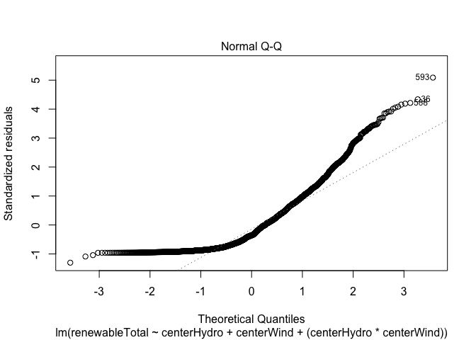

Project2
================

Name: Pranav Varanasi UTEID: ptv247 Date: 4/21/2021

## R Markdown

Title: How do we get power?

Part 1: Introduction

As recently experienced with the Texas snowstorms, the reliability and
efficiency of the energy grid is crucial to maintaining a basic quality
of life for an individual. Issues with power can cause widespread chaos
and quickly shut down the fundamental functions of modern society. The
key issue made relevant by these Texas storms is the impact of climate
change and the need for a continued reliance on renewable energy. With
this issue in mind, I became curious as to the main sources of power
running all the states across the country. In addition, I began to
wonder how much of the country had already transitioned to renewable
energy sources like solar, wind, and geothermal and how many states
still had a majority dependence on non-renewable sources like natural
gas and coal. Throughout the course of this project, I hope to identify
which states and regions are most reliant on forms of renewable energy
and understand how much of the energy grid needs to transition in order
to make the majority of the country reliant on green power. I expect
that policies surrounding renewable energy are politically driven and
that the West coast region and states with heavy Democratic interests
will be more reliant on renewable energy than the rest of the country. I
also hope to identify associations between how much a reliance on
specific types of non-renewable energy (e.g. natural gas, oil) affects
which renewable energy sources are chosen to transition to within
certain geographic regions.

To answer these questions, I chose two datasets that together provide
the energy sources by state from 1960 - 2014 as well as region/division
identifiers for each state. The main advantage I have in grouping these
two datasets is to be able to group states by region and identify the
main sources of energy.

More information about these datasets can be found below:

Dataset 1: Energy.csv - Provides energy sources by state from 1960 -
2014 - Sources: - <https://corgis-edu.github.io/corgis/csv/energy/> -
<https://www.eia.gov/tools/faqs/>

Dataset 2: usa\_states.csv - Provides abbreviations and region/division
identifiers for each state - Source: - Inbuilt R-dataset from
“stevedata” library -
<https://vincentarelbundock.github.io/Rdatasets/datasets.html>

Part 2: Import + Tidy + Merge

``` r
# Set working directory to local
#setwd('/Users/pranavvaranasi/Desktop/')

# Import stevedata for in-built usa_states dataset
library(stevedata)

# Import tidyverse and dplyr operations
library(tidyverse)
```

    ## ── Attaching packages ─────────────────────────────────────── tidyverse 1.3.0 ──

    ## ✓ ggplot2 3.3.3     ✓ purrr   0.3.4
    ## ✓ tibble  3.0.5     ✓ dplyr   1.0.4
    ## ✓ tidyr   1.1.2     ✓ stringr 1.4.0
    ## ✓ readr   1.4.0     ✓ forcats 0.5.0

    ## ── Conflicts ────────────────────────────────────────── tidyverse_conflicts() ──
    ## x dplyr::filter() masks stats::filter()
    ## x dplyr::lag()    masks stats::lag()

``` r
library(dplyr)

# Read in online energy data from 1960 - 2014 and save as dataframe
energyData <- read_csv("energy.csv")
```

    ## 
    ## ── Column specification ────────────────────────────────────────────────────────
    ## cols(
    ##   .default = col_double(),
    ##   State = col_character()
    ## )
    ## ℹ Use `spec()` for the full column specifications.

``` r
# Clean datasets:
# Both datasets are already TIDY since each observation has its own row and each variable has its own column

# Dataset 1: Energy.csv
# Drop all Production, Expenditure, and Price columns from energyData
# Only want columns for Consumption across different sectors, Commercial, Electric Power, Industrial, Refinery, Residential, and Transportation

energyTrimmed <- energyData %>%  select(-"Production.Coal") %>% select(-"Expenditure.Commercial.Coal") %>% select(-"Expenditure.Commercial.Distillate Fuel Oil") %>%  select(-"Expenditure.Commercial.Kerosene") %>% select(-"Expenditure.Commercial.Liquefied Petroleum Gases") %>% select(-"Expenditure.Commercial.Natural Gas") %>%  select(-"Expenditure.Electric Power.Coal") %>% select(-"Expenditure.Electric Power.Distillate Fuel Oil") %>% select(-"Expenditure.Electric Power.Natural Gas") %>% select(-"Expenditure.Industrial.Coal") %>%  select(-"Expenditure.Industrial.Distillate Fuel Oil") %>% select(-"Expenditure.Industrial.Kerosene") %>% select(-"Expenditure.Industrial.Liquefied Petroleum Gases") %>% select(-"Expenditure.Industrial.Natural Gas") %>% select(-"Expenditure.Industrial.Other Petroleum Products") %>%  select(-"Expenditure.Residential.Coal") %>% select(-"Expenditure.Residential.Distillate Fuel Oil") %>% select(-"Expenditure.Residential.Kerosene") %>% select(-"Expenditure.Residential.Liquefied Petroleum Gases") %>%  select(-"Expenditure.Residential.Natural Gas") %>% select(-"Expenditure.Residential.Wood") %>%  select(-"Expenditure.Transportation.Coal") %>% select(-"Expenditure.Transportation.Distillate Fuel Oil") %>% select(-"Expenditure.Transportation.Liquefied Petroleum Gases") %>% select(-"Expenditure.Transportation.Natural Gas") %>%  select(-"Price.Commercial.Coal") %>% select(-"Price.Commercial.Distillate Fuel Oil") %>% select(-"Price.Commercial.Kerosene") %>% select(-"Price.Commercial.Liquefied Petroleum Gases") %>%  select(-"Price.Commercial.Natural Gas")  %>% select(-"Price.Electric Power.Coal") %>% select(-"Price.Electric Power.Distillate Fuel Oil") %>%  select(-"Price.Electric Power.Natural Gas") %>% select(-"Price.Industrial.Coal") %>% select(-"Price.Industrial.Distillate Fuel Oil") %>% select(-"Price.Industrial.Kerosene") %>%  select(-"Price.Industrial.Liquefied Petroleum Gases") %>% select(-"Price.Industrial.Natural Gas") %>%  select(-"Price.Industrial.Other Petroleum Products") %>% select(-"Price.Transportation.Coal") %>% select(-"Price.Transportation.Distillate Fuel Oil") %>% select(-"Price.Transportation.Liquefied Petroleum Gases") %>%  select(-"Price.Transportation.Natural Gas") 


# Create new variables/columns to represent total renewable and total non-renewable energy per year for each state
# Renewable Energy Types: Geothermal, Hydropower, Solar, Wind, Wood
# Non-Renewable Energy Types: Coal, Distillate Fuel Oil, Kerosene, Liqueified Petroleum Gases, Natural Gas

# Sum up all non-renewable energy sources and save them in one column, units are in billions of BTU (British Thermal Unit)
# Move column to front of dataframe with .before operator
energySum <- energyTrimmed %>% mutate(nonRenewableTotal = Consumption.Commercial.Coal  + `Consumption.Commercial.Distillate Fuel Oil` + Consumption.Commercial.Kerosene +  `Consumption.Commercial.Liquefied Petroleum Gases` + 
`Consumption.Commercial.Natural Gas` + `Consumption.Electric Power.Coal` + `Consumption.Electric Power.Distillate Fuel Oil` +
`Consumption.Electric Power.Natural Gas` + Consumption.Industrial.Coal + `Consumption.Industrial.Distillate Fuel Oil` + Consumption.Industrial.Kerosene + `Consumption.Industrial.Liquefied Petroleum Gases` + `Consumption.Industrial.Natural Gas` + `Consumption.Industrial.Other Petroleum Products`  + Consumption.Refinery.Coal + `Consumption.Refinery.Distillate Fuel Oil` +  `Consumption.Refinery.Liquefied Petroleum Gases` + `Consumption.Refinery.Natural Gas` +  Consumption.Residential.Coal + `Consumption.Residential.Distillate Fuel Oil` + Consumption.Residential.Kerosene + `Consumption.Residential.Liquefied Petroleum Gases` + `Consumption.Residential.Natural Gas` + Consumption.Transportation.Coal 
+ `Consumption.Transportation.Distillate Fuel Oil` + `Consumption.Transportation.Liquefied Petroleum Gases` + `Consumption.Transportation.Natural Gas`, .before = Consumption.Commercial.Coal)


# Sum up all reneable energy sources, put renewable column before nonRenewable column
# Save fully formatted dataset as energyClean
energyClean <- energySum %>% mutate(renewableTotal = Consumption.Commercial.Geothermal + Consumption.Commercial.Hydropower + Consumption.Commercial.Solar + Consumption.Commercial.Wind + Consumption.Commercial.Wood + 
`Consumption.Electric Power.Wood` + Consumption.Industrial.Geothermal + Consumption.Industrial.Hydropower + Consumption.Industrial.Solar + Consumption.Industrial.Wind + Consumption.Industrial.Wood
 + Consumption.Residential.Geothermal + Consumption.Residential.Wood, .before = nonRenewableTotal)


# Dataset 2: usa_states.csv
# Dataset 2 is already in proper ascending order by state and has all relevant columns

# Rename statename variable so it matches up with energy dataset
renameStates <- usa_states %>% rename('State' = statename)

# Perform left join with energy clean dataset
energyJoin <- energyClean %>% left_join(renameStates, by = 'State')


# Sort dataframe in ascending order of state names
# Sorting is needed to group all data for one state together and make overall table visually understandable
energyJoin <- energyJoin %>% arrange(State)

# Add a percent renewable variable for each state
energyJoin <- energyJoin %>% mutate(percentRenewable = (renewableTotal / (renewableTotal + nonRenewableTotal)) * 100, .before = renewableTotal)
```

My combined dataset, energyJoin, has 2805 observations for each of the
50 states across the time period from 1960 - 2014. From these, I chose
to focus specifically on the numeric variables corresponding to types of
non-renewable and renewable energy consumption. I also added 3 numeric
variables (percentRenewable, nonRenewableTotal, renewableTotal) from
this consumption data for easier analysis. Each individual dataset was
already in tidy form where each observation has its own row and each
variable has its own column. I expect to identify mean differences in
the total percentage and types of renewable energy reliance across the 4
U.S. geographic regions (South, West, North-central, Northeast)

Part 2: EDA

``` r
# Plot 1: Correlation Matrix

# Only keep variables for Consumption commercial since commercial sector is biggest area to use energy
# Out of commercial variables, keep biggest producers of Coal, Petrol, Natural Gas, Solar, Wind, Wood
energyMap <- energyJoin %>% select(-State) %>% select(-Year) %>% select(Consumption.Commercial.Coal,`Consumption.Commercial.Liquefied Petroleum Gases`, `Consumption.Commercial.Natural Gas`, Consumption.Commercial.Solar, Consumption.Commercial.Wind, Consumption.Commercial.Wood)
 
# Source: Lab 4
cor(energyMap) %>%
  # Save as a data frame
  as.data.frame %>%
  # Convert row names to an explicit variable
  rownames_to_column %>%
  # Pivot so that all correlations appear in the same column
  pivot_longer(-1, names_to = "other_var", values_to = "correlation") %>%
  # Specify variables are displayed alphabetically from top to bottom
  ggplot(aes(rowname, factor(other_var, levels = rev(levels(factor(other_var)))), fill=correlation)) +
  # Heatmap with geom_tile
  geom_tile() +
  # Change the scale to make the middle appear neutral
  scale_fill_gradient2(low="red",mid="white",high="blue") +
  # Overlay values
  geom_text(aes(label = round(correlation,2)), color = "black", size = 4) +
  # Give title and labels
  labs(title = "Correlation matrix for Consumption Factors", x = "", y = "") 
```

<!-- -->

``` r
# Plot 2: region on x, percent renewable on y, barplot, decrease x axis size with theme for visual purposes
plot <- ggplot(data = energyJoin,  aes(x= State, y=percentRenewable, fill = region)) + geom_bar(stat = 'summary', fun = 'mean') + scale_fill_brewer(palette = "Spectral") + geom_errorbar(stat = 'summary', fun.data = 'mean_se', width = 0.5) +  theme(axis.text.x=element_text(size = 2))
  
# Add a title and label axes
plot + ggtitle("Percent Renewable Energy Consumption by Region (1960-2014)") + xlab("State") + ylab("Percent Renewable Energy Consumption")
```

<!-- -->

My correlation heat map shows relatively strong relationships between
consumption of natural gas and wood as well as consumption of natural
gas and petroleum gas. The relationship between natural gas and wood is
surprising as we usually expect an inverse relationship between
renewable and non-renewable energy. The relationship between the two
types of gas is expected as fossil fuels can have a co-dependence on
each other and can be intermixed as an energy source. Based on this
heatmap, I hope to understand how reliance on a specific renewable or
non-renewable resource affects the overall percentage renewable that is
generated. The heatmap also shows poor correrlations between energy
sources of the same type (e.g wood and solar). I hope to investigate
this difference to see how renewable sources differ across the country.

My percent renewable energy consumption plot shows a clear difference in
the renewable energy reliance between regions over the years. Based on
this, I will investigate the differences in percentageRenweable, and
consumption of solar energy with my ANOVA tests. I specifically picked
consumption of solar energy to calculate differences for since it is the
most likely to vary by region across the US.

Part 3: MANOVA

``` r
# Source : WS13

# Check Assumptions:

# Group percentRenewable, consumption solar across different regions
energyJoin %>%
  group_by(region) %>%
  summarize(mean(percentRenewable), mean(Consumption.Commercial.Solar))
```

    ## # A tibble: 4 x 3
    ##   region        `mean(percentRenewable)` `mean(Consumption.Commercial.Solar)`
    ## * <chr>                            <dbl>                                <dbl>
    ## 1 North Central                     2.57                               0.0909
    ## 2 Northeast                        11.8                                4.78  
    ## 3 South                             5.96                               1.62  
    ## 4 West                              5.71                               6.52

``` r
# Represent the means per region in graph
# Checks random sample, independent observations based on diff means:
energyJoin %>%
  select(region, percentRenewable, Consumption.Commercial.Solar) %>%
  pivot_longer(-1,names_to='DV', values_to='measure') %>%
  ggplot(aes(region,measure,fill=region)) +
  geom_bar(stat="summary", fun = "mean") +
  geom_errorbar(stat="summary", fun.data = "mean_se", width=.5) +
  facet_wrap(~DV, nrow=2) +
  coord_flip() + 
  ylab("") + 
  theme(legend.position = "none")
```

<!-- -->

``` r
# Inspect multivariate plots of response variable for each region
# Checks normality of response variables assumption:
ggplot(energyJoin, aes(x = percentRenewable, y = Consumption.Commercial.Solar)) +
  geom_point(alpha = .5) + 
  geom_density_2d(h=2) + 
  facet_wrap(~region)
```

<!-- -->

``` r
# Inspect homogeneity of (co)variances
covmats <- energyJoin %>%
  group_by(region) %>%
  do(covs=cov(.[2:4]))

# Covariance matrices per 4 regions
for(i in 1:4){print(as.character(covmats$region[i])); print(covmats$covs[i])}
```

    ## [1] "North Central"
    ## [[1]]
    ##                          Year percentRenewable renewableTotal
    ## Year               252.382398        -1.452582   2.684104e+04
    ## percentRenewable    -1.452582         6.414238   6.392198e+04
    ## renewableTotal   26841.044006     63921.979957   1.011282e+09
    ## 
    ## [1] "Northeast"
    ## [[1]]
    ##                          Year percentRenewable renewableTotal
    ## Year               252.510121        -8.450438   1.903116e+04
    ## percentRenewable    -8.450438       176.097003   1.721934e+05
    ## renewableTotal   19031.157895    172193.430338   1.301241e+09
    ## 
    ## [1] "South"
    ## [[1]]
    ##                           Year percentRenewable renewableTotal
    ## Year                252.269807        -6.012464       213676.5
    ## percentRenewable     -6.012464        16.673859       108442.1
    ## renewableTotal   213676.527837    108442.050772   2056021851.1
    ## 
    ## [1] "West"
    ## [[1]]
    ##                         Year percentRenewable renewableTotal
    ## Year               252.35294        -18.46005   2.089284e+04
    ## percentRenewable   -18.46005         53.62904   1.316259e+05
    ## renewableTotal   20892.84174     131625.85896   1.545121e+09

I checked the assumptions of random sample/independence, multivariate
normality, and homogeneity of covariances with a bar plot, scatterplot,
and co-variance matrix. Of these, only the random sample/independence
assumption looks to be met given the observed mean difference between
regions. The homogeneity of co-variances doesn’t look to be met as the
relative coefficents across regions are not similar. The multivariate
normality assumption is also not met due to the overwhelming presence of
many multivariate outliers. However, there does not appear to be
multicollinearity between the different response variables.

``` r
# Perform MANOVA with 2 response variables listed in cbind()
manova_energy <- manova(cbind(percentRenewable,Consumption.Commercial.Solar) ~ region, data = energyJoin)

# Output of MANOVA, approx F is pseudo F-staistic, if p-value is very small, means significant diff across groups for atleast one of these variables
summary(manova_energy)
```

    ##             Df  Pillai approx F num Df den Df    Pr(>F)    
    ## region       3 0.14775   74.478      6   5602 < 2.2e-16 ***
    ## Residuals 2801                                             
    ## ---
    ## Signif. codes:  0 '***' 0.001 '**' 0.01 '*' 0.05 '.' 0.1 ' ' 1

``` r
# If MANOVA is significant then we can perform one-way ANOVA for each variable, p-value here tells you which response variables are significantly different
summary.aov(manova_energy)
```

    ##  Response percentRenewable :
    ##               Df Sum Sq Mean Sq F value    Pr(>F)    
    ## region         3  24239  8079.5  155.98 < 2.2e-16 ***
    ## Residuals   2801 145083    51.8                      
    ## ---
    ## Signif. codes:  0 '***' 0.001 '**' 0.01 '*' 0.05 '.' 0.1 ' ' 1
    ## 
    ##  Response Consumption.Commercial.Solar :
    ##               Df  Sum Sq Mean Sq F value  Pr(>F)  
    ## region         3   17803  5934.4   3.518 0.01452 *
    ## Residuals   2801 4724842  1686.8                  
    ## ---
    ## Signif. codes:  0 '***' 0.001 '**' 0.01 '*' 0.05 '.' 0.1 ' ' 1

``` r
# Conduct paired t-tests to see which groups are actually different

# If ANOVA is significant then we can perform post-hoc analysis

# For percentRenewable, p-values here tell you between which groups there actually is a diff
# Apply bonferoni correction
pairwise.t.test(energyJoin$percentRenewable,energyJoin$region, p.adj="bonf")
```

    ## 
    ##  Pairwise comparisons using t tests with pooled SD 
    ## 
    ## data:  energyJoin$percentRenewable and energyJoin$region 
    ## 
    ##           North Central Northeast South
    ## Northeast < 2e-16       -         -    
    ## South     < 2e-16       < 2e-16   -    
    ## West      5.3e-15       < 2e-16   1    
    ## 
    ## P value adjustment method: bonferroni

``` r
# For solar consumption
pairwise.t.test(energyJoin$Consumption.Commercial.Solar,energyJoin$region, p.adj="bonf")
```

    ## 
    ##  Pairwise comparisons using t tests with pooled SD 
    ## 
    ## data:  energyJoin$Consumption.Commercial.Solar and energyJoin$region 
    ## 
    ##           North Central Northeast South
    ## Northeast 0.330         -         -    
    ## South     1.000         0.997     -    
    ## West      0.022         1.000     0.097
    ## 
    ## P value adjustment method: bonferroni

Null Hypothesis: Mean percent renwable and mean solar energy consumption
are same across different regions Alternate Hypothesis: Either Mean
percent renwable and/pr mean solar energy consumption are different
across different regions

For my overall ANOVA analysis, I conducted 12 t-tests, 2 one-way ANOVAS,
and 1 MANOVA to generate a total of 15 p-values. From these tests, I
calculated the probability of atleast one type 1 error as 1 - 0.95^15 =
0.5368. I also used the Bonferroni correction with a Bonferroni value of
0.05 / 15 = 0.0033 to identify the significant results below:

After conducting the MANOVA test, I found that both percent renwable and
solar energy consumption had low p-values. This led me to conclude there
is a significant difference for these values across region and conduct
post-hoc t tests.

However, when I conducted one-way ANOVA and pairwise t-tests I found
that only percent renewable had a significant difference WITHIN all of
the regions. Solar energy consumption had high p-values and didn’t have
a large difference within each geographic region even though it had a
significant difference across regions.

Part 4: PERMANOVA Randomization Test

``` r
# Source: WS13

# The package vegan contains a function for performing PERMANOVA
library(vegan)
```

    ## Loading required package: permute

    ## Loading required package: lattice

    ## This is vegan 2.5-7

``` r
# Compute Euclidean distances between observations of percent and solalr
dists <- energyJoin %>%
  select(percentRenewable, Consumption.Commercial.Solar) %>%
  dist

# Perform PERMANOVA on the distance matrix, end p-value is significant shows atleast one of the responses differ across regions
adonis(dists ~ region, data = energyJoin)
```

    ## 
    ## Call:
    ## adonis(formula = dists ~ region, data = energyJoin) 
    ## 
    ## Permutation: free
    ## Number of permutations: 999
    ## 
    ## Terms added sequentially (first to last)
    ## 
    ##             Df SumsOfSqs MeanSqs F.Model      R2 Pr(>F)    
    ## region       3     42042 14013.9  8.0603 0.00856  0.001 ***
    ## Residuals 2801   4869925  1738.6         0.99144           
    ## Total     2804   4911967                 1.00000           
    ## ---
    ## Signif. codes:  0 '***' 0.001 '**' 0.01 '*' 0.05 '.' 0.1 ' ' 1

Null Hypothesis: Mean percent renwable and mean solar energy consumption
are same across different regions Alternate Hypothesis: Either Mean
percent renwable and/pr mean solar energy consumption are different
across different regions

After conducting the permanova test, I got a observed F-statistic oof
8.063 and a p-value of 0.001. Since this p-value is very small and below
0.05, I canreject the null hypotheses and say that atleast one numeric
variable has a significant difference in mean across the regions.

``` r
# Source: WS13

# Create plot visualizaing null distribution and test statistic

# Observed F-statistic calculated from above permanova
obs_F <- 8.0603

# Randomization test (using replicate)
Fs <- replicate(5000,{
  
  # Randomly permute the response variable across regions
  new <- energyJoin %>%
    mutate(percentRenew = sample(percentRenewable))
  
  # Compute variation within groups
  SSW <- new %>%
    group_by(region) %>%
    summarize(SSW = sum((percentRenew - mean(percentRenew))^2)) %>%
    summarize(sum(SSW)) %>% 
    pull
  
  # Compute variation between groups
  SSB <- new %>% 
    mutate(mean = mean(percentRenew)) %>%
    group_by(region) %>% 
    mutate(groupmean = mean(percentRenew)) %>%
    summarize(SSB = sum((mean - groupmean)^2)) %>%
    summarize(sum(SSB)) %>%
    pull
  
  # Compute the F-statistic (ratio of MSB and MSW)
  # df for SSB is 4 groups - 1 = 3
  # df for SSW is 2805 observations - 4 groups = 2801
  (SSB/3)/(SSW/2801)
})

# Represent the distribution of the F-statistics for each randomized sample
hist(Fs, prob=T); abline(v = obs_F, col="red",add=T)
```

    ## Warning in int_abline(a = a, b = b, h = h, v = v, untf = untf, ...): "add" is
    ## not a graphical parameter

<!-- -->

``` r
# Calculate the proportion of F statistic that are greater than the observed F-statistic
mean(Fs > obs_F)
```

    ## [1] 0

From the above plot, it is clear to see that there is a significant
difference in mean percentage renewable across regions as the test
statistic is far from the null distribution. This validates my earlier
ANOVA results that showed percent renewable to have the most significant
mean difference across the different regions.

Part 5: Linear Regression Model

``` r
# Source: WS15

# Fit linear model and check assumptions
# Predict total renewable consumption solely based on amount of hydropower energy and wind

# Mean center hydropower and wind numeric variables
energyJoin$centerHydro <- energyJoin$Consumption.Commercial.Hydropower - mean(energyJoin$Consumption.Commercial.Hydropower, na.rm = TRUE)
energyJoin$centerWind <- energyJoin$Consumption.Commercial.Wind - mean(energyJoin$Consumption.Commercial.Wind, na.rm = TRUE)

# Wind and hydropower are the most used renewable resources in the US
# Fit two numeric variables and their interaction to predict total renewable energy
fit <- lm(renewableTotal ~ centerHydro + centerWind  + (centerHydro * centerWind), data = energyJoin)
summary(fit)
```

    ## 
    ## Call:
    ## lm(formula = renewableTotal ~ centerHydro + centerWind + (centerHydro * 
    ##     centerWind), data = energyJoin)
    ## 
    ## Residuals:
    ##    Min     1Q Median     3Q    Max 
    ## -51588 -32912 -14480  20958 208507 
    ## 
    ## Coefficients:
    ##                         Estimate Std. Error t value Pr(>|t|)    
    ## (Intercept)            40168.801    773.893  51.905  < 2e-16 ***
    ## centerHydro              102.308     13.064   7.831 6.79e-15 ***
    ## centerWind               -13.737     61.190  -0.224    0.822    
    ## centerHydro:centerWind    -3.267      2.876  -1.136    0.256    
    ## ---
    ## Signif. codes:  0 '***' 0.001 '**' 0.01 '*' 0.05 '.' 0.1 ' ' 1
    ## 
    ## Residual standard error: 40980 on 2801 degrees of freedom
    ## Multiple R-squared:  0.02382,    Adjusted R-squared:  0.02278 
    ## F-statistic: 22.78 on 3 and 2801 DF,  p-value: 1.434e-14

``` r
# Check assumptions:

# Residuals vs Fitted values plot
plot(fit, which = 1)
```

<!-- -->

``` r
# Histogram of residuals
hist(fit$residuals)
```

<!-- -->

``` r
# Q-Q plot for the residuals
plot(fit, which = 2)
```

<!-- -->

``` r
### b. Normality
# Shapiro-Wilk test
# H0: normality
shapiro.test(fit$residuals)
```

    ## 
    ##  Shapiro-Wilk normality test
    ## 
    ## data:  fit$residuals
    ## W = 0.84482, p-value < 2.2e-16

``` r
# Kolmogorov-Smirnov test
# H0: normality
ks.test(fit$residuals, "pnorm", mean=0, sd(fit$residuals))
```

    ## Warning in ks.test(fit$residuals, "pnorm", mean = 0, sd(fit$residuals)): ties
    ## should not be present for the Kolmogorov-Smirnov test

    ## 
    ##  One-sample Kolmogorov-Smirnov test
    ## 
    ## data:  fit$residuals
    ## D = 0.16734, p-value < 2.2e-16
    ## alternative hypothesis: two-sided

``` r
### c. Equal variance (homoscedasticity)
library(sandwich);
# Install a new package
# install.packages("lmtest")
library(lmtest)
```

    ## Loading required package: zoo

    ## 
    ## Attaching package: 'zoo'

    ## The following objects are masked from 'package:base':
    ## 
    ##     as.Date, as.Date.numeric

``` r
# Breusch-Pagan test
# H0: homoscedasticity
bptest(fit) 
```

    ## 
    ##  studentized Breusch-Pagan test
    ## 
    ## data:  fit
    ## BP = 1.9644, df = 3, p-value = 0.5798

For my linear regression model, I first checked the assumptions of
linearity, normality, and homoscedasity with a residuals v fitted values
plot, qq-plot, and a bp test. The linearity assumption does not appear
to be met well as the graph does not show a straight line and has
curves. The normality assumption appears to be mostly met as the qq-plot
is close to linear for a large portion. The homoscedasity,equal
variance, assumption appears to be not met as the p-value of 0.5798 is
high.

Part 5 continued:

``` r
# Robust Standard Errors
coeftest(fit, vcov = vcovHC(fit))
```

    ## 
    ## t test of coefficients:
    ## 
    ##                          Estimate Std. Error t value Pr(>|t|)    
    ## (Intercept)            40168.8012   773.9148 51.9034  < 2e-16 ***
    ## centerHydro              102.3079    11.0389  9.2679  < 2e-16 ***
    ## centerWind               -13.7369    32.5067 -0.4226  0.67263    
    ## centerHydro:centerWind    -3.2667     1.3820 -2.3638  0.01816 *  
    ## ---
    ## Signif. codes:  0 '***' 0.001 '**' 0.01 '*' 0.05 '.' 0.1 ' ' 1

``` r
# use bootstrap samples to estimate coefficients, SEs, fitted values, ...
# Example of estimating coefficients SEs
# Use the function replicate to repeat the process (similar to a for loop)
samp_SEs <- replicate(5000, {
  # Bootstrap your data (resample observations)
  boot_data <- sample_frac(energyJoin, replace = TRUE)
  # Fit regression model for two numeric
  fitboot <- lm(renewableTotal ~ centerHydro + centerWind  + (centerHydro * centerWind), data = energyJoin)
  # Save the coefficients
  coef(fitboot)
})

# Estimated SEs
samp_SEs %>%
  # Transpose the obtained matrices
  t %>%
  # Consider the matrix as a data frame
  as.data.frame %>%
  # Compute the standard error (standard deviation of the sampling distribution)
  summarize_all(sd)
```

    ##   (Intercept) centerHydro centerWind centerHydro:centerWind
    ## 1           0           0          0                      0

``` r
# We can also consider a confidence interval for the estimates
samp_SEs %>%
  # Transpose the obtained matrices
  t %>%
  # Consider the matrix as a data frame
  as.data.frame %>%
  # Pivot longer to group by and summarize each coefficient
  pivot_longer(everything(), names_to = "estimates", values_to = "value") %>%
  group_by(estimates) %>%
  summarize(lower = quantile(value,.025), upper = quantile(value,.975))
```

    ## # A tibble: 4 x 3
    ##   estimates                 lower    upper
    ## * <chr>                     <dbl>    <dbl>
    ## 1 (Intercept)            40169.   40169.  
    ## 2 centerHydro              102.     102.  
    ## 3 centerHydro:centerWind    -3.27    -3.27
    ## 4 centerWind               -13.7    -13.7

``` r
# Compare this interval to original fit
confint(fit, level = 0.95)
```

    ##                               2.5 %       97.5 %
    ## (Intercept)            38651.343986 41686.258513
    ## centerHydro               76.692113   127.923684
    ## centerWind              -133.718815   106.244998
    ## centerHydro:centerWind    -8.905066     2.371572

From these assumptions, I built a linear model predicting percentage
renewable energy based on the predictors of hydropower and wind energy
consumption. The coefficent estimates of 102.31 and -13.7 show that on
average a 102.3 BTU increase in hydropower increases the renewable
energy percentage by 1. The coefficient of -13.7 shows that a -13.7
reduction in wind power would correspond to a 1 point increase in
renewable energy percentage. The relative coefficient of -3.27 means
that a 1 BTU increase in hydropower corresponds to a -3.27 decrease in
wind power consumption. From the above data, it appears that 88.96% of
the variation in the response variable is explained by the model. After
re-computing results using robust SEs, I found that bootstrapped
standard error were less than the robust and original standard errors.
Thsi is further evidenced by the low p-values of &lt; 2e-16 that result
from the robust caluclation. Futhermore, after comparing the confidence
intervals it is easy to see that the robust calculation interrval is
more accurate as it is narrower and more closely approximates the value
of the test statistic.

Part 6: Logistic Regression

``` r
# Source : WS16 + WS17

library(dplyr)
library(ggplot2)

# Create a binary variable coded as 0 and 1
# Use 1 if the percent renewable is greater than 5%, 0 otherwise
# Predict percent renewable based on wind and hydropower consumption (Response)

energyNew <- energyJoin %>% select(percentRenewable,Consumption.Commercial.Hydropower, Consumption.Commercial.Wind, region, Year, State) %>% mutate(binaryPercent = ifelse(percentRenewable >= 5, 1, 0)) 

# Consider a logistic model with the two numeric variables
# binaryPercent is categorical variable we are trying to predict
logisticFit <- glm(binaryPercent ~  + Consumption.Commercial.Hydropower + Consumption.Commercial.Wind, data = energyNew, family = "binomial")
summary(logisticFit)
```

    ## 
    ## Call:
    ## glm(formula = binaryPercent ~ +Consumption.Commercial.Hydropower + 
    ##     Consumption.Commercial.Wind, family = "binomial", data = energyNew)
    ## 
    ## Deviance Residuals: 
    ##     Min       1Q   Median       3Q      Max  
    ## -1.5627  -0.9729  -0.9729   1.3967   1.3967  
    ## 
    ## Coefficients:
    ##                                     Estimate Std. Error z value Pr(>|z|)    
    ## (Intercept)                       -0.5021396  0.0397849 -12.621  < 2e-16 ***
    ## Consumption.Commercial.Hydropower  0.0104071  0.0023301   4.466 7.96e-06 ***
    ## Consumption.Commercial.Wind        0.0001628  0.0030268   0.054    0.957    
    ## ---
    ## Signif. codes:  0 '***' 0.001 '**' 0.01 '*' 0.05 '.' 0.1 ' ' 1
    ## 
    ## (Dispersion parameter for binomial family taken to be 1)
    ## 
    ##     Null deviance: 3749.9  on 2804  degrees of freedom
    ## Residual deviance: 3691.0  on 2802  degrees of freedom
    ## AIC: 3697
    ## 
    ## Number of Fisher Scoring iterations: 6

``` r
# Based on predicted probabilities...
energyNew$prob1 <- predict(logisticFit, type = "response")

# Classify percent renewable as 1 or 0 based, if greater than 5% consider it good reliance on renewable energy (apply a cutoff of 0.5)
energyNew$predicted <- ifelse(energyNew$prob1 > .5, 1, 0)

# Confusion matrix
table(truth = energyNew$binaryPercent, prediction = energyNew$predicted)
```

    ##      prediction
    ## truth    0    1
    ##     0 1676   37
    ##     1 1034   58

``` r
# Plot density of log-odds by binary outcome variable (binaryPercent)
# Predicted log odds 
energyNew$logit <- predict(logisticFit, type = "link") 

# Density plot of log-odds for each outcome
energyNew %>%
  ggplot() + 
  geom_density(aes(logit, color = binaryPercent, fill = binaryPercent), alpha = .4) +
    geom_rug(aes(logit, color = binaryPercent)) +
  geom_text(x = -5, y = .07, label = "TN = 431") +
  geom_text(x = -1.75, y = .008, label = "FN = 19") +
  geom_text(x = 1, y = .006, label = "FP = 13") +
  geom_text(x = 5, y = .04, label = "TP = 220") +
  theme(legend.position = c(.85,.85)) +
  geom_vline(xintercept = 0) + 
  xlab("logit (log-odds)")
```

<!-- -->

``` r
# Call the library plotROC
library(plotROC) 

# Plot ROC depending on values of y and its probabilities displaying some cutoff values
ROCplot1 <- ggplot(energyNew) + 
  geom_roc(aes(d = binaryPercent, m = prob1), cutoffs.at = list(0.1, 0.5, 0.9))
ROCplot1
```

<!-- -->

``` r
# Calculate the area under the curve still using the library plotROC with function calc_auc
calc_auc(ROCplot1)
```

    ##   PANEL group       AUC
    ## 1     1    -1 0.5220638

I built a logistic regression model predicting how large the perrcent
renewable was (1 if &gt; 5%) for each observation. My explanatory
variables here were the consumption of hydropowerr and wind energy.

Accuracy: (1676 + 58) / 2805 = 0.618 Sensisitvity: 58 / 1034 = 0.056
Specificity: 1676 / 1713 = 0.978 Precision: 58 / 95 = 0.611

These results mean 61.8% of cases were correctly classified, 5.6% of
observations were true-positives, 97.8% of observations were
true-negatives, and 61.1% of observations were accurate true-positive
predictions.

My computed AUC value of 0.522 as well as the ROC curve indicates that
model is generally bad in creating predictions. This stems from the
interpration that a randomly selected observation from the greater than
5% (1 group) has a value larger than a randomly chosen observation from
the less than 5% (0 group) 52.2% of the time.

From my above models and analysis, a key finding is that there is a
significant difference in the total percentage of renewable energy
across each of the 4 U.S regions. This difference is also prevalent
within the regions themselves indicating that not all states in a region
have the same reliance on renewable power. Another key finding I found
is that consumption of hydropower and wind are generally good predictors
of the total percentage renewable as a high percentage variation was
explained with their linear model.
